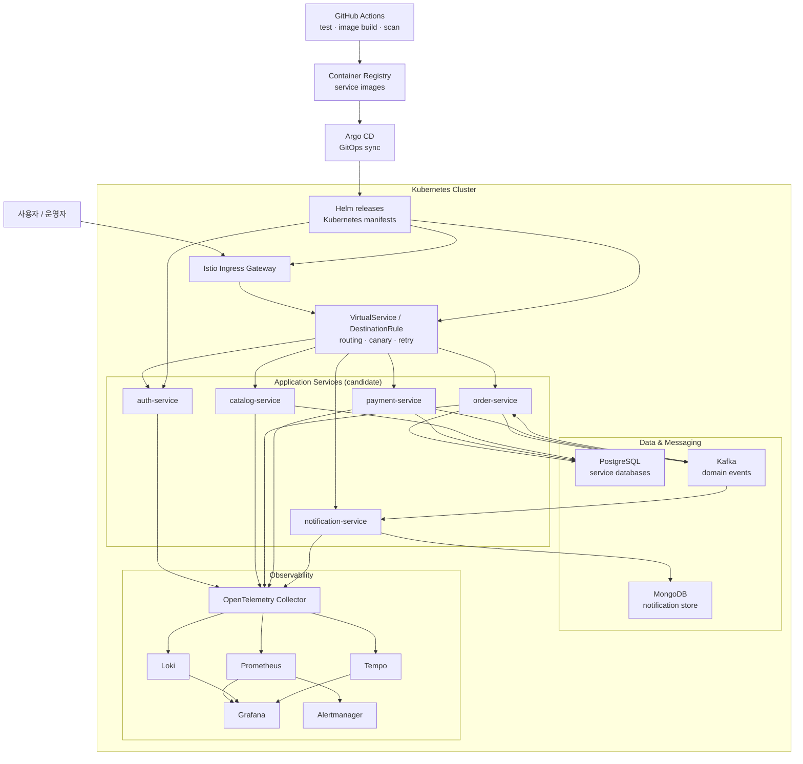
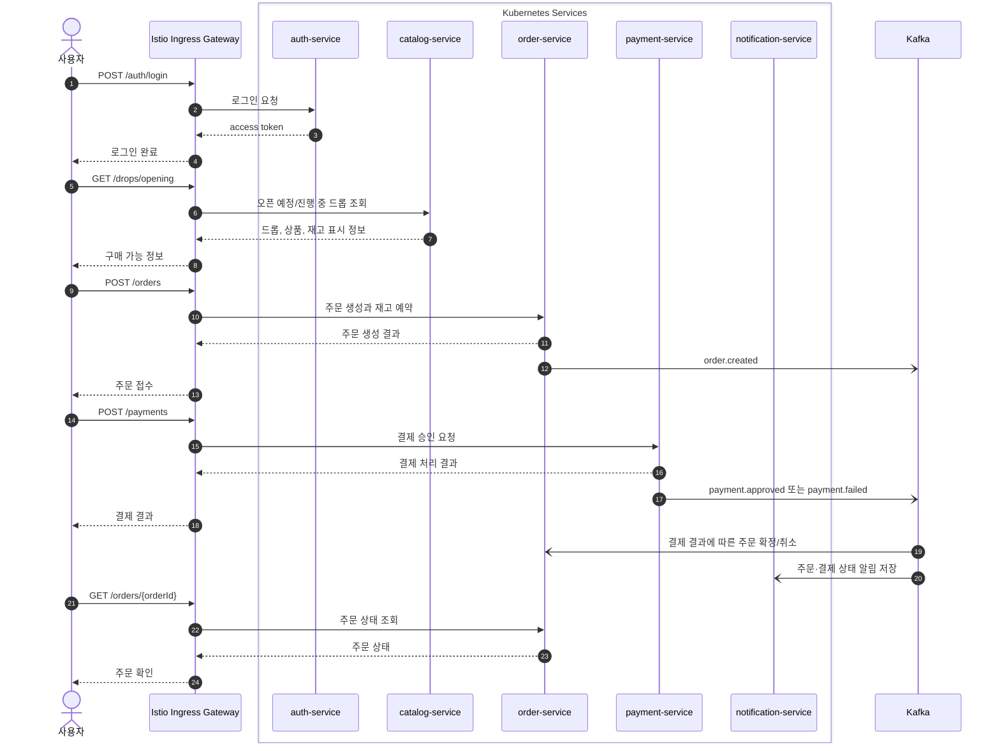

# DropMong workspace

DropMong은 정해진 시각에 한정 수량 상품을 공개하고, 짧은 시간에 몰리는 주문을 안정적으로 처리하는 드롭 커머스 프로젝트다.

이 repo는 구현 repo가 아니라 작업공간 진입점이다. 공통 문서, 온보딩, repo manifest, 작업 규칙, 운영 검증 기준을 관리한다. 실제 서비스 코드는 `services`, 배포 선언은 `gitops`, 인프라 구성은 `infra` repo를 기준으로 본다.

## 프로젝트 주제

```text
드롭 오픈 순간의 트래픽 피크에서도 oversell 없이 주문을 접수하고,
결제 지연이나 알림 장애가 핵심 주문 상태를 망가뜨리지 않도록 검증한다.
```

- 상품 드롭 조회, 재고 예약, 주문 생성, mock 결제, 알림 저장 과정을 API 기준으로 연결한다.
- 재고 차감과 주문 상태 변경은 idempotency와 transaction boundary를 기준으로 검증한다.
- 결제 승인, 결제 실패, 주문 만료, 알림 발송은 Kafka 이벤트로 분리한다.
- Kubernetes, Istio, Helm, Argo CD로 배포와 트래픽 정책을 검증한다.
- Prometheus, Grafana, Loki, Tempo, Alertmanager로 장애 원인과 병목을 추적한다.

## 예상 아키텍처

서비스 경계는 새 구현에서 확정한다. 현재 README의 다이어그램은 DropMong을 Kubernetes 위에 올릴 때의 예상 골격을 보여준다.



## 주문 처리 시퀀스

외부 요청은 Istio Ingress Gateway를 통과한다. 서비스 경계는 새 구현에서 확정하되, 현재 문서 기준의 초기 후보는 `auth`, `catalog`, `order`, `payment`, `notification`이다.



## 목표

- Oversell 0건
  동시 주문 상황에서도 판매 가능 수량보다 많은 주문이 확정되지 않게 한다.

- 주문 상태 정합성
  결제 승인, 결제 실패, 주문 만료가 같은 주문에 중복 적용되지 않게 한다.

- 후속 처리 분리
  알림 장애가 주문 확정과 결제 처리 결과를 실패시키지 않게 한다.

- 트래픽 피크 대응
  HPA와 backpressure 지표로 드롭 오픈 순간의 처리 한계를 설명한다.

- 배포 안정성
  Istio traffic policy, canary, rollback 기준을 운영 절차로 검증한다.

- 운영 가시성
  metric, log, trace로 병목과 장애 원인을 찾을 수 있게 한다.

## 기술 스택

| 영역 | 후보 |
| --- | --- |
| Backend | Python, FastAPI, JWT |
| Data & Messaging | PostgreSQL, MongoDB, Kafka |
| Platform | Docker, Kubernetes, Istio |
| CI/CD & IaC | GitHub Actions, Helm, Argo CD, Terraform, AWS, Amazon ECR |
| Observability | structlog, OpenTelemetry, Prometheus, Alertmanager, Grafana, Loki, Tempo |
| Quality & Test | k6, Postman, Newman, Trivy |

## 레포지토리 구조

```text
workspace-root/
  workspaces/  # 공통 문서, 온보딩, repo manifest
  service/     # 서비스 코드, 테스트, 이미지 빌드
  gitops/      # Kubernetes/GitOps 배포 선언
  infra/       # 클러스터, 클라우드, 네트워크 기반
  archive/     # 과거 설계와 실험 결과 보관
```

## Local 개발 접속 주소

| 이름 | 주소 | 비고 |
| --- | --- | --- |
| Grafana | http://localhost/grafana | `gitops` 레포에서 로컬 플랫폼을 올린 뒤 접속 |
| pgAdmin | http://localhost/pgadmin | 로컬 DB stack을 올린 뒤 접속 |

## GitHub 이미지 배포

신규 서비스의 이미지 배포 기반은 유지한다. 서비스가 추가되거나 제외되어도 manifest와 CI 설정에서 서비스 목록만 조정할 수 있도록 관리한다.

```bash
task deploy:tag SERVICE=all BUMP=patch DRY_RUN=true
task deploy:tag SERVICE=all BUMP=patch
```

- 실행 절차: [docs/runbooks/deployment/tag-based-image-deploy.md](docs/runbooks/deployment/tag-based-image-deploy.md)
- 배포 구조: [docs/architecture/deployment/README.md](docs/architecture/deployment/README.md)

## 문서 기준

| 영역 | 용도 |
| --- | --- |
| [docs/adr](docs/adr/README.md) | 구조적 의사결정 기록 |
| [docs/architecture](docs/architecture/README.md) | repo 경계, 배포, 관측성, 플랫폼 아키텍처 |
| [docs/evidence](docs/evidence/README.md) | 검증 결과와 실행 증거 |
| [docs/runbooks](docs/runbooks/README.md) | 배포, 관측성, 운영 확인 절차 |
| [docs/trouble](docs/trouble/README.md) | 장애, 실패, 운영 리스크 분석 기록 |

과거 프로젝트 산출물은 `archive` repo에서 보관하고, 이 workspace는 DropMong의 현재 작업 기준만 유지한다.
