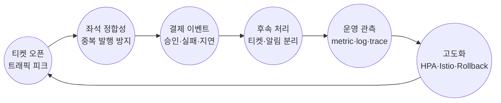

# Medikong workspace


## 프로젝트 주제

```
인기 공연 티켓 오픈 순간의 트래픽 폭주를 견디는 예매 시스템을 만듭니다.
좌석 중복 발행을 막고, 결제·티켓 발행·알림 장애를 격리하며, 운영자가 관측 가능한 구조로 검증합니다.
```

- 공연/좌석 조회, 좌석 lock, 예약 생성, mock 결제, 티켓 발행, 알림 저장 흐름을 API 기준으로 연결합니다.
- Kafka 기반 후속 처리와 idempotency로 예약 API와 티켓·알림 처리를 분리합니다.
- k6, Postman/Newman, Docker Compose E2E로 티켓 오픈 피크와 핵심 예매 흐름을 검증합니다.
- Kubernetes, Kong, Istio, Helm, Argo CD로 배포·트래픽 제어·서비스 메시를 검증합니다.
- Prometheus, Grafana, Loki, Tempo, Alertmanager로 장애 원인과 병목을 추적합니다.

### 핵심 흐름




### 주요 화면


## 목표

- 좌석 중복 0건
  동시 예매 상황에서도 한 좌석에는 하나의 유효 티켓만 발행합니다.

- 후속 처리 분리
  예약 API와 티켓/알림 후속 처리를 Kafka 이벤트로 분리합니다.

- 장애 격리
  알림 장애가 결제 완료와 티켓 발행 흐름을 실패시키지 않도록 설계합니다.

- 트래픽 폭발 대응
  HPA와 backpressure 관측으로 티켓 오픈 피크를 설명합니다.

- 통신 보안과 배포 안정성
  Kong JWT, NetworkPolicy, Istio mTLS, canary/rollback을 검증합니다.

- 운영 가시성
  metric, log, trace로 병목과 장애 원인을 찾을 수 있게 합니다.

- Object Storage 분리
  티켓 QR/PDF artifact를 S3에 저장해 app pod를 stateless하게 유지합니다.

## 기술 스택

### Backend


### Data & Messaging


### Platform


### CI/CD & IaC


### Logging & Observability


### Quality & Test


## 레포지토리 구조

```text
medikong/
  workspace/  # 공통 문서, 온보딩, repo manifest
  service/    # 서비스 코드, 테스트, 이미지 빌드
  gitops/     # Kubernetes/GitOps 배포 선언
  infra/      # 클러스터, 클라우드, 네트워크 기반
```

## local 개발 접속 주소

| 이름 | 주소 | 비고 |
| --- | --- | --- |
| Grafana | http://localhost/grafana | `gitops` 레포에서 `task dev` 혹은 `task --taskfile platform/monitoring/Taskfile.yml up` 실행 |
| pgAdmin | http://localhost/pgadmin | `gitops` 레포에서 `task dev` 혹은 `task dev:data` 실행. 로그인 `admin@example.com` / `admin`, DB 접속 `user` / `password` |

## GitHub 이미지 배포

초기 전체 서비스 배포나 강제 전체 배포가 필요하면 `service` repo에서 먼저 미리보기 후 실제 태그를 만든다.

```bash
task deploy:tag SERVICE=all BUMP=patch DRY_RUN=true
task deploy:tag SERVICE=all BUMP=patch
```

- 실행 절차: [docs/runbooks/deployment/tag-based-image-deploy.md](docs/runbooks/deployment/tag-based-image-deploy.md)
- 배포 구조: [docs/architecture/deployment/README.md](docs/architecture/deployment/README.md)

## AWS Dev 접속 주소

| 이름 | 주소 | 비고 |
| --- | --- | --- |
| Grafana | http://medikong-default-kong-nlb-c17a54e23efd293c.elb.ap-northeast-2.amazonaws.com:32407/grafana/ | 보안그룹 `sg-00ec124430d0eab68`의 `32407` 허용 목록에 공인 IP가 있어야 접속할 수 있습니다. |


**지금까지 한 일**
- 기본 예매 과정 연결
  로그인, 공연/좌석 조회, 예약, 결제, 티켓 발급, 알림까지 연결
- 좌석 중복 예매 방지
  같은 좌석이 두 번 예매되지 않도록 충돌 처리와 테스트 추가
- Kafka 기반 후속 처리 분리
  예약 이후 티켓 발급과 알림 처리를 이벤트로 분리
- 자동 검증 기반 마련
  Docker Compose와 Newman으로 전체 예매 과정 확인
- Kubernetes 배포 구성
  Helm, Argo CD 기반 서비스 배포 구조 정리
- 운영·보안 설정 준비
  Kong, Istio, HPA, NetworkPolicy 적용
- 관측 환경 구성
  Prometheus, Grafana, Loki, Tempo로 지표, 로그, trace 확인
- 부하테스트 준비
  k6 기반 자동 점검과 부하테스트 구성 진행

**아직 남은 일**
- 부하테스트 반복 실행
  k6로 트래픽이 몰리는 상황 검증
- 핵심 지표 확인
  예매 성공률, 응답시간, 에러율, 중복 티켓 수 측정
- 자동 확장 검증
  부하 상황에서 HPA가 pod를 늘리는지 확인
- 후속 처리 지연 점검
  Kafka 처리 지연, 티켓 발급 지연, 알림 실패 여부 확인
- 병목 지점 정리
  Grafana 대시보드와 로그를 기준으로 원인 분석
- 발표 자료용 증거 정리
  실험 수치와 화면 캡처 정리

## 심화 프로젝트 방향

이번 심화 프로젝트에서는 기본 프로젝트에서 드러난 협업 구조, 배포 검증, 운영 검증의 한계를 개선하고 구체화합니다.

### 협업 구조 재정비

- `workspace`, `service`, `gitops`, `infra` repo별 책임 범위 분리
- 공통 인프라 선행 조건 정리
- 팀원이 같은 기준 위에서 작업할 수 있는 문서 기준점 정리

### 서비스 검증 체계 구체화

- 부하, 인프라, 클러스터, 서비스 단절 상황을 테스트 시나리오 파일로 정의
- 테스트 시나리오 파일을 자동 실행 가능한 검증 자산으로 관리
- Docker Compose E2E 기반 서비스 간 흐름 검증
- Postman/Newman 기반 API 시나리오 검증
- k6 기반 티켓 오픈 피크와 부하 상황 검증

### 배포와 보안 흐름 분리

- 서비스별 독립 배포 전략과 배포 영향 범위 정리
- 서비스별 이미지 빌드, 배포 선언, rollout/rollback 기준 분리
- GitHub Actions 기반 테스트·빌드 단계 분리
- Docker image build와 Argo CD 배포 흐름 분리
- secret, Dockerfile, 이미지 취약점 검사 위치 정리

### 운영 관측성 고도화

- Prometheus, Grafana, Loki, Tempo, Alertmanager 기반 운영 증거 확보
- metric, log, trace, alert를 통한 장애 원인 설명
- 서비스 메시, 장애 격리, canary/rollback 방향 점검

## 아키텍처

- repo별 책임 경계: [docs/architecture/repo-boundaries.md](docs/architecture/repo-boundaries.md)
- 태그 기반 이미지 배포: [docs/architecture/deployment/README.md](docs/architecture/deployment/README.md)
- 관측성 아키텍처: [docs/architecture/observability/README.md](docs/architecture/observability/README.md)
- 감사 로그 아키텍처: [docs/architecture/audit-logs/README.md](docs/architecture/audit-logs/README.md)

## 레퍼런스

- workspace 설치, 빠른 시작, 명령, 기준 파일, 실행 환경, 비목표: [docs/references/workspace.md](docs/references/workspace.md)
- 신규 참여자 첫 실행 흐름: [docs/onboarding/quickstart.md](docs/onboarding/quickstart.md)
- workspace 역할 결정 기록: [docs/adr/0001-use-workspace-as-polyrepo-helper.md](docs/adr/0001-use-workspace-as-polyrepo-helper.md)
- 프로젝트 목표: [docs/project_docs/00-GOAL.md](docs/project_docs/00-GOAL.md)
