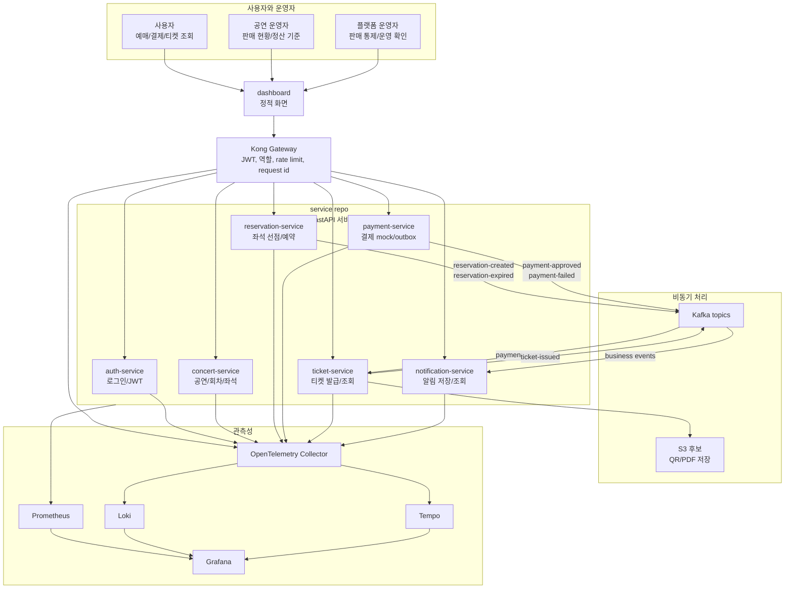

# 01. 시스템 컨텍스트

이 문서가 답하는 질문:

- 사용자는 어떤 진입점으로 Medikong에 들어오는가?
- 외부 API, 서비스, Kafka, 관측성 시스템은 어떤 큰 관계로 연결되는가?

## 핵심 해석

- 외부 HTTP 진입점은 Kong이 맡고, 서비스별 실제 API는 `auth`, `concert`, `reservation`, `payment`, `ticket`, `notification` FastAPI 서비스가 처리한다.
- `dashboard`는 현재 구조에서 여러 서비스를 직접 호출하는 화면이며, 별도 BFF는 현재 확정 구조로 보지 않는다.
- 예약 생성과 결제 요청은 사용자에게 응답하는 동기 API이고, 결제 이후 티켓 발급과 알림 생성은 Kafka 이벤트로 분리되어 있다.
- 관측성은 서비스가 만든 trace/log/metric을 Collector, Prometheus, Loki, Tempo, Grafana로 나누어 처리한다.
- `workspace`는 이 관계를 설명하는 공통 문서 위치이고, 런타임 코드나 배포 선언을 직접 소유하지 않는다.

## 근거 경로

- `workspace/docs/project_docs/02-service-architecture.md`
- `workspace/docs/architecture/repo-boundaries.md`
- `service/docs/architecture/trace/README.md`
- `gitops/platform/kong/README.md`
- `gitops/platform/observability/README.md`

## 확인 필요

- `dashboard-bff`는 trace 설계 문서에서 후보 구조로만 설명되어 있어, 현재 컨텍스트 다이어그램에는 포함하지 않았다.
- S3는 `ticket-service` 값과 코드에 드러나지만 실제 환경별 credential/버킷 운영 방식은 별도 확인이 필요하다.
