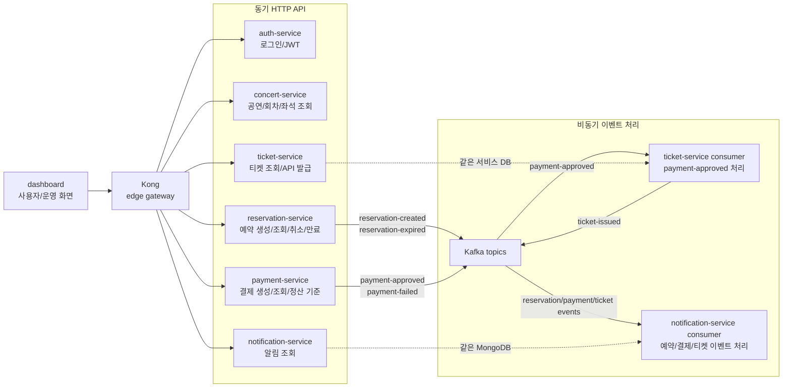

# 02. 서비스 아키텍처

이 문서가 답하는 질문:

- Medikong 서비스는 어떤 책임으로 나뉘는가?
- 동기 HTTP 호출과 비동기 Kafka 처리는 어디에서 갈라지는가?

## 핵심 해석

- `auth-service`는 로그인과 JWT 발급, Kong은 JWT 검증과 역할별 진입 정책을 담당한다.
- `reservation-service`는 좌석 선점과 예약 상태 변경을 동기 처리하고, 생성/만료 이벤트를 Kafka로 발행한다.
- `payment-service`는 결제 결과를 저장하고 승인/실패 이벤트를 outbox에 남긴 뒤 dispatcher가 Kafka로 발행한다.
- `ticket-service`는 사용자 조회 API와 `payment-approved` consumer를 함께 갖고, `reservation_id` 기준 중복 발급을 막는다.
- `notification-service`는 조회 API와 이벤트 consumer를 함께 갖고, 이벤트별 알림을 MongoDB에 저장한다.
- `concert-service`는 현재 핵심 예매 흐름에서 조회/운영 데이터의 기준 서비스로 다루며, 이번 초안에서는 상세 내부 구조를 분리하지 않았다.

## 근거 경로

- `workspace/docs/project_docs/02-service-architecture.md`
- `service/services/reservation-service/app/routers/reservations.py`
- `service/services/payment-service/app/services/payments.py`
- `service/services/ticket-service/app/services/ticket_service.py`
- `service/services/notification-service/app/services/notification_service.py`
- `gitops/values/services/*.yaml`

## 확인 필요

- `concert-service`의 이벤트 발행과 운영 API 구현 범위는 기존 문서에 일부 설명되어 있지만, 이번 확인 범위에서는 코드까지 깊게 검증하지 않았다.
- 예약 실패/결제 실패 이후 좌석 해제의 최종 보상 처리 책임은 서비스별 구현과 운영 시나리오를 더 확인해야 한다.
