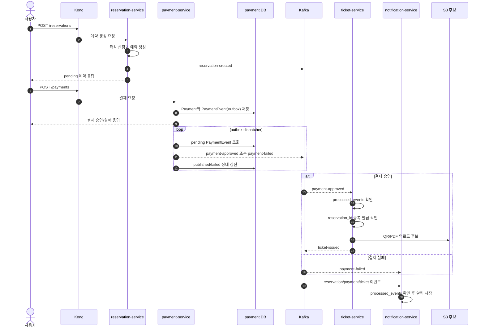

# 03. 예약-결제-티켓 처리

이 문서가 답하는 질문:

- 사용자가 예약하고 결제 승인까지 받은 뒤 티켓과 알림은 어떻게 이어지는가?
- payment outbox와 Kafka는 핵심 업무 처리에서 어떤 역할을 하는가?

## 핵심 해석

- 예약 생성은 `reservation-service`가 사용자 요청 안에서 처리하고 `reservation-created` 이벤트를 Kafka에 발행한다.
- 결제 생성은 `Payment`와 `PaymentEvent` outbox row를 같은 DB 트랜잭션으로 저장한다.
- `payment-service` dispatcher는 pending outbox를 조회해 Kafka에 발행하고, 성공/실패 상태와 발행 시도 횟수를 기록한다.
- `ticket-service`는 `payment-approved`를 소비해 티켓을 발급하고, `processed_events`와 `reservation_id`로 중복 처리를 방어한다.
- `notification-service`는 예약/결제/티켓 이벤트를 받아 알림을 저장하고, MongoDB의 `processed_events`로 같은 이벤트의 중복 알림 생성을 막는다.
- 알림은 핵심 결제 응답 경로 밖의 후속 처리이고, 티켓 발급은 결제 승인 이후 재시도 가능한 서버 소유 업무로 봐야 한다.

## 근거 경로

- `service/docs/architecture/reservation/user-booking/README.md`
- `service/services/payment-service/app/services/payments.py`
- `service/services/payment-service/app/services/payment_events.py`
- `service/services/payment-service/app/models.py`
- `service/services/ticket-service/app/services/ticket_service.py`
- `service/services/notification-service/app/services/notification_service.py`

## 확인 필요

- `ticket-issued` 발행 실패 시 티켓 row는 이미 commit될 수 있으므로, downstream 이벤트 내구성 보강이나 reconciliation 정책이 필요한지 확인해야 한다.
- 결제 실패 또는 예약 만료가 좌석 상태를 언제 어떻게 정리하는지는 별도 시나리오 검증이 필요하다.
