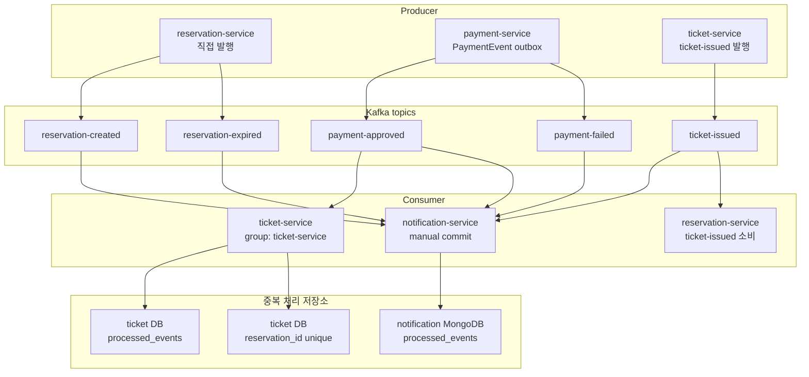

# 04. 이벤트와 Kafka 아키텍처

이 문서가 답하는 질문:

- 어떤 서비스가 어떤 Kafka topic을 만들고 소비하는가?
- outbox, consumer group, `processed_events`는 재시도와 중복 처리에서 어떤 역할을 하는가?

## 핵심 해석

- 실제 topic 생성 Job은 `reservation-created`, `reservation-expired`, `payment-approved`, `payment-failed`, `ticket-issued`를 만든다.
- `payment-service`는 outbox를 사용해 결제 상태 저장과 이벤트 발행 대상을 같은 DB 트랜잭션에 묶는다.
- `payment-service` dispatcher는 Kafka 발행 실패 시 `publish_attempts`, `publish_status`, `last_publish_error`로 재시도 상태를 남긴다.
- `ticket-service`는 `payment-approved` 이벤트 ID를 `processed_events`에 저장하고, `reservation_id` unique 제약으로 중복 티켓 발급도 막는다.
- `notification-service`는 manual commit을 사용하고, 파싱 가능한 이벤트를 처리한 뒤 commit한다.
- `reservation-service`도 `ticket-issued`를 소비하는 코드 경계가 있지만, 이 문서에서는 티켓 발급 이후 예약 상태 반영의 상세 의미를 확인 필요로 둔다.

## 근거 경로

- `gitops/platform/data/kafka.yaml`
- `service/services/payment-service/app/models.py`
- `service/services/payment-service/app/services/payment_events.py`
- `service/services/ticket-service/app/consumers/kafka_consumer.py`
- `service/services/ticket-service/app/models.py`
- `service/services/notification-service/app/consumers/kafka_consumer.py`
- `service/services/notification-service/app/models.py`

## 확인 필요

- `reservation-service`의 `ticket-issued` 소비 결과가 예약 상태에 어떤 의미로 반영되는지는 별도 코드/시나리오 확인이 필요하다.
- Kafka topic partition 수는 현재 dev manifest에서 1로 생성되므로, 운영형 처리량/순서 보장 요구가 생기면 partition 전략을 다시 정해야 한다.
- outbox 실패 이벤트가 `failed` 상태가 된 뒤 사람이 재처리하는 운영 절차는 아직 이 초안에서 확인하지 않았다.
