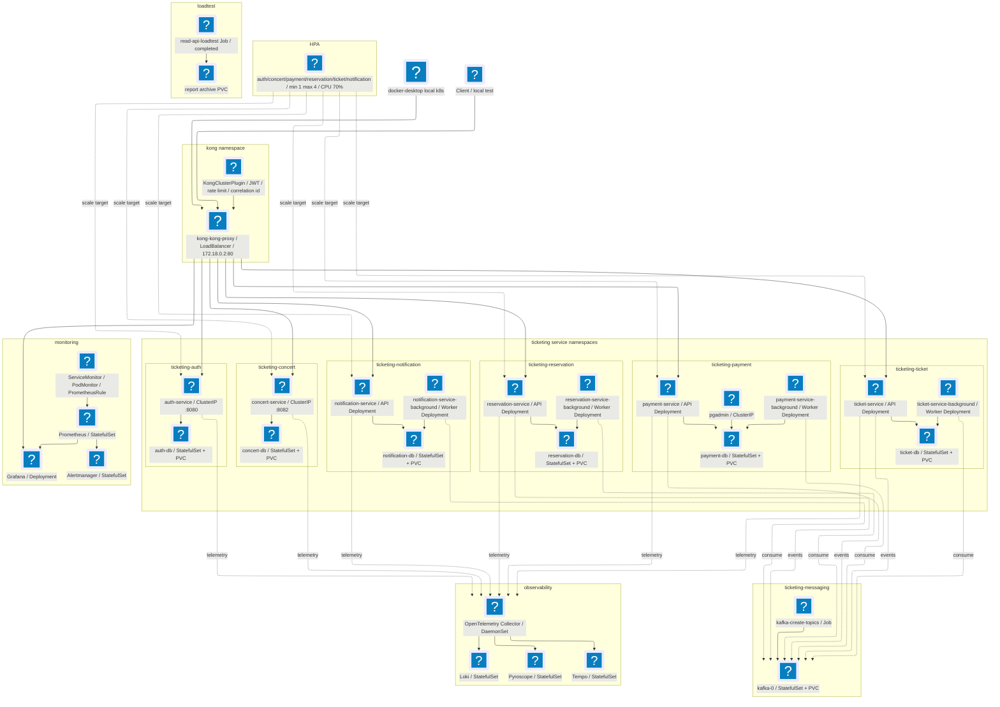
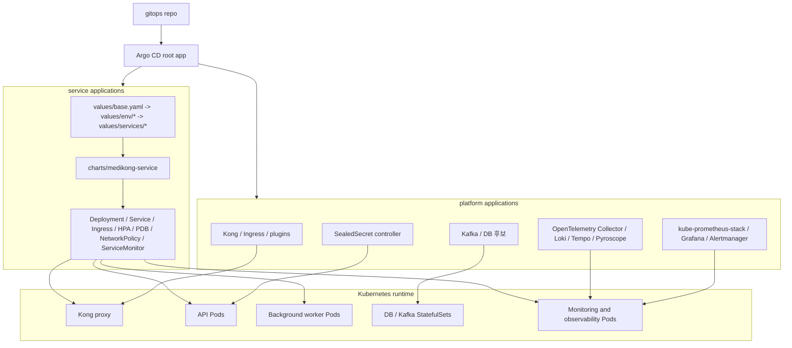

# 05. Kubernetes 런타임과 GitOps 아키텍처

이 문서가 답하는 질문:

- 로컬 Kubernetes에서 Medikong은 어떤 네임스페이스와 리소스로 떠 있는가?
- 외부 요청, API Deployment, background worker, DB, Kafka는 어떻게 연결되는가?
- 모니터링과 관측성 구성은 서비스 런타임과 어떤 관계를 갖는가?
- GitOps 선언은 이 런타임 구성을 어떤 단위로 관리하는가?

아래 그림은 2026-06-22 로컬 `docker-desktop` 클러스터 조회 결과를 기준으로 한 런타임 구성도다. Mermaid v11.3+의 flowchart icon shape를 사용한다. 렌더러가 Iconify pack을 등록하지 않으면 아이콘 대신 일반 노드처럼 보일 수 있다.

## 핵심 해석

- 로컬 런타임은 `kong`, `ticketing-*`, `ticketing-messaging`, `monitoring`, `observability`, `loadtest` 네임스페이스로 나뉜다.
- 외부 HTTP 진입점은 `kong-kong-proxy` LoadBalancer이고, 현재 로컬 주소는 `172.18.0.2:80`이다.
- `auth`, `concert`는 API Deployment와 DB StatefulSet 조합이고, 별도 background worker Deployment는 없다.
- `payment`, `reservation`, `ticket`, `notification`은 API Deployment와 background worker Deployment를 분리해서 운영한다.
- PostgreSQL 계열 DB는 `auth`, `concert`, `payment`, `reservation`, `ticket`에 있고, `notification`은 MongoDB를 사용한다. 각 DB와 Kafka는 PVC를 가진 StatefulSet이다.
- Kafka topic 생성은 `ticketing-messaging`의 `kafka-create-topics` Job으로 관리된다.
- HPA는 6개 API Deployment를 대상으로 `min 1`, `max 4`, CPU target `70%` 기준으로 설정되어 있다.
- Prometheus는 ServiceMonitor/PodMonitor를 통해 메트릭을 수집하고, OpenTelemetry Collector DaemonSet은 로그/트레이스/프로파일링 backend와 연결된다.

## 로컬 조회 스냅샷

| 구분 | 현재 상태 |
| --- | --- |
| Kubernetes context | `docker-desktop` |
| Kubernetes API | `https://127.0.0.1:63875` |
| Node | `desktop-control-plane`, `desktop-worker`, `desktop-worker2`, `desktop-worker3` 모두 `Ready` |
| Kong | `kong-kong-proxy` `LoadBalancer`, `EXTERNAL-IP 172.18.0.2`, `80:32752/TCP` |
| API Deployment | `auth-service`, `concert-service`, `payment-service`, `reservation-service`, `ticket-service`, `notification-service` 모두 `1/1` |
| Background worker | `payment-service-background`, `reservation-service-background`, `ticket-service-background`, `notification-service-background` 모두 `1/1` |
| StatefulSet | 서비스 DB, Kafka, Prometheus, Alertmanager, Loki, Tempo, Pyroscope 모두 `1/1` |
| HPA | 6개 API Deployment 대상, 현재 replica `1`, CPU target `70%` |
| PVC | DB, Kafka, 관측성 backend, loadtest report archive PVC 모두 `Bound` |

## GitOps 관리 관점

GitOps 문서는 런타임을 그대로 복사하기 위한 목록이 아니라, 어떤 선언이 어떤 런타임 리소스를 만들고 관리하는지 보여주는 관점이다. 서비스별 chart와 values는 API/worker Deployment, Service, Ingress, HPA, PDB, NetworkPolicy, ServiceMonitor 같은 표면을 만든다. platform Application은 Kong, monitoring, observability, secret controller, data layer처럼 서비스 공통 기반을 맡는다.

## 근거 경로

- `gitops/argo/README.md`
- `gitops/argo/applications/aws-dev/root.yaml`
- `gitops/argo/applications/aws-dev/services/*.yaml`
- `gitops/argo/applications/aws-dev/platform/*.yaml`
- `gitops/charts/medikong-service/values.yaml`
- `gitops/values/base.yaml`
- `gitops/values/env/aws-dev.yaml`
- `gitops/values/services/*.yaml`
- `gitops/platform/data/kafka.yaml`
- `gitops/platform/monitoring/values/kube-prometheus-stack.yaml`
- `gitops/platform/observability/README.md`

## 확인 필요

- 이 문서는 로컬 `docker-desktop` 조회 결과를 기준으로 한다. `aws-dev`와 `private-dev`는 Service type, Ingress 주소, node/hostPort 정책이 다를 수 있다.
- Mermaid 아이콘 렌더링은 문서를 보여주는 도구가 `logos`, `mdi`, `simple-icons` Iconify pack을 등록했는지에 따라 달라진다.
- Kubernetes 리소스 전용 아이콘(`k8s:svc`, `k8s:deploy`, `k8s:sts`, `k8s:pvc`)을 쓰려면 별도 `k8s` Iconify pack 등록이 필요하다.
- 최근 이벤트에는 일부 liveness/readiness probe timeout 경고가 있었지만, 이 문서는 장애 분석 문서가 아니라 배포 구성도 문서로 범위를 둔다.
