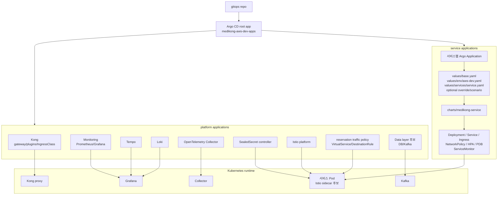

# 05. Kubernetes와 GitOps 아키텍처

이 문서가 답하는 질문:

- GitOps 선언은 어떤 순서로 Kubernetes 리소스를 만든다?
- Argo CD, Helm values, SealedSecret, Kong, Istio, 서비스 Deployment는 어떤 책임으로 나뉘는가?

## 핵심 해석

- `gitops/argo/applications/aws-dev/root.yaml`은 platform Application과 services Application을 app-of-apps 방식으로 묶는다.
- 서비스 배포는 `charts/medikong-service`와 `values/base.yaml -> values/env/aws-dev.yaml -> values/services/<service>.yaml` 순서의 Helm values가 기준이다.
- 서비스 values는 Deployment, Service, Kong Ingress, NetworkPolicy, HPA, ServiceMonitor, tracing env 같은 배포 표면을 정의한다.
- Kong은 외부 HTTP 진입점과 공통 plugin을 담당하고, Istio는 내부 mesh 라우팅과 `VirtualService`/`DestinationRule` 기반 트래픽 정책을 담당한다.
- `sealed-secrets-aws-dev`는 sync wave `-28`로 controller를 준비하지만, 개별 secret 값의 소유 위치는 리소스별로 더 확인해야 한다.
- `archive/` 아래 Kustomize 경로는 실제 배포 근거가 아니라 과거 reference로만 보았다.

## 근거 경로

- `gitops/argo/README.md`
- `gitops/argo/applications/aws-dev/root.yaml`
- `gitops/argo/applications/aws-dev/services/*.yaml`
- `gitops/argo/applications/aws-dev/platform/*.yaml`
- `gitops/charts/medikong-service/values.yaml`
- `gitops/values/base.yaml`
- `gitops/values/env/aws-dev.yaml`
- `gitops/values/services/*.yaml`
- `gitops/platform/istio/traffic/reservation/*.yaml`

## 확인 필요

- AWS dev에서 DB/Kafka가 Argo CD `platform/data`로 실제 관리되는지, 아니면 별도 방식으로 준비되는지는 문서마다 표현이 달라 추가 확인이 필요하다.
- SealedSecret 개별 manifest와 secret 생성/갱신 절차는 이 초안에서 깊게 확인하지 않았다.
- private-dev와 aws-dev는 유사한 트리 구조를 갖지만, 이 문서는 aws-dev 선언을 중심으로 작성했다.
