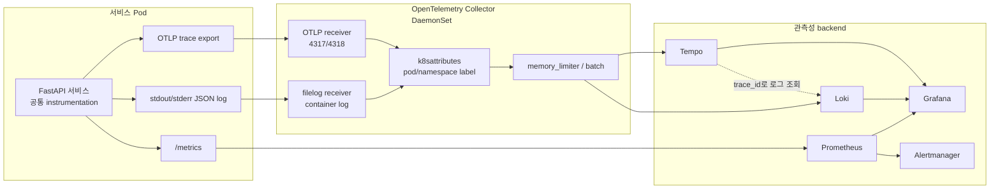

# 06. 관측성 아키텍처

이 문서가 답하는 질문:

- 애플리케이션 로그, 트레이스, 메트릭은 어떤 경로로 수집되는가?
- Grafana에서 로그와 트레이스를 어떻게 이어서 볼 수 있는가?

## 핵심 해석

- 서비스 코드는 FastAPI inbound, Kafka consumer/producer, DB driver 같은 경계 중심으로 trace를 남긴다.
- trace는 서비스에서 OTLP로 Collector에 보내고, Collector는 Tempo exporter로 전달한다.
- log는 애플리케이션이 stdout/stderr에 JSON으로 남기고, Collector filelog receiver가 Kubernetes container log를 읽어 Loki로 보낸다.
- metric은 Collector가 아니라 ServiceMonitor/PodMonitor를 통해 Prometheus가 `/metrics`를 scrape한다.
- Grafana datasource 설정에는 Tempo에서 Loki로 `trace_id` 기반 로그 조회를 이어가는 설정이 있다.
- Loki는 모든 request/access log 원장이 아니라 운영 로그 수집/보존 정책에 따라 필터링과 샘플링이 적용된다.

## 근거 경로

- `workspace/docs/architecture/observability/README.md`
- `workspace/docs/architecture/observability/tracing/README.md`
- `gitops/platform/observability/README.md`
- `gitops/platform/observability/collector/values/aws-dev.yaml`
- `gitops/platform/monitoring/values/kube-prometheus-stack.yaml`
- `service/packages/observability/src/observability`

## 확인 필요

- trace sampling/retention은 환경별 Collector values와 Tempo values에 따라 달라질 수 있으므로, 실제 배포 환경 값을 기준으로 다시 확인해야 한다.
- 로그 보존 정책과 감사 로그 파이프라인은 별도 문서 영역이므로, 업무 증적 보관 요구는 이 문서만으로 판단하지 않는다.
