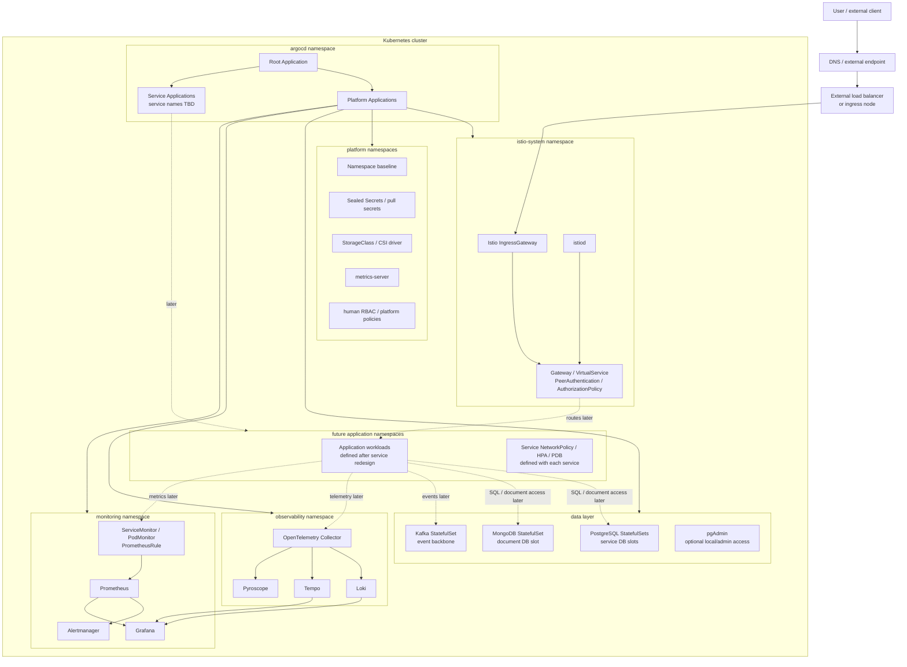
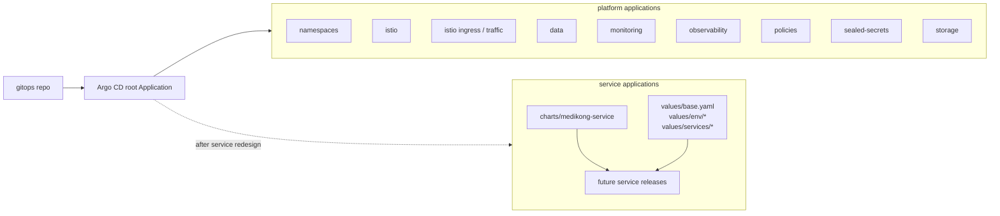

# 07. Kubernetes 플랫폼 아키텍처

이 문서가 답하는 질문:

- 서비스가 아직 확정되지 않았을 때 Kubernetes 플랫폼은 어떤 영역으로 나눠 보는가?
- 외부 HTTP 진입점을 Istio IngressGateway로 둘 때 요청은 어디까지 들어오는가?
- GitOps, 데이터, 관측성, 보안 정책은 서비스 설계와 어떤 경계로 분리되는가?

이 초안은 서비스 재구성 전의 플랫폼 골격만 다룬다. 개별 서비스 Deployment, Service, worker, API 경로, topic 생산/소비 관계는 의도적으로 제외한다.

## 전체 구조

## 영역별 책임

| 영역 | 책임 | 서비스 재구성과의 관계 |
| --- | --- | --- |
| Edge | DNS, 외부 LoadBalancer 또는 ingress node, Istio IngressGateway 진입 | 서비스 경로가 정해지면 Gateway/VirtualService에 반영 |
| Service mesh | `istiod`, Gateway, VirtualService, mTLS, AuthorizationPolicy | 서비스별 정책은 나중에 붙이고, 진입 방식만 먼저 고정 |
| GitOps | Argo CD root app, platform apps, service apps | platform tree는 먼저 유지하고, service apps는 이름 확정 후 추가 |
| Platform baseline | namespace, secret, storage, metrics-server, RBAC | 서비스와 무관하게 먼저 준비되는 기반 |
| Data layer | PostgreSQL, MongoDB, Kafka, pgAdmin | DB/topic 이름은 서비스 확정 후 세분화 |
| Observability | OpenTelemetry Collector, Loki, Tempo, Pyroscope | 서비스가 어떤 언어/프레임워크여도 수집 backend는 유지 |
| Monitoring | kube-prometheus-stack, Grafana, Alertmanager, ServiceMonitor/PodMonitor/Rule | 서비스별 scrape 대상과 alert rule은 나중에 추가 |
| Workload slots | 향후 서비스 namespace, Deployment, HPA, PDB, NetworkPolicy | 이 문서에서는 이름과 내부 구조를 확정하지 않음 |

## GitOps 관점

플랫폼 Application은 서비스 이름이 바뀌어도 비교적 오래 유지될 영역이다. 반대로 service Application은 서비스 경계, API 이름, worker 필요 여부, DB 소유권이 확정된 뒤 다시 설계한다.

## 설계 메모

- Ingress는 일단 Istio IngressGateway를 기준으로 둔다. 기존 Kong 중심 문서는 이전 런타임/구현 근거로만 본다.
- 이 문서는 서비스가 빠진 플랫폼 지도다. `auth`, `concert`, `reservation` 같은 기존 서비스 이름은 다이어그램에 넣지 않았다.
- 데이터 레이어도 서비스별 DB 이름을 최종 확정하지 않고 `PostgreSQL slots`, `document DB slot`, `event backbone` 수준으로만 표현한다.
- 관측성 backend는 서비스와 독립적인 운영 기반으로 둔다. 서비스별 metric name, log field, trace span 구조는 별도 문서에서 정한다.
- NetworkPolicy, HPA, PDB는 chart가 만들 수 있는 표면이지만, 서비스 경계와 리소스 기준이 확정될 때 구체화한다.

## 근거 경로

- `workspace/docs/architecture/repo-boundaries.md`
- `workspace/docs/architecture/05-kubernetes-gitops-architecture.md`
- `workspace/docs/architecture/06-observability-architecture.md`
- `gitops/argo/applications/aws-dev/root.yaml`
- `gitops/argo/applications/aws-dev/platform/*.yaml`
- `gitops/platform/istio`
- `gitops/platform/namespaces/namespaces.yaml`
- `gitops/platform/data/README.md`
- `gitops/platform/monitoring`
- `gitops/platform/observability`
- `gitops/charts/medikong-service/templates`

## 확인 필요

- Istio IngressGateway를 실제 진입점으로 바꿀 때 외부 LoadBalancer, NodePort, hostPort, DNS/TLS 종료 위치를 어느 환경 기준으로 둘지 정해야 한다.
- Kong plugin으로 처리하던 JWT, role guard, rate limit, correlation id를 Istio native 정책, EnvoyFilter, external auth, 또는 별도 gateway layer 중 어디로 옮길지 결정해야 한다.
- 서비스 재구성 후 DB를 서비스별 PostgreSQL로 유지할지, 공유 클러스터 안에서 database/schema만 나눌지 다시 정해야 한다.
- Kafka를 플랫폼 공용 event backbone으로 유지할지, 서비스 재설계 후 topic/consumer group 전략을 다시 잡을지 결정해야 한다.
