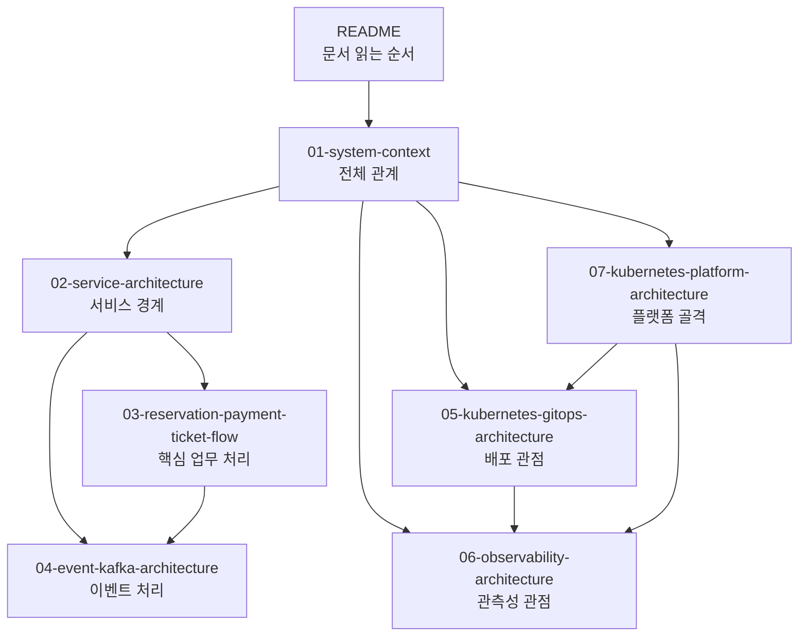

# Medikong 아키텍처 다이어그램 초안

이 문서가 답하는 질문:

- Medikong 아키텍처를 처음 보는 팀원이 어떤 순서로 읽으면 되는가?
- 시스템, 서비스, 이벤트, 배포, 관측성 관점을 어디에서 나눠 보면 되는가?

## 문서 목록

- [01-system-context.md](01-system-context.md): 사용자, 외부 진입점, 주요 서비스, Kafka, 관측성 시스템의 전체 관계를 본다.
- [02-service-architecture.md](02-service-architecture.md): `auth`, `concert`, `reservation`, `payment`, `ticket`, `notification`, `dashboard`의 책임과 동기/비동기 경계를 본다.
- [03-reservation-payment-ticket-flow.md](03-reservation-payment-ticket-flow.md): 예약 생성부터 결제 승인, outbox, Kafka, 티켓 발급, 알림까지의 핵심 업무 처리를 본다.
- [04-event-kafka-architecture.md](04-event-kafka-architecture.md): producer, topic, consumer, outbox, `processed_events`, 재시도/중복 처리 관점을 본다.
- [05-kubernetes-gitops-architecture.md](05-kubernetes-gitops-architecture.md): 로컬 Kubernetes 런타임, Kong, 서비스/worker/DB/Kafka, HPA, 관측성, GitOps 관리 단위를 본다.
- [06-observability-architecture.md](06-observability-architecture.md): 로그, 트레이스, 메트릭이 OpenTelemetry Collector, Loki, Tempo, Prometheus, Grafana로 이어지는 경로를 본다.
- [07-kubernetes-platform-architecture.md](07-kubernetes-platform-architecture.md): 서비스 재구성 전, Istio IngressGateway를 전제로 서비스 영역을 제외한 Kubernetes 플랫폼 골격을 본다.

## 핵심 해석

- 이 초안은 `workspace`에 둔 공통 아키텍처 문서이며, 실제 서비스 코드는 `service`, 배포 선언은 `gitops`, 클러스터/인프라 구성은 `infra`가 책임진다.
- `archive/` 경로는 과거 reference로만 보고, 실제 배포 상태 근거에는 사용하지 않았다.
- 한 장짜리 큰 그림 대신 시스템, 서비스, 업무 처리, 이벤트, 배포, 관측성을 분리했다.
- 서비스 재구성 전에는 `07-kubernetes-platform-architecture.md`를 기준으로 플랫폼 영역과 서비스 영역을 분리해서 본다.
- 각 문서는 현재 코드와 GitOps 선언에서 확인한 구조를 우선 반영하고, 단정하기 어려운 부분은 `확인 필요`에 남겼다.

## 근거로 본 주요 경로

- `workspace/docs/project_docs/02-service-architecture.md`
- `workspace/docs/architecture/repo-boundaries.md`
- `service/docs/architecture/reservation/user-booking/README.md`
- `service/docs/architecture/trace/README.md`
- `service/services/*`
- `gitops/argo`
- `gitops/values`
- `gitops/platform/observability`
- `gitops/platform/istio`

## 확인 필요

- 이 문서 묶음을 장기적으로 `workspace/docs/architecture/` 최상위에 둘지, 이후 `workspace/docs/architecture/medikong/` 같은 별도 하위 폴더로 이동할지는 팀 문서 규칙 확정 후 다시 정한다.
