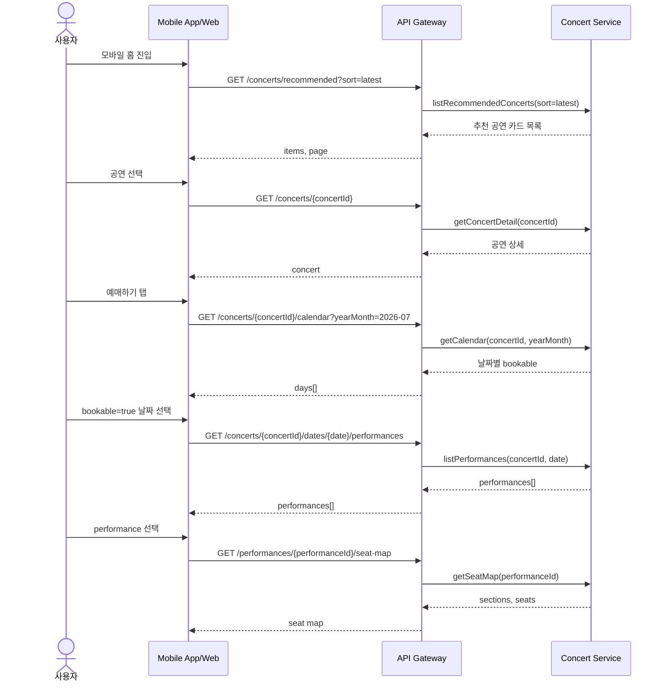

# Target API Shape Details

이 문서는 모바일 예매 과정에서 `Concert Service`가 제공할 조회 API의 상세 스키마를 한 곳에 모은다. 기준 여정은 `추천 공연 -> 공연 상세 -> 달력 -> 날짜별 performance -> 좌석도`다.

좌석 선택 이후의 주문, 결제, 티켓 발급은 이 문서의 범위가 아니다.

## Principles

- API는 현재 화면에서 필요한 데이터만 반환한다.
- 첫 진입은 직접 검색이 아니라 최신순 추천 공연 목록이다.
- 달력 API는 날짜별 클릭 가능 여부만 반환한다.
- 날짜를 선택하기 전에는 `performance` 목록을 반환하지 않는다.
- `performance`를 선택하기 전에는 좌석 정보를 반환하지 않는다.
- 모든 list API는 서버가 최대 크기를 강제한다.

## API List

| 단계 | API | 목적 |
| --- | --- | --- |
| 추천 공연 | `GET /concerts/recommended?sort=latest&cursor={cursor}&limit={limit}` | 모바일 홈의 최신순 추천 공연 카드 목록 |
| 공연 상세 | `GET /concerts/{concertId}` | 공연 기본 정보, venue, 가격, 예매 공지 |
| 달력 | `GET /concerts/{concertId}/calendar?yearMonth=YYYY-MM` | 해당 월 날짜별 클릭 가능 여부 |
| 날짜별 performance | `GET /concerts/{concertId}/dates/{date}/performances` | 선택 날짜의 performance 목록 |
| 좌석도 | `GET /performances/{performanceId}/seat-map` | 선택 performance의 좌석 구역, 등급, 좌석 상태 |

## Common Rules

### ID Format

ID는 예시 형식이다. 실제 구현에서는 현재 서비스의 ID 전략을 따른다.

```json
{
  "concertId": "con_01JY8M4R7Y9E5Q6X2K6W1M3Q2A",
  "performanceId": "perf_01JY8M6M0P9F2S3C7K8N4H5R1B",
  "venueId": "ven_01JY8M5DQZ9KTY3NJ7H4TAM02W",
  "seatId": "seat_01JY8M8CQJ3B9Q1GQ4B6FM2S5R"
}
```

### Time Format

- 날짜는 `YYYY-MM-DD`를 사용한다.
- 월은 `YYYY-MM`을 사용한다.
- 시간은 timezone이 포함된 ISO 8601 문자열을 사용한다.
- 응답의 `timezone`은 공연장 기준 timezone이다.

### Error Response

```json
{
  "error": {
    "code": "INVALID_REQUEST",
    "message": "yearMonth must match YYYY-MM.",
    "requestId": "req_01JY8MB4WYWJQ9FHH7A9Q2MKY6"
  }
}
```

공통 에러 코드:

| HTTP | code | 의미 |
| --- | --- | --- |
| `400` | `INVALID_REQUEST` | query/path/body 형식 오류 |
| `404` | `CONCERT_NOT_FOUND` | 공연이 없음 |
| `404` | `PERFORMANCE_NOT_FOUND` | performance가 없음 |
| `410` | `CONCERT_NOT_BOOKABLE` | 예매 가능한 상태가 아님 |
| `429` | `RATE_LIMITED` | 요청 제한 |
| `500` | `INTERNAL_ERROR` | 서버 오류 |

## GET /concerts/recommended

모바일 홈의 최신순 추천 공연 목록을 반환한다. 첫 버전에서는 개인화 추천이 아니라 최신 등록순 feed로 본다.

### Request

```http
GET /concerts/recommended?sort=latest&cursor=eyJjcmVhdGVkQXQiOiIyMDI2LTA2LTIwVDA5OjAwOjAwKzA5OjAwIn0&limit=10
```

| 이름 | 위치 | 필수 | 설명 |
| --- | --- | --- | --- |
| `sort` | query | 아니오 | 현재는 `latest`만 허용한다. 기본값은 `latest`다. |
| `cursor` | query | 아니오 | 다음 페이지 조회 cursor다. |
| `limit` | query | 아니오 | 기본 `10`, 최대 `12`다. |

### Response

```json
{
  "items": [
    {
      "concertId": "con_01JY8M4R7Y9E5Q6X2K6W1M3Q2A",
      "title": "Summer Night Live 2026",
      "posterImageUrl": "https://cdn.example.com/posters/con_01JY8M4R7Y9E5Q6X2K6W1M3Q2A.jpg",
      "venue": {
        "venueId": "ven_01JY8M5DQZ9KTY3NJ7H4TAM02W",
        "name": "Olympic Hall",
        "city": "Seoul"
      },
      "performancePeriod": {
        "startDate": "2026-07-18",
        "endDate": "2026-07-20"
      },
      "saleBadge": "ON_SALE",
      "createdAt": "2026-06-20T09:00:00+09:00"
    }
  ],
  "page": {
    "nextCursor": "eyJjcmVhdGVkQXQiOiIyMDI2LTA2LTE5VDE4OjAwOjAwKzA5OjAwIn0",
    "hasMore": true,
    "limit": 10
  }
}
```

### Schema

| 필드 | 타입 | 설명 |
| --- | --- | --- |
| `items[].concertId` | string | 공연 ID |
| `items[].title` | string | 공연명 |
| `items[].posterImageUrl` | string | 포스터 이미지 URL |
| `items[].venue.venueId` | string | venue ID |
| `items[].venue.name` | string | 공연장명 |
| `items[].venue.city` | string | 도시 |
| `items[].performancePeriod.startDate` | string | 공연 시작일 |
| `items[].performancePeriod.endDate` | string | 공연 종료일 |
| `items[].saleBadge` | string | `ON_SALE`, `COMING_SOON`, `SOLD_OUT`, `CLOSED` |
| `items[].createdAt` | string | 추천 피드 정렬 기준 시각 |
| `page.nextCursor` | string or null | 다음 페이지 cursor |
| `page.hasMore` | boolean | 다음 페이지 존재 여부 |
| `page.limit` | number | 적용된 page size |

## GET /concerts/{concertId}

공연 상세 화면에 필요한 정보를 반환한다. 목록 카드보다 자세하지만, 날짜별 performance와 좌석 정보는 포함하지 않는다.

### Request

```http
GET /concerts/con_01JY8M4R7Y9E5Q6X2K6W1M3Q2A
```

### Response

```json
{
  "concertId": "con_01JY8M4R7Y9E5Q6X2K6W1M3Q2A",
  "title": "Summer Night Live 2026",
  "description": "2026 summer concert.",
  "posterImageUrl": "https://cdn.example.com/posters/con_01JY8M4R7Y9E5Q6X2K6W1M3Q2A.jpg",
  "venue": {
    "venueId": "ven_01JY8M5DQZ9KTY3NJ7H4TAM02W",
    "name": "Olympic Hall",
    "address": "424 Olympic-ro, Songpa-gu, Seoul",
    "city": "Seoul"
  },
  "performancePeriod": {
    "startDate": "2026-07-18",
    "endDate": "2026-07-20"
  },
  "bookingPeriod": {
    "openAt": "2026-06-25T20:00:00+09:00",
    "closeAt": "2026-07-20T17:00:00+09:00"
  },
  "priceBands": [
    {
      "gradeCode": "VIP",
      "gradeName": "VIP",
      "price": 165000,
      "currency": "KRW"
    },
    {
      "gradeCode": "R",
      "gradeName": "R",
      "price": 132000,
      "currency": "KRW"
    }
  ],
  "purchaseLimit": {
    "maxTicketsPerUser": 4,
    "maxTicketsPerPerformance": 2
  },
  "notices": [
    "예매 전 관람일과 performance 시간을 다시 확인해 주세요.",
    "공연 당일 현장 상황에 따라 입장이 지연될 수 있습니다."
  ],
  "saleStatus": "ON_SALE"
}
```

### Schema

| 필드 | 타입 | 설명 |
| --- | --- | --- |
| `concertId` | string | 공연 ID |
| `title` | string | 공연명 |
| `description` | string | 공연 설명 |
| `posterImageUrl` | string | 포스터 이미지 URL |
| `venue` | object | 공연장 요약 |
| `performancePeriod` | object | 공연 기간 |
| `bookingPeriod` | object | 예매 가능 기간 |
| `priceBands[]` | array | 좌석 등급별 가격 |
| `purchaseLimit.maxTicketsPerUser` | number | 사용자별 최대 예매 수 |
| `purchaseLimit.maxTicketsPerPerformance` | number | performance별 최대 예매 수 |
| `notices[]` | array | 예매 전 안내 문구 |
| `saleStatus` | string | `ON_SALE`, `COMING_SOON`, `SOLD_OUT`, `CLOSED` |

## GET /concerts/{concertId}/calendar

해당 월의 날짜별 클릭 가능 여부만 반환한다. 모바일 달력은 이 값을 보고 날짜를 활성화하거나 비활성화한다.

이 API는 사용자가 특정 날짜를 클릭할 수 있는지만 알려준다. 회차 수, 잔여 좌석 수, 매진 사유, 가격, 캐스팅은 반환하지 않는다.

### Request

```http
GET /concerts/con_01JY8M4R7Y9E5Q6X2K6W1M3Q2A/calendar?yearMonth=2026-07
```

| 이름 | 위치 | 필수 | 설명 |
| --- | --- | --- | --- |
| `concertId` | path | 예 | 공연 ID |
| `yearMonth` | query | 아니오 | 조회 월이다. 없으면 공연장 timezone 기준 현재 월을 사용한다. |

### Response

```json
{
  "concertId": "con_01JY8M4R7Y9E5Q6X2K6W1M3Q2A",
  "yearMonth": "2026-07",
  "timezone": "Asia/Seoul",
  "days": [
    {
      "date": "2026-07-01",
      "bookable": false
    },
    {
      "date": "2026-07-18",
      "bookable": true
    },
    {
      "date": "2026-07-19",
      "bookable": true
    },
    {
      "date": "2026-07-20",
      "bookable": true
    }
  ]
}
```

### Schema

| 필드 | 타입 | 설명 |
| --- | --- | --- |
| `concertId` | string | 공연 ID |
| `yearMonth` | string | 조회 월, `YYYY-MM` |
| `timezone` | string | 공연장 기준 timezone |
| `days[].date` | string | 조회 월에 포함된 날짜, `YYYY-MM-DD` |
| `days[].bookable` | boolean | 사용자가 이 날짜를 클릭할 수 있는지 여부 |

### Calendar Rules

- `bookable=true`면 모바일 달력에서 날짜를 활성화한다.
- `bookable=false`면 모바일 달력에서 날짜를 비활성화한다.
- `days`는 조회 월의 전체 날짜를 포함한다.
- `days`에는 날짜별 잔여 좌석 수를 넣지 않는다.
- `days`에는 날짜별 performance 수를 넣지 않는다.
- `days`에는 예매 상태의 상세 이유를 넣지 않는다.
- 날짜를 선택한 뒤 필요한 정보는 `GET /concerts/{concertId}/dates/{date}/performances`에서 조회한다.

## GET /concerts/{concertId}/dates/{date}/performances

사용자가 달력에서 날짜를 선택한 뒤, 해당 날짜의 performance 목록을 반환한다. 사용자는 이미 공연 상세에서 어떤 공연인지 알고 있으므로, performance 응답에는 공연명, 회차 표시명, 요약 문구를 넣지 않는다.

### Request

```http
GET /concerts/con_01JY8M4R7Y9E5Q6X2K6W1M3Q2A/dates/2026-07-18/performances
```

| 이름 | 위치 | 필수 | 설명 |
| --- | --- | --- | --- |
| `concertId` | path | 예 | 공연 ID |
| `date` | path | 예 | 선택 날짜, `YYYY-MM-DD` |

### Response

```json
{
  "concertId": "con_01JY8M4R7Y9E5Q6X2K6W1M3Q2A",
  "date": "2026-07-18",
  "timezone": "Asia/Seoul",
  "performances": [
    {
      "performanceId": "perf_01JY8M6M0P9F2S3C7K8N4H5R1B",
      "startsAt": "2026-07-18T14:00:00+09:00",
      "endsAt": "2026-07-18T16:30:00+09:00",
      "saleStatus": "ON_SALE"
    },
    {
      "performanceId": "perf_01JY8M70GEK6W2R22DTF9YHZ47",
      "startsAt": "2026-07-18T19:00:00+09:00",
      "endsAt": "2026-07-18T21:30:00+09:00",
      "saleStatus": "SOLD_OUT"
    }
  ]
}
```

### Schema

| 필드 | 타입 | 설명 |
| --- | --- | --- |
| `concertId` | string | 공연 ID |
| `date` | string | 선택 날짜 |
| `timezone` | string | 공연장 기준 timezone |
| `performances[].performanceId` | string | performance ID |
| `performances[].startsAt` | string | 시작 시각 |
| `performances[].endsAt` | string | 종료 시각 |
| `performances[].saleStatus` | string | `ON_SALE`, `COMING_SOON`, `SOLD_OUT`, `CLOSED` |

### Rules

- 달력에서 선택한 하루의 performance만 반환한다.
- 다른 날짜의 performance는 반환하지 않는다.
- 공연명, 회차 표시명, 요약 문구, 캐스팅 정보는 반환하지 않는다.
- 좌석 정보는 반환하지 않는다.
- `saleStatus=ON_SALE`인 performance만 다음 좌석 단계로 이동할 수 있다.

## GET /performances/{performanceId}/seat-map

선택한 performance의 좌석도 화면에 필요한 정보를 반환한다.

### Request

```http
GET /performances/perf_01JY8M6M0P9F2S3C7K8N4H5R1B/seat-map
```

| 이름 | 위치 | 필수 | 설명 |
| --- | --- | --- | --- |
| `performanceId` | path | 예 | performance ID |

### Response

```json
{
  "performanceId": "perf_01JY8M6M0P9F2S3C7K8N4H5R1B",
  "venue": {
    "venueId": "ven_01JY8M5DQZ9KTY3NJ7H4TAM02W",
    "name": "Olympic Hall"
  },
  "mapVersion": "2026-07-18T12:00:00+09:00",
  "sections": [
    {
      "sectionId": "sec_A",
      "name": "A",
      "gradeCode": "VIP",
      "price": 165000,
      "currency": "KRW",
      "available": true
    },
    {
      "sectionId": "sec_B",
      "name": "B",
      "gradeCode": "R",
      "price": 132000,
      "currency": "KRW",
      "available": true
    }
  ],
  "seats": [
    {
      "seatId": "seat_01JY8M8CQJ3B9Q1GQ4B6FM2S5R",
      "sectionId": "sec_A",
      "row": "1",
      "number": "1",
      "gradeCode": "VIP",
      "status": "AVAILABLE"
    },
    {
      "seatId": "seat_01JY8M8F42GQAF06BK4E1QHGW7",
      "sectionId": "sec_A",
      "row": "1",
      "number": "2",
      "gradeCode": "VIP",
      "status": "UNAVAILABLE"
    }
  ]
}
```

### Schema

| 필드 | 타입 | 설명 |
| --- | --- | --- |
| `performanceId` | string | performance ID |
| `venue.venueId` | string | venue ID |
| `venue.name` | string | 공연장명 |
| `mapVersion` | string | 좌석도 상태 버전 |
| `sections[].sectionId` | string | 구역 ID |
| `sections[].name` | string | 구역 표시명 |
| `sections[].gradeCode` | string | 좌석 등급 코드 |
| `sections[].price` | number | 좌석 가격 |
| `sections[].currency` | string | 통화 |
| `sections[].available` | boolean | 구역 내 선택 가능한 좌석 존재 여부 |
| `seats[].seatId` | string | 좌석 ID |
| `seats[].sectionId` | string | 좌석이 속한 구역 ID |
| `seats[].row` | string | 열 |
| `seats[].number` | string | 좌석 번호 |
| `seats[].gradeCode` | string | 좌석 등급 코드 |
| `seats[].status` | string | `AVAILABLE`, `UNAVAILABLE`, `ACCESSIBLE_ONLY` |

### Rules

- 선택한 `performanceId`의 좌석만 반환한다.
- 좌석 상태는 좌석 선택 화면 진입 시점의 상태다.
- `status=AVAILABLE`인 좌석만 사용자가 선택할 수 있다.
- 모바일에서 전체 좌석을 한 번에 렌더링하기 어렵다면 같은 응답 구조를 유지하고, 이후 `sectionId` 기반 조회로 나눌 수 있다.

## Sequence



## Open Questions

- 추천 공연의 기본 `limit`을 `8`, `10`, `12` 중 무엇으로 둘지 정한다.
- 좌석도가 큰 공연장은 `GET /performances/{performanceId}/seat-map?sectionId={sectionId}`처럼 구역 단위 조회를 추가할지 정한다.
- `saleStatus=COMING_SOON`인 performance를 목록에 보여주되 좌석 단계는 막을지, 아예 숨길지 정한다.
