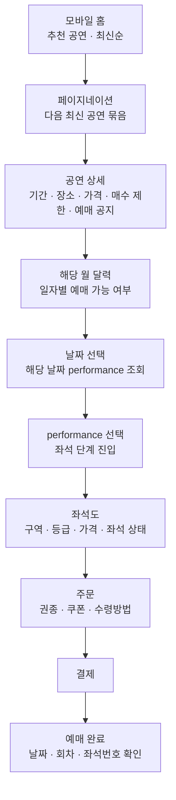
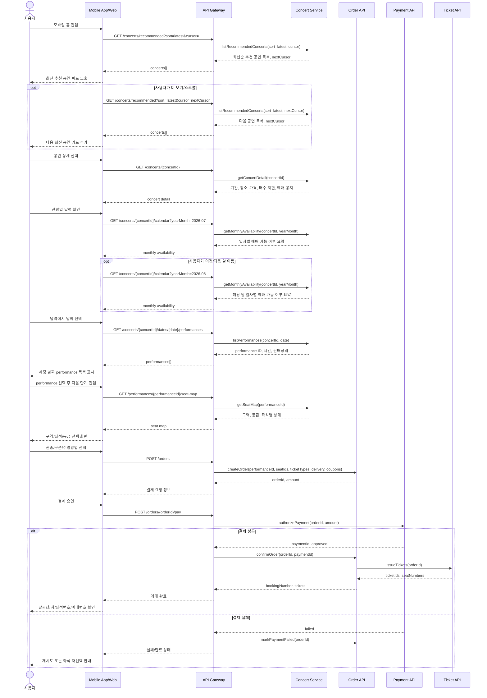
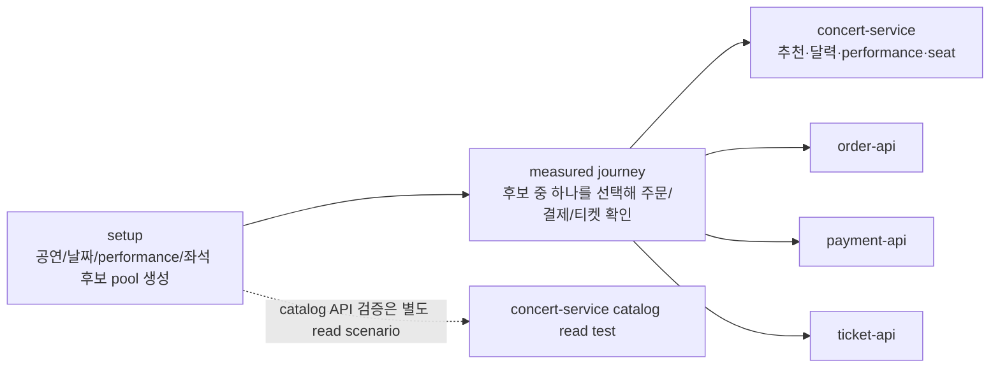

# Concert Service Booking Journey API Design

이 문서는 `concert-service`의 공연 탐색, 날짜 선택, 회차 선택, 좌석 조회 API를 실제 모바일 예매 과정에 맞게 다시 설계하기 위한 초안이다.

현재 문제의 출발점은 `TROUBLE-015`다. 기존 API와 loadtest 조합은 공연 목록, 회차, 좌석을 큰 단위로 한 번에 가져오며, 이 때문에 `reservation-journey-load-test`에서 `concert-service`가 다른 서비스보다 먼저 병목이 된다.

이번 설계는 모바일 앱 또는 모바일 웹을 기본 포맷으로 가정한다. 첫 버전은 직접 검색보다 최신순 추천 피드로 공연을 노출하고, 사용자가 공연을 고른 뒤 `공연 상세 -> 달력 -> performance -> 좌석 -> 주문` 순서로 좁혀 가는 구조를 기준으로 한다.

## Research Summary

공개 도움말, 공식 예매 안내, 공개 상세 페이지를 기준으로 국내외 예매 서비스를 비교했다. 실제 예매창은 로그인, 판매 상태, 대기열, 보안문자, 봇 차단에 따라 달라질 수 있으므로, 여기서는 사용자가 데이터를 좁혀 가는 순서에 초점을 둔다.

| 서비스 | 관찰한 접근 방식 | 설계에 반영할 점 |
| --- | --- | --- |
| NOL/인터파크 | 오픈 예정, 장르별 랭킹, 공연 카드에서 진입하고 관람일/관람시간 이후 좌석선택 팝업으로 이동한다. | 목록은 카드 단위로 작게 제공하고, 날짜/시간 선택 뒤 좌석으로 들어간다. |
| 멜론티켓 | 공연 선택 후 날짜/시간, 좌석, 가격/할인, 수령, 결제 순서로 진행한다. | 좌석 선택 뒤 사용자가 선택한 날짜, performance, 좌석을 주문 단계에서 다시 확인할 수 있어야 한다. |
| YES24 티켓 | 모바일 홈에서 장르, 랭킹, 오픈/공지, 공연장, 검색으로 찾고, 달력에서 예매 가능 날짜를 확인한 뒤 회차와 잔여좌석을 본다. | 달력은 월 단위 가능 여부 요약을 먼저 보여주고, 날짜 선택 뒤 회차를 조회한다. |
| 티켓링크 | 공연별 공지에서 선예매/일반예매, 매수 제한, 회차 조건을 강하게 노출한다. | 공연 상세 응답에 예매 공지, 매수 제한, 판매 상태 요약이 포함되어야 한다. |
| 네이버 예약 | 지정석은 좌석 선택 후 예매 단계로 이동한다. | 좌석 선택 실패나 상태 변경이 있으면 최신 좌석 상태로 되돌린다. |
| Ticketmaster | 인기 이벤트는 waiting room/queue를 거친 뒤 interactive seat map에서 구역, 가격, 접근성 필터를 사용한다. | 인기 공연의 대기열과 보안 확인은 별도 예외 과정으로 확장할 수 있어야 한다. |
| SeatGeek/AXS/StubHub | 이벤트 선택 후 매수, 필터, best available, listing 비교 등으로 좌석을 찾는다. | 지정석과 비지정석/자동배정 좌석은 같은 결제 파이프라인을 쓰되 선택 UI를 분리한다. |

참고 URL:

- NOL 티켓: <https://nol.yanolja.com/ticket>
- 인터파크 예매 안내: <https://ticket.interpark.com/TiKi/Info/BookingGuide.asp?Url=guide_03.html>
- 멜론티켓 예매 방법: <https://ticket.melon.com/customerservice/howto.htm>
- YES24 모바일 티켓: <https://m.ticket.yes24.com/>
- YES24 예매 안내: <https://m.ticket.yes24.com/MyPage/UserGuideDetail.aspx?type=booking>
- 네이버 예약 지정석 도움말: <https://help.naver.com/support/contents/contentsView.help?contentsNo=5108>
- Ticketmaster queue: <https://help.ticketmaster.com/hc/en-us/articles/9781366115985-What-is-the-queue-and-how-do-I-join>
- Ticketmaster interactive seat map: <https://help.ticketmaster.com/hc/en-us/articles/9786899270545-What-is-the-interactive-seat-map-and-how-do-I-use-it>
- SeatGeek filter guide: <https://support.seatgeek.com/hc/en-us/articles/360044584134-How-do-I-sort-and-filter-listings>
- AXS buy tickets guide: <https://support.axs.com/hc/en-us/articles/360033107093-How-can-I-buy-tickets>

## Target User Journey

사용자는 모바일 홈에서 최신순 추천 공연 피드를 보고, 공연 상세에서 날짜와 회차를 고른 뒤, 선택한 `performance`의 좌석도에 진입한다. 여기서 `concert`는 작품/이벤트 묶음이고, `performance`는 특정 날짜와 시간에 열리는 1회 공연이다.

모바일 UX 기준:

- 홈은 최신순 추천 피드를 기본 진입점으로 둔다. 직접 검색은 보조 진입점이다.
- 공연 목록은 무한 스크롤 또는 `더 보기` 방식의 cursor pagination을 사용한다.
- 공연 상세의 `예매하기` CTA는 하단에 고정한다.
- 달력은 현재 월을 기본값으로 열고, 월 단위 availability summary만 먼저 조회한다.
- 날짜를 탭한 뒤에만 해당 날짜의 `performance` 목록을 조회한다.
- `performance`를 선택한 시점에 좌석도 API를 호출한다.
- 좌석 선택 후에는 하단 주문 요약에 날짜, 회차, 좌석, 금액을 함께 보여준다.
- 좌석이 사라지면 토스트만 띄우지 말고 좌석 상태를 갱신하고, 같은 날짜의 다른 회차 또는 같은 회차의 다른 구역으로 이동할 수 있어야 한다.

## Service Boundary

첫 설계에서는 검색, 추천 피드, 공연 상세, venue, performance, seat를 단일 `Concert Service`가 맡는다. 좌석 선택 이후의 주문, 결제, 티켓 발급은 별도 서비스가 맡는다.

| 책임 | 소유 서비스 | 설명 |
| --- | --- | --- |
| 추천 공연 목록 | `Concert Service` | 최신순 추천 피드와 cursor pagination |
| 공연 상세 | `Concert Service` | 공연 기간, 장소, 가격, 매수 제한, 예매 공지 |
| venue 정보 | `Concert Service` | 공연장 요약, 좌석 구역/등급 메타데이터 |
| 월간 가능 여부 | `Concert Service` | `yearMonth` 기준 일자별 예매 가능 여부 요약 |
| performance 목록 | `Concert Service` | 사용자가 선택한 날짜의 performance ID, 시간, 판매 상태 |
| 좌석도/좌석 상태 | `Concert Service` | 선택한 `performance`의 구역, 등급, 좌석별 상태 |
| 주문 | `Order API` | 권종, 할인, 쿠폰, 수령방법, 주문 금액 |
| 결제 | `Payment API` | 결제 승인, 실패, 취소 |
| 티켓 | `Ticket API` | 예매번호, 티켓 발급, 좌석번호 확인 |

## Target API Shape

목표는 모바일 화면 단계와 API 응답 범위를 맞추는 것이다. 목록, 달력, performance, 좌석은 서로 다른 조회 단위로 나누고, 다음 단계에 필요한 데이터만 가져온다.

| 사용자 단계 | API | 응답 성격 | 기본/제약 |
| --- | --- | --- | --- |
| 추천 공연 | `GET /concerts/recommended?sort=latest&cursor={cursor}` | 공연 카드: id, title, poster, venue summary, sale badge | 최신순, cursor pagination |
| 공연 상세 | `GET /concerts/{concertId}` | 공연 설명, 기간, venue, 가격, 매수 제한, 예매 공지 | 단건 |
| 달력 | `GET /concerts/{concertId}/calendar?yearMonth=YYYY-MM` | 일자별 클릭 가능 여부 | 현재 월 기본값, 월 단위 조회 |
| 날짜별 회차 | `GET /concerts/{concertId}/dates/{date}/performances` | 선택 날짜의 `performance` 목록: ID, 시간, 판매 상태 | 날짜별 회차만 |
| 좌석도 | `GET /performances/{performanceId}/seat-map` | 구역, 등급, 가격, 좌석별 상태 | 선택 `performance` 단위 |

달력 API는 전체 공연 기간의 모든 날짜와 회차를 내려주지 않는다. 해당 월의 날짜별 예매 가능 여부만 가볍게 보여주고, 사용자가 날짜를 선택했을 때 그 날짜의 `performance`만 조회한다.

상세 스키마는 [Target API Shape Details](./01-target-api-shape.md)에 둔다.

## API Sequence

## Loadtest Boundary

전체 예매 journey loadtest는 사용자 행동을 검증하는 시나리오로 유지한다. 다만 서비스별 HPA 병목을 보려면 catalog discovery가 예매 처리 단계를 가리지 않도록 분리해야 한다.

해석 기준:

- `concert-service catalog read test`: 추천 피드, 상세, 월간 availability, performance 목록, 좌석도 API의 p95/p99와 캐시/DB 병목을 본다.
- `booking journey test`: 좌석 선택, 주문, 결제, 티켓 발급까지의 완료율과 단계별 실패율을 본다.
- `HPA spike test`: 어느 서비스가 먼저 scale-out하는지 보되, catalog discovery 부하와 주문/결제 부하를 섞어 해석하지 않는다.

## Design Rules

- 목록 API는 최신순 추천 피드의 카드 단위로 작게 유지한다.
- 검색 API는 기본 진입점이 아니라 보조 진입점으로 둔다.
- 상세 API와 목록 API의 응답 모델을 분리한다.
- 달력은 `yearMonth` 기준 availability summary만 먼저 내려준다.
- 날짜 선택 전에는 전체 `performance`를 내려주지 않는다.
- `performance` 선택 전에는 좌석을 내려주지 않는다.
- 모든 list API는 서버에서 최대 limit을 강제한다.
- loadtest용 dataset 탐색은 운영 API의 큰 limit에 기대지 않는다.

## Open Questions

- 최신순 추천 피드의 기본 page size를 `8`, `10`, `12` 중 무엇으로 둘지 정한다.
- 좌석도 API가 모든 좌석 상태를 한 번에 내려줄지, 구역 선택 후 구역별 상태를 내려줄지 정한다.
- 인기 공연의 queue, 보안문자, 선예매 인증을 `Concert Service` 앞단에서 처리할지 별도 gate로 둘지 정한다.
- 기존 `/concerts/{id}/performances`와 `/performances/{id}/seats`를 호환 유지할지, v2 API로 분리할지 정한다.

## Related

- [TROUBLE-015: concert-service catalog API overfetch](../../trouble/2026-06-20-concert-service-catalog-api-overfetch.md)
- [HPA spike concert pool 35 analysis](../../evidence/loadtest/hpa-spike-test/reports/local-hpa-spike-scaleout-6m-concert-pool-35-2026-06-20/analysis-report.md)
- [Target API Shape Details](./01-target-api-shape.md)
- [Performance ticket booking user journey research](../../../../../../knowledge-vault/wiki/sources/performance-ticket-booking-user-journey.md)
