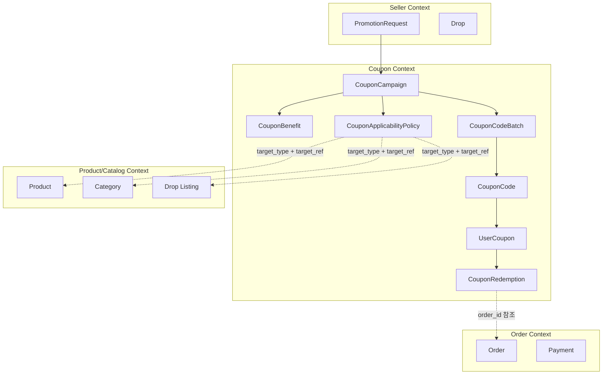

# Coupon Service 도메인 모델

작성일: 2026-07-06

## 이 문서가 답하는 질문

- 쿠폰 서비스가 소유해야 하는 도메인 개념은 무엇인가?
- 쿠폰과 상품, 드롭, 주문의 의존성은 어디에서 끊어야 하는가?
- DDD 기준으로 Aggregate와 Entity를 어떻게 나눌 것인가?
- 현재처럼 단일 `Store`와 단일 컨트롤러에 모든 책임을 넣으면 왜 위험한가?

## 용어

| 용어 | 의미 |
| --- | --- |
| `CouponCampaign` | 쿠폰을 발행하는 업무 단위. 이름, 상태, 기간, 총량, 채널, 생성 주체를 가진다. |
| `CouponBenefit` | 쿠폰이 제공하는 혜택. 할인 금액, 할인율, 무료배송, 적립금, 보상 지급 같은 내용을 표현한다. |
| `CouponApplicabilityPolicy` | 쿠폰을 어디에 쓸 수 있는지 정하는 정책. 상품/드롭/카테고리/주문 조건은 여기에서만 참조한다. |
| `CouponCodeBatch` | 리딤 코드 묶음. 생성 수량, 생성 방식, 만료, 배포 채널을 가진다. |
| `CouponCode` | 사용자가 입력하거나 배포받는 코드. 미사용, 예약, 사용 완료, 폐기 상태를 가진다. |
| `UserCoupon` | 특정 사용자에게 부여된 쿠폰. 쿠폰 코드와 다르며, 사용자 보관함에 보이는 단위다. |
| `CouponRedemption` | 주문에서 쿠폰을 사용한 기록. 예약, 확정, 해제 상태를 가진다. |
| `CouponLedger` | 발급, 리딤, 사용, 취소 같은 불변 이벤트 원장. 장애 분석과 정산 기준이 된다. |

## Aggregate

| Aggregate | 포함 Entity | 책임 | 주요 불변식 |
| --- | --- | --- | --- |
| `CouponCampaign` | `CouponBenefit`, `CouponApplicabilityPolicy`, `CampaignLimit` | 쿠폰의 업무 목적, 혜택, 적용 조건, 발급 가능 기간과 총량을 정의한다. | 활성 캠페인은 혜택과 적용 정책을 반드시 가진다. 종료된 캠페인은 발급 정책을 변경할 수 없다. |
| `CouponCodeBatch` | `CouponCode` | 리딤 코드 생성, 폐기, 다운로드, 코드별 상태 관리를 담당한다. | 한 코드는 하나의 배치와 캠페인에만 속한다. 사용 완료 코드는 다시 미사용으로 돌아가지 않는다. |
| `UserCoupon` | `CouponGrantLedger` | 사용자에게 부여된 쿠폰과 사용자별 상태를 관리한다. | 같은 캠페인에서 사용자별 제한을 초과해 보유 쿠폰을 만들 수 없다. 만료된 쿠폰은 사용할 수 없다. |
| `CouponRedemption` | `RedemptionLedger` | 주문 적용 예약, 확정, 해제 상태를 관리한다. | 하나의 `UserCoupon`은 동시에 하나의 활성 예약만 가진다. 확정된 사용은 해제할 수 없다. |

## 바운디드 컨텍스트 관계

## 상품 의존성 분리

쿠폰 서비스가 `drop_id`를 직접 소유하면 쿠폰 원장이 상품/드롭 모델 변경에 끌려간다. 특히 드롭이 판매 이벤트인지, 카탈로그 노출 단위인지, 재고 계획인지가 바뀌면 쿠폰 테이블과 API도 같이 흔들린다.

쿠폰 쪽에서는 외부 도메인을 opaque reference로만 다룬다. 적용 대상 종류, 외부 참조, 조건 값 같은 구체 필드는 [02-entity-design.md](02-entity-design.md)의 `CouponApplicabilityPolicy`에서 정의한다.

쿠폰 서비스는 적용 정책을 저장하지만 상품의 존재와 판매 가능 여부를 최종 판단하지 않는다. 주문 서비스가 주문 시점의 상품, 수량, 가격, 판매 상태를 알고 있고, 쿠폰 서비스는 넘겨받은 주문 후보가 정책 조건을 만족하는지 검증한다.

엔티티별 필드와 상태값은 [02-entity-design.md](02-entity-design.md)에서 다룬다. 이 문서는 도메인 개념, Aggregate 책임, 컨텍스트 경계만 정의한다.

## 도메인 서비스

| 서비스 | 책임 |
| --- | --- |
| `CampaignPolicyService` | 캠페인 생성/활성화 전 혜택, 기간, 수량, 적용 정책의 일관성을 검사한다. |
| `CouponCodeGenerator` | 코드 생성 규칙, 중복 방지, 배치 생성 단위를 담당한다. |
| `CouponClaimService` | 선착순 수령, 코드 리딤, 사용자별 제한, idempotency를 조합해 `UserCoupon`을 만든다. |
| `CouponApplicabilityService` | 주문 후보와 적용 정책을 비교해 사용 가능 여부와 할인 결과를 계산한다. |
| `CouponRedemptionService` | 주문 사용 예약, 확정, 해제를 원장과 함께 처리한다. |

## 설계 결론

- `CouponPolicy` 하나로 모든 것을 표현하지 않는다. 캠페인, 혜택, 적용 정책, 코드, 사용자 보유 쿠폰, 사용 원장을 분리한다.
- `Issue`는 선착순 수령 유스케이스 이름으로만 쓴다. 코드 입력은 `Redeem`, 주문 적용은 `Redemption`으로 나눈다.
- `drop_id`는 쿠폰 발급 결과에 넣지 않는다. 필요한 경우 `CouponApplicabilityPolicy`의 외부 참조로만 둔다.
- 도메인 모델이 분리되지 않으면 API도 분리되지 않고, API가 분리되지 않으면 레포지토리와 컨트롤러도 결국 단일 `Store`로 다시 합쳐진다.
