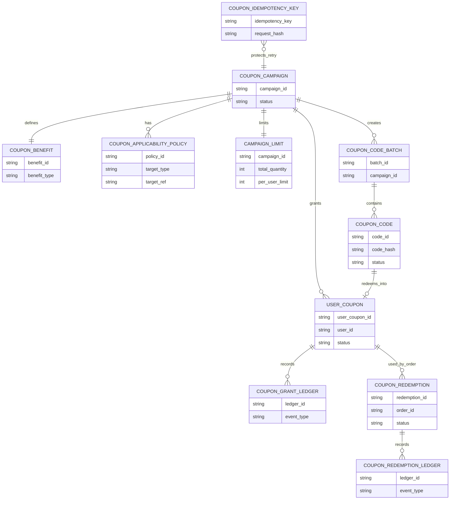
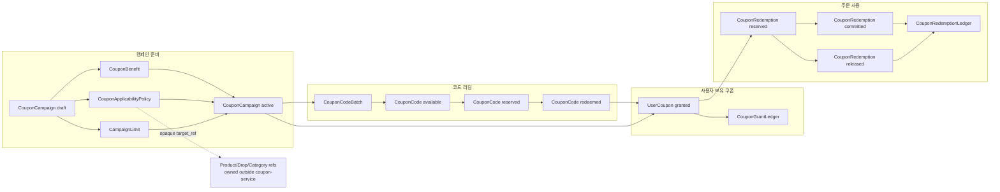

# Coupon Service 엔티티 설계

작성일: 2026-07-06

## 이 문서가 답하는 질문

- 쿠폰 서비스가 저장해야 하는 엔티티는 무엇인가?
- 어떤 필드가 쿠폰 도메인 내부 필드이고, 어떤 필드가 외부 참조인가?
- 발급 원장과 사용 원장은 어떻게 나눌 것인가?
- 도메인별 레포지토리 포트는 어떻게 나눌 것인가?

## 엔티티 관계 요약

## 생명주기 요약

## 엔티티 목록

| 엔티티 | Aggregate | 설명 |
| --- | --- | --- |
| `CouponCampaign` | `CouponCampaign` | 쿠폰 발행의 상위 업무 단위 |
| `CouponBenefit` | `CouponCampaign` | 할인/보상 혜택 정의 |
| `CouponApplicabilityPolicy` | `CouponCampaign` | 적용 대상과 조건 |
| `CampaignLimit` | `CouponCampaign` | 총량, 사용자별 제한, 기간 제한 |
| `CouponCodeBatch` | `CouponCodeBatch` | 코드 생성 묶음 |
| `CouponCode` | `CouponCodeBatch` | 개별 리딤 코드 |
| `UserCoupon` | `UserCoupon` | 사용자에게 부여된 쿠폰 |
| `CouponGrantLedger` | `UserCoupon` | 수령/리딤/회수 원장 |
| `CouponRedemption` | `CouponRedemption` | 주문 사용 예약/확정/해제 |
| `CouponRedemptionLedger` | `CouponRedemption` | 사용 원장 |
| `CouponIdempotencyKey` | 보조 엔티티 | 재시도 안정성을 위한 키 |

## CouponCampaign

`CouponCampaign`은 쿠폰 발행의 기준이 되는 업무 단위다. 운영자나 판매자가 "어떤 쿠폰을 언제부터 언제까지, 어떤 조건으로, 어느 정도 수량만큼 제공할 것인가"를 정의하는 중심 Aggregate다. 다른 엔티티는 대부분 이 캠페인을 기준으로 혜택, 적용 조건, 코드, 사용자 보유 쿠폰, 사용 기록을 연결한다.

| 필드 | 타입 | 설명 |
| --- | --- | --- |
| `campaign_id` | string | 쿠폰 캠페인 식별자 |
| `name` | string | 운영 표시명 |
| `description` | string | 운영 설명 |
| `status` | enum | `draft`, `scheduled`, `active`, `paused`, `ended`, `archived` |
| `starts_at` | timestamp | 수령/리딤 시작 시각 |
| `ends_at` | timestamp | 수령/리딤 종료 시각 |
| `created_by_type` | enum | `seller`, `operator`, `system` |
| `created_by_ref` | string | 생성 주체 외부 참조 |
| `version` | int | 낙관적 잠금 |
| `created_at` | timestamp | 생성 시각 |
| `updated_at` | timestamp | 수정 시각 |

불변식:

- `active` 상태가 되려면 `CouponBenefit`, `CouponApplicabilityPolicy`, `CampaignLimit`이 있어야 한다.
- `starts_at`은 `ends_at`보다 이전이어야 한다.
- `ended`, `archived` 상태에서는 신규 코드 배치 생성과 신규 수령을 허용하지 않는다.

## CouponBenefit

`CouponBenefit`은 쿠폰이 사용자에게 주는 실질적인 혜택을 표현한다. 할인 금액, 할인율, 무료배송, 적립금, 보상 아이템처럼 "쿠폰을 쓰면 무엇이 달라지는가"를 담당한다. 상품이나 주문 조건은 이 엔티티가 아니라 `CouponApplicabilityPolicy`가 다룬다.

| 필드 | 타입 | 설명 |
| --- | --- | --- |
| `benefit_id` | string | 혜택 식별자 |
| `campaign_id` | string | 캠페인 참조 |
| `benefit_type` | enum | `fixed_amount`, `percentage`, `free_shipping`, `reward_item`, `points` |
| `amount` | decimal | 정액 할인 또는 적립 값 |
| `percentage` | decimal | 정률 할인 |
| `max_discount_amount` | decimal | 정률 할인 상한 |
| `currency` | string | 통화 |
| `reward_ref` | string | 보상 아이템 등 외부 참조 |

v1 권고:

- 커머스 할인 쿠폰이면 `fixed_amount`, `percentage`, `free_shipping`부터 시작한다.
- 게임/보상형 쿠폰처럼 아이템 지급이 필요하면 `reward_item`은 별도 확장으로 둔다.

## CouponApplicabilityPolicy

`CouponApplicabilityPolicy`는 쿠폰을 어디에 적용할 수 있는지 정하는 정책이다. 쿠폰 서비스가 상품, 드롭, 카테고리를 직접 소유하지 않도록 외부 도메인은 여기에서만 참조한다. 주문 서비스가 넘겨준 주문 후보가 이 정책을 만족하는지 검증할 때 사용한다.

| 필드 | 타입 | 설명 |
| --- | --- | --- |
| `policy_id` | string | 적용 정책 식별자 |
| `campaign_id` | string | 캠페인 참조 |
| `target_type` | enum | `all`, `seller`, `product`, `drop`, `category`, `order` |
| `target_ref` | string | 외부 도메인 식별자. 쿠폰 서비스가 소유하지 않는다. |
| `condition_type` | enum | `include`, `exclude`, `minimum_order_amount`, `first_purchase`, `payment_method` |
| `condition_value` | json | 조건 값 |
| `snapshot_label` | string | 운영 표시용 이름 |

규칙:

- 상품/드롭/카테고리 id는 여기에서만 참조한다.
- `UserCoupon`이나 `CouponRedemption`에는 `drop_id`를 저장하지 않는다.
- 주문 시점 검증은 주문 후보의 상품/가격/수량 스냅샷을 받아 정책과 비교한다.

## CampaignLimit

`CampaignLimit`은 캠페인의 발급 가능 수량과 사용자별 제한을 관리한다. 선착순 쿠폰의 총량, 한 사용자가 받을 수 있는 개수, 수령 가능 시간 같은 제약을 이 엔티티로 모은다. Redis gate를 쓰더라도 최종 수량 판단과 불변식은 이 제한 모델과 DB 원장을 기준으로 맞춘다.

| 필드 | 타입 | 설명 |
| --- | --- | --- |
| `campaign_id` | string | 캠페인 참조 |
| `total_quantity` | int | 전체 발급 가능 수량. 무제한이면 null 허용 후보 |
| `issued_count` | int | 발급 완료 수량 |
| `per_user_limit` | int | 사용자별 보유 가능 수량 |
| `claim_window_seconds` | int | 수령 유효 시간 제한 후보 |

동시성 기준:

- `issued_count`는 최종 원장 기준으로 증가한다.
- Redis gate를 쓰더라도 DB 트랜잭션과 unique constraint가 최종 방어선이다.
- 사용자별 제한은 `(campaign_id, user_id)` unique 또는 partial unique index로 방어한다.

## CouponCodeBatch

`CouponCodeBatch`는 리딤 코드 생성 작업의 묶음이다. 운영자나 판매자가 특정 캠페인에 대해 1만 개 코드 생성, 외부 코드 import, 배포용 코드 export 같은 작업을 요청하면 그 작업 단위를 이 엔티티로 추적한다. 개별 코드는 `CouponCode`가 담당하고, 배치는 생성 수량과 배포 채널을 관리한다.

| 필드 | 타입 | 설명 |
| --- | --- | --- |
| `batch_id` | string | 코드 배치 식별자 |
| `campaign_id` | string | 캠페인 참조 |
| `code_format` | enum | `random`, `human_readable`, `imported` |
| `quantity` | int | 생성 요청 수량 |
| `created_count` | int | 실제 생성 수량 |
| `distribution_channel` | enum | `download`, `email`, `seller_export`, `external` |
| `status` | enum | `creating`, `ready`, `voided`, `completed` |
| `created_by_ref` | string | 생성자 외부 참조 |
| `created_at` | timestamp | 생성 시각 |

## CouponCode

`CouponCode`는 사용자가 입력하거나 배포받는 개별 리딤 코드다. 코드 자체는 사용자 쿠폰이 아니며, 리딤에 성공했을 때 `UserCoupon`을 만들어내는 입력 수단이다. 중복 리딤, 코드 폐기, 코드 만료, 코드 원문 보호는 이 엔티티의 책임이다.

| 필드 | 타입 | 설명 |
| --- | --- | --- |
| `code_id` | string | 내부 식별자 |
| `batch_id` | string | 배치 참조 |
| `campaign_id` | string | 캠페인 참조 |
| `code_hash` | string | 코드 원문 해시 |
| `code_suffix` | string | 운영 조회용 마지막 일부 |
| `status` | enum | `available`, `reserved`, `redeemed`, `voided`, `expired` |
| `redeemed_by_user_id` | string | 리딤 사용자 |
| `redeemed_user_coupon_id` | string | 리딤 결과로 생성된 사용자 쿠폰 |
| `reserved_until` | timestamp | 동시 리딤 보호용 예약 만료 |
| `redeemed_at` | timestamp | 리딤 완료 시각 |

보안 기준:

- 코드 원문은 저장하지 않는다. 원문은 생성 직후 다운로드 응답이나 안전한 외부 배포 채널로만 전달한다.
- 운영 조회는 `code_suffix`와 상태로 제한한다.
- 코드 검증은 입력값을 정규화한 뒤 해시 비교로 처리한다.

## UserCoupon

`UserCoupon`은 특정 사용자에게 부여된 쿠폰 한 장이다. 사용자의 쿠폰함에 보이는 단위이며, 선착순 수령, 리딤 코드 입력, 운영자 지급 같은 여러 경로로 생성될 수 있다. 주문에 실제로 사용하는 단계는 `CouponRedemption`이 담당하므로, 이 엔티티는 "사용자가 쿠폰을 보유하고 있는가"를 중심으로 본다.

| 필드 | 타입 | 설명 |
| --- | --- | --- |
| `user_coupon_id` | string | 사용자 보유 쿠폰 식별자 |
| `campaign_id` | string | 캠페인 참조 |
| `user_id` | string | Principal의 사용자 식별자 |
| `source_type` | enum | `claim`, `redeem_code`, `operator_grant`, `system_grant` |
| `source_ref` | string | 코드 id, 캠페인 id, 운영 작업 id 등 |
| `status` | enum | `granted`, `reserved`, `used`, `expired`, `revoked` |
| `usable_from` | timestamp | 사용 가능 시작 |
| `expires_at` | timestamp | 사용 만료 |
| `created_at` | timestamp | 생성 시각 |

불변식:

- `used` 상태는 다시 `granted`로 돌아가지 않는다.
- `reserved`는 하나의 활성 `CouponRedemption`과 연결되어야 한다.
- `user_id`는 사용자 프로필을 소유하지 않는다. 인증 주체 참조일 뿐이다.

## CouponRedemption

`CouponRedemption`은 주문에서 사용자 쿠폰을 사용하려는 시도를 표현한다. 주문 생성 전에는 예약 상태로 쿠폰을 잠그고, 결제와 주문이 성공하면 확정하며, 실패하면 해제한다. 이 엔티티를 분리해야 쿠폰 보유와 주문 사용을 섞지 않고 결제 실패, 재시도, 타임아웃을 다룰 수 있다.

| 필드 | 타입 | 설명 |
| --- | --- | --- |
| `redemption_id` | string | 사용 기록 식별자 |
| `user_coupon_id` | string | 사용자 보유 쿠폰 참조 |
| `campaign_id` | string | 캠페인 참조 |
| `user_id` | string | 사용자 식별자 |
| `order_id` | string | 주문 서비스 외부 참조 |
| `status` | enum | `reserved`, `committed`, `released`, `expired` |
| `discount_amount` | decimal | 계산된 할인 금액 |
| `currency` | string | 통화 |
| `reserved_until` | timestamp | 예약 만료 |
| `committed_at` | timestamp | 사용 확정 시각 |
| `released_at` | timestamp | 예약 해제 시각 |

주문 서비스 연동 기준:

- 주문 생성 전에는 `reserve`로 쿠폰 사용권만 잡는다.
- 결제/주문 확정 후 `commit`으로 최종 사용 처리한다.
- 주문 실패, 결제 실패, 타임아웃은 `release`로 예약을 해제한다.

## 원장

### CouponGrantLedger

`CouponGrantLedger`는 사용자 쿠폰이 만들어지거나 회수되는 과정을 append-only로 남기는 원장이다. 현재 상태만 보면 장애 분석, 중복 처리, 운영 감사가 어렵기 때문에 수령, 코드 리딤, 운영자 지급, 만료, 회수 같은 사건을 별도로 기록한다.

| 필드 | 설명 |
| --- | --- |
| `ledger_id` | 원장 식별자 |
| `user_coupon_id` | 사용자 쿠폰 참조 |
| `campaign_id` | 캠페인 참조 |
| `user_id` | 사용자 식별자 |
| `event_type` | `claimed`, `code_redeemed`, `operator_granted`, `revoked`, `expired` |
| `event_ref` | idempotency key, code id, operator action id |
| `occurred_at` | 발생 시각 |

### CouponRedemptionLedger

`CouponRedemptionLedger`는 주문 사용 과정에서 발생한 예약, 확정, 해제, 예약 만료 이벤트를 남기는 원장이다. 주문 서비스와 결제 서비스가 재시도되거나 실패할 수 있으므로, 최종 상태뿐 아니라 어떤 순서로 사용 처리가 진행됐는지를 보존한다.

| 필드 | 설명 |
| --- | --- |
| `ledger_id` | 원장 식별자 |
| `redemption_id` | 사용 기록 참조 |
| `user_coupon_id` | 사용자 쿠폰 참조 |
| `order_id` | 주문 참조 |
| `event_type` | `reserved`, `committed`, `released`, `reservation_expired` |
| `amount_snapshot` | 할인 계산 스냅샷 |
| `occurred_at` | 발생 시각 |

## CouponIdempotencyKey

`CouponIdempotencyKey`는 같은 요청이 네트워크 재시도나 클라이언트 재전송으로 여러 번 들어와도 하나의 결과만 만들기 위한 보조 엔티티다. 캠페인 수령, 코드 리딤, 주문 사용 예약/확정/해제처럼 중복 호출이 실제 돈이나 쿠폰 수량에 영향을 주는 API에서 사용한다.

| 필드 | 설명 |
| --- | --- |
| `idempotency_key` | 호출자가 보낸 재시도 식별자 |
| `request_hash` | 같은 키로 다른 요청 본문이 들어오는 것을 막기 위한 요청 해시 |
| `operation_type` | `claim`, `redeem_code`, `reserve_redemption`, `commit_redemption`, `release_redemption` 같은 작업 종류 |
| `result_ref` | 이미 처리된 결과 엔티티 참조 |
| `expires_at` | 키 보존 만료 시각 |

## 레포지토리 포트 후보

단일 `Store`를 쓰지 않는다. 도메인별 포트를 분리한다.

| 포트 | 책임 |
| --- | --- |
| `CouponCampaignRepository` | 캠페인, 혜택, 적용 정책, 제한 조회/저장 |
| `CouponCodeRepository` | 코드 배치 생성, 코드 상태 전이, 코드 해시 조회 |
| `UserCouponRepository` | 사용자 쿠폰 생성, 조회, 상태 전이, 사용자별 제한 검사 |
| `CouponRedemptionRepository` | 사용 예약, 확정, 해제, 예약 만료 처리 |
| `CouponLedgerRepository` | 발급/사용 원장 append와 감사 조회 |
| `CouponIdempotencyRepository` | API 재시도 키 저장과 결과 재사용 |

## DB 제약 후보

| 제약 | 목적 |
| --- | --- |
| `UNIQUE(campaign_id, user_id, source_type, source_ref)` | 같은 리딤/수령 요청 중복 방지 |
| `UNIQUE(code_hash)` | 코드 중복 방지 |
| `UNIQUE(user_coupon_id) WHERE status = 'reserved'` 후보 | 사용자 쿠폰의 중복 활성 예약 방지 |
| `UNIQUE(order_id, user_coupon_id)` | 같은 주문에 같은 쿠폰 중복 사용 방지 |
| `CHECK(starts_at < ends_at)` | 캠페인 기간 일관성 |

실제 Postgres partial unique index는 상태 모델 확정 후 적용한다.
