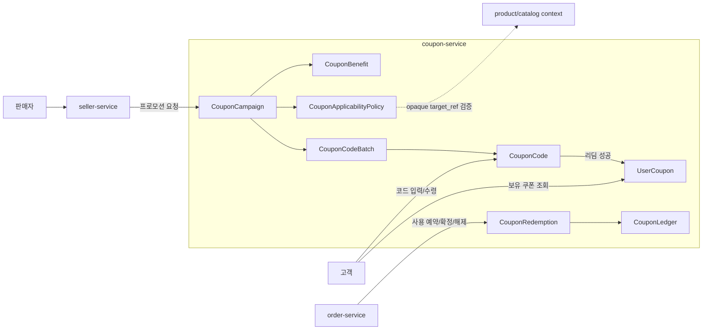

# DropMong coupon-service 설계

작성일: 2026-07-06

이 문서는 DropMong의 쿠폰 서비스를 DDD 기준으로 다시 정의한다. 현재 구현처럼 `policyId` 기준 선착순 발급만 제공하면 쿠폰 서비스가 아니라 수량 차감 게이트에 가깝다. 프로덕션 수준의 쿠폰 서비스는 캠페인, 혜택, 적용 정책, 리딤 코드, 사용자 보유 쿠폰, 사용 원장을 분리해서 다뤄야 한다.

이번 문서는 설계 기준점이며, `service/services/coupon-service` 코드 수정은 포함하지 않는다.

## 읽는 순서

| 순서 | 문서 | 용도 |
| ---: | --- | --- |
| 1 | [01-domain-model.md](01-domain-model.md) | 쿠폰 서비스의 바운디드 컨텍스트, Aggregate, 상품 의존성 분리 원칙 |
| 2 | [02-entity-design.md](02-entity-design.md) | 엔티티, 값 객체, 원장, 저장소 포트 후보 |
| 3 | [03-api-list.md](03-api-list.md) | 운영자, 사용자, 주문 연동, 내부 API 후보 |
| 4 | [04-code-boundary-guideline.md](04-code-boundary-guideline.md) | 코드 패키지, 레포지토리, 컨트롤러 분리 기준 |

## 설계 원칙

- 쿠폰은 상품이나 드롭을 소유하지 않는다. 상품 의존성은 `CouponApplicabilityPolicy`가 외부 참조로 가진다.
- 쿠폰 발급, 코드 리딤, 주문 사용은 서로 다른 유스케이스다. `Issue` 하나로 합치지 않는다.
- 사용자에게 부여된 쿠폰과 쿠폰 코드 자체는 다르다. 코드가 리딤되면 사용자 보유 쿠폰이 만들어진다.
- 사용 원장은 발급 원장과 분리한다. 주문 적용은 `reserve -> commit -> release` 단계가 필요하다.
- Redis는 DB 앞단의 admission/gate 또는 캐시일 수 있지만, 최종 원장은 Postgres 같은 영속 저장소가 소유한다.
- 도메인별 레포지토리와 컨트롤러 이름을 명시한다. `Store`, `Handler`, `routes.go` 같은 단일 이름으로 서비스 전체를 덮지 않는다.

## 바운디드 컨텍스트

## 핵심 결정

| 주제 | 결정 |
| --- | --- |
| 상품/드롭 참조 | 쿠폰 원장에 `drop_id`를 직접 넣지 않는다. 적용 정책에서 `target_type`, `target_ref`로 참조한다. |
| 수량 | 캠페인 총량, 코드 배치 수량, 사용자별 발급 제한, 주문 사용 제한을 분리한다. |
| 리딤 코드 | 코드 자체는 `CouponCode`로 관리하고, 코드 사용 결과는 `UserCoupon` 또는 `CouponRedemption`에 남긴다. |
| 발급 원장 | 사용자에게 쿠폰을 부여한 사실은 `UserCoupon`과 `CouponGrantLedger`가 소유한다. |
| 사용 원장 | 주문 적용은 `CouponRedemption`이 소유하며 예약, 확정, 해제 상태를 가진다. |
| 외부 의존성 | 상품, 드롭, 주문은 쿠폰 서비스가 소유하지 않는다. 필요한 값은 외부 참조와 정책 스냅샷으로 제한한다. |

## 확인 필요

- 쿠폰 혜택의 v1 범위를 할인 금액, 할인율, 무료배송, 적립금 중 어디까지 둘지 결정해야 한다.
- 주문 서비스가 쿠폰 사용을 `reserve/commit/release`로 호출할지, 주문 생성 트랜잭션 안에서 outbox로 처리할지 결정해야 한다.
- 판매자 쿠폰 생성 권한을 `seller-service`가 직접 요청할지, 운영자 검수 후 `coupon-service`가 생성할지 결정해야 한다.
- 기존 `DropID` 기반 API를 제거할 때 호환 레이어가 필요한지 결정해야 한다.
