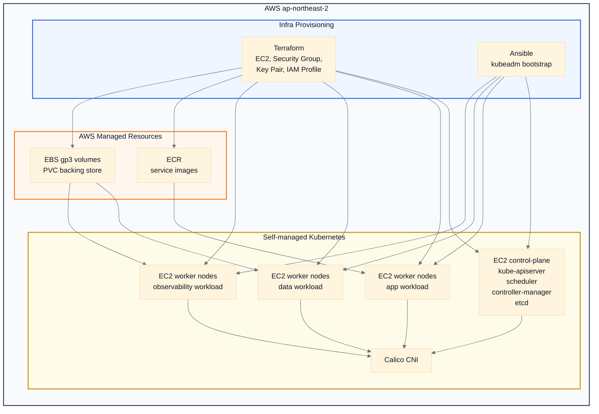
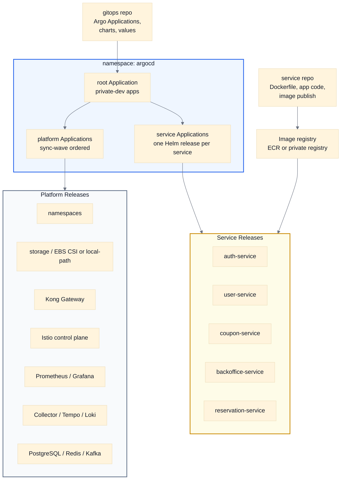
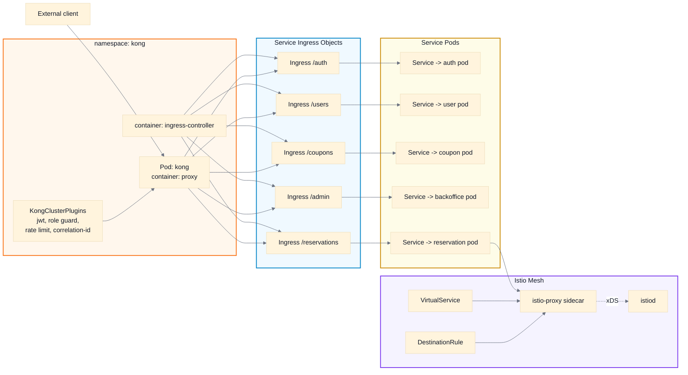
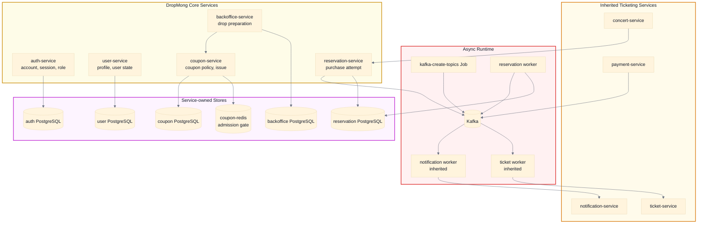
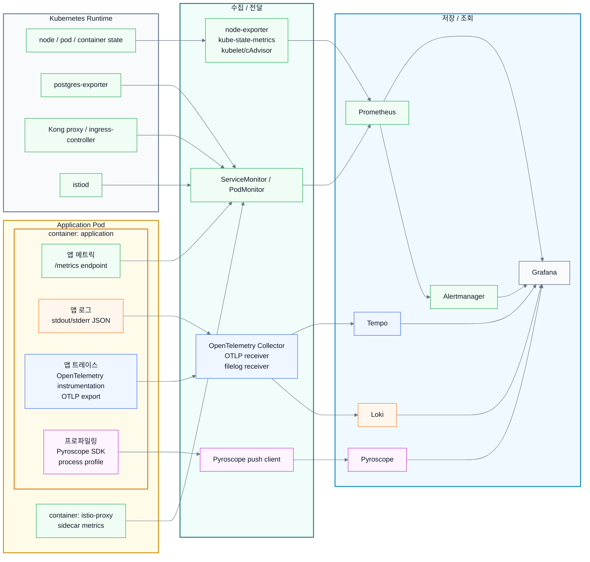

# Kubernetes architecture

DropMong의 Kubernetes는 한정 상품 드롭을 처리하는 여러 서비스를 GitOps로 배포하고, 그 위에 gateway, storage/runtime 기반, service mesh, observability를 얹은 구조다. 처음 보는 사람은 아래 여섯 영역을 먼저 잡으면 전체 그림을 빠르게 읽을 수 있다.

## 전체 다이어그램

원본 Mermaid 파일은 [full-kubernetes-architecture.mmd](full-kubernetes-architecture.mmd)에 따로 둔다.

```mermaid
%%{init: {"theme": "base", "themeVariables": {"primaryTextColor": "#111827", "textColor": "#111827", "lineColor": "#6b7280", "edgeLabelBackground": "#ffffff", "fontFamily": "Arial"}}}%%
flowchart TB
  User["External client"]
  GitOpsRepo["gitops repo"]
  ServiceRepo["service repo"]
  Registry["Image registry"]

  ServiceRepo --> Registry
  GitOpsRepo --> RootApp

  subgraph Cluster["Kubernetes cluster"]
    subgraph ArgocdNS["namespace: argocd"]
      RootApp["Application: tempkong private-dev apps"]
      PlatformApps["Application CRs: platform layer"]
      ServiceApps["Application CRs: service layer"]

      subgraph ArgoControllerPod["Pod: argocd-application-controller"]
        ArgoController["container: application-controller"]
      end

      subgraph ArgoRepoPod["Pod: argocd-repo-server"]
        ArgoRepo["container: repo-server"]
      end
    end

    subgraph KubeSystemNS["namespace: kube-system"]
      subgraph SealedSecretsPod["Pod: sealed-secrets-controller"]
        SealedSecrets["container: sealed-secrets-controller"]
      end
    end

    subgraph LocalPathNS["namespace: local-path-storage"]
      StorageClass["StorageClass: local-path"]
      subgraph LocalPathPod["Pod: local-path-provisioner"]
        LocalPathProvisioner["container: local-path-provisioner"]
      end
    end

    subgraph KongNS["namespace: kong"]
      KongService["Service: kong-kong-proxy"]
      KongIngressClass["IngressClass: kong"]
      KongPlugins["KongClusterPlugins"]

      subgraph KongPod["Pod: kong"]
        KongProxy["container: proxy"]
        KongController["container: ingress-controller"]
      end
    end

    subgraph IstioNS["namespace: istio-system"]
      subgraph IstiodPod["Pod: istiod"]
        Istiod["container: discovery"]
      end

      subgraph KialiPod["Pod: kiali"]
        Kiali["container: kiali"]
      end
    end

    subgraph MonitoringNS["namespace: monitoring"]
      ServiceMonitor["ServiceMonitor / PodMonitor CRs"]

      subgraph PrometheusPod["Pod: prometheus"]
        Prometheus["container: prometheus"]
        PrometheusReloader["container: config-reloader"]
      end

      subgraph GrafanaPod["Pod: grafana"]
        Grafana["container: grafana"]
        DashboardSidecar["container: dashboard-sidecar"]
        DatasourceSidecar["container: datasource-sidecar"]
      end

      subgraph AlertmanagerPod["Pod: alertmanager"]
        Alertmanager["container: alertmanager"]
        AlertmanagerReloader["container: config-reloader"]
      end
    end

    subgraph ObservabilityNS["namespace: observability"]
      subgraph CollectorPod["Pod: opentelemetry-collector"]
        Collector["container: otelcol-contrib"]
      end

      subgraph TempoPod["Pod: tempo"]
        Tempo["container: tempo"]
      end

      subgraph LokiPod["Pod: loki"]
        Loki["container: loki"]
      end
    end

    subgraph AuthNS["namespace: ticketing-auth"]
      AuthIngress["Ingress: /auth"]
      AuthService["Service: auth-service"]

      subgraph AuthPod["Pod: auth-service"]
        AuthContainer["container: auth-service"]
      end

      subgraph AuthDbPod["Pod: auth-db"]
        AuthPostgres["container: postgres"]
        AuthPgExporter["container: postgres-exporter"]
      end
    end

    subgraph UserNS["namespace: ticketing-user"]
      UserIngress["Ingress: /users"]
      UserService["Service: user-service"]

      subgraph UserPod["Pod: user-service"]
        UserContainer["container: user-service"]
      end

      subgraph UserDbPod["Pod: user-db"]
        UserPostgres["container: postgres"]
        UserPgExporter["container: postgres-exporter"]
      end
    end

    subgraph CouponNS["namespace: ticketing-coupon"]
      CouponIngress["Ingress: /coupons"]
      CouponService["Service: coupon-service"]

      subgraph CouponPod["Pod: coupon-service"]
        CouponContainer["container: coupon-service"]
      end

      subgraph CouponDbPod["Pod: coupon-db"]
        CouponPostgres["container: postgres"]
        CouponPgExporter["container: postgres-exporter"]
      end

      subgraph CouponRedisPod["Pod: coupon-redis"]
        CouponRedis["container: redis-compatible valkey"]
      end
    end

    subgraph BackofficeNS["namespace: ticketing-backoffice"]
      BackofficeIngress["Ingress: /admin"]
      BackofficeService["Service: backoffice-service"]

      subgraph BackofficePod["Pod: backoffice-service"]
        BackofficeContainer["container: backoffice-service"]
      end

      subgraph BackofficeDbPod["Pod: backoffice-db"]
        BackofficePostgres["container: postgres"]
        BackofficePgExporter["container: postgres-exporter"]
      end
    end

    subgraph ReservationNS["namespace: ticketing-reservation"]
      ReservationIngress["Ingress: /reservations"]
      ReservationService["Service: reservation-service"]
      ReservationTraffic["Istio VirtualService / DestinationRule"]

      subgraph ReservationApiPod["Pod: reservation-service API"]
        ReservationApi["container: reservation-service"]
        ReservationApiSidecar["container: istio-proxy"]
      end

      subgraph ReservationWorkerPod["Pod: reservation-service worker"]
        ReservationWorker["container: background"]
        ReservationWorkerSidecar["container: istio-proxy"]
      end

      subgraph ReservationDbPod["Pod: reservation-db"]
        ReservationPostgres["container: postgres"]
        ReservationPgExporter["container: postgres-exporter"]
      end
    end

    subgraph LegacyTicketingNS["namespaces: inherited ticketing services"]
      subgraph ConcertPod["Pod: concert-service"]
        ConcertContainer["container: concert-service"]
        ConcertSidecar["container: istio-proxy"]
      end

      subgraph PaymentPod["Pod: payment-service"]
        PaymentContainer["container: payment-service"]
        PaymentSidecar["container: istio-proxy"]
      end

      subgraph TicketPod["Pod: ticket-service"]
        TicketContainer["container: ticket-service"]
        TicketSidecar["container: istio-proxy"]
      end

      subgraph NotificationPod["Pod: notification-service"]
        NotificationContainer["container: notification-service"]
        NotificationSidecar["container: istio-proxy"]
      end

      subgraph NotificationDbPod["Pod: notification-db"]
        Mongo["container: mongo"]
      end
    end

    subgraph MessagingNS["namespace: ticketing-messaging"]
      KafkaService["Service: kafka"]

      subgraph KafkaPod["Pod: kafka-0"]
        Kafka["container: kafka"]
      end

      subgraph TopicJobPod["Job Pod: kafka-create-topics"]
        TopicCreator["container: kafka-create-topics"]
      end
    end

    subgraph DashboardNS["namespace: ticketing-dashboard"]
      FrontendIngress["Ingress: /"]
      FrontendService["Service: frontend / dashboard"]

      subgraph FrontendPod["Pod: frontend or dashboard"]
        Frontend["container: frontend"]
      end
    end

    subgraph SyntheticNS["namespace: synthetic"]
      subgraph SyntheticPod["CronJob Pod: synthetic-traffic"]
        SyntheticRunner["container: k6-runner"]
      end
    end
  end

  RootApp --> ArgoController
  ArgoController --> ArgoRepo
  ArgoController --> PlatformApps
  ArgoController --> ServiceApps

  PlatformApps --> SealedSecretsPod
  PlatformApps --> LocalPathPod
  PlatformApps --> KongPod
  PlatformApps --> IstiodPod
  PlatformApps --> PrometheusPod
  PlatformApps --> GrafanaPod
  PlatformApps --> AlertmanagerPod
  PlatformApps --> CollectorPod
  PlatformApps --> TempoPod
  PlatformApps --> LokiPod
  PlatformApps --> KafkaPod
  PlatformApps --> SyntheticPod

  ServiceApps --> AuthPod
  ServiceApps --> UserPod
  ServiceApps --> CouponPod
  ServiceApps --> BackofficePod
  ServiceApps --> ReservationApiPod
  ServiceApps --> ConcertPod
  ServiceApps --> PaymentPod
  ServiceApps --> TicketPod
  ServiceApps --> NotificationPod
  ServiceApps --> FrontendPod

  Registry --> AuthContainer
  Registry --> UserContainer
  Registry --> CouponContainer
  Registry --> BackofficeContainer
  Registry --> ReservationApi
  Registry --> ReservationWorker
  Registry --> Frontend

  User --> KongService --> KongProxy
  KongController --> KongIngressClass
  KongController --> KongPlugins

  KongProxy --> AuthIngress --> AuthService --> AuthContainer
  KongProxy --> UserIngress --> UserService --> UserContainer
  KongProxy --> CouponIngress --> CouponService --> CouponContainer
  KongProxy --> BackofficeIngress --> BackofficeService --> BackofficeContainer
  KongProxy --> ReservationIngress --> ReservationService --> ReservationApi
  KongProxy --> FrontendIngress --> FrontendService --> Frontend

  AuthContainer --> AuthPostgres
  UserContainer --> UserPostgres
  CouponContainer --> CouponRedis
  CouponContainer --> CouponPostgres
  BackofficeContainer --> BackofficePostgres
  BackofficeContainer --> CouponService
  ReservationApi --> ReservationPostgres
  ReservationWorker --> ReservationPostgres

  ReservationApi --> KafkaService
  ReservationWorker --> KafkaService
  PaymentContainer --> KafkaService
  TicketContainer --> KafkaService
  NotificationContainer --> KafkaService
  KafkaService --> Kafka
  TopicCreator --> Kafka
  Kafka --> NotificationContainer
  Kafka --> TicketContainer

  ReservationApiSidecar -. "xDS" .-> Istiod
  ReservationWorkerSidecar -. "xDS" .-> Istiod
  ConcertSidecar -. "xDS" .-> Istiod
  PaymentSidecar -. "xDS" .-> Istiod
  TicketSidecar -. "xDS" .-> Istiod
  NotificationSidecar -. "xDS" .-> Istiod
  ReservationTraffic -. "traffic policy" .-> Istiod

  AuthContainer -. "/metrics" .-> ServiceMonitor
  UserContainer -. "/metrics" .-> ServiceMonitor
  CouponContainer -. "/metrics" .-> ServiceMonitor
  BackofficeContainer -. "/metrics" .-> ServiceMonitor
  ReservationApi -. "/metrics" .-> ServiceMonitor
  KongProxy -. "gateway metrics" .-> ServiceMonitor
  Istiod -. "mesh metrics" .-> ServiceMonitor
  AuthPgExporter -. "db metrics" .-> ServiceMonitor
  UserPgExporter -. "db metrics" .-> ServiceMonitor
  CouponPgExporter -. "db metrics" .-> ServiceMonitor
  BackofficePgExporter -. "db metrics" .-> ServiceMonitor
  ReservationPgExporter -. "db metrics" .-> ServiceMonitor
  ServiceMonitor --> Prometheus --> Grafana
  Alertmanager --> Grafana

  AuthContainer -. "OTLP traces" .-> Collector
  UserContainer -. "OTLP traces" .-> Collector
  CouponContainer -. "OTLP traces" .-> Collector
  BackofficeContainer -. "OTLP traces" .-> Collector
  ReservationApi -. "OTLP traces" .-> Collector
  Collector --> Tempo --> Grafana

  AuthContainer -. "stdout JSON logs" .-> Collector
  UserContainer -. "stdout JSON logs" .-> Collector
  CouponContainer -. "stdout JSON logs" .-> Collector
  BackofficeContainer -. "stdout JSON logs" .-> Collector
  ReservationApi -. "stdout JSON logs" .-> Collector
  KongProxy -. "gateway logs" .-> Collector
  Collector --> Loki --> Grafana

  SyntheticRunner --> KongService

  style Cluster fill:#f8fafc,stroke:#334155,stroke-width:2px,color:#111827
  style ArgocdNS fill:#eff6ff,stroke:#2563eb,stroke-width:2px,color:#111827
  style KubeSystemNS fill:#f8fafc,stroke:#64748b,stroke-width:2px,color:#111827
  style LocalPathNS fill:#f8fafc,stroke:#64748b,stroke-width:2px,color:#111827
  style KongNS fill:#fff7ed,stroke:#f97316,stroke-width:2px,color:#111827
  style IstioNS fill:#f5f3ff,stroke:#7c3aed,stroke-width:2px,color:#111827
  style MonitoringNS fill:#f0fdf4,stroke:#16a34a,stroke-width:2px,color:#111827
  style ObservabilityNS fill:#f0fdfa,stroke:#0f766e,stroke-width:2px,color:#111827
  style AuthNS fill:#fefce8,stroke:#ca8a04,stroke-width:2px,color:#111827
  style UserNS fill:#fefce8,stroke:#ca8a04,stroke-width:2px,color:#111827
  style CouponNS fill:#fefce8,stroke:#ca8a04,stroke-width:2px,color:#111827
  style BackofficeNS fill:#fefce8,stroke:#ca8a04,stroke-width:2px,color:#111827
  style ReservationNS fill:#fefce8,stroke:#ca8a04,stroke-width:2px,color:#111827
  style LegacyTicketingNS fill:#fffbeb,stroke:#d97706,stroke-width:2px,color:#111827
  style MessagingNS fill:#fdf4ff,stroke:#c026d3,stroke-width:2px,color:#111827
  style DashboardNS fill:#f0f9ff,stroke:#0284c7,stroke-width:2px,color:#111827
  style SyntheticNS fill:#fff1f2,stroke:#dc2626,stroke-width:2px,color:#111827

  classDef external fill:#ffffff,stroke:#334155,stroke-width:1px,color:#111827
  classDef control fill:#eff6ff,stroke:#1d4ed8,stroke-width:1px,color:#111827
  classDef infra fill:#f8fafc,stroke:#475569,stroke-width:1px,color:#111827
  classDef gateway fill:#fff7ed,stroke:#ea580c,stroke-width:1px,color:#111827
  classDef mesh fill:#f5f3ff,stroke:#7c3aed,stroke-width:1px,color:#111827
  classDef service fill:#fefce8,stroke:#a16207,stroke-width:1px,color:#111827
  classDef data fill:#fdf4ff,stroke:#a21caf,stroke-width:1px,color:#111827
  classDef observability fill:#f0fdf4,stroke:#15803d,stroke-width:1px,color:#111827
  classDef worker fill:#fff1f2,stroke:#b91c1c,stroke-width:1px,color:#111827

  class User,GitOpsRepo,ServiceRepo,Registry external
  class RootApp,PlatformApps,ServiceApps,ArgoController,ArgoRepo control
  class SealedSecrets,StorageClass,LocalPathProvisioner infra
  class KongService,KongIngressClass,KongPlugins,KongProxy,KongController gateway
  class Istiod,Kiali,ReservationTraffic,ReservationApiSidecar,ReservationWorkerSidecar,ConcertSidecar,PaymentSidecar,TicketSidecar,NotificationSidecar mesh
  class AuthContainer,UserContainer,CouponContainer,BackofficeContainer,ReservationApi,ConcertContainer,PaymentContainer,TicketContainer,NotificationContainer,Frontend service
  class AuthPostgres,UserPostgres,CouponPostgres,CouponRedis,BackofficePostgres,ReservationPostgres,KafkaService,Kafka,TopicCreator,Mongo data
  class ServiceMonitor,Prometheus,PrometheusReloader,Grafana,DashboardSidecar,DatasourceSidecar,Alertmanager,AlertmanagerReloader,Collector,Tempo,Loki observability
  class ReservationWorker,SyntheticRunner worker
```

## 1. AWS 인프라 구성 아키텍처

키워드: AWS EC2, kubeadm, Calico, IAM instance profile, EBS CSI, gp3, ECR

AWS 환경은 EKS가 아니라 EC2 위에 kubeadm으로 Kubernetes를 구성하는 self-managed cluster를 기준으로 본다. Terraform은 EC2, 보안 그룹, 키페어, IAM instance profile 같은 바닥을 만들고, Ansible은 kubeadm control-plane과 worker node를 준비한다. Kubernetes 안의 저장소는 GitOps가 EBS CSI driver와 `medikong-aws-gp3` StorageClass를 적용한 뒤 PVC가 동적으로 EBS volume을 받는 구조다.

## 2. GitOps 배포 아키텍처

키워드: Argo CD, Application CR, sync wave, Helm chart, values layering

배포는 `service` repo와 `gitops` repo가 나뉜다. `service` repo는 이미지를 만들고 registry에 올리고, `gitops` repo는 Argo CD Application과 Helm values로 클러스터 상태를 선언한다. Argo CD는 namespace, storage, gateway, monitoring, observability 같은 platform Application을 먼저 맞춘 뒤 서비스별 Helm release를 배포한다.

## 3. 트래픽 라우팅 아키텍처

키워드: Kong proxy, IngressClass, Ingress, Service, istio-proxy, VirtualService

외부 요청은 Kong proxy에서 시작한다. Kong Ingress Controller는 Kubernetes Ingress를 읽고, Kong plugin으로 인증/권한/제한/상관관계 ID를 적용한 뒤 서비스의 ClusterIP Service로 넘긴다. 서비스 Pod에 `istio-proxy`가 붙은 경우 내부 트래픽 정책은 Istio가 맡고, stable/canary 같은 정책은 VirtualService와 DestinationRule로 분리한다.

## 4. 서비스 구성 아키텍처

키워드: Go services, PostgreSQL 원장, Redis gate, Kafka, background worker

서비스 구성은 DropMong 핵심 도메인과 남아 있는 inherited ticketing 서비스를 구분해서 본다. 핵심 서비스는 `auth-service`, `user-service`, `coupon-service`, `backoffice-service`, `reservation-service`이고, 각 서비스는 자기 원장 DB를 가진다. 비동기 처리는 독립 아키텍처로 빼지 않고 서비스 구성 안에서 Kafka topic, background worker, topic 생성 Job으로 함께 표현한다.

## 5. 관측성 구성 아키텍처

키워드: System metrics, App metrics, Traces, Logs, Profiles, Grafana

관측성은 애플리케이션 Pod 안에서 시작하는 신호마다 수집 방식이 다르다. 앱 메트릭은 서비스가 `/metrics`로 노출하고 ServiceMonitor가 Prometheus로 scrape한다. 앱 로그는 애플리케이션 컨테이너가 stdout/stderr에 JSON으로 남기고, OpenTelemetry Collector의 filelog receiver가 Loki로 전달한다. 앱 트레이스는 애플리케이션 코드의 OpenTelemetry instrumentation이 OTLP로 Collector에 보내고, Collector가 Tempo로 전달한다. 프로파일링은 애플리케이션 프로세스 안의 Pyroscope SDK가 Pyroscope backend로 직접 push한다.

## 6. 보안/네트워크 정책 아키텍처

키워드: NetworkPolicy, ServiceAccount, RoleBinding, Kong plugin, Secret, SealedSecret

보안은 gateway 정책, namespace 내부 권한, 네트워크 허용 방향을 나눠서 본다. 외부 요청은 Kong plugin에서 JWT, identity header, role guard, rate limit을 거친다. 서비스 Pod는 ServiceAccount와 namespace-scoped Role/RoleBinding을 사용한다. NetworkPolicy는 Kong에서 서비스로 들어오는 ingress, 서비스에서 자기 DB/Kafka/Collector/DNS로 나가는 egress만 명시적으로 허용하는 방향이다.

```mermaid
%%{init: {"theme": "base", "themeVariables": {"primaryTextColor": "#111827", "textColor": "#111827", "lineColor": "#6b7280", "edgeLabelBackground": "#ffffff", "fontFamily": "Arial"}}}%%
flowchart TB
  subgraph GatewaySecurity["Gateway Security"]
    JWT["Kong JWT plugin"]
    Identity["identity headers"]
    RoleGuard["role guard"]
    RateLimit["rate limit"]
  end

  subgraph WorkloadIdentity["Workload Identity"]
    ServiceAccount["ServiceAccount per service"]
    Role["namespace Role"]
    RoleBinding["RoleBinding"]
    HumanRBAC["human RBAC groups\ndevelopers, operators, sres"]
  end

  subgraph NetworkPolicy["NetworkPolicy Allow Lists"]
    KongToService["kong namespace -> service port"]
    ServiceToDNS["service -> kube-dns"]
    ServiceToDB["service -> own DB"]
    ServiceToKafka["event service -> kafka"]
    ServiceToCollector["service -> otel collector"]
    MonitoringScrape["monitoring -> /metrics"]
  end

  subgraph Secrets["Secret Boundary"]
    K8sSecret["Kubernetes Secret"]
    SealedSecret["SealedSecret"]
    AppEnv["Pod env / envFrom"]
  end

  JWT --> Identity --> RoleGuard --> RateLimit
  ServiceAccount --> RoleBinding
  Role --> RoleBinding
  HumanRBAC --> RoleBinding
  SealedSecret --> K8sSecret --> AppEnv
  KongToService --> ServiceToDB
  ServiceToDB --> ServiceToKafka
  ServiceToDNS --> ServiceToCollector
  MonitoringScrape --> ServiceToCollector

  style GatewaySecurity fill:#fff7ed,stroke:#f97316,stroke-width:2px,color:#111827
  style WorkloadIdentity fill:#eff6ff,stroke:#2563eb,stroke-width:2px,color:#111827
  style NetworkPolicy fill:#fff1f2,stroke:#dc2626,stroke-width:2px,color:#111827
  style Secrets fill:#f8fafc,stroke:#64748b,stroke-width:2px,color:#111827
```

## 이 그림을 줄인다면

- 발표용: 전체도는 유지하고 하위 다이어그램은 `AWS 인프라`, `서비스 구성`, `관측성`만 남긴다.
- README용: 전체도에서 Pod 내부 container를 숨기고, 하위 다이어그램으로 세부를 넘긴다.
- 장애 분석용: `트래픽 라우팅`, `서비스 구성`, `관측성`만 남긴다.
- 보안 검토용: `보안/네트워크 정책`과 `트래픽 라우팅`을 함께 본다.
- 운영 인수인계용: 6개 하위 다이어그램을 모두 유지하고, 전체도는 맨 위의 색인으로만 사용한다.
