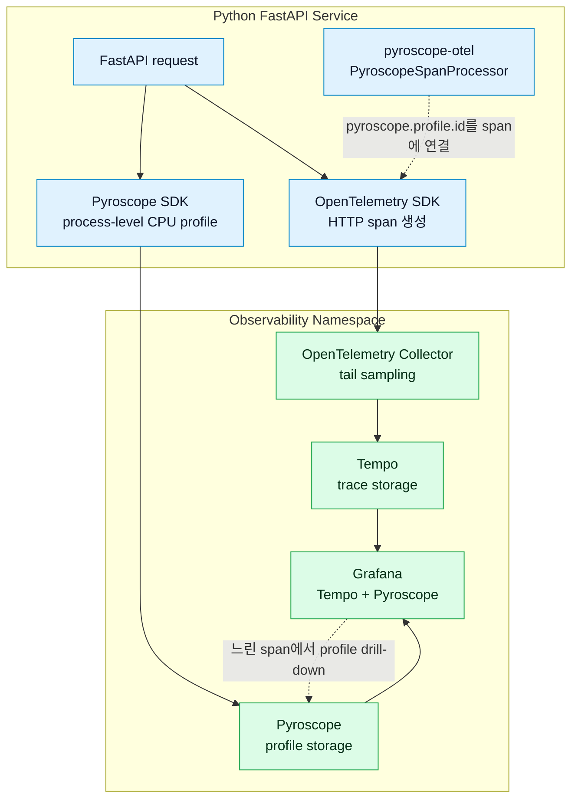

# 프로파일링 수집 설계

이 문서는 Medikong 서비스의 CPU 프로파일링 수집 방식과 trace 연동 기준을 정리한다.

관련 문서:

- 관측성 아키텍처: `../README.md`
- Trace 수집 경로와 repo 책임: `../tracing/README.md`
- Trace sampling과 retention 기준: `../tracing/sampling-retention.md`

## 왜 만들었나

부하 테스트와 장애 분석에서는 "어떤 API가 느렸는가"만으로는 부족하다. 느린 구간 안에서 실제로 CPU를 많이 쓴 함수, 직렬화 비용, DB 응답 대기와 애플리케이션 계산 비용의 차이를 봐야 한다.

기존 trace는 요청 간 호출 관계와 지연 시간을 잘 보여주지만, 프로세스 내부에서 CPU 시간이 어디에 쓰였는지는 보여주지 못한다. 그래서 Pyroscope 기반 continuous profiling을 붙여 서비스 프로세스의 CPU 사용 근거를 남긴다.

## 목적

- 부하 구간의 CPU hotspot을 함수 단위로 확인한다.
- 느린 Tempo span에서 관련 Pyroscope profile로 이동해 원인을 좁힌다.
- profile label cardinality를 낮게 유지해 저장량과 조회 비용을 통제한다.
- 수집 강도와 span/profile 연결 여부를 애플리케이션 코드가 아니라 GitOps values로 조절한다.

## 기본 결정

```text
profile 수집 경로
  - Python Pyroscope SDK
  - Pyroscope
  - Grafana

trace 수집 경로
  - OpenTelemetry SDK
  - OpenTelemetry Collector
  - Tempo
  - Grafana

span/profile 연결
  - pyroscope-otel
  - PyroscopeSpanProcessor
  - Tempo datasource tracesToProfiles
```

Pyroscope profile은 OpenTelemetry Collector를 기본 수집 경로로 쓰지 않는다. Collector는 trace/log 수집과 trace sampling을 담당하고, profile은 서비스 프로세스 안의 Pyroscope SDK가 Pyroscope backend로 직접 보낸다.

## 처리 방식



서비스 시작 시 observability 설정은 두 가지를 나눠 붙인다.

- `configure_process_profiling()`: `PYROSCOPE_ENABLED=true`일 때 Pyroscope SDK를 설정한다.
- `configure_process_tracing()`: OpenTelemetry tracer provider를 설정하고, 조건이 맞으면 `PyroscopeSpanProcessor`를 추가한다.

span/profile 연결은 `PYROSCOPE_ENABLED=true`와 `PYROSCOPE_SPAN_PROFILES_ENABLED=true`가 모두 필요하다. 이 기능이 꺼져 있어도 process-level profile 수집은 계속 가능하다.

## 운영 레버

| 값 | 역할 |
|---|---|
| `observability.profiling.enabled` | 서비스 Pod에 `PYROSCOPE_ENABLED=true`를 주입한다. |
| `observability.profiling.sampleRate` | Pyroscope SDK의 CPU profile sample rate를 조절한다. |
| `observability.profiling.spanProfilesEnabled` | `PYROSCOPE_SPAN_PROFILES_ENABLED`를 조절한다. |
| `observability.profiling.tags` | 낮은 cardinality profile label을 추가한다. |

환경별 기본 방향은 다음과 같다.

| 환경 | 기본 방향 |
|---|---|
| local/dev | profile과 span/profile 연결을 켜서 기능 확인을 쉽게 한다. |
| aws-dev | 낮은 sample rate로 process-level profile을 계속 수집하고, 부하 구간에서만 span/profile 연결을 override로 켠다. |

예시:

```bash
helm upgrade --install auth charts/medikong-service \
  -f values/base.yaml \
  -f values/env/aws-dev.yaml \
  -f values/services/auth.yaml \
  --set observability.profiling.sampleRate=100 \
  --set observability.profiling.spanProfilesEnabled=true \
  --set-string observability.profiling.tags.scenario=reservation-journey-load-test \
  --set-string observability.profiling.tags.run_id=<loadtest-run-id>
```

## 경계

프로파일링 label에는 동적 업무 ID를 넣지 않는다.

```text
금지
  - user_id
  - reservation_id
  - payment_id
  - ticket_id
  - raw URL path

허용 후보
  - service
  - environment
  - version
  - scenario
  - run_id
```

API별 분석은 profile label에 `route`를 항상 붙이는 방식이 아니라, Tempo의 느린 span에서 Pyroscope profile로 이동해 확인한다. 이렇게 해야 요청별 cardinality가 profile 저장소로 번지는 것을 막을 수 있다.

## 완료 기준

```text
profiling 설계 완료 기준
  - process-level profile이 Pyroscope에 계속 쌓인다.
  - trace는 OpenTelemetry Collector와 Tempo 경로를 유지한다.
  - span/profile 연결은 env와 GitOps values로 켜고 끌 수 있다.
  - 느린 span에서 Pyroscope profile drill-down이 가능하다.
  - 동적 ID는 profile label로 올리지 않는다.
```
