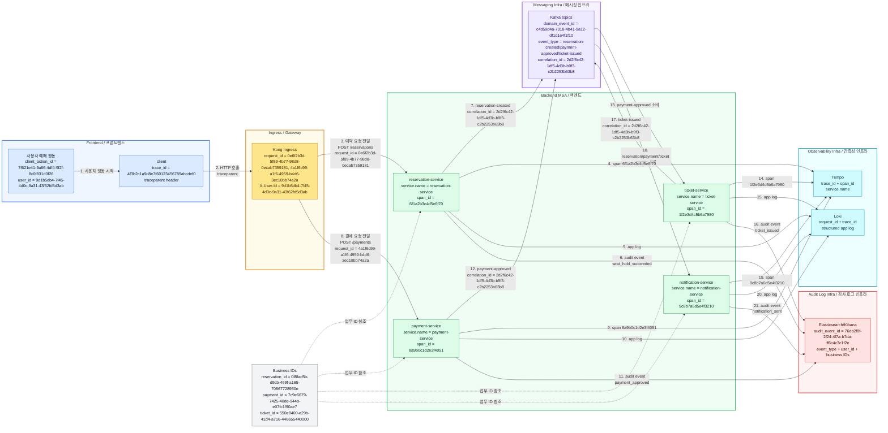
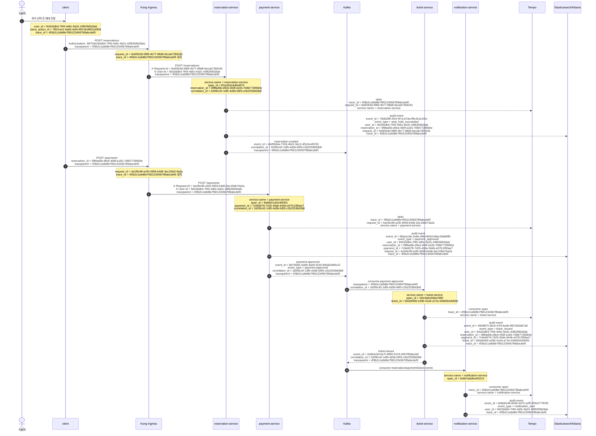

# Trace 수집 경로와 repo 책임

이 문서는 관측성 신호별 수집 경로와 repo 책임을 정리한다.

## 트레이스 전체 과정

클라이언트가 있다고 가정하면 사용자 예매 행동 하나에는 시스템 관측성 ID와 감사 로그 ID가 함께 생긴다. 큰 그림으로 보면 프론트엔드에서 시작된 요청이 인그레스를 지나 백엔드 MSA와 메시징 구간으로 이어지고, 그 과정의 신호가 관측성 인프라와 감사 로그 인프라로 나뉘어 저장된다.

화살표 번호는 대표 성공 흐름의 읽는 순서다. 점선은 순차 처리 단계가 아니라 각 서비스가 함께 참조하는 업무 ID를 뜻한다.



감사 로그 인프라에는 아래처럼 검색 가능한 구조화 JSON 데이터가 저장된다. 각 객체는 Elasticsearch/Kibana에 저장되는 감사 로그 한 건의 예시다. `audit_event_id`는 감사 로그 한 건을 구분하고, `domain_event_id`는 Kafka 도메인 이벤트와 연결할 때 쓴다. 장애 분석은 `trace_id`, `span_id`, `request_id`로 Tempo/Loki에 연결하고, 고객 문의나 운영 조회는 `user_id`, `reservation_id`, `payment_id`, `ticket_id`, `event_type`으로 찾는다.

```json
{
  "audit_log_samples": [
    {
      "audit_event_id": "76db2f8f-2f24-4f7a-b7da-ff6c4c3c1f2e",
      "domain_event_id": "c4d59d4a-7318-4b41-9a12-df1d1e4f1f10",
      "event_type": "seat_hold_succeeded",
      "occurred_at": "2026-06-10T12:00:01Z",
      "observed_at": "2026-06-10T12:00:02Z",
      "service.name": "reservation-service",
      "service.version": "1.0.0",
      "deployment.environment": "dev",
      "trace_id": "4f3b2c1a9d8e7f60123456789abcdef0",
      "span_id": "6f1a2b3c4d5e6f70",
      "request_id": "0e6f2b3d-5f89-4b77-98d8-0ecab7359181",
      "correlation_id": "2d2f6c42-1df5-4d3b-b9f3-c2b2253b63b8",
      "client_action_id": "7f621e41-9a66-4df4-9f2f-8c0f831d0f26",
      "user_id": "9d1b5db4-7f45-4d0c-9a31-43f62fd5d3ab",
      "actor_type": "customer",
      "resource": {
        "reservation_id": "0f8fad5b-d9cb-469f-a165-70867728950e",
        "seat_id": "A-10"
      },
      "result": "success"
    },
    {
      "audit_event_id": "9bba1c9e-2e8e-4f6d-8b2d-b8ac1f8a89fb",
      "domain_event_id": "6b7f4d9c-5a58-4ad4-9150-8d3d2a5f6c21",
      "event_type": "payment_approved",
      "occurred_at": "2026-06-10T12:00:05Z",
      "observed_at": "2026-06-10T12:00:06Z",
      "service.name": "payment-service",
      "service.version": "1.0.0",
      "deployment.environment": "dev",
      "trace_id": "4f3b2c1a9d8e7f60123456789abcdef0",
      "span_id": "8a9b0c1d2e3f4051",
      "request_id": "4a1f6c99-a1f6-4959-b4d6-3ec10bb74a2a",
      "correlation_id": "2d2f6c42-1df5-4d3b-b9f3-c2b2253b63b8",
      "client_action_id": "7f621e41-9a66-4df4-9f2f-8c0f831d0f26",
      "user_id": "9d1b5db4-7f45-4d0c-9a31-43f62fd5d3ab",
      "actor_type": "customer",
      "resource": {
        "reservation_id": "0f8fad5b-d9cb-469f-a165-70867728950e",
        "payment_id": "7c9e6679-7425-40de-944b-e07fc1f90ae7"
      },
      "result": "success"
    },
    {
      "audit_event_id": "4939f07f-30c0-47f4-8cdb-9f07d25d67a5",
      "domain_event_id": "2a3b4c5d-6e7f-4890-9123-456789abcdef",
      "event_type": "ticket_issued",
      "occurred_at": "2026-06-10T12:00:07Z",
      "observed_at": "2026-06-10T12:00:08Z",
      "service.name": "ticket-service",
      "service.version": "1.0.0",
      "deployment.environment": "dev",
      "trace_id": "4f3b2c1a9d8e7f60123456789abcdef0",
      "span_id": "1f2e3d4c5b6a7980",
      "correlation_id": "2d2f6c42-1df5-4d3b-b9f3-c2b2253b63b8",
      "client_action_id": "7f621e41-9a66-4df4-9f2f-8c0f831d0f26",
      "user_id": "9d1b5db4-7f45-4d0c-9a31-43f62fd5d3ab",
      "actor_type": "system",
      "resource": {
        "reservation_id": "0f8fad5b-d9cb-469f-a165-70867728950e",
        "payment_id": "7c9e6679-7425-40de-944b-e07fc1f90ae7",
        "ticket_id": "550e8400-e29b-41d4-a716-446655440000"
      },
      "result": "success"
    },
    {
      "audit_event_id": "bb8d0c48-83d6-4d72-a2f0-f59e2773f1f5",
      "event_type": "notification_sent",
      "occurred_at": "2026-06-10T12:00:09Z",
      "observed_at": "2026-06-10T12:00:10Z",
      "service.name": "notification-service",
      "service.version": "1.0.0",
      "deployment.environment": "dev",
      "trace_id": "4f3b2c1a9d8e7f60123456789abcdef0",
      "span_id": "9c8b7a6d5e4f3210",
      "correlation_id": "2d2f6c42-1df5-4d3b-b9f3-c2b2253b63b8",
      "client_action_id": "7f621e41-9a66-4df4-9f2f-8c0f831d0f26",
      "user_id": "9d1b5db4-7f45-4d0c-9a31-43f62fd5d3ab",
      "actor_type": "system",
      "resource": {
        "reservation_id": "0f8fad5b-d9cb-469f-a165-70867728950e",
        "payment_id": "7c9e6679-7425-40de-944b-e07fc1f90ae7",
        "ticket_id": "550e8400-e29b-41d4-a716-446655440000"
      },
      "result": "success"
    }
  ]
}
```

## 시간 순서 ID 흐름

다음 시퀀스는 사용자가 좌석을 선택하고 예약, 결제, 티켓 발급, 알림까지 이어질 때 어떤 ID가 생기고 전파되는지 보여준다. `trace_id`는 Tempo에서 호출 흐름을 이어 보기 위한 기술 ID이고, `request_id`는 API 요청 단위 ID다. `event_id`, `event_type`, `user_id`, `reservation_id`, `payment_id`, `ticket_id`는 감사 로그와 업무 이력 검색에서 더 중요하다.



위 흐름에서 `trace_id = 4f3b2c1a9d8e7f60123456789abcdef0`은 클라이언트가 같은 사용자 행동 안에서 `traceparent`를 유지한다는 가정이다. 클라이언트가 요청마다 새 trace를 만들거나 `traceparent`를 전파하지 않으면 `POST /reservations`, `POST /payments`, Kafka consumer span이 서로 다른 trace로 갈라진다. 이 문제가 BFF를 두면 줄어든다. BFF가 사용자 행동 단위의 backend root span을 만들고, 각 MSA 서버로 같은 trace context를 전파할 수 있기 때문이다.

| ID | 생성 위치 | 전파 범위 | 주 조회 위치 |
| --- | --- | --- | --- |
| `trace_id` | client, BFF, Kong 중 최초 trace 시작점 | HTTP `traceparent`, Kafka header | Tempo, Loki 연결 |
| `request_id` | Kong 또는 서비스 inbound 경계 | HTTP header, app log, audit log | Loki, Kibana |
| `service.name` 또는 `service_id` | 각 서비스 OpenTelemetry resource | span, metric, log, audit log | Grafana, Tempo, Loki |
| `user_id` | auth-service JWT 발급 후 client/Kong/service에서 확인 | trusted user header, domain event, audit log | Kibana, 업무 API |
| `correlation_id` | 예약 생성 같은 첫 업무 command | Kafka event, audit log | Kibana, 업무 이력 |
| `event_id` | 감사 로그 또는 도메인 이벤트 생성 시점 | audit event, Kafka event | Kibana, 이벤트 재처리 |
| `event_type` | 업무 사건 정의 | audit event, Kafka topic/payload | Kibana, 운영 리포트 |
| `reservation_id`, `payment_id`, `ticket_id` | 각 도메인 서비스 | audit log, domain event | Kibana, CS/운영 조회 |

문서와 OpenTelemetry 기준에서는 `service_id`보다 `service.name`을 우선 쓴다. 같은 서비스 pod를 더 세밀하게 구분해야 하면 `service.instance.id`, `k8s.pod.name` 같은 resource attribute를 함께 둔다.

`event_id`는 두 용도로 나뉠 수 있다. 감사 로그 한 건의 ID는 `76db2f8f-2f24-4f7a-b7da-ff6c4c3c1f2e`처럼 감사 로그 저장과 검색을 위한 UUID이고, Kafka 도메인 이벤트의 ID는 `c4d59d4a-7318-4b41-9a12-df1d1e4f1f10`처럼 메시지 중복 처리와 이벤트 체인 추적에 쓰는 UUID다. 구현에서는 필드명을 하나로 둘지, `audit_event_id`와 `domain_event_id`로 분리할지 별도 계약에서 정한다.

## 관련 결정

- ADR: `../../../adr/0004-observability-signal-routing-and-trace.md`
- Tempo/Grafana 조회 기준: `tempo-grafana-query.md`
- Sampling/retention 기준: `sampling-retention.md`

## 신호별 수집 경로

```text
시스템 메트릭
  - 생성: Kubernetes node, pod, container, control plane
  - 수집: node-exporter, kube-state-metrics, kubelet/cAdvisor
  - 전달: Prometheus scrape
  - 저장/조회: Prometheus, Grafana

애플리케이션 메트릭
  - 생성: FastAPI /metrics
  - 수집: ServiceMonitor
  - 전달: Prometheus scrape
  - 저장/조회: Prometheus, Grafana

Trace
  - 생성: FastAPI OpenTelemetry instrumentation
  - 전달: OTLP
  - 수집/처리: OpenTelemetry Collector
  - 저장/조회: Tempo, Grafana

애플리케이션 로그
  - 생성: app stdout/stderr JSON
  - 수집: Kubernetes container log
  - 전달: OpenTelemetry Collector filelog receiver
  - 저장/조회: Loki, Grafana

시스템 로그
  - 생성: node, pod, container log
  - 수집: OpenTelemetry Collector DaemonSet filelog receiver
  - 저장/조회: Loki, Grafana

사용자 감사 로그
  - 생성: 업무 이벤트 또는 outbox
  - 전달: Kafka, Logstash, Beats 등 별도 경로
  - 저장/조회: Elasticsearch, Kibana
```

## Trace 경로

```text
FastAPI OpenTelemetry instrumentation
-> OTLP exporter
-> OpenTelemetry Collector OTLP receiver
-> Collector processors
   - resource
   - memory_limiter
   - batch
   - tail_sampling
-> Tempo exporter
-> Tempo
-> Grafana
```

## BFF가 trace에 도움이 되는 이유

현재 구조에서 dashboard가 여러 서비스를 직접 호출하면 각 API 요청은 서로 다른 진입점으로 들어간다. 클라이언트가 `traceparent`를 일관되게 만들고 모든 요청에 전파하지 않는 한, 예약 생성, 결제 요청, 티켓 조회는 Tempo에서 서로 다른 `trace_id`로 보인다.

BFF를 두면 dashboard의 사용자 행동 하나를 BFF의 서버 사이드 span 하나로 받고, BFF가 downstream 서비스 호출에 같은 trace context를 전파할 수 있다. 이때 BFF는 좌석 선점, 결제 승인, 티켓 발급 같은 도메인 규칙이나 분산 트랜잭션을 소유하지 않는다. BFF의 역할은 화면 단위 API 조합, trace context 전파, 사용자 행동 단위 관측성 보강으로 제한한다.

```mermaid
flowchart TB
    subgraph Current["현재: 클라이언트가 서비스 호출 순서를 조합"]
        CurrentDashboard["dashboard 또는 수동 테스트"]
        CurrentKong["Kong Ingress"]
        CurrentReservation["reservation-service"]
        CurrentPayment["payment-service"]
        CurrentTicket["ticket-service"]
        CurrentTempo["Tempo"]

        CurrentDashboard -->|"POST /reservations<br/>trace_id = T1"| CurrentKong
        CurrentKong --> CurrentReservation
        CurrentReservation -->|"OTLP span<br/>trace_id = T1"| CurrentTempo

        CurrentDashboard -->|"POST /payments<br/>trace_id = T2"| CurrentKong
        CurrentKong --> CurrentPayment
        CurrentPayment -->|"OTLP span<br/>trace_id = T2"| CurrentTempo

        CurrentDashboard -->|"GET /tickets/me<br/>trace_id = T3"| CurrentKong
        CurrentKong --> CurrentTicket
        CurrentTicket -->|"OTLP span<br/>trace_id = T3"| CurrentTempo
    end

    subgraph WithBff["BFF 적용: 사용자 행동 하나를 같은 trace로 묶음"]
        BffDashboard["dashboard"]
        BffKong["Kong Ingress"]
        Bff["dashboard-bff<br/>checkout action span"]
        BffReservation["reservation-service"]
        BffPayment["payment-service"]
        BffTicket["ticket-service"]
        BffTempo["Tempo"]

        BffDashboard -->|"POST /checkout<br/>trace_id = T9"| BffKong
        BffKong --> Bff
        Bff -->|"POST /reservations<br/>traceparent = T9"| BffReservation
        Bff -->|"POST /payments<br/>traceparent = T9"| BffPayment
        Bff -->|"GET /tickets/me<br/>traceparent = T9"| BffTicket

        Bff -->|"OTLP span<br/>trace_id = T9"| BffTempo
        BffReservation -->|"OTLP span<br/>trace_id = T9"| BffTempo
        BffPayment -->|"OTLP span<br/>trace_id = T9"| BffTempo
        BffTicket -->|"OTLP span<br/>trace_id = T9"| BffTempo
    end
```



이 차이 때문에 BFF는 "비즈니스 로직을 한곳에 합치기 위해서"가 아니라 "프론트의 사용자 행동 단위를 backend trace root로 만들기 위해서" 유용하다. 장기 트랜잭션, 보상 처리, 이벤트 재시도, 티켓 발급 보장은 각 서비스의 local transaction, outbox, Kafka consumer idempotency, Saga/process manager 영역으로 남긴다.

## Repo 책임

```text
workspace
  - ADR
  - 이슈 구조
  - 아키텍처 문서
  - 운영 기준
  - trace sampling 기준
  - retention 기준
  - high-cardinality attribute 금지 기준

service
  - FastAPI OpenTelemetry instrumentation
  - span 생성
  - request context 전파
  - trace context 전파
  - error span/event 기록
  - OTLP endpoint 환경변수 사용
  - service.name 설정
  - deployment.environment 설정

gitops
  - OpenTelemetry Collector 배포
  - OTLP receiver 설정
  - processor 설정
  - Tempo exporter 설정
  - tail sampling 정책
  - memory limiter
  - batch processor
  - Tempo backend 배포
  - Grafana datasource 연결

infra
  - cluster 기반 리소스
  - namespace 경계
  - storage class
  - object storage
  - network policy
  - secret/권한 경계
```

## 역할 경계

```text
service
  - trace를 만든다.
  - trace context를 전파한다.
  - Collector endpoint를 설정으로 사용한다.

gitops
  - trace를 받는 Collector pipeline을 배포한다.
  - trace를 저장할 Tempo를 배포한다.
  - Grafana에서 Tempo를 조회할 수 있게 연결한다.

infra
  - gitops가 배포할 수 있는 기반 리소스를 제공한다.
  - storage, network, secret, 권한 경계를 준비한다.

workspace
  - 왜 이 경로를 쓰는지 기록한다.
  - repo별 후속 작업과 완료 기준을 정리한다.
```

## 분리 원칙

```text
metric
  - 집계와 알림 기준
  - Prometheus scrape
  - 고유 ID label 금지

trace
  - 실패 위치와 호출 흐름 확인
  - OTLP
  - Tempo 조회

애플리케이션 로그
  - trace를 찾기 위한 보조 정보
  - stdout/stderr JSON
  - Loki 조회
  - 과도한 debug log 금지

감사 로그
  - 고객 문의 대응
  - 업무 이력 조회
  - 증적 보관
  - 시스템 관측성과 별도 저장소
```
