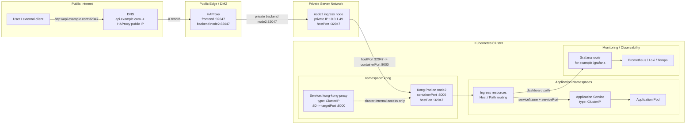
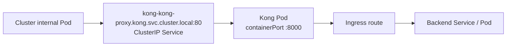

# Private-dev private server network architecture

이 문서는 Medikong `private-dev` 사설 서버 환경에서 외부 HTTP 요청이 HAProxy, Kong, Kubernetes Ingress, 내부 Service로 이어지는 네트워크 구조를 설명한다.

## 한 줄 요약

외부 사용자는 HAProxy가 공개한 HTTP 포트 `32047`로 접근한다. HAProxy는 같은 포트로 사설망의 `node2:32047`에 요청을 전달하고, Kong Pod의 `hostPort`가 이 요청을 받아 Kubernetes Ingress 라우팅으로 내부 서비스에 연결한다.

```text
Public URL :32047 -> HAProxy :32047 -> node2 :32047 -> Kong :8000 -> Ingress -> Service ClusterIP -> Pod
```

## 전체 경계



## 외부 요청 경로

현재 외부 공개 URL은 HAProxy에 바인딩한 HTTP 포트 `32047`을 사용한다.

```text
Client
  -> DNS
  -> HAProxy:32047
  -> node2:32047
  -> Kong Pod containerPort 8000
  -> Kubernetes Ingress
  -> backend Service
  -> backend Pod
```

DNS는 포트를 알지 못한다. DNS는 도메인을 HAProxy의 공인 IP로만 변환한다. 현재 구조에서는 클라이언트가 `http://<public-domain>:32047`로 접속하고, HAProxy가 사설망 backend `node2:32047`로 전달한다.

예시 구조:

```text
frontend http
  bind *:32047

backend kong
  server kong-node2 node2:32047
```

## Kong Service와 hostPort

`private-dev` Kong values의 핵심 설정은 다음 구조다.

```yaml
proxy:
  type: ClusterIP
  http:
    servicePort: 80
    containerPort: 8000
    hostPort: 32047
  tls:
    servicePort: 443
    containerPort: 8443
    hostPort: 443
```

각 포트의 의미는 다르다.

| 항목 | 의미 | 현재 역할 |
| --- | --- | --- |
| `servicePort` | Kubernetes Service가 노출하는 포트 | 클러스터 내부에서 `kong-kong-proxy:80`으로 접근 |
| `containerPort` | Kong 컨테이너가 실제로 listen하는 포트 | Kong HTTP proxy는 `8000`에서 수신 |
| `hostPort` | Pod가 뜬 노드의 실제 포트를 컨테이너 포트에 직접 연결 | 외부 HAProxy가 `node2:32047`로 접근 |
| `ClusterIP` | 클러스터 내부 전용 Service 가상 IP | 외부 HAProxy가 직접 쓰는 주소가 아님 |

따라서 `kubectl get svc -n kong`에는 `32047`이 보이지 않는다. `32047`은 Service 포트가 아니라 Pod spec의 `hostPort`다.

확인 명령:

```bash
kubectl -n kong get svc kong-kong-proxy
kubectl -n kong get deploy kong-kong -o yaml | grep -A5 -B5 hostPort
kubectl -n kong get pod -l app.kubernetes.io/instance=kong -o wide
```

## 내부 요청 경로

클러스터 안의 Pod가 Kong을 호출할 때는 HAProxy와 `hostPort`를 거치지 않는다.



내부 synthetic traffic처럼 클러스터 안에서 실행되는 워크로드는 `http://kong-kong-proxy.kong.svc.cluster.local`을 사용할 수 있다. 이 경로는 Service `ClusterIP`를 통하므로 node2의 `32047`과 직접 관련이 없다.

## 왜 외부에서 잘 동작하는가

`kong-kong-proxy` Service가 `ClusterIP`여도 외부 접근이 되는 이유는 외부 트래픽이 Service `ClusterIP`로 들어오지 않기 때문이다.

실제 외부 경로는 다음과 같다.

```text
HAProxy backend -> node2:32047 -> Kong Pod hostPort -> Kong containerPort 8000
```

Kong Pod가 node2에 떠 있고 `hostPort: 32047`을 잡고 있으므로, HAProxy는 Kubernetes Service를 몰라도 node2의 실제 포트로 HTTP 요청을 전달할 수 있다. Kong은 요청을 받은 뒤 Kubernetes Ingress 규칙을 기준으로 내부 `ClusterIP` Service에 라우팅한다.

## 운영상 주의점

- Kong Pod는 ingress 노드에 고정되어야 한다. Pod가 다른 노드로 이동하면 HAProxy의 `node2:32047` backend가 더 이상 Kong에 닿지 않을 수 있다.
- 같은 노드에서 같은 `hostPort`는 하나의 Pod만 사용할 수 있다.
- `ClusterIP`는 클러스터 내부 전용 주소이며 외부 공개 주소로 보지 않는다.
- 외부 공개 포트를 바꾸려면 DNS가 아니라 HAProxy frontend/backend와 Kong `hostPort` 설정을 함께 확인한다.
- HA 구성이 필요해지면 ingress 노드를 2대 이상 두고 HAProxy backend에 각 노드의 hostPort를 등록하거나, `NodePort`, `LoadBalancer`, 별도 ingress gateway 구성을 다시 검토한다.

## 근거 경로

- `gitops/argo/applications/private-dev/platform/kong.yaml`
- `gitops/platform/kong/values-private-dev.yaml`
- `gitops/platform/synthetic/values/private-dev.yaml`
- `workspace/docs/adr/0003-separate-kong-edge-gateway-and-istio-service-mesh.md`
- `workspace/docs/architecture/onprem-private-dev-environment.md`
