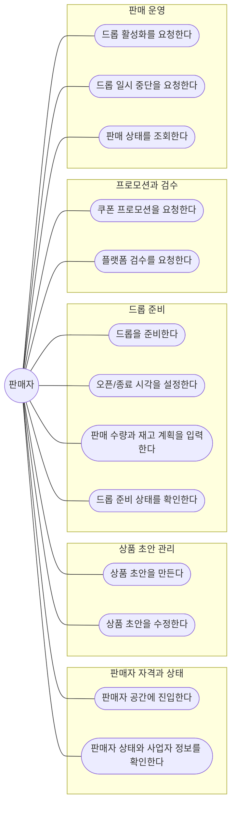

# DropMong seller-service 설계

작성일: 2026-07-06

이 문서는 현재 `backoffice-service`에 들어 있는 드롭 준비 책임을 플랫폼 운영자가 아니라 플랫폼 상품 판매자의 책임으로 다시 해석하고, 초기 `seller-service`의 서비스 위치와 API 후보를 정의한다. 이번 단계는 설계 문서화이며, `service/services/backoffice-service`의 코드명 변경이나 파일 이동은 포함하지 않는다.

## 설계 배경

현재 서비스 코드는 `service/services/backoffice-service`에 `POST /admin/drops/prepare`와 `GET /admin/drops/{dropId}/readiness`를 두고, `operator` role을 가진 Principal만 드롭 준비를 실행할 수 있게 한다. 내부 구현은 상품, 드롭, 판매 시작 시각, 재고 수량을 로컬 저장소에 준비한 뒤 `coupon-service`의 `POST /internal/coupon-policies`를 호출하고, 쿠폰 준비 여부를 readiness check로 표시한다.

기존 DropMong 문서는 고객이 드롭을 발견하고 구매를 시도한 뒤 결제 결과와 알림까지 확인하는 큰 시나리오를 중심에 둔다. 같은 문서에서 상품 등록, 드롭 생성, 판매 수량 설정, 오픈 예약은 "운영자 준비"로 표현되어 있지만, 실제 도메인 관점에서는 플랫폼 운영자가 상품 판매 조건을 직접 만드는 주체라기보다 판매자가 자기 상품을 준비하고 플랫폼 운영자는 검수, 제재, 장애 대응, 강제 중단을 맡는 편이 더 자연스럽다.

따라서 초기 설계 방향은 다음과 같다.

- 드롭 준비 책임은 `seller-service`로 이동한다.
- `seller-service`는 초기에는 상품 초안, 드롭, 일정, 재고 계획, 프로모션 요청을 한 서비스 안에서 모놀리스하게 확장한다.
- `backoffice-service`는 플랫폼 운영자용 검수, 제재, 강제 중단, 운영 대응 서비스 후보로 남긴다.
- 쿠폰 정책과 발급 원장은 계속 `coupon-service`가 소유한다.
- 인증/권한 Principal은 `auth-service`가 발급하지만, 판매자 업무 프로필 소유 위치는 별도 설계 결정으로 남긴다.

## 1. 요구사항

### 기능 요구사항

| ID | 요구사항 | 비고 |
| --- | --- | --- |
| FR-01 | 판매자는 자기 상품 초안을 등록하고 수정할 수 있다. | 초기에는 공개 catalog와 분리된 `ProductDraft`로 둔다. |
| FR-02 | 판매자는 상품 초안에서 드롭을 준비하고 오픈 시각, 판매 수량, 노출 조건을 설정할 수 있다. | 현재 `/admin/drops/prepare` 책임의 판매자 재해석이다. |
| FR-03 | 판매자는 드롭별 재고 계획을 등록하고 활성화 전 readiness를 확인할 수 있다. | 실제 재고 차감 권한은 향후 order/inventory 쪽 경계와 맞춘다. |
| FR-04 | 판매자는 드롭에 붙일 쿠폰 프로모션을 요청할 수 있다. | 정책 원장은 `coupon-service`가 소유한다. |
| FR-05 | 판매자는 준비 중, 예약됨, 활성, 일시 중단, 종료 상태를 조회할 수 있다. | 고객 공개 여부와 내부 준비 상태를 분리한다. |
| FR-06 | 플랫폼 운영자는 판매자가 준비한 드롭을 검수하고, 정책 위반 시 반려하거나 강제 중단할 수 있다. | 운영자 직접 준비가 아니라 사후/사전 통제다. |
| FR-07 | 서비스는 Principal의 `seller` role과 판매자 리소스 소유권을 함께 검사한다. | role만으로 모든 판매자 리소스 접근을 허용하지 않는다. |

### 비기능 요구사항

| ID | 요구사항 | 설계 기준 |
| --- | --- | --- |
| NFR-01 | 드롭 준비와 활성화 요청은 재시도해도 중복 생성되지 않아야 한다. | `Idempotency-Key`, natural key, 상태 전이 guard를 함께 쓴다. |
| NFR-02 | 쿠폰 정책 요청 실패가 드롭 전체 데이터를 애매한 성공 상태로 만들면 안 된다. | local readiness와 외부 정책 링크 상태를 분리한다. |
| NFR-03 | 판매자별 데이터 접근 제어가 로그와 감사 이벤트로 남아야 한다. | `seller_id`, `user_id`, `request_id`, `trace_id`를 남긴다. |
| NFR-04 | 드롭 활성화 같은 상태 전이는 동시 요청에서도 단일 결과만 만들어야 한다. | DB unique constraint, optimistic version, transactional outbox 후보를 검토한다. |
| NFR-05 | K8s/MSA 환경에서 독립 배포, readiness, metric, trace를 제공해야 한다. | `/healthz`, `/readyz`, `/metrics`, OpenTelemetry 기준을 따른다. |

### 제약사항

- 이번 작업은 설계 문서 작성만 한다. `backoffice-service`의 코드 이름, endpoint, 모듈 경로는 변경하지 않는다.
- `auth-service`는 사용자/판매자 프로필을 소유하지 않는다. `user_id`, session, role, auth method, Principal 생성만 담당한다.
- `user-service`는 회원 프로필과 회원 상태를 소유한다. 판매자 프로필과 사업자 정보가 `user-service`에 남을지, `seller-service`의 별도 판매자 프로필로 갈지는 결정이 필요하다.
- `coupon-service`는 쿠폰 정책, 발급, 사용 원장을 소유한다. `seller-service`는 쿠폰 정책 생성을 직접 저장하지 않고 정책 요청과 링크 상태를 관리하는 방향을 우선한다.
- 고객 구매 경로의 실제 재고 차감, 주문, 결제, 알림은 각각의 전용 서비스가 소유한다. `seller-service`는 드롭 준비와 판매자 관리면을 담당한다.

## 2. 액터 및 유스케이스

| 액터 | 관심사 | `seller-service`와의 관계 |
| --- | --- | --- |
| 판매자 | 상품 초안, 드롭 준비, 재고 계획, 쿠폰 프로모션 요청, 판매 상태 확인 | 핵심 사용자이며 `seller` role과 판매자 소유권을 가진다. |
| 고객 | 드롭 발견, 쿠폰 발급, 구매, 결제, 알림 확인 | 직접 쓰지 않는다. 공개 catalog/order/coupon 경로로 간접 영향을 받는다. |
| 플랫폼 운영자 | 검수, 정책 위반 제재, 장애 대응, 강제 중단, 판매자 지원 | `backoffice-service` 또는 운영자 API 후보를 통해 통제한다. |
| `auth-service` | Principal 발급, session, role, auth method | `seller-service`는 `X-Principal`을 신뢰하되 프로필 정보로 해석하지 않는다. |
| `user-service` | 회원 프로필, 상태, 자기 프로필 수정 | 판매자 신청 주체의 사용자 상태를 참조할 수 있다. |
| `coupon-service` | 쿠폰 정책, 발급 원장, idempotent issue | 판매자 프로모션 요청의 실행 주체다. |

판매자 행위 목록 다이어그램:

판매자 중심 유스케이스 후보:

- 판매자는 사업자/정산 준비 상태를 확인하고 판매자 공간에 진입한다.
- 판매자는 상품 초안을 만들고 이미지, 이름, 옵션, 가격, 노출 설명을 입력한다.
- 판매자는 상품 초안으로 드롭을 만들고 오픈 시각과 수량을 예약한다.
- 판매자는 드롭에 사용할 쿠폰 프로모션을 요청한다.
- 판매자는 readiness check에서 product, schedule, inventory, coupon, review 상태를 확인한다.
- 판매자는 오픈 전 드롭을 취소하거나 수정 요청을 낸다.
- 판매자는 오픈 이후 판매 현황을 조회하고, 필요하면 일시 중단 요청을 낸다.
- 플랫폼 운영자는 검수 실패, 신고, 장애, 정책 위반 시 드롭을 반려하거나 강제 중단한다.

## 3. 상세 설계 문서

| 문서 | 포함 내용 |
| --- | --- |
| [domain-model.md](domain-model.md) | 도메인 모델, 엔티티 후보, 이벤트 모델, 바운디드 컨텍스트 |
| [api-and-sequences.md](api-and-sequences.md) | 시퀀스 다이어그램, 판매자/내부 API 후보, `/admin/drops/prepare` 마이그레이션 방향 |

## 4. 장애 복구 설계

| 상황 | 위험 | 복구 방향 |
| --- | --- | --- |
| `coupon-service` 호출 실패 | 드롭은 준비됐지만 쿠폰 정책이 없어서 readiness가 애매해짐 | `PromotionRequest`를 `RETRYABLE_FAILED`로 남기고 readiness의 `coupon=false`를 반환한다. |
| DB write 성공 후 외부 요청 실패 | 로컬 상태와 외부 정책 상태가 달라짐 | request id, policy id, idempotency key를 저장하고 재시도 worker 또는 수동 재시도 API로 보정한다. |
| 외부 요청 성공 후 DB link 저장 실패 | 쿠폰 정책은 있는데 `seller-service`가 모름 | stable `policyId`로 `GET /internal/coupon-policies/{policyId}`를 조회해 link를 복구한다. |
| 드롭 활성화 중 downstream projection 실패 | 고객 공개 상태가 일부 서비스에만 반영됨 | transactional outbox와 projection retry를 쓴다. 활성화 응답은 내부 상태와 projection 상태를 분리해 보여준다. |
| 운영자 강제 중단 중 일부 전파 실패 | 고객 구매 API가 잠시 활성 상태로 볼 수 있음 | `drop_paused` 이벤트 재시도, 강제 중단 상태의 short TTL cache, order/admission guard를 함께 둔다. |

재시도 원칙:

- 판매자 변경 API는 client-provided `Idempotency-Key`를 우선한다.
- 내부 정책 요청은 `dropId + promotionRequestId` 또는 `policyId`를 stable key로 사용한다.
- 재시도는 성공처럼 보이는 fallback을 만들지 않는다. 상태는 `REQUESTING`, `LINKED`, `RETRYABLE_FAILED`, `FAILED_FINAL`처럼 명확히 남긴다.
- 운영자 수동 보정 API는 audit log와 reason을 필수로 받는다.

## 5. 동시성 설계

| 경쟁 상황 | 방지 장치 | 기대 결과 |
| --- | --- | --- |
| 같은 판매자가 드롭 준비 버튼을 반복 클릭 | `Idempotency-Key`, `seller_id + client_request_id` unique key | 같은 readiness를 반환한다. |
| 같은 상품 초안으로 여러 드롭 활성화 | `productDraftId`, 상태, schedule window guard | 허용 정책에 맞지 않으면 `409`를 반환한다. |
| 드롭 활성화 요청과 일시 중단 요청이 충돌 | 상태 version 기반 compare-and-swap | 먼저 성공한 전이만 반영하고 나머지는 현재 상태를 반환한다. |
| 쿠폰 정책 중복 생성 | stable `policyId`, `coupon-service` upsert/idempotency | 정책 하나만 준비되고 link도 하나만 남는다. |
| 재고 계획 중복 반영 | `dropId + inventoryPlanRevision` unique key | 같은 revision은 중복 반영되지 않는다. |
| 운영자 강제 중단과 판매자 resume 요청이 충돌 | 운영자 제재 상태가 우선하는 guard | 판매자 resume은 review 필요 상태로 막힌다. |

초기 DB 설계 후보:

- `sellers(seller_id, primary_user_id, status, version)`
- `seller_users(seller_id, user_id, role, status, unique(seller_id, user_id))`
- `product_drafts(product_draft_id, seller_id, status, version)`
- `drops(drop_id, seller_id, product_draft_id, status, version, sale_starts_at, sale_ends_at)`
- `inventory_plans(drop_id, revision, total_quantity, status, unique(drop_id, revision))`
- `promotion_requests(promotion_request_id, drop_id, policy_id, status, idempotency_key, unique(drop_id, policy_id))`
- `idempotency_keys(seller_id, key, request_hash, response_snapshot, expires_at)`

## 6. 관측성

로그 필드 후보:

- `service=seller-service`
- `request_id`, `trace_id`, `span_id`
- `actor_user_id`, `actor_roles`, `seller_id`
- `drop_id`, `product_draft_id`, `promotion_request_id`, `policy_id`
- `state_from`, `state_to`, `decision`, `reason_code`

Metrics 후보:

| Metric | Label | 의미 |
| --- | --- | --- |
| `seller_drop_prepare_total` | `result` | 드롭 준비 요청 결과 |
| `seller_drop_activation_total` | `result` | 활성화 요청 결과 |
| `seller_promotion_request_total` | `result` | 쿠폰 프로모션 요청 결과 |
| `seller_coupon_policy_link_lag_seconds` | `seller_id`, `drop_id` | 프로모션 요청 후 링크 완료까지 시간 |
| `seller_readiness_check_total` | `check`, `ready` | readiness 항목별 결과 |
| `seller_access_denied_total` | `reason` | role 또는 ownership 실패 |
| `seller_outbox_pending_age_seconds` | `event_type` | outbox 지연 |

Trace 후보:

- `POST /seller/drops/prepare` span 안에 user status 확인, DB upsert, coupon policy request span을 분리한다.
- `coupon-service` 호출에는 `traceparent`와 `X-Request-Id`를 전달한다.
- 운영자 강제 중단은 actor context와 causation id를 trace attribute로 남긴다.

알림 후보:

- 쿠폰 정책 link 실패가 일정 시간 이상 지속된다.
- 드롭 활성화 예정 시각이 지났는데 readiness가 false다.
- 운영자 강제 중단 전파 실패가 발생한다.
- 판매자 접근 거부율이 급증한다.
- outbox pending age가 임계값을 넘는다.

## 7. 보안

- `seller` role과 `operator` role을 분리한다.
- 판매자 API는 `seller` role만으로 허용하지 않고 `seller_id`와 Principal `user_id`의 연결을 확인한다.
- 운영자 API는 `operator` role 또는 더 강한 `admin` role을 요구하고, reason과 audit context를 필수로 받는다.
- `auth-service` Principal은 인증 결과로만 다룬다. 판매자 이름, 사업자 번호, 정산 정보 같은 프로필은 Principal에 넣지 않는다.
- 내부 service-to-service 호출은 mTLS, service identity, allowlist를 사용한다.
- 판매자별 리소스는 path의 `sellerId`보다 DB에서 조회한 ownership을 우선한다.
- 쿠폰 정책 요청에는 판매자에게 노출하면 안 되는 내부 원장 정보가 포함되지 않는다.
- 감사 로그에는 직접 개인정보와 결제/정산 민감값을 넣지 않고 식별자와 reason code 중심으로 남긴다.

## 8. 테스트 전략

| 테스트 범위 | 후보 |
| --- | --- |
| Unit | role 검사, ownership guard, 상태 전이, request validation, idempotency hash 비교 |
| Integration | Postgres Testcontainers 기반 seller DB upsert, unique constraint, coupon-service fake/server 연동, user-service 상태 참조 |
| E2E | 판매자 상품 초안 생성 -> 드롭 준비 -> 쿠폰 요청 -> 검수 -> 활성화 -> 고객 드롭 조회 후보 |
| Contract | `/seller/*` OpenAPI, `/internal/seller/*`, `coupon-service` `POST /internal/coupon-policies` 요청/응답 |
| Concurrency | 같은 드롭 준비 중복 요청, 쿠폰 정책 중복 요청, 활성화/중단 충돌, 같은 idempotency key 재전송 |
| Failure injection | coupon-service timeout/5xx, DB write 성공 후 link 실패, outbox publish 실패, user-service 상태 조회 실패 |
| Security | 다른 판매자 리소스 접근 차단, operator endpoint에 seller role 접근 차단, missing/invalid Principal |
| Observability | 주요 span/metric/log field 존재, 실패 상태 alert rule 후보 검증 |

## K8s/MSA 서비스 위치

`seller-service`는 `service` repo에 애플리케이션 코드와 OpenAPI 계약을 두고, `gitops` repo에서 Deployment, Service, HPA/PDB, NetworkPolicy, Argo CD 설정을 소유하는 기존 polyrepo 경계를 따른다. `workspaces` repo는 이 문서처럼 공통 설계와 온보딩 기준을 둔다.

초기 배포 단위 후보:

- Kubernetes Deployment: `seller-service`
- Kubernetes Service: `seller-service:8080`
- Ingress route: `/seller/*`는 외부 API gateway를 통해 접근, `/internal/seller/*`는 cluster 내부만 허용
- Config: `COUPON_SERVICE_URL`, `USER_SERVICE_URL`, DB DSN, outbox 설정
- Readiness: DB 연결, outbox backlog 임계값, 필수 downstream soft check
- NetworkPolicy: ingress gateway, backoffice-service, coupon-service, user-service에서 필요한 방향만 허용

## 남은 결정점

| 결정점 | 기본 제안 | 확정 전 확인 |
| --- | --- | --- |
| 판매자 프로필 소유 | `seller-service` 소유 | 사업자 정보/정산 정보 범위 |
| 공개 catalog 반영 방식 | 이벤트 또는 내부 projection API | catalog-service가 별도로 생길 때 경계 조정 |
| 재고 계획과 실제 재고 권한 | 계획은 seller, 차감은 order/inventory | order-service 구현 방향 |
| 운영자 검수 위치 | `backoffice-service` 미래 역할 | 검수 UI와 audit log 요구사항 |
| `/admin/drops/prepare` 유지 기간 | 1개 전환 릴리스 | 클라이언트와 synthetic test 교체 시점 |

## 결론

`backoffice-service`가 드롭 준비 주체가 되면 플랫폼 운영자가 판매 상품과 프로모션을 직접 만드는 모델이 된다. DropMong의 핵심 사용자 관점에서는 판매자가 상품과 드롭을 준비하고, 플랫폼 운영자는 검수와 통제, 장애 대응을 담당하는 모델이 더 명확하다. 그래서 초기 구현은 세부 서비스를 쪼개지 않고 `seller-service` 하나에 판매자 기능을 모아 시작하되, 쿠폰 원장, 인증, 회원 프로필, 운영자 제재 같은 경계는 기존 MSA 책임에 맞춰 분리한다.
