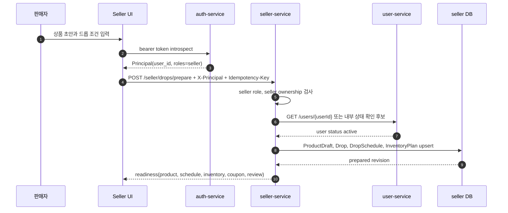
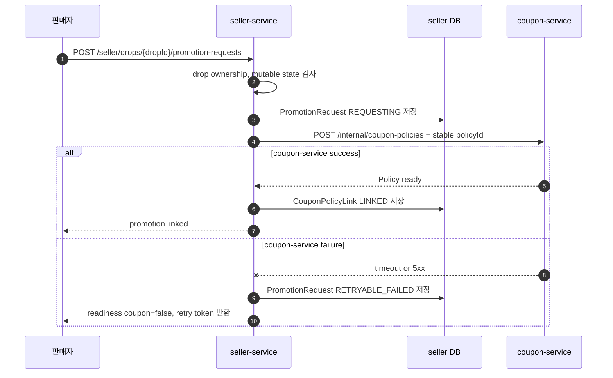
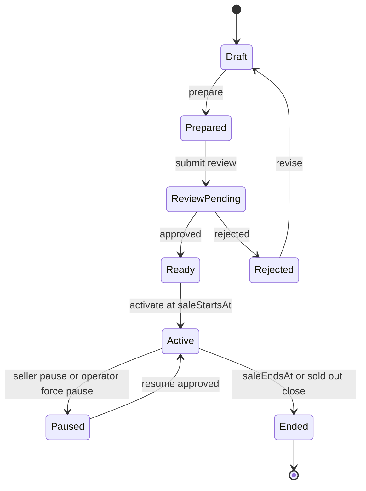
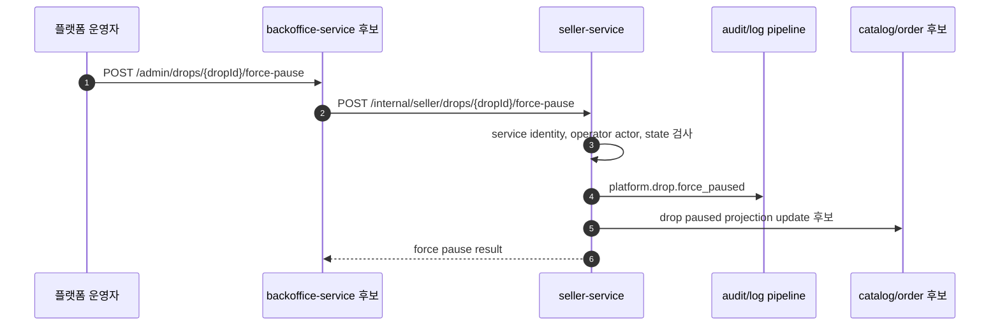

# seller-service API, 시퀀스, 캐싱 전략

작성일: 2026-07-06

이 문서는 `seller-service`의 endpoint 후보를 기준으로 API 설계, 처리 시퀀스, Redis/캐싱 전략을 함께 정리한다. 서비스 개요와 요구사항은 [README.md](README.md), 도메인 모델과 바운디드 컨텍스트는 [domain-model.md](domain-model.md)를 기준으로 본다.

## 공통 원칙

- 모든 판매자 변경 API는 `X-Principal`과 `Idempotency-Key`를 기본 입력으로 검토한다.
- Principal에는 `seller` role이 있어야 하며, `seller-service`는 Principal의 `user_id`가 대상 `seller_id`에 연결되어 있는지 별도로 검사한다.
- `seller-service`의 업무 상태 원장은 PostgreSQL이다.
- Redis는 read pressure 완화, 짧은 TTL snapshot, polling 완화에만 쓴다.
- 드롭 활성화, 중단, 검수 반영 같은 상태 전이는 Redis lock에 의존하지 않고 PostgreSQL transaction, unique constraint, version compare-and-swap으로 보호한다.
- 쿠폰 발급 수량 gate와 중복 발급 방지는 `coupon-service` 책임이다. `seller-service`는 쿠폰 정책 원장이나 발급 카운터를 Redis에 저장하지 않는다.
- 캐시 key에는 `seller_id`, `drop_id`, `product_draft_id`, `version`처럼 소유권과 변경 버전을 드러내는 값을 포함한다.
- 캐시 hit/miss, stale serve, invalidation 실패, Redis unavailable은 metric으로 남긴다.

## 판매자 Endpoint

### `GET /seller/me`

API 설계:

| 항목 | 내용 |
| --- | --- |
| 목적 | 현재 Principal에 연결된 판매자 상태 조회 |
| 인증/권한 | `X-Principal`, `seller` role 후보 |
| 응답 | `sellerId`, `status`, `primaryUserId`, `profileReady`, `reviewStatus` |
| 실패 | `401` invalid principal, `403` seller role 없음, `404` seller 미생성 |

시퀀스:

1. API gateway 또는 BFF가 bearer token을 Principal로 변환한다.
2. `seller-service`가 Principal의 `user_id`와 role을 확인한다.
3. `seller-service`가 `seller_users`에서 연결된 `seller_id`를 조회한다.
4. `seller-service`가 판매자 상태 summary를 반환한다.

캐싱 전략:

- 기본은 보류한다. 판매자 상태는 접근 제어에 직접 영향을 준다.
- 병목이 확인되면 `seller:{sellerId}:summary:v{sellerVersion}` 형태의 짧은 TTL cache를 검토한다.
- 판매자 정지, 제재, profile 상태 변경 시 즉시 무효화한다.

### `POST /seller/applications`

API 설계:

| 항목 | 내용 |
| --- | --- |
| 목적 | 판매자 신청 또는 판매자 프로필 초기화 |
| 인증/권한 | `X-Principal`, 로그인 사용자 |
| 요청 | 사업자/정산 준비에 필요한 최소 신청 정보 후보 |
| 응답 | 생성 또는 기존 `sellerId`, `status` |
| 실패 | `400` invalid request, `401`, `409` 이미 연결된 seller 존재 |

시퀀스:

1. 사용자가 판매자 신청 정보를 제출한다.
2. `seller-service`가 Principal의 `user_id`를 기준으로 기존 seller 연결을 확인한다.
3. PostgreSQL transaction에서 `Seller`, `SellerProfile`, `seller_users` 후보 데이터를 생성한다.
4. 같은 `Idempotency-Key` 재시도는 기존 결과를 반환한다.

캐싱 전략:

- 캐시 금지. 판매자 신청과 상태 생성은 원장 write다.
- 중복 방지는 DB unique constraint와 idempotency table로 처리한다.
- 성공 후 `GET /seller/me` 관련 cache만 무효화한다.

### `GET /seller/products/drafts`

API 설계:

| 항목 | 내용 |
| --- | --- |
| 목적 | 판매자의 상품 초안 목록 조회 |
| 인증/권한 | `X-Principal`, seller ownership |
| Query | `status`, `cursor`, `limit`, `sort` 후보 |
| 응답 | 상품 초안 목록, cursor |
| 실패 | `401`, `403`, `400` invalid cursor |

시퀀스:

1. `seller-service`가 Principal에서 `seller_id`를 해석한다.
2. 요청 filter와 pagination 값을 검증한다.
3. PostgreSQL에서 해당 seller의 product draft 목록을 조회한다.
4. 목록과 다음 cursor를 반환한다.

캐싱 전략:

- 조건부 적용한다.
- 판매자 UI에서 반복 조회가 많아지면 `seller:{sellerId}:product-drafts:{cursor}:{filter}:v{sellerVersion}` 형태의 짧은 TTL cache를 둔다.
- draft 생성/수정/삭제 시 해당 seller 범위 cache를 무효화한다.
- cache miss 폭주는 singleflight로 같은 key의 DB 조회를 합친다.

### `POST /seller/products/drafts`

API 설계:

| 항목 | 내용 |
| --- | --- |
| 목적 | 상품 초안 생성 |
| 인증/권한 | `X-Principal`, seller ownership |
| 요청 | 상품명, 옵션, 가격, 설명, 이미지 참조 후보 |
| 응답 | `productDraftId`, `status`, `version` |
| 실패 | `400`, `401`, `403`, `409` idempotency conflict |

시퀀스:

1. 판매자가 상품 초안 생성 요청을 보낸다.
2. `seller-service`가 seller 연결과 요청 값을 검증한다.
3. PostgreSQL transaction에서 `ProductDraft`를 생성한다.
4. 생성 이벤트 후보와 idempotency 결과를 저장한다.
5. 생성된 초안 정보를 반환한다.

캐싱 전략:

- 캐시 금지. 상품 초안 생성은 원장 write다.
- 성공 후 product draft 목록 cache와 seller summary cache를 무효화한다.
- idempotency는 Redis가 아니라 DB에 저장한 request hash와 response snapshot으로 처리한다.

### `PATCH /seller/products/drafts/{productDraftId}`

API 설계:

| 항목 | 내용 |
| --- | --- |
| 목적 | 상품 초안 수정 |
| 인증/권한 | `X-Principal`, 해당 draft의 seller ownership |
| 요청 | 수정할 field subset, 기대 `version` 후보 |
| 응답 | 수정된 draft, 새 `version` |
| 실패 | `400`, `401`, `403`, `404`, `409` version conflict |

시퀀스:

1. `seller-service`가 `productDraftId`의 소유 seller를 조회한다.
2. Principal의 seller와 일치하는지 확인한다.
3. mutable 상태인지 확인한다.
4. PostgreSQL에서 version guard로 수정한다.
5. 수정된 draft와 새 version을 반환한다.

캐싱 전략:

- 캐시 금지. 수정은 원장 write다.
- 성공 후 draft 상세, draft 목록, 연결된 drop readiness cache를 무효화한다.
- 오래된 cache가 남더라도 versioned key와 짧은 TTL로 지속 시간을 제한한다.

### `POST /seller/drops/prepare`

API 설계:

| 항목 | 내용 |
| --- | --- |
| 목적 | 상품 초안, 일정, 재고 계획을 포함한 드롭 준비 |
| 인증/권한 | `X-Principal`, seller ownership, `Idempotency-Key` |
| 요청 | `productDraftId`, `dropId` 후보, `saleStartsAt`, `saleEndsAt`, `stockQuantity`, 노출 조건 |
| 응답 | `dropId`, `version`, readiness summary |
| 실패 | `400`, `401`, `403`, `404`, `409` state/version conflict |

시퀀스:

캐싱 전략:

- 캐시 금지. 드롭 준비는 여러 도메인 모델을 함께 바꾸는 원장 write다.
- 재시도 안정성은 Redis가 아니라 `Idempotency-Key`와 DB 저장 결과 재사용으로 처리한다.
- 성공 후 product draft 목록, drop readiness, review snapshot cache를 무효화한다.

### `GET /seller/drops/{dropId}/readiness`

API 설계:

| 항목 | 내용 |
| --- | --- |
| 목적 | 드롭 준비 상태 조회 |
| 인증/권한 | `X-Principal`, drop ownership |
| 응답 | `product`, `schedule`, `inventory`, `coupon`, `review` check와 reason |
| 실패 | `401`, `403`, `404` |

시퀀스:

1. 판매자 화면이 드롭 준비 상태를 조회하거나 polling한다.
2. `seller-service`가 drop ownership을 확인한다.
3. readiness cache가 있으면 version을 확인하고 반환한다.
4. cache miss면 PostgreSQL에서 product, schedule, inventory, promotion, review 상태를 모아 계산한다.
5. 계산 결과를 짧은 TTL로 저장하고 반환한다.

캐싱 전략:

- 적용 후보 1순위다.
- key는 `seller:{sellerId}:drop:{dropId}:readiness:v{dropVersion}`를 사용한다.
- TTL은 5-15초와 jitter를 둔다.
- drop 준비, coupon link 변경, review 결정, activate/pause 성공 시 무효화한다.
- cache miss 폭주는 singleflight로 같은 `dropId + version`의 DB 재계산을 합친다.

### `POST /seller/drops/{dropId}/promotion-requests`

API 설계:

| 항목 | 내용 |
| --- | --- |
| 목적 | 드롭에 붙일 쿠폰 프로모션 요청 |
| 인증/권한 | `X-Principal`, drop ownership, mutable drop state |
| 요청 | `policyId` 후보, 이름, 총 수량, 적용 조건 |
| 응답 | `promotionRequestId`, `policyId`, link status |
| 실패 | `400`, `401`, `403`, `404`, `409`, `502` coupon-service 실패 후보 |

시퀀스:

캐싱 전략:

- 캐시 금지. `PromotionRequest`와 `CouponPolicyLink`는 DB 원장 상태로 남긴다.
- Redis는 쿠폰 발급 gate가 아니라 readiness cache invalidation 정도만 관여한다.
- 쿠폰 발급 hot path는 `coupon-service` Redis gate에서 다룬다.
- 성공/실패 상태 전이 후 drop readiness cache를 무효화한다.

### `POST /seller/drops/{dropId}/submit-review`

API 설계:

| 항목 | 내용 |
| --- | --- |
| 목적 | 플랫폼 검수 요청 |
| 인증/권한 | `X-Principal`, drop ownership |
| 요청 | 검수 요청 comment 후보, 기대 `version` |
| 응답 | `dropId`, `status=ReviewPending`, `version` |
| 실패 | `400`, `401`, `403`, `404`, `409` readiness 또는 version conflict |

시퀀스:

1. 판매자가 검수 요청을 보낸다.
2. `seller-service`가 drop ownership과 readiness 필수 항목을 확인한다.
3. PostgreSQL transaction에서 상태를 `ReviewPending`으로 전이한다.
4. 검수 요청 이벤트 후보를 outbox에 남긴다.
5. 변경된 상태를 반환한다.

캐싱 전략:

- 캐시 금지. 검수 요청은 상태 전이다.
- 성공 후 readiness cache와 review snapshot cache를 무효화한다.
- 운영자 검수 화면이 바로 조회할 수 있도록 outbox/event와 DB 상태를 기준으로 한다.

### `POST /seller/drops/{dropId}/activate`

API 설계:

| 항목 | 내용 |
| --- | --- |
| 목적 | 조건 충족 시 드롭 활성화 요청 |
| 인증/권한 | `X-Principal`, drop ownership |
| 요청 | 기대 `version`, activation reason 후보 |
| 응답 | `dropId`, `status=Active`, `version` |
| 실패 | `400`, `401`, `403`, `404`, `409` not ready/version conflict |

시퀀스:

캐싱 전략:

- 캐시 금지. 활성화는 고객 공개와 구매 가능성에 영향을 준다.
- Redis lock 대신 DB 상태 전이와 outbox로 보장한다.
- 성공 후 readiness, review snapshot, public projection 관련 cache를 무효화한다.

### `POST /seller/drops/{dropId}/pause`

API 설계:

| 항목 | 내용 |
| --- | --- |
| 목적 | 판매자 요청에 의한 드롭 일시 중단 |
| 인증/권한 | `X-Principal`, drop ownership |
| 요청 | pause reason, 기대 `version` |
| 응답 | `dropId`, `status=Paused`, `version` |
| 실패 | `400`, `401`, `403`, `404`, `409` state/version conflict |

시퀀스:

1. 판매자가 일시 중단 요청을 보낸다.
2. `seller-service`가 ownership과 현재 상태를 확인한다.
3. PostgreSQL transaction에서 상태를 `Paused`로 전이한다.
4. 공개 projection과 주문/admission guard에 전달할 이벤트 후보를 outbox에 남긴다.
5. 변경된 상태를 반환한다.

캐싱 전략:

- 캐시 금지. 중단은 안전성이 우선이다.
- DB 상태 전이와 outbox를 기준으로 한다.
- 관련 readiness, review snapshot, public projection cache는 즉시 무효화한다.

## 내부 Endpoint

### `GET /internal/seller/drops/{dropId}/review-snapshot`

API 설계:

| 항목 | 내용 |
| --- | --- |
| 목적 | 운영자 검수용 드롭 snapshot 조회 |
| 호출자 | `backoffice-service` |
| 인증/권한 | mTLS/service identity, operator actor context 후보 |
| 응답 | seller, product, schedule, inventory, coupon readiness, current version |
| 실패 | `401`, `403`, `404` |

시퀀스:

1. `backoffice-service`가 검수 대상 drop snapshot을 요청한다.
2. `seller-service`가 service identity와 actor context를 확인한다.
3. review snapshot cache가 있으면 반환한다.
4. cache miss면 PostgreSQL에서 검수에 필요한 데이터를 모아 반환한다.

캐싱 전략:

- 조건부 적용한다.
- key는 `drop:{dropId}:review-snapshot:v{dropVersion}`를 사용한다.
- TTL은 30초 이하로 제한한다.
- 최종 승인/반려 직전에는 DB 재조회로 확인한다.

### `POST /internal/seller/drops/{dropId}/review-decisions`

API 설계:

| 항목 | 내용 |
| --- | --- |
| 목적 | 플랫폼 운영자 승인/반려 결정 반영 |
| 호출자 | `backoffice-service` |
| 요청 | decision, reason, operator actor, expected version |
| 응답 | `dropId`, `reviewStatus`, `version` |
| 실패 | `400`, `401`, `403`, `404`, `409` |

시퀀스:

1. 운영자가 `backoffice-service`에서 승인/반려를 수행한다.
2. `backoffice-service`가 `seller-service` 내부 API를 호출한다.
3. `seller-service`가 service identity와 operator actor를 확인한다.
4. PostgreSQL transaction에서 review decision과 drop 상태를 반영한다.
5. audit/outbox 이벤트 후보를 남기고 결과를 반환한다.

캐싱 전략:

- 캐시 금지. 승인/반려는 상태 전이다.
- 성공 후 readiness cache와 review snapshot cache를 무효화한다.

### `POST /internal/seller/drops/{dropId}/force-pause`

API 설계:

| 항목 | 내용 |
| --- | --- |
| 목적 | 운영자 강제 중단 |
| 호출자 | `backoffice-service` |
| 요청 | reason, operator actor, incident id 후보 |
| 응답 | `dropId`, `status=Paused`, `version` |
| 실패 | `400`, `401`, `403`, `404`, `409` |

시퀀스:

캐싱 전략:

- 캐시 금지. 강제 중단은 운영 안전성이 우선이다.
- Redis가 실패해도 중단 상태는 DB와 outbox에 남아야 한다.
- 관련 cache는 결과 전파 후 무효화 대상으로만 본다.

### `POST /internal/seller/drops/{dropId}/coupon-policy-links`

API 설계:

| 항목 | 내용 |
| --- | --- |
| 목적 | 쿠폰 정책 준비 결과를 드롭에 연결 |
| 호출자 | `coupon-service` 또는 async worker 후보 |
| 요청 | `policyId`, `status`, `issuedLimit`, correlation id |
| 응답 | `dropId`, `policyId`, link status |
| 실패 | `400`, `401`, `403`, `404`, `409` |

시퀀스:

1. `coupon-service` 또는 worker가 쿠폰 정책 준비 결과를 전달한다.
2. `seller-service`가 service identity와 correlation id를 확인한다.
3. PostgreSQL transaction에서 `CouponPolicyLink` 상태를 반영한다.
4. drop readiness를 다시 계산할 수 있도록 변경 version을 증가시킨다.
5. 결과를 반환한다.

캐싱 전략:

- 캐시 금지. 쿠폰 정책 link 반영은 원장 write다.
- 성공 후 readiness cache만 무효화한다.
- 쿠폰 발급 수량과 발급 중복 방지는 계속 `coupon-service` Redis gate가 담당한다.

### `GET /internal/sellers/{sellerId}`

API 설계:

| 항목 | 내용 |
| --- | --- |
| 목적 | 다른 서비스의 판매자 상태 확인 |
| 호출자 | catalog/order/coupon 후보 |
| 응답 | `sellerId`, `status`, `publicName`, `sanctionStatus` 후보 |
| 실패 | `401`, `403`, `404` |

시퀀스:

1. 내부 서비스가 판매자 상태 확인을 요청한다.
2. `seller-service`가 service identity를 확인한다.
3. seller status cache가 있으면 반환한다.
4. cache miss면 PostgreSQL에서 seller summary를 조회해 반환한다.

캐싱 전략:

- 조건부 적용한다.
- 다른 서비스가 판매자 상태를 자주 확인하면 짧은 TTL cache를 검토한다.
- 제재/정지 상태는 stale하면 위험하므로 status 변경 시 즉시 무효화하고 TTL은 5-30초로 제한한다.

## Redis 장애 시 동작

| 상황 | 동작 |
| --- | --- |
| read cache unavailable | DB로 fallback하고 `seller_redis_cache_unavailable_total`을 증가시킨다. |
| cache invalidation 실패 | 원장 write는 성공으로 유지하되 경고 로그와 metric을 남긴다. TTL이 짧은 cache만 사용해 오래된 값의 지속 시간을 제한한다. |
| readiness cache miss 폭주 | singleflight로 같은 `dropId + version`의 DB 재계산을 합친다. |
| Redis timeout 증가 | cache 경로 timeout을 짧게 잡고 DB fallback 비율을 관측한다. 쓰기 요청은 Redis 대기 때문에 실패시키지 않는다. |

## 초기 구현 우선순위

1. Redis 없이 PostgreSQL 원장, idempotency, version guard를 먼저 구현한다.
2. 판매자 화면에서 polling 부하가 확인되면 `GET /seller/drops/{dropId}/readiness` cache를 가장 먼저 검토한다.
3. 운영자 검수 화면 반복 조회가 확인되면 versioned review snapshot cache를 검토한다.
4. 판매자 목록 조회가 병목이 될 때 product draft list cache를 검토한다.
5. 쿠폰 발급 hot path는 `seller-service`가 아니라 `coupon-service` Redis gate에서 다룬다.

## `/admin/drops/prepare` 마이그레이션 방향

현재:

- `POST /admin/drops/prepare`
- `operator` role 필요
- `backoffice-service`가 로컬 준비 후 `coupon-service`에 정책 준비 요청
- readiness 항목은 product, stock, sale window, coupon 중심

목표:

- `POST /seller/drops/prepare`
- `seller` role과 판매자 리소스 소유권 필요
- `seller-service`가 ProductDraft, Drop, DropSchedule, InventoryPlan, PromotionRequest를 소유
- 쿠폰 정책은 `coupon-service`에 요청하고 `CouponPolicyLink`로 연결 상태만 저장
- `backoffice-service`는 `/admin/drops/{dropId}/reviews`, `/admin/drops/{dropId}/force-pause`, `/admin/sellers/{sellerId}/sanctions` 같은 운영자 통제 API로 축소

단계:

1. `backoffice-service` 문서와 OpenAPI 설명에서 운영자 준비 주체 표현을 판매자 준비 주체로 분리한다.
2. `seller-service` scaffold를 추가하되, 초기에는 기존 `backoffice-service` 준비 모델을 참고해 seller role과 ownership guard를 먼저 넣는다.
3. `/admin/drops/prepare`는 deprecated endpoint로 두고 내부적으로 `/seller/drops/prepare`에 위임하거나, 한 릴리스 동안 병행 제공한다.
4. `coupon-service`의 `POST /internal/coupon-policies` summary에서 "prepared by backoffice-service" 표현을 "requested by seller-service"로 바꾼다.
5. 운영자 검수/강제 중단 API가 준비되면 판매자 준비 API에서 operator role 의존을 제거한다.
