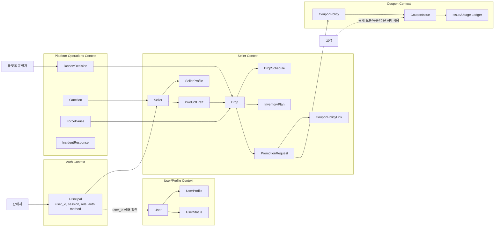

# seller-service 도메인 모델과 바운디드 컨텍스트

작성일: 2026-07-06

이 문서는 `seller-service`의 도메인 모델, 엔티티 후보, 이벤트 모델, 바운디드 컨텍스트를 분리해 정리한다. 서비스 개요와 요구사항은 [README.md](README.md), API와 시퀀스 다이어그램은 [api-and-sequences.md](api-and-sequences.md)를 기준으로 본다.

## 도메인 모델과 엔티티

초기 `seller-service`는 판매자 기능을 한 서비스 안에서 모놀리스하게 확장한다. 아래 모델은 분리된 세부 서비스가 아니라 같은 서비스 안의 aggregate/entity 후보로 본다.

| 모델 | 유형 | 설명 | 소유 후보 |
| --- | --- | --- | --- |
| `Seller` | Aggregate | 판매 가능한 주체. 내부 식별자, 상태, 연결된 `user_id` 또는 조직 식별자를 가진다. | `seller-service` |
| `SellerProfile` | Entity | 상호명, 대표자, 사업자 정보, 정산 준비 상태, 운영 연락처. | 결정 필요 |
| `ProductDraft` | Aggregate | 판매자가 작성 중인 상품 초안. 공개 catalog 반영 전 상태다. | `seller-service` |
| `Drop` | Aggregate | 특정 상품 초안을 일정과 판매 조건으로 묶은 판매 이벤트. | `seller-service` 우선 |
| `DropSchedule` | Entity | 오픈 시각, 종료 시각, 타임존, 예약/활성화 조건. | `seller-service` |
| `InventoryPlan` | Entity | 판매자가 의도한 준비 수량, 안전 재고, 옵션별 수량 계획. | `seller-service`, 실제 차감은 주문/재고 쪽 |
| `PromotionRequest` | Aggregate | 판매자가 요청한 쿠폰/프로모션 조건. 승인, 요청, 연결 실패 상태를 가진다. | `seller-service` |
| `CouponPolicyLink` | Entity | `coupon-service` 정책 id와 드롭의 연결 상태. | `seller-service` |
| `ReviewDecision` | Entity | 플랫폼 운영자 검수 결과, 반려 사유, 강제 중단 근거. | `backoffice-service` 후보 |

`SellerProfile` 위치 결정:

| 선택지 | 장점 | 위험 | 우선 판단 |
| --- | --- | --- | --- |
| `user-service`에 둔다 | 회원 프로필과 상태를 한곳에서 본다. | 사업자/정산/판매 정책 정보가 일반 회원 프로필을 비대하게 만든다. | 단순 판매자 신청 정보까지만 가능 |
| `seller-service`에 둔다 | 판매자 도메인과 사업자 상태를 가까이 둔다. | 사용자 상태와 판매자 상태 동기화가 필요하다. | 장기적으로 더 자연스럽다 |
| 분리된 `seller-profile-service` | 독립 확장 가능하다. | 초기 서비스 수가 과하다. | 초기에는 제외 |

초기 권고는 `Seller`와 판매자 업무 프로필을 `seller-service`에 두고, `user-service`에는 일반 회원 프로필과 계정 상태만 남기는 것이다. 단, `seller-service`가 `user_id`를 업무 주체 식별에 사용할 때는 `user-service`의 사용자 상태를 참조해 정지/탈퇴 사용자 접근을 막아야 한다.

## 이벤트 모델

| 이벤트 | 생산자 | 소비자 후보 | 의미 |
| --- | --- | --- | --- |
| `seller.registered` | `seller-service` | `backoffice-service`, audit/log pipeline | 판매자 주체가 생성됨 |
| `seller.profile.updated` | `seller-service` | audit/log pipeline | 판매자 업무 프로필 변경 |
| `seller.product_draft.created` | `seller-service` | audit/log pipeline | 상품 초안 생성 |
| `seller.product_draft.submitted` | `seller-service` | `backoffice-service` | 상품 또는 드롭 검수 요청 |
| `seller.drop.prepared` | `seller-service` | catalog/order/coupon 후보 | 드롭 준비 데이터가 로컬 기준으로 준비됨 |
| `seller.drop.activated` | `seller-service` | catalog/order/notification 후보 | 드롭이 고객 노출 및 구매 가능 상태로 전환됨 |
| `seller.drop.paused` | `seller-service` 또는 `backoffice-service` | catalog/order/notification 후보 | 판매자 요청 또는 운영자 제재로 일시 중단됨 |
| `seller.promotion.requested` | `seller-service` | `coupon-service` | 쿠폰 정책 생성/갱신 요청 |
| `seller.promotion.linked` | `seller-service` | audit/log pipeline | 쿠폰 정책 id와 드롭이 연결됨 |
| `platform.drop.force_paused` | `backoffice-service` | `seller-service`, catalog/order 후보 | 운영자가 강제 중단함 |

이벤트 이름은 문서 후보이며, 실제 구현 시 공통 event envelope, idempotency key, causation id, correlation id를 함께 정의한다.

## 바운디드 컨텍스트

경계 규칙:

- Seller Context는 판매자가 준비하는 상품/드롭/재고 계획/프로모션 요청의 업무 상태를 소유한다.
- User/Profile Context는 일반 회원 프로필과 사용자 상태를 소유한다.
- Auth Context는 인증과 권한 정보를 Principal로 전달하지만 판매자 업무 프로필을 알지 않는다.
- Coupon Context는 쿠폰 정책과 발급/사용 원장을 소유한다.
- Platform Operations Context는 검수, 제재, 강제 중단, 장애 대응을 소유한다.
