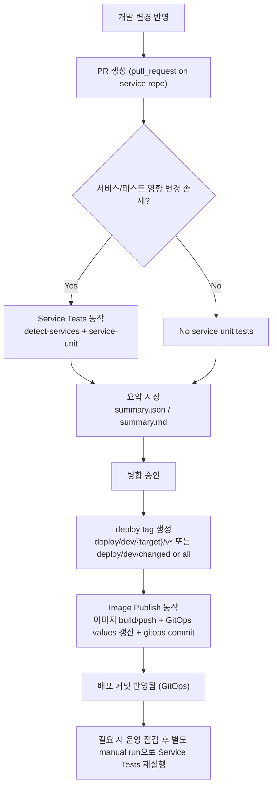
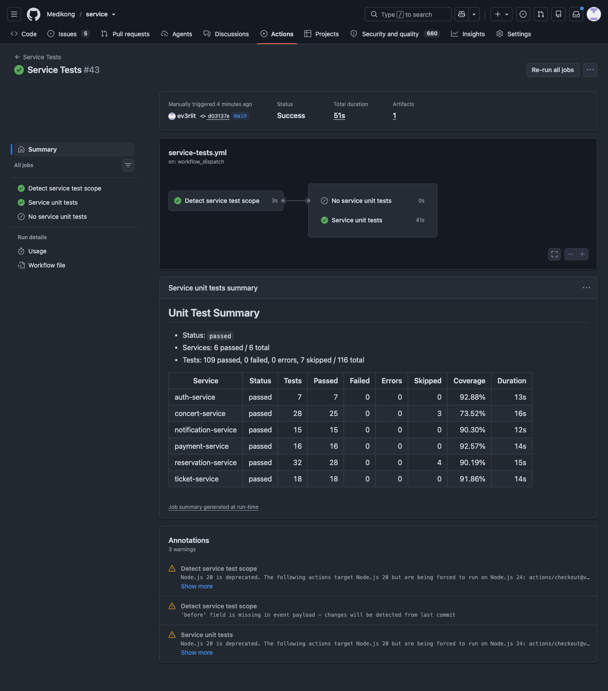

# Service Unit Test 자동화 및 커버리지 증거

## Summary

- 대상: `Service Tests` 워크플로우 실행 #43
- 링크: [https://github.com/Medikong/service/actions/runs/27801020753](https://github.com/Medikong/service/actions/runs/27801020753)
- 실행 타입: `workflow_dispatch` (수동 실행)
- 실행 시각: 2026-06-19 02:07:10Z ~ 02:08:01Z (UTC)
- 최종 코드 커버리지(라인): `85.45%` (`3742 / 4379`, 가중 합산)
- 상태: `success`
- 브랜치/커밋: `main` / `d03137e635f320e1812159f20770d84acc25999b`

## CI 자동화 동작 근거

- 워크플로우 파일: [service/.github/workflows/service-tests.yml](../../../../service/.github/workflows/service-tests.yml)
이 문서는 **서비스 배포 커밋 기준**으로 보면 다음과 같이 이해하면 됩니다.

- 배포 후보 코드가 PR로 올라오면 `pull_request` 이벤트로 `Service Tests`가 먼저 실행되어 서비스 단위 테스트/커버리지를 검증한다.
- `main` 브랜치에 `push`가 생기는 케이스는 현재 `branches-ignore`로 제외되어 있어, 배포 커밋(main push)에서는 이 workflow가 자동으로 돌지 않는다.
- 배포 승인 후 `deploy/dev/*` 태그를 기준으로 `Image Publish`가 돌아가면 이미지 빌드/푸시와 GitOps values 갱신이 진행되며, 이 단계는 서비스 단위 테스트를 직접 수행하지 않는다.
- `run #43`은 배포 의사결정 후 **수동 실행(`workflow_dispatch`)으로 시행**한 증빙 실행이다.

### 배포 의사결정 후 실행 경로

### 기술적 실행 순서(워크플로우 내부)

- 변경 경로 변경 감지 -> `paths-filter` + `detect-services` job
- 대상 서비스 변경이 있거나 수동 실행이므로 `service-unit` job이 동작
- 실행 명령: `task test-services SERVICES="..."`
- 테스트/커버리지 실행: 각 서비스 컨테이너에서 `pytest --cov=app --cov-report=xml=...`
- 요약 생성: `tests/scripts/unit_report_summary.py`
  - `junit.xml` / `coverage.xml` 파싱
  - `summary.json` 작성
  - `summary.md` 작성 후 `GITHUB_STEP_SUMMARY`에 append
- 아티팩트 업로드: `unit-test-reports` (`tests/tmp/reports/unit/`)

## 결과 개요 (아티팩트 summary 기준)

- artifacts: `unit-test-reports` (`id: 7740205400`, `size: 646 KB`)
- 서비스 수: 6개 모두 통과
- 테스트: `109 passed / 116 total` (`7 skipped`, 실패 0, 에러 0)
- 전체 실행 시간: `84s`
- 라인 커버리지 총합(가중): `85.45%` (`3742 / 4379`)

| Service | Status | Tests | Passed | Failed | Errors | Skipped | Coverage | Duration |
| --- | --- | ---: | ---: | ---: | ---: | ---: | ---: | ---: |
| auth-service | passed | 7 | 7 | 0 | 0 | 0 | 92.88% | 13s |
| concert-service | passed | 28 | 25 | 0 | 0 | 3 | 73.52% | 16s |
| notification-service | passed | 15 | 15 | 0 | 0 | 0 | 90.30% | 12s |
| payment-service | passed | 16 | 16 | 0 | 0 | 0 | 92.57% | 14s |
| reservation-service | passed | 32 | 28 | 0 | 0 | 4 | 90.19% | 15s |
| ticket-service | passed | 18 | 18 | 0 | 0 | 0 | 91.86% | 14s |

## 저장된 증거

- 요약 JSON: [assets/2026-06-19-service-tests-27801020753-summary.json](assets/2026-06-19-service-tests-27801020753-summary.json)
- 요약 Markdown: [assets/2026-06-19-service-tests-27801020753-summary.md](assets/2026-06-19-service-tests-27801020753-summary.md)
- GitHub Run: [actions/runs/27801020753](https://github.com/Medikong/service/actions/runs/27801020753)
- GitHub API(메타데이터): `https://api.github.com/repos/Medikong/service/actions/runs/27801020753`
- GitHub API(작업): `https://api.github.com/repos/Medikong/service/actions/runs/27801020753/jobs?per_page=100`
- GitHub API(아티팩트): `https://api.github.com/repos/Medikong/service/actions/runs/27801020753/artifacts`
- 스크린샷: 

## 참고

- 워크플로우 상세 로그에는 페이지 로딩 제약으로 일부 UI 표시 제한이 있었고, 런 결과 수치는 API + 아티팩트를 기준으로 기록했다.
