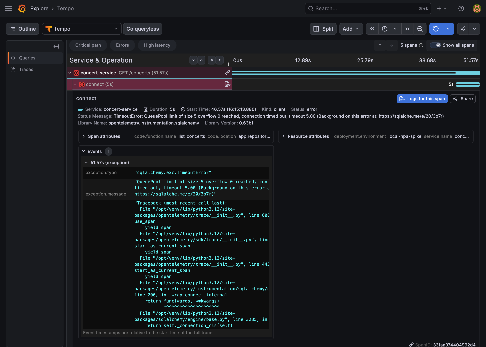

# Local HPA Spike Scaleout 6m Memory Unlimited Analysis

## Summary

| 항목 | 결과 |
| --- | --- |
| run id | `read-api-loadtest-read-manual-20260620072343-zpsp2` |
| timestamp | `2026-06-20T07:30:18.336Z` |
| scenario | `reservation-journey-load-test` |
| preset | `local-hpa-spike-scaleout-6m` |
| changed condition | service memory limit 제거 |
| status | `FAIL` |

이번 실행은 이전 실험에서 의심했던 memory limit을 제거하고 동일한 spike 조건으로 재실행한 결과다.

결론적으로 memory limit 제거만으로는 실패가 해결되지 않았다. `concert-service`는 여전히 `40 journey/s`부터 응답 지연과 503을 보였고, liveness/readiness probe timeout으로 재시작했다.

추가로 확인된 `QueuePool limit of size 5 overflow 0 reached, connection timed out, timeout 5.00` 로그를 기준으로 보면, 이번 실패의 1차 원인 후보는 memory limit이 아니라 `concert-service`의 SQLAlchemy DB connection pool exhaustion이다.

## Experiment Conditions

이번 실행은 `local-hpa-spike` 환경의 서비스별 override를 적용한 상태에서 수행했다. HPA target CPU utilization은 `70%`이며, 서비스 memory limit은 모두 제거했다.

| service | CPU request | memory request | CPU limit | memory limit |
| --- | ---: | ---: | ---: | ---: |
| auth-service | `2400m` | `256Mi` | `null` | `null` |
| concert-service | `781m` | `256Mi` | `null` | `null` |
| notification-service | `427m` | `256Mi` | `null` | `null` |
| payment-service | `340m` | `256Mi` | `null` | `null` |
| reservation-service | `250m` | `256Mi` | `null` | `null` |
| ticket-service | `380m` | `256Mi` | `null` | `null` |

CPU request는 HPA의 CPU utilization 계산 기준이다. 예를 들어 `concert-service`는 `781m` request의 `70%`를 넘는 평균 CPU 사용률이 유지될 때 scale-out 판단 대상이 된다.

## HPA Result

| service | max desired | decision | ready |
| --- | ---: | ---: | ---: |
| auth-service | `1` | `null` | `null` |
| concert-service | `2` | `131.816s` | `141.743s` |
| notification-service | `1` | `null` | `null` |
| payment-service | `1` | `null` | `null` |
| reservation-service | `2` | `131.816s` | `141.743s` |
| ticket-service | `2` | `131.816s` | `141.743s` |

HPA scale-out은 발생했다. 다만 `concert-service`는 replica가 2까지 올라간 뒤에도 안정화되지 못했다.

## Stage Result

| stage | p95 | p99 | failed | status |
| --- | ---: | ---: | ---: | --- |
| `10 journey/s` | `26.30ms` | `50.30ms` | `0` | `OK` |
| `20 journey/s` | `40.33ms` | `62.29ms` | `0` | `OK` |
| `40 journey/s` | `10001.73ms` | `10002.18ms` | `0.3870` | `LIMIT_CANDIDATE` |
| `50 journey/s` | `10001.65ms` | `10002.28ms` | `0.9313` | `LIMIT_CANDIDATE` |

메모리 limit 제거 후에도 안정 구간은 `20 journey/s`까지다. `40 journey/s`부터 한계가 재현됐다.

## API Step Result

| step | service | p95 | failed |
| --- | --- | ---: | ---: |
| setup.pre_login | auth-service | `50.84ms` | `0` |
| concerts | concert-service | `10001.65ms` | `0.7926` |
| performances | concert-service | `10001.46ms` | `0.2511` |
| seats | concert-service | `10000.56ms` | `0.0905` |
| reservation.create | reservation-service | `24.23ms` | `0` |
| payment.approve | payment-service | `23.27ms` | `0` |
| ticket.list | ticket-service | `5141.36ms` | `0.0346` |

실패는 여전히 concert-service 조회 경로에서 시작된다. reservation/payment write 경로는 낮은 latency와 실패율 0을 유지했다.

## Failure Signal

| 항목 | 관측 |
| --- | --- |
| main failed route | `GET /concerts` |
| observed HTTP status | `503` |
| concert-service max desired | `2` |
| concert-service restart count | Pod별 `2` |
| memory limit | 제거됨 |
| DB pool signal | `QueuePool limit of size 5 overflow 0 reached`, timeout `5.00s` |
| DB pool config | `poolSize=5`, `maxOverflow=0`, `poolTimeoutSeconds=5` |
| container exit code | `137` |
| probe signal | liveness/readiness timeout |

메모리 limit이 제거된 상태에서도 exit code `137`과 probe timeout이 발생했다. 따라서 이번 결과만 놓고 보면 "memory limit 때문에 OOM이 발생했다"보다는 "concert-service가 부하 중 DB connection을 제때 확보하지 못했고, 그 여파로 health 응답까지 지연되어 kubelet에 의해 재시작됐다"는 해석이 더 강하다.

## Root Cause Candidate

`local-hpa-spike`의 기본 DB pool 조건은 `poolSize=5`, `maxOverflow=0`, `poolTimeoutSeconds=5`다. 이 조건에서는 한 Pod가 동시에 사용할 수 있는 DB connection이 최대 5개이고, 5초 안에 connection을 얻지 못한 요청은 timeout 된다.

이번 예매 여정은 매 iteration마다 `concert-service` 조회 API를 3번 호출한다. 반면 reservation/payment는 각각 1번씩 호출된다. 따라서 같은 `journey/s`라도 concert-service가 대부분의 조회 부하를 먼저 받으며, `40 journey/s` 구간부터 `GET /concerts`, `GET /concerts/{id}/performances`, `GET /performances/{id}/seats`가 connection pool을 압박한다. 이 설명은 `concerts` step의 높은 실패율, `503`, 10초대 p95/p99, readiness/liveness timeout을 모두 설명한다.

## Decision

| 판단 | 내용 |
| --- | --- |
| memory limit 제거 효과 | 실패 해결 못함 |
| HPA scale-out 검증 | PASS |
| 예매 여정 안정성 | FAIL |
| 안정 처리량 | `20 journey/s` |
| 한계 후보 | `40 journey/s` |
| 우선 확인 대상 | concert-service SQLAlchemy pool size/max overflow, DB query latency, health/probe timeout |

## Next Experiment

다음 실험은 CPU request보다 먼저 `concert-service`의 DB pool 조건을 실험 목적에 맞게 올린 뒤 재실행한다. AWS dev 서비스 override는 `poolSize=20`, `maxOverflow=20`, `poolTimeoutSeconds=10`을 쓰고 있으므로, 로컬 HPA spike에서도 이와 같은 계열의 pool 조건을 적용하면 memory/probe 문제가 아니라 실제 CPU 기반 HPA 반응을 더 정확히 볼 수 있다.

| 항목 | 값 |
| --- | --- |
| 변경 대상 | `concert-service` |
| 변경 조건 | SQLAlchemy DB pool |
| poolSize | `20` |
| maxOverflow | `20` |
| poolTimeoutSeconds | `10` |
| 유지 조건 | memory limit 제거, `local-hpa-spike-scaleout-6m` preset |
| 확인 기준 | `40 journey/s` 이상에서 `GET /concerts` 503와 QueuePool timeout 감소 여부 |

## Raw Result

원본 실행 결과는 같은 폴더의 [loadtest-run-report.json](loadtest-run-report.json)에 저장했다.
