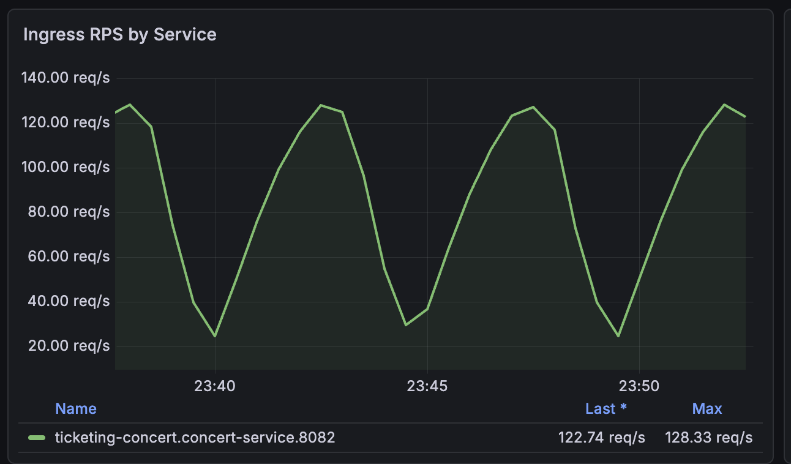

# Service HPA Spike concert 140RPS - second run

## Summary

| 항목 | 값 |
| --- | --- |
| service | `concert-service` |
| scenario | `service-hpa-spike-load-test` |
| preset | `concert-140rps` |
| job | `read-api-loadtest-read-manual-20260621143331` |
| run id | `read-api-loadtest-read-manual-20260621143331-7wpl8` |
| job status | `Failed / DeadlineExceeded` |
| environment | `local-hpa-spike` |
| SQLAlchemy pool | `poolSize=15`, `maxOverflow=0`, `poolTimeoutSeconds=15`, `poolRecycleSeconds=1800` |
| Uvicorn workers | `2` |
| HPA min / max | `1 / 4` |
| observed scale-out | `1 -> 2 -> 3 -> 4` |
| report archive | `/loadtest/reports/read-api-loadtest-read-manual-20260621143331-7wpl8` |
| report files | `0` |
| 판단 | `connection budget 문제는 재발하지 않았고, 남은 실패는 seat_map 고부하/health probe timeout 계열` |

## Conclusion

두 번째 `concert-140rps` 실행은 pool 예산을 `poolSize=15`, `maxOverflow=0`으로 낮춘 뒤의 재검증이다. HPA는 정상적으로 반응했다. `concert-service`는 `1 -> 2 -> 3 -> 4`까지 scale-out 했고, 최종 snapshot에서도 HPA `REPLICAS=4`, pod 4개 `1/1 Running` 상태를 확인했다.

첫 번째 실행의 직접 원인이었던 DB connection exhaustion은 재발하지 않았다. `concert-service` 로그와 `concert-db` 로그에서 `too many clients already`, `remaining connection slots`, SQLAlchemy `QueuePool`, `OperationalError` 패턴은 확인되지 않았다. 현재 pool budget은 API pod 기준 `4 replicas * 2 workers * 15 pool = 120` connection으로, local `concert-db max_connections=200` 안에 들어온다.

다만 테스트 자체는 성공하지 않았다. read job은 `DeadlineExceeded`로 실패했고, k6 summary JSON도 생성되지 않았다. 마지막 실패 패턴은 `capacity_baseline.concert.seat_map failed with status 0`였고, 같은 시점에 `concert-service` pod들의 readiness/liveness probe timeout과 liveness restart가 반복됐다. 따라서 이번 실패는 DB connection budget 초과가 아니라 `seat_map` 고부하에서 endpoint 처리 지연이 health check까지 밀어낸 문제로 분리해서 봐야 한다.

## HPA Result

| 항목 | 값 |
| --- | ---: |
| initial replicas | `1` |
| max observed replicas | `4` |
| HPA max replicas | `4` |
| scale-out sequence | `1 -> 2 -> 3 -> 4` |
| post-run HPA CPU | `8%/70%` |
| post-run pod restarts | `7 total` |

증거:

- `kubectl-describe-hpa-concert-service.txt`: `New size: 2`, `New size: 3`, `New size: 4`
- `kubectl-events-concert.txt`: HPA `SuccessfulRescale` 이벤트와 pod 생성 이벤트
- `kubectl-get-pods-concert-service.txt`: pod 4개 `1/1 Running`

## Connection Budget Result

| 항목 | 값 |
| --- | ---: |
| `SQLALCHEMY_POOL_SIZE` | `15` |
| `SQLALCHEMY_MAX_OVERFLOW` | `0` |
| `UVICORN_WORKERS` | `2` |
| HPA max replicas | `4` |
| API connection budget | `120` |
| local DB max connections | `200` |

검색 결과:

- `too many clients already`: 없음
- `remaining connection slots`: 없음
- SQLAlchemy `QueuePool`: 없음
- `OperationalError`: 없음
- `psycopg` connection exhaustion: 없음

`concert-db` 로그에는 `unexpected EOF on client connection with an open transaction`와 `connection to client lost`가 남았다. 이 메시지는 pod liveness restart와 클라이언트 연결 중단 이후 발생한 후속 증상으로 해석한다. 첫 번째 실행의 `FATAL: sorry, too many clients already`와는 다른 신호다.

## Failure Analysis

| 항목 | 관측 |
| --- | --- |
| job result | `Failed / DeadlineExceeded` |
| active deadline | `1800s` |
| k6 report JSON | 생성 안 됨 |
| k6 tail 수집 | pod 종료 후 `error: timed out waiting for the condition` |
| live k6 failure | `capacity_baseline.concert.seat_map failed with status 0` 반복 |
| service symptom | readiness/liveness probe timeout, liveness restart |
| DB symptom | connection budget 초과 메시지 없음 |

실패 구간은 `seat_map` 측정 lane이다. 이 scenario는 concert endpoint 5개를 한 번에 섞어 하나의 부하 곡선을 만드는 방식이 아니라, 각 endpoint measurement를 독립 k6 scenario로 만들고 `startTime`을 순차로 밀어 실행한다. 따라서 run 후반에 `seat_map` lane이 별도로 올라오며, 이때 pod health check가 밀리고 status `0` 요청 실패가 반복됐다.

## RPS Graph

그래프가 산등성이처럼 내려갔다가 다시 올라오는 이유는 대부분 scenario 구조 때문이다.

`service-hpa-spike-load-test.js`에서 `concert-service`는 아래 5개 measurement로 나뉜다.

| 순서 | measurement | endpoint |
| ---: | --- | --- |
| 1 | `concert-recommended` | `GET /concerts/recommended` |
| 2 | `concert-detail` | `GET /concerts/{id}` |
| 3 | `concert-calendar` | `GET /concerts/{id}/calendar` |
| 4 | `concert-date-performances` | `GET /concerts/{id}/dates/{date}/performances` |
| 5 | `concert-seat-map` | `GET /performances/{performanceId}/seat-map` |

각 measurement는 같은 stage 묶음 `20 -> 80 -> 120 -> 140 -> 80 RPS`를 갖지만, `measurementOffsetSeconds()`가 앞 measurement의 duration과 `gracefulStop`을 더해서 다음 measurement의 `startTime`을 뒤로 민다. 그래서 Grafana의 service-level ingress RPS는 하나의 긴 spike가 아니라 endpoint별 작은 spike가 반복되는 모양으로 보인다.

즉 질문에 답하면, “스파이크 테스트 스텝 전환 때문”도 맞지만 그것만은 아니다. 더 정확히는 `recommended`, `detail`, `calendar`, `date_performances`, `seat_map`이 시간차로 각각 스텝을 밟기 때문에 RPS가 내려갔다가 다시 올라온다. 내려가는 골은 한 endpoint lane이 끝나고 다음 endpoint lane이 ramp-up 하기 전의 간격과 stage 전환이 겹쳐서 생긴다.

## Evidence Files

- `metadata.json`
- `summary.json`
- `run-observation-notes.md`
- `k6-tail.log`
- `read-job.yaml`
- `kubectl-describe-read-job.txt`
- `kubectl-get-hpa-concert-service.txt`
- `kubectl-describe-hpa-concert-service.txt`
- `kubectl-get-pods-concert-service.txt`
- `kubectl-describe-pods-concert-service.txt`
- `kubectl-events-concert.txt`
- `concert-service-env.txt`
- `concert-service-logs-since-90m.log`
- `concert-db-logs-since-90m.log`
- `kong-rate-limit-after-restore.txt`
- `report-archive-list.txt`
- `.assets/ingress-rps-by-service.png`

