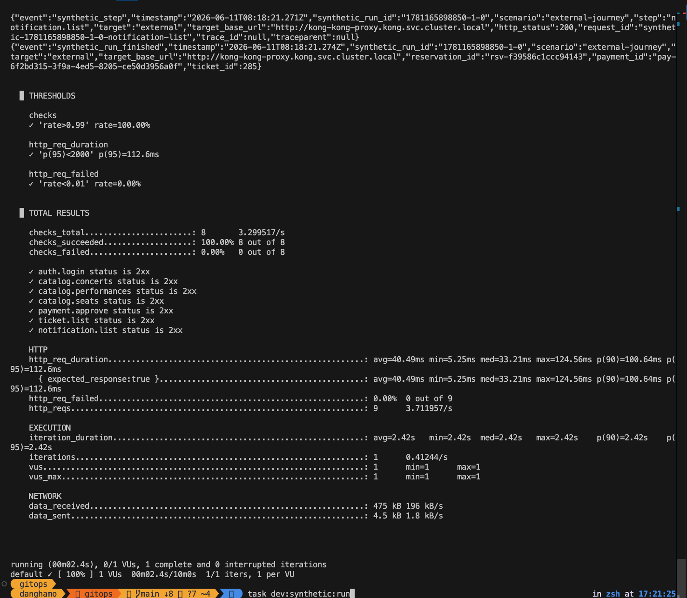
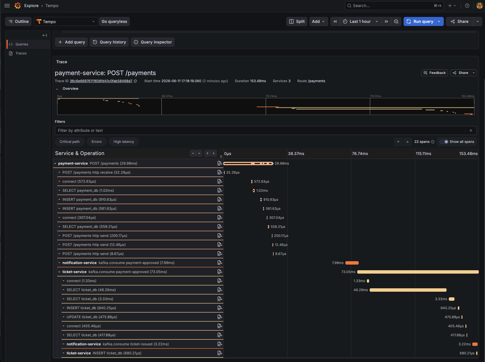

# Payment Outbox Trace Context 전파 검증

## Summary

2026-06-11에 payment-service outbox 기반 Kafka 이벤트에 저장한 trace context가 ticket-service consumer trace까지 이어지는지 확인했다.

검증은 `task dev:synthetic:run`으로 가상의 예매와 결제를 실행한 뒤, `Logs 25 - Service Log Search` 대시보드에서 최신 synthetic 로그를 찾고, 로그의 `trace_id`를 클릭해 Tempo trace 화면으로 이동하는 방식으로 진행했다.

결과적으로 `/payments` HTTP 요청에서 시작한 trace가 payment outbox, Kafka `payment-approved`, ticket-service consumer, ticket DB span까지 같은 trace 안에서 확인됐다.

## Evidence

### Synthetic 실행 결과



| 항목 | 값 |
| --- | --- |
| 실행 명령 | `task dev:synthetic:run` |
| Synthetic run id | `1781165898850-1-0` |
| Scenario | `external-journey` |
| Target base URL | `http://kong-kong-proxy.kong.svc.cluster.local` |
| Reservation ID | `rsv-f39586c1ccc94143` |
| Payment ID | `pay-6f2bd315-3f9a-4ed5-8205-ce50d3956a0f` |
| Ticket ID | `285` |
| Checks | `8 / 8` 성공 |
| HTTP failed | `0.00%` |
| p95 | `112.6ms` |

### Tempo Trace



| 항목 | 값 |
| --- | --- |
| Trace ID | `36c6e66976111606fd41c0fab58468d7` |
| Root span | `payment-service POST /payments` |
| Duration | `153.48ms` |
| Services | `3` |
| Spans | `22` |
| 확인 도구 | Grafana Tempo Explore |
| 확인 시간 | 2026-06-11 |

## 확인 절차

```text
task dev:synthetic:run
-> synthetic_run_finished 로그 확인
-> Grafana Logs 25 - Service Log Search 대시보드에서 최신 로그 검색
-> 로그의 trace_id 클릭
-> Tempo trace 화면에서 payment-service, ticket-service, notification-service span 확인
```

## 확인된 흐름

```text
payment-service POST /payments
-> payment_db INSERT payments
-> payment_db INSERT payment_events
-> notification-service kafka.consume payment-approved
-> ticket-service kafka.consume payment-approved
-> ticket_db SELECT tickets
-> ticket_db INSERT tickets
-> ticket_db UPDATE tickets
-> ticket_db INSERT processed_events
-> notification-service kafka.consume ticket-issued
```

## 의미

- `payment_events.trace_context`에 요청 시점의 `traceparent`가 저장된다.
- outbox dispatcher가 저장된 trace context를 Kafka header로 복원한다.
- ticket-service의 `start_consumer_span(message)` 경계가 Kafka header에서 부모 trace를 추출한다.
- ticket-service 내부 DB 작업 span이 payment 요청과 같은 trace 아래에 붙는다.
- 이벤트 payload에는 trace context를 섞지 않고, outbox metadata와 Kafka header를 통해 전파한다.
- synthetic 실행 결과를 로그 검색과 trace drilldown으로 다시 추적할 수 있다.

## 관련 문제

초기에는 `payment_events.trace_context` 컬럼이 실제 DB에 없어 outbox insert가 실패했다. 이 문제는 별도 trouble 문서에 원인 분석으로 남긴다.

- [payment outbox trace context 컬럼 마이그레이션 누락](../../../trouble/2026-06-11-payment-outbox-trace-context-migration.md)

## 후속

- 임시 `schema_migrations.py` 제거 조건을 정한다.
- 운영/카나리 배포에서 DB migration을 어떤 원칙으로 자동화할지 결정한다.
- Grafana Tempo 조회 기준을 runbook 또는 tracing 문서에 연결한다.
- Logs 25 대시보드에서 사용하는 대표 쿼리를 문서에 추가한다.
