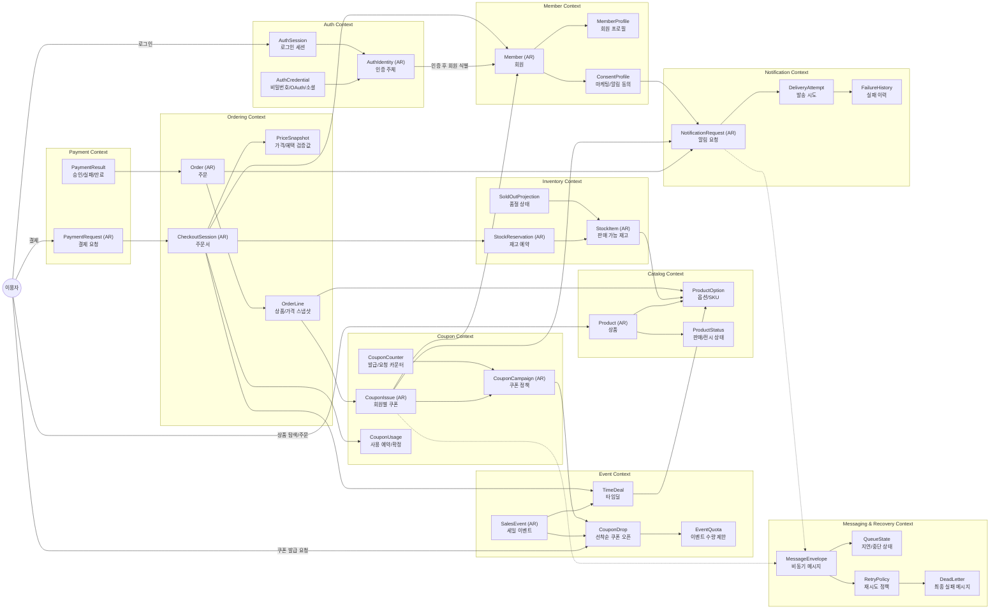
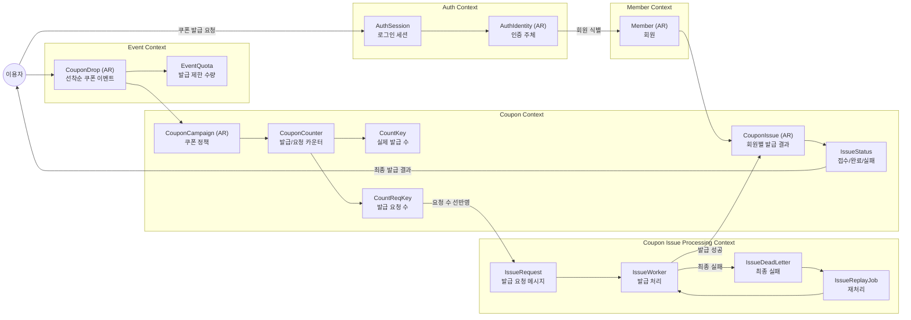
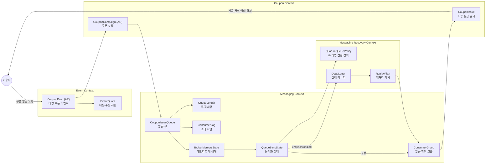
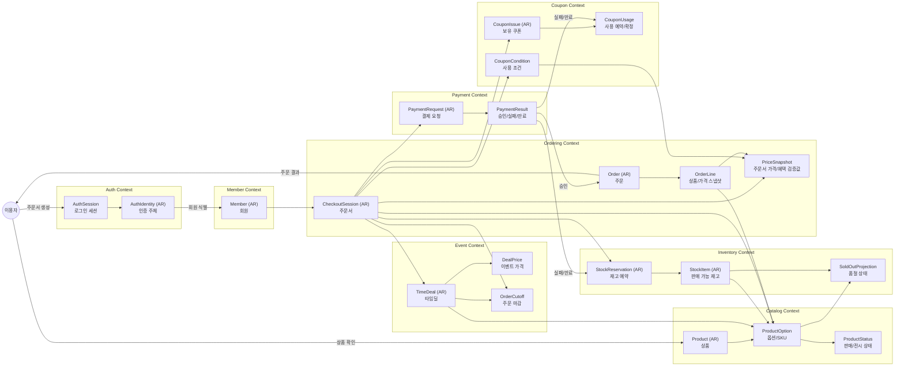
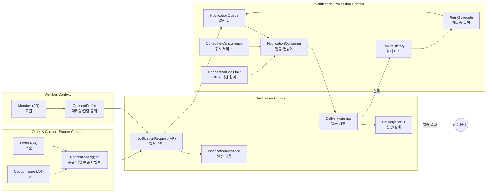

# 온라인 뷰티 이벤트 커머스 DDD 바운디드 컨텍스트 초안

## 문서 목적

수집된 기술블로그에서 확인한 장애, 복잡성, 데이터 정합성 문제를 근거로 온라인 뷰티 이벤트 커머스의 바운디드 컨텍스트 초안을 그린다.

이 문서는 MSA 서비스를 확정하기 전 업무 경계와 일관성 경계를 확인하기 위한 초안이다. 이벤트 스토밍은 아직 하지 않는다.

## 작성 원칙

- 수집 문서에 직접 등장하거나, 수집 문서의 문제 상황에서 분명하게 도출되는 도메인 경계만 다이어그램에 둔다.
- 화면, BFF, read model은 수집 문서에서 직접 다루지 않으면 바운디드 컨텍스트로 두지 않는다.
- `Customer Experience Context`, `CouponWalletView`, `CheckoutView`, `NotificationTimeline`은 근거 문서의 도메인 경계가 아니므로 제거한다.
- 고객 관점은 별도 컨텍스트가 아니라 "고객에게 드러난 문제"와 "시스템이 보장해야 할 결과"로만 기록한다.

## 기준 시나리오와 근거

| 번호 | 시나리오 | 고객에게 드러난 문제 | 근거 문서 |
|---|---|---|---|
| S1 | 선착순 쿠폰 발급 정합성 | 발급 성공 응답과 실제 발급 결과가 달라 CS로 이어졌다. | Oliveyoung, [올영세일 선착순 쿠폰, 미발급 0%를 향한 여정](https://oliveyoung.tech/2025-12-15/fcfs-coupon/) |
| S2 | 대량 쿠폰 MQ 지연·중단 대응 | 1,500만 건 쿠폰 발급 중 발급 처리가 멈추고 고객 문의가 발생했다. | Oliveyoung, [RabbitMQ Classic Queue 메모리 장애와 Quorum Queue 전환기](https://oliveyoung.tech/2025-10-28/coupon-mq-issue/) |
| S3 | 타임딜 상품 구매 정합성 | 주문서와 결제 사이에 쿠폰 가능 여부, 가격, 재고, 결제 검증이 달라질 수 있다. | Kurly, [쿠폰과 할인으로 앞다리살 하나 더 판매한 이야기](https://helloworld.kurly.com/blog/%EC%BF%A0%ED%8F%B0%EA%B3%BC-%ED%95%A0%EC%9D%B8%EC%9C%BC%EB%A1%9C-%EC%95%9E%EB%8B%A4%EB%A6%AC%EC%82%B4-%ED%95%98%EB%82%98-%EB%8D%94-%ED%8C%90%EB%A7%A4%ED%95%9C-%EC%9D%B4%EC%95%BC%EA%B8%B0) |
| S9 | 비동기 알림 후처리·자원 경합 | 알림 발송 로직이 비즈니스 트랜잭션과 결합되고, 실패 재처리와 DB 커넥션 경합 문제가 생겼다. | Oliveyoung, [SQS 기반 알림톡 처리에서 발생한 DB 커넥션 데드락 분석기](https://oliveyoung.tech/2025-12-30/alimtalk_improve_event_driven_architecture/) |

보조 근거:

- 주문 성립에는 재고 확인, 결제 금액 확인, 결제, 재고 차감, 배송 정보, 주문 완료 정보 생성이 함께 등장한다. 출처: [Oliveyoung, 올리브영 결제 이야기 Part - 3](https://oliveyoung.tech/2022-12-13/oliveyoung-transaction-orderstock/)
- 품절 여부는 장바구니, 검색 결과, 상품 상세 페이지에서 활용되며, 대규모 트래픽에서 품절 조회 지연이 온라인몰 품질에 영향을 줬다. 출처: [Oliveyoung, Kafka Streams 기반 EDA 구축 사례: 올리브영 품절 시스템 현대화 프로젝트](https://oliveyoung.tech/2025-12-15/kafka-streams-for-out-of-stock/)
- 캠페인 타겟팅에서는 마케팅 수신 동의/철회, 쿠폰 발급 같은 고객 상태가 늦게 반영되면 타겟팅 누락 또는 수신 거부 후 알림 발송 문제가 생긴다. 출처: [Oliveyoung, 올리브영의 실시간 캠페인 타겟팅을 위한 CDC 전환기](https://oliveyoung.tech/2025-12-29/campaign-worekr_review/)

이번 다이어그램에서는 고객 사용 시나리오에 직접 등장하지 않는 정산 컨텍스트를 제외한다. 정산은 이후 환불, 취소, 결제 상태 보정이 고객에게 드러나는 시나리오를 다룰 때 다시 포함한다.

## 전체 바운디드 컨텍스트

## S1. 선착순 쿠폰 발급 정합성

출처 기준:

- [Oliveyoung, 올영세일 선착순 쿠폰, 미발급 0%를 향한 여정](https://oliveyoung.tech/2025-12-15/fcfs-coupon/)은 "발급 성공 응답"과 "실제 워커 실패"의 불일치를 문제로 제시한다.
- [Oliveyoung, 올영세일 선착순 쿠폰, 미발급 0%를 향한 여정](https://oliveyoung.tech/2025-12-15/fcfs-coupon/)은 `GET`과 `INCR` 사이의 원자성 부재, 발급 요청 수량용 별도 Redis key, `count`와 `countReq` 정합성 체크를 개선 포인트로 설명한다.

핵심 경계:

- `CouponCounter`는 선착순 수량과 중복 요청을 지키는 일관성 경계다.
- `CouponIssue`는 회원별 발급 결과의 원천이다.
- "쿠폰함" 같은 화면 객체는 수집 글의 경계가 아니므로 다이어그램에 두지 않는다.

## S2. 대량 쿠폰 MQ 지연·중단 대응

출처 기준:

- [Oliveyoung, RabbitMQ Classic Queue 메모리 장애와 Quorum Queue 전환기](https://oliveyoung.tech/2025-10-28/coupon-mq-issue/)는 1,500만 건 쿠폰 발급 중 RabbitMQ 메모리 과다 점유와 `unsynchronized` 상태 때문에 쿠폰 발급이 멈춘 사례를 제시한다.
- [Oliveyoung, RabbitMQ Classic Queue 메모리 장애와 Quorum Queue 전환기](https://oliveyoung.tech/2025-10-28/coupon-mq-issue/)는 Queue Length, Consumer Lag, 클러스터 상태 감시, Dead Letter Queue 고도화를 향후 개선 항목으로 언급한다.

핵심 경계:

- S2는 "고객 대기 화면"을 설계하는 문제가 아니라, 쿠폰 발급 큐가 멈췄을 때 발급 결과와 재처리 가능성을 잃지 않는 문제다.
- `QueueState`는 막연한 운영 상태가 아니라 `QueueLength`, `ConsumerLag`, `BrokerMemoryState`, `QueueSyncState`로 쪼개야 근거 문서와 연결된다.
- `QuorumQueuePolicy`는 RabbitMQ 장애 글의 개선 사례에 근거한다.

## S3. 타임딜 상품 구매 정합성

출처 기준:

- [Kurly, 쿠폰과 할인으로 앞다리살 하나 더 판매한 이야기](https://helloworld.kurly.com/blog/%EC%BF%A0%ED%8F%B0%EA%B3%BC-%ED%95%A0%EC%9D%B8%EC%9C%BC%EB%A1%9C-%EC%95%9E%EB%8B%A4%EB%A6%AC%EC%82%B4-%ED%95%98%EB%82%98-%EB%8D%94-%ED%8C%90%EB%A7%A4%ED%95%9C-%EC%9D%B4%EC%95%BC%EA%B8%B0)는 주문서에서는 쿠폰이 사용 가능했지만 결제 단계에서 가격 변동으로 쿠폰 사용 조건이 맞지 않게 된 사례를 제시한다.
- [Oliveyoung, 올리브영 결제 이야기 Part - 3](https://oliveyoung.tech/2022-12-13/oliveyoung-transaction-orderstock/)은 주문 성립에 재고 확인, 결제 금액 확인, 결제, 재고 차감, 배송 정보, 주문 완료 정보 생성이 함께 등장한다고 설명한다.
- [Oliveyoung, Kafka Streams 기반 EDA 구축 사례: 올리브영 품절 시스템 현대화 프로젝트](https://oliveyoung.tech/2025-12-15/kafka-streams-for-out-of-stock/)는 품절 상태가 장바구니, 검색 결과, 상품 상세 페이지에서 쓰이며, 올영세일 같은 대규모 트래픽에서 조회 지연이 서비스 품질에 영향을 줬다고 설명한다.

핵심 경계:

- `CheckoutSession`은 결제 직전의 가격, 쿠폰 조건, 재고, 주문 마감을 다시 검증하는 경계다.
- `PriceSnapshot`은 주문서와 결제 사이 조건 차이를 설명하기 위해 둔다.
- `SoldOutProjection`은 품절 시스템 글에 근거가 있다. 단, "주문 가능 상태 화면"이라는 별도 컨텍스트는 두지 않는다.

## S9. 비동기 알림 후처리·자원 경합

출처 기준:

- [Oliveyoung, SQS 기반 알림톡 처리에서 발생한 DB 커넥션 데드락 분석기](https://oliveyoung.tech/2025-12-30/alimtalk_improve_event_driven_architecture/)는 주문 완료, 배송 완료, 반품 완료 알림톡이 발송되고, 알림톡 로직이 여러 서비스에 흩어져 있었다고 설명한다.
- [Oliveyoung, SQS 기반 알림톡 처리에서 발생한 DB 커넥션 데드락 분석기](https://oliveyoung.tech/2025-12-30/alimtalk_improve_event_driven_architecture/)는 알림톡 실패 재전송 프로세스 부재, 외부 API 지연이 비즈니스 트랜잭션을 붙잡는 문제, SQS 전환 후 Hikari 커넥션 타임아웃과 `REQUIRES_NEW` 커넥션 중첩 점유를 설명한다.
- [Oliveyoung, 올리브영의 실시간 캠페인 타겟팅을 위한 CDC 전환기](https://oliveyoung.tech/2025-12-29/campaign-worekr_review/)는 마케팅 수신 동의/철회가 늦게 반영되면 타겟팅 누락 또는 알림 수신 거부 후 발송 문제가 생긴다고 설명한다.

핵심 경계:

- 알림 실패는 주문 성공을 취소하지 않는다. `Order`와 `NotificationRequest`는 서로 다른 일관성 경계다.
- `FailureHistory`와 `RetrySchedule`은 알림톡 글의 실패 이력 테이블과 EventBridge 재시도 구조에 근거한다.
- `ConsumerConcurrency`와 `ConnectionPoolLimit`은 SQS 폴링, Hikari pool, `REQUIRES_NEW`가 함께 만든 커넥션 경합 문제에 근거한다.

## 컨텍스트별 역할 초안

| 바운디드 컨텍스트 | Aggregate/Entity 후보 | 근거 또는 책임 |
|---|---|---|
| Auth | `AuthIdentity`, `AuthCredential`, `AuthSession` | 인증 수단과 로그인 세션을 관리한다. 회원과 분리한다. |
| Member | `Member`, `MemberProfile`, `ConsentProfile` | 서비스 회원, 프로필, 마케팅/알림 동의, 고객 식별자를 관리한다. |
| Event | `SalesEvent`, `CouponDrop`, `TimeDeal`, `EventQuota` | 선착순 쿠폰 오픈, 타임딜, 이벤트 수량 제한을 관리한다. |
| Catalog | `Product`, `ProductOption`, `ProductStatus` | 상품, 옵션, 판매/전시 상태를 관리한다. |
| Coupon | `CouponCampaign`, `CouponIssue`, `CouponCounter`, `CouponUsage` | 쿠폰 정책, 발급 결과, 요청/발급 카운터, 쿠폰 사용 예약을 관리한다. |
| Inventory | `StockItem`, `StockReservation`, `SoldOutProjection` | 판매 가능 재고, 재고 예약, 품절 상태를 관리한다. |
| Ordering | `CheckoutSession`, `PriceSnapshot`, `Order`, `OrderLine` | 주문서 검증, 주문 생성, 가격/혜택 스냅샷을 관리한다. |
| Payment | `PaymentRequest`, `PaymentResult` | 결제 요청, 승인, 실패, 만료 결과를 주문에 전달한다. |
| Messaging & Recovery | `MessageEnvelope`, `QueueState`, `RetryPolicy`, `DeadLetter` | 쿠폰 발급과 캠페인/알림 처리의 메시지 지연, 실패, 재처리를 관리한다. |
| Notification | `NotificationRequest`, `DeliveryAttempt`, `FailureHistory` | 주문, 배송, 쿠폰 알림 요청과 발송 결과, 실패 이력을 관리한다. |

## Auth와 Member 분리 메모

- `Auth`는 인증 주체, 인증 수단, 로그인 세션을 다룬다.
- `Member`는 서비스 회원 프로필, 동의 정보, 주문·쿠폰·정산에서 참조되는 고객 식별자를 다룬다.
- 한 명의 `Member`는 비밀번호, 소셜 로그인, 패스키처럼 여러 `AuthIdentity` 또는 `AuthCredential`과 연결될 수 있다.
- 시나리오 다이어그램에서는 로그인 확인이 필요한 경우에만 `Auth Context`를 포함하고, 알림 수신 동의처럼 회원 정보만 필요한 경우에는 `Member Context`만 둔다.

## 제거한 항목

| 제거 항목 | 제거 이유 |
|---|---|
| `Customer Experience Context` | 수집 문서의 도메인 경계가 아니라 화면/BFF/read model에 가까운 추정이다. |
| `CouponWalletView` | 선착순 쿠폰 글의 직접 근거는 발급 성공 응답과 실제 발급 실패의 불일치다. 쿠폰함은 구현 화면 추정이다. |
| `CheckoutView` | 컬리 글의 직접 근거는 주문서와 결제 단계의 쿠폰 사용 가능 여부 차이다. 주문서 화면을 별도 컨텍스트로 둘 근거는 없다. |
| `NotificationTimeline` | 알림톡 글의 직접 근거는 알림 요청, 발송, 실패 이력, 재시도, 커넥션 경합이다. 알림 수신 이력 화면은 추정이다. |

## 다음 단계

1. 각 시나리오를 이벤트 스토밍으로 풀어 고객 행동, 도메인 이벤트, 정책, 실패 이벤트를 분리한다.
2. 각 Aggregate 후보 옆에 사이트 출처 링크를 붙여 근거 없음/직접 근거/적용 추론을 구분한다.
3. `Coupon Issue Processing`, `Messaging & Recovery`, `Notification Processing`을 별도 서비스로 둘지, 쿠폰/알림 서비스 내부 모듈로 둘지 결정한다.
4. S1, S2, S3, S9 기준으로 MSA 후보와 API 계약을 다시 정리한다.
