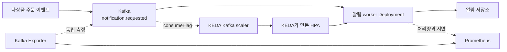

  
<b>1</b>이전 HPA에서 남은 질문

  
<b>2</b>Kafka lag를 쓰기 위한 준비

  
<b>3</b>세 가지 방법의 같은 조건 비교

::meta::

발표자 [이름]
소속 [팀/기관]
발표일 [YYYY-MM-DD]

<!--
[00:00–00:35]
안녕하세요. 이번 발표에서는 KEDA가 좋다고 미리 결론 내리지 않고, Kafka 이벤트가 밀리는 상황에서 KEDA를 어떻게 시험할지 설명드리겠습니다. 고정 용량과 CPU HPA를 같은 조건으로 두고, Kafka consumer lag를 본 KEDA가 처리 지연과 자원 사용량에 어떤 차이를 만드는지 확인할 계획입니다.
-->

---
layout: preliminary-evidence
eyebrow: 이전 HPA 실험
headline: 파드 증가 이후에도 남은 사용자 품질 문제
subtitle: 이전 HPA 수치와 새 KEDA 실험의 명확한 구분
---

::metrics::

<MetricStrip :items="[
  { value: '11–14초', label: '결정부터 Ready까지', detail: '다섯 서비스의 이전 관찰', tone: 'info' },
  { value: '1 → 4', label: 'concert 파드 수', detail: 'CPU HPA 확장', tone: 'success' },
  { value: '34.64%', label: '요청 실패율', detail: 'concert 140 RPS 3차', tone: 'danger' },
  { value: '약 14.9초', label: 'p99 응답시간', detail: '14,885.30ms', tone: 'danger' },
]"/>

  <article data-tone="info">
    파드 증가 확인
    <h3>CPU 상승 이후 concert 파드 1개에서 4개로 증가</h3>
  </article>
  <article data-tone="danger">
    사용자 품질 미회복
    <h3>DB connection pool 대기와 약 14.9초의 p99</h3>
  </article>

<!--
[00:35–01:30]
먼저 이전 실험에서 확인한 내용입니다. HPA가 확장을 결정한 뒤 새 파드가 Ready가 되기까지 약 11초에서 14초가 걸렸고, concert-service는 1개에서 4개로 늘었습니다. 그런데 같은 실행의 요청 실패율은 34.64퍼센트, p99는 약 14.9초였습니다. 이 수치는 KEDA의 결과가 아닙니다. 파드가 늘었다는 사실과 사용자가 느끼는 품질 회복을 따로 확인해야 한다는 예비 근거입니다. 수치 출처는 06 연구 기획서 6장과 05 HPA 논문 1장입니다.
-->

---
layout: comparison
eyebrow: 남은 질문
headline: CPU 신호와 대기 작업 사이의 설명 부족
subtitle: 온라인 요청의 DB 병목과 비동기 이벤트 적체에 필요한 서로 다른 신호
---

::left::

### 이전 실험에서 본 범위

- CPU target 초과
- Desired와 Ready Replica 증가
- concert 1 → 4
- 요청 실패율과 p99 기준 초과

HPA 동작 확인

::criterion::

다음

::right::

### 이번에 확인할 범위

- Kafka에 기다리는 이벤트 수
- 알림 소비 속도와 처리 지연
- 워커 증가 뒤 lag 회복 시간
- 처리 이벤트당 자원 사용량

실험 전

<!--
[01:30–02:10]
이전 실험은 CPU HPA가 동작했는지를 보여줬지만, 대기 중인 작업을 직접 측정하지는 않았습니다. 이번에는 비동기 알림 작업으로 범위를 좁힙니다. CPU가 바빠진 뒤에 반응하는 방법과 Kafka에 쌓인 이벤트 수를 직접 보는 방법을 비교하면, KEDA를 쓰려는 이유와 비교 결과를 더 분명하게 설명할 수 있습니다.
-->

---
layout: research-background
eyebrow: KEDA 적용 전 확인
headline: KEDA 적용 전 필요한 두 가지 알림 구조 변경
subtitle: 코드와 GitOps 설정에서 확인한 KEDA 미배포 상태
---

::context::

### 소비자와 API의 결합

`notification-service`의 FastAPI lifespan에서 Kafka 소비자 실행

API 파드를 늘리면 HTTP 서버와 소비자가 함께 증가

::gap::

### 파티션 1개

`notification.requested`의 현재 파티션 수 1개

소비자가 여러 개여도 동시에 맡을 파티션 부족

::need::

### 실험 준비

소비자를 별도 Deployment로 분리

최대 워커 수에 맞춘 파티션 수와 처리량 확인

consumer lag 수집 계약과 Kafka Exporter 준비 필요

<!--
[02:10–03:05]
KEDA 대상을 임의로 정하지 않고 실제 코드를 확인했습니다. 알림 서비스는 notification.requested 이벤트를 notification-service-notification-requested 그룹으로 소비합니다. 다만 이 소비자는 별도 워커가 아니라 API 프로세스 안에서 실행됩니다. 또 현재 토픽은 파티션이 하나입니다. 이 상태에서 KEDA를 붙이면 API까지 함께 늘고, 소비자를 여러 개 만들어도 한 파티션만 처리하므로 확장 효과를 보기 어렵습니다. 따라서 소비자 분리와 파티션 준비가 첫 단계입니다.
-->

---
layout: hypothesis
eyebrow: 확인할 예상
headline: Kafka lag KEDA의 더 빠른 처리 지연 감소 예상
subtitle: CPU HPA와 비슷한 자원 사용량에서 lag 회복 및 처리 지연 p99 비교
---

::h1::

### 예상하는 결과

Kafka consumer lag가 커질 때 KEDA가 워커를 늘리고, CPU HPA보다 lag와 처리 지연 p99를 빨리 낮추는 결과

::h0::

### 차이가 없을 가능성

부하가 충분히 길거나 CPU와 lag가 비슷한 시점에 증가해 두 방법의 처리 지연과 자원 사용량이 비슷한 결과

::checks::

### 예상이 틀렸다고 볼 조건

- KEDA의 lag 회복이 더 늦은 경우
- 처리 지연 p99가 줄지 않는 경우
- 같은 성공 이벤트에 더 많은 pod-seconds를 쓰는 경우
- DB 또는 파티션 제한이 먼저 나타나는 경우

<!--
[03:05–03:50]
예상은 단순합니다. 기다리는 이벤트 수를 직접 보면 CPU가 오른 뒤보다 먼저 워커를 늘릴 수 있고, 처리 지연을 빨리 줄일 수 있다는 것입니다. 반대로 부하가 충분히 길거나 CPU와 lag가 거의 같이 움직이면 두 방법의 차이가 없을 수 있습니다. KEDA가 더 늦거나, 처리 지연이 줄지 않거나, 같은 작업에 더 많은 자원을 쓰면 예상과 다른 결과로 받아들이겠습니다.
-->

---
layout: system-model
eyebrow: 적용 구조
headline: Kafka lag에 따른 KEDA의 알림 워커 파드 수 조정
subtitle: Prometheus의 결과 측정과 첫 비교에서 제외한 Node Autoscaler
---

::boundary::

### KEDA에 넣을 값

- topic: `notification.requested`
- group: `notification-service-notification-requested`
- min 1, max 4
- `lagThreshold`: 준비 실행 뒤 결정

KEDA의 1→N 확장에서 HPA가 담당하는 실제 파드 수 조절

<!--
[03:50–04:45]
구조는 다음과 같습니다. 주문에서 나온 이벤트가 Kafka에 들어가고 알림 워커가 처리합니다. KEDA Kafka scaler는 같은 토픽과 consumer group의 lag를 읽어 HPA에 외부 지표를 제공합니다. Prometheus Kafka Exporter는 KEDA와 별도로 lag를 측정해 제어 신호가 맞았는지 확인합니다. 첫 비교에서는 노드 용량을 충분히 준비해 Node Autoscaler 시간을 제외합니다. KEDA 공식 문서에 따르면 1개에서 N개로 늘리는 결정은 KEDA가 만든 HPA가 맡습니다.
-->

---
layout: experiment-matrix
eyebrow: 최소 비교군
headline: 같은 이벤트 입력에서 고정 용량·CPU HPA·KEDA 비교
subtitle: 워커 수 결정 방법만 다른 세 비교군
---

| 비교군 | 워커 수를 정하는 방법 | 공통 범위 | 실험 전에 정할 값 |
| --- | --- | --- | --- |
| 고정 용량 | 준비 실행에서 찾은 최소 안전 수 | 같은 이미지, 1~4개 범위 | 안전 파드 수 |
| CPU HPA | 워커 CPU 사용률 | min 1, max 4 | CPU target |
| KEDA | Kafka consumer lag | min 1, max 4 | `lagThreshold` |

::placeholder::

<strong>실험 전</strong> 단일 워커 기준선 이후 처리 지연 SLO와 threshold 고정

<!--
[04:45–05:35]
비교군은 세 개만 둡니다. 첫째는 준비 실행에서 찾은 최소 안전 파드 수를 계속 유지하는 고정 용량입니다. 둘째는 CPU 사용률을 보는 HPA입니다. 셋째는 Kafka consumer lag를 보는 KEDA입니다. 자동 확장 두 그룹의 최소와 최대 파드 수는 1개와 4개로 같게 둡니다. CPU target과 lagThreshold는 단일 워커가 포화되는 지점을 확인한 뒤 결과를 보기 전에 고정합니다.
-->

---
layout: comparison
eyebrow: 실험 조건
headline: 같이 둘 조건과 그룹별 변경 설정
subtitle: 다른 원인의 개입 방지를 위한 첫 비교의 고정 노드 공급
---

::left::

### 세 그룹에서 같이 둘 조건

- 같은 worker 이미지 digest와 환경 설정
- 같은 다상품 주문 데이터셋과 이벤트 발생 순서
- `notification.requested` 파티션 4개
- 같은 CPU와 메모리 Request, DB 용량
- 워커 4개를 수용하는 준비된 노드
- 같은 warmup, 실행 시간, cooldown

::criterion::

고정

::right::

### 그룹마다 바꿀 설정

- 고정 용량: 준비 실행에서 정한 파드 수
- CPU HPA: CPU target
- KEDA: `lagThreshold`
- 자동 확장: 같은 min 1, max 4
- scale-to-zero: 이번 비교에서 제외

threshold 결정 필요

<!--
[05:35–06:25]
세 그룹에서 바꾸지 않을 조건도 명확히 둡니다. 이미지, 이벤트 입력, 파티션 수, 파드 자원, 데이터베이스와 노드 용량을 같게 둡니다. 파티션은 최대 워커 수와 같은 네 개로 준비해 소비자 네 개가 실제로 일을 나눌 수 있게 합니다. 바뀌는 것은 고정 파드 수, CPU target, lagThreshold뿐입니다. scale-to-zero는 첫 비교에서 빼서 시작 지연이 결과에 섞이지 않게 합니다.
-->

---
layout: experiment-design
eyebrow: 실행 순서
headline: KEDA 비교 전 워커의 수평 확장 가능 여부 확인
subtitle: 앞 단계 통과 후 다음 단계 진행
---

<ol class="step-list">
  <li><strong>측정 준비</strong> lag, 처리 지연, 성공과 오류, 파드 상태의 같은 시간축 수집</li>
  <li><strong>단일 워커 기준선</strong> 이벤트 유입률을 올리며 최초 lag 증가와 처리 지연 기준 초과 확인</li>
  <li class="fragment"><strong>고정 1·2·4개 비교</strong> 처리량이 늘고 lag가 줄어드는지 확인</li>
  <li class="fragment"><strong>세 비교군 실행</strong> 순서를 섞어 조건별 최소 3회 반복</li>
  <li class="fragment"><strong>노드 확장 후속 확인</strong> 선택한 방법에만 Node Autoscaler 결합</li>
</ol>

::controls::

### 기본 입력

특정 상품 오픈이 아닌 여러 상품의 주문 이벤트

평상시 유입률에서 점진적으로 증가한 뒤 안정 구간 유지

### 나중에 확인할 입력

순간 burst, 반복 peak, scale-to-zero 재시작

::output::

실험 전

<!--
[06:25–07:25]
실행 순서가 핵심입니다. 먼저 lag와 처리 지연을 같은 시간으로 수집할 수 있어야 합니다. 다음으로 워커 하나의 한계를 찾고, 워커를 1개, 2개, 4개로 고정했을 때 처리량이 늘어나는지 확인합니다. 여기서 개선이 없으면 KEDA 비교를 멈추고 파티션이나 데이터베이스 병목을 먼저 봅니다. 통과하면 세 비교군의 순서를 섞어 최소 세 번씩 실행합니다. Node Autoscaler와 순간 burst는 그 뒤의 별도 실험입니다.
-->

---
layout: metric-statistics
eyebrow: 기록 방법
headline: 부하 시작부터 lag·처리 지연 회복까지의 단일 타임라인
subtitle: 파드 증가 시점과 실제 처리량 증가 시점의 분리 기록
---

::metrics::

  
<strong>t0 부하 시작</strong>초당 이벤트 수 증가입력

  
<strong>t1 확장 판단</strong>CPU target 또는 lagThreshold 초과제어 신호

  
<strong>t2 파드 요청</strong>Desired Replica 증가Kubernetes

  
<strong>t3 준비 완료</strong>새 worker Pod Ready용량

  
<strong>t4 처리 증가</strong>초당 소비 이벤트 증가실효 용량

  
<strong>t5 품질 회복</strong>lag와 처리 지연 p99가 기준 안으로 복귀결과

::formula::

### 비교할 값

$$T_{recover}=t_5-t_0$$

$$E_{pod}=\frac{\text{total pod-seconds}}{\text{successful events}}$$

::method::

- consumer lag와 가장 오래 기다린 이벤트 나이
- 처리 지연 p99, 오류와 재시도
- 초당 성공 이벤트 수
- 성공 이벤트당 pod-seconds
- 처리 지연 SLO와 오류 예산: 결정 필요

<!--
[07:25–08:20]
기록은 부하 시작, 확장 판단, Desired 증가, Pod Ready, 실제 소비량 증가, 품질 회복 순서로 남깁니다. Pod Ready만 보고 성공으로 끝내지 않습니다. consumer lag와 가장 오래 기다린 이벤트 나이, 처리 지연 p99, 오류, 처리량, 성공 이벤트당 pod-seconds를 같이 비교합니다. 현재 알림 서비스에는 소비 건수 counter는 있지만 처리 지연 histogram과 lag 수집 계약이 부족하므로 이 계측을 먼저 추가해야 합니다.
-->

---
layout: experiment-matrix
eyebrow: 결과를 읽는 방법
headline: 결과별 다음 행동을 미리 정한 해석표
subtitle: 실험 결과가 아닌 실행 이후의 해석 기준
---

| 관측 결과 | 설명할 수 있는 내용 | 다음 확인 |
| --- | --- | --- |
| KEDA의 lag와 처리 지연이 더 빨리 회복 | 대기 신호가 CPU보다 이른 확장 신호일 가능성 | 반복 수 확대와 비용 확인 |
| lag만 줄고 처리 지연 p99는 비슷함 | DB 또는 알림 저장 단계의 제한 가능성 | 저장소 대기와 connection 확인 |
| 파드는 늘지만 처리량이 늘지 않음 | 파티션 배분 또는 워커 수평 확장 실패 가능성 | partition별 lag와 consumer 할당 확인 |
| CPU HPA와 차이가 거의 없음 | CPU가 충분한 대리 신호이거나 threshold 조정 필요 | 신뢰구간과 신호 선행 시간 확인 |

::placeholder::

실험 전 · 결과 값 없음

<!--
[08:20–09:10]
결과를 본 뒤 설명을 맞추지 않도록 해석 규칙을 먼저 적었습니다. KEDA가 lag와 처리 지연을 더 빨리 줄이면 다음 반복과 비용 비교로 갑니다. lag만 줄고 처리 지연이 그대로면 저장소가 다음 병목일 수 있습니다. 파드는 늘지만 처리량이 그대로면 파티션 배분이나 워커 구조를 봐야 합니다. CPU HPA와 차이가 거의 없을 수도 있으며, 그 경우에는 CPU가 충분한 대리 신호였는지 threshold가 맞지 않았는지 확인합니다.
-->

---
layout: references
eyebrow: 정리와 참고자료
headline: 소비자 분리 이후 같은 입력을 사용한 세 가지 방법 비교
subtitle: 현재 확인한 사실과 앞으로 얻을 결과의 명확한 구분
---

<strong>다음 실행</strong> 소비자 분리 → lag 계측 → 단일 워커 한계 → 고정 1, 2, 4개 → 고정 용량, CPU HPA, KEDA 비교

<ul class="reference-list">
  <li><strong>이전 HPA 수치</strong> kubernetes-autoscaling-strategy-research-design.md, hpa-metric-selection-research-design.md, hpa-metric-selection-paper.md</li>
  <li><strong>현재 알림 구조</strong> notification-service/app/db.py, app/messaging.py, GitOps notification.yaml, kafka.yaml</li>
  <li><strong>KEDA Kafka scaler</strong> https://keda.sh/docs/2.20/scalers/apache-kafka/</li>
  <li><strong>KEDA와 HPA 역할</strong> https://keda.sh/docs/2.20/concepts/scaling-deployments/</li>
</ul>

::scope::

### 아직 정하지 못한 항목

- 처리 지연 SLO와 오류 예산
- CPU target과 `lagThreshold`
- 준비 실행 뒤 필요한 본 실험 반복 수
- scale-to-zero와 Node Autoscaler의 효과

KEDA 실험 결과 없음

<!--
[09:10–10:00]
정리하겠습니다. 현재 확인한 것은 이전 HPA의 수치, 알림 소비자가 API와 결합된 구조, 토픽 파티션이 하나라는 사실입니다. 앞으로 확인할 것은 소비자를 분리하고 계측을 준비한 뒤, 같은 이벤트 입력에서 고정 용량과 CPU HPA, KEDA를 비교한 결과입니다. KEDA는 CPU 대신 밀린 작업 수를 보고 직원을 더 부르는 방식과 비슷합니다. 다만 작업을 나눌 파티션과 실제 수평 확장성이 먼저 준비돼야 합니다. 아직 결과는 없으며 화면의 threshold와 SLO는 준비 실행 뒤 확정하겠습니다.
-->
