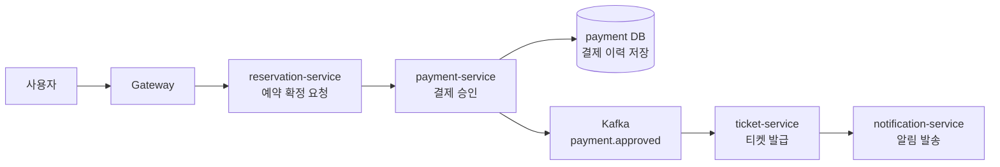
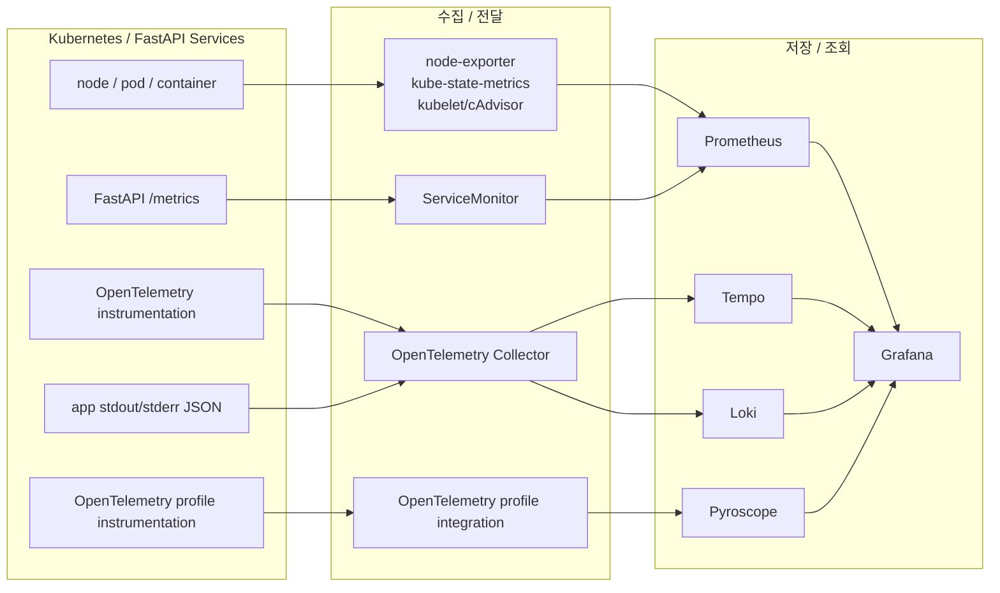

# 관측성 및 부하테스트 발표 플랜

## 문서 목적

이 문서는 공연 티켓 예매 서비스를 운영한다고 가정한 실습 프로젝트에서 관측성과 부하테스트를 어떤 순서로 발표할지 정리한다.

발표의 초점은 실제 운영 중인 서비스 장애 대응이 아니라, 서비스를 운영한다면 어떤 지표와 로그, trace, profile이 필요하고, 부하 실험을 통해 어떤 병목을 확인했는지 설명하는 데 둔다.

## 발표 목표

| 목표 | 설명 |
| --- | --- |
| 관측성 설계 설명 | MSA 환경에서 어느 서비스가 문제인지, 사용자가 얼마나 영향받는지, 요청이 어디를 지나갔는지 확인하기 위한 구조를 설명 |
| 서비스별 기준치 확보 | API benchmark와 서비스별 RPS 측정을 통해 서비스별 p95/p99, error rate, 기준 RPS를 측정 |
| 병목 지점 판단 | 서비스별 부하테스트 결과를 바탕으로 CPU 집약, DB 조회 집중, connection pool, payload, HPA 이후 병목을 구분 |
| 개선 방향 도출 | Redis cache, DB concurrency limiter, PgBouncer, worker 조정처럼 다음 설계 방향으로 연결 |

## 발표 원칙

이번 발표는 최소한의 설명과 이미지, 수치 중심으로 구성한다. 각 실험은 배경 설명을 길게 하기보다 결과 표와 그래프를 먼저 보여주고, 그 수치가 의미하는 분석 결과를 뒤따라 설명한다.

| 원칙 | 적용 방식 |
| --- | --- |
| 설명은 짧게 | 실험 목적과 조건은 한 문장 또는 한 표로 정리한다 |
| 결과를 먼저 제시 | API benchmark, 서비스별 RPS 측정, HPA test는 결과 수치부터 보여준다 |
| 수치 기반 분석 | p95/p99, error rate, 기준 RPS, HPA decision/ready time을 중심으로 해석한다 |
| 이미지를 적극 사용 | Grafana, Tempo trace, k6 report, HPA 변화 캡처를 우선 배치한다 |
| 트러블은 마지막에 묶기 | 실험 전개를 끊지 않고, 마지막에 실험 중 드러난 문제점으로 정리한다 |

## 결과 분석과 트러블 분리 기준

결과 및 분석 파트에서는 실험별 결론 수치, 짧은 해석, 다음 설계 변경만 보여준다. API benchmark는 p50/p95/p99와 error rate, 서비스별 RPS 측정은 `1000m` 기준 RPS, HPA test는 scale-out 여부와 decision/ready time을 중심으로 말한다.

문제 언급은 "이 결과 때문에 다음 실험 설계를 이렇게 바꿨다" 정도로 짧게 둔다. 예를 들어 API benchmark 결과를 보고 SLO 기준을 잡았고, 서비스별 RPS 측정 결과를 보고 서비스별 목표 RPS를 분리했으며, HPA 결과를 보고 scale-out 이후 병목 확인이 필요해졌다고 연결한다.

구체적인 문제 원인과 시행착오는 마지막 트러블 섹션으로 넘긴다. 결과 슬라이드에서 문제를 계속 설명하면 전체 실험 과정이 끊기기 때문에, 중간에는 "이 수치가 다음 실험 기준으로 어떻게 이어졌는가"까지만 설명한다.

## 발표 구조

| 순서 | 섹션 | 목적 |
| --- | --- | --- |
| 1 | 소개 페이지 | 관측성과 부하테스트 파트의 시작 화면 |
| 2 | 문제 정의 | MSA 구조의 장점과 함께 생기는 운영 복잡도를 설명 |
| 3 | 관측성 도입 이유 | 어느 서비스가 문제인지, 어디서 병목이 발생하는지 알기 위한 수단으로 관측성을 제시 |
| 4 | 관측성 설계 | metric, log, trace를 왜 분리했고, 각 신호를 어떤 방식으로 수집했는지 설명 |
| 5 | 측정 방식 | 시나리오 테스트, API benchmark, 서비스별 RPS 측정, HPA test의 목적 구분 |
| 6 | 실험 결과 | 서비스별 기준 RPS, HPA 반응, SLO 기준 충족 여부 요약 |
| 7 | 트러블 분석 | 실험 중 드러난 문제를 사례 중심으로 설명 |
| 8 | 교훈 | 관측성은 부하테스트 결과를 해석하기 위한 기반이었다는 결론 정리 |

## 문제 정의

MSA는 서비스를 작게 나누어 독립적으로 개발, 배포, 확장할 수 있다는 장점이 있다. 공연 예매 서비스에서도 auth, concert, reservation, payment, ticket, notification처럼 책임을 나누면 각 서비스의 역할이 명확해지고, 특정 서비스만 따로 확장하거나 개선할 수 있다.

하지만 서비스가 나뉘면 운영 관점에서는 새로운 문제가 생긴다. 하나의 사용자 요청이 여러 서비스를 거치고, HTTP 요청과 Kafka 이벤트, DB 접근이 함께 섞이기 때문에 단순히 "요청이 실패했다"는 결과만으로는 원인을 알기 어렵다.

이 프로젝트에서 관측성은 다음 질문에 답하기 위한 수단으로 도입했다.

| 질문 | 확인하려는 내용 |
| --- | --- |
| 어느 서비스가 문제인가? | gateway, auth, concert, reservation, payment, ticket, notification 중 실패나 지연이 시작된 위치 |
| 어디서 병목이 발생하는가? | API 처리, DB connection pool, query, payload 직렬화, CPU-bound 작업, HPA 지연 중 실제 원인 |
| 사용자는 얼마나 영향을 받는가? | p95/p99 latency, error rate, 예매 성공률, ticket 발급 성공 여부 |
| 자동으로 복구되는가? | HPA scale-out, Pod Ready 회복, cooldown 구간의 latency/error 회복 여부 |
| 특정 요청은 어떻게 흘러갔는가? | 하나의 요청이 서비스 간 trace, log, DB span, Kafka event로 어떻게 이어졌는지 |

따라서 관측성의 목표는 단순히 대시보드를 만드는 것이 아니라, 분산된 서비스에서 문제 위치와 사용자 영향을 설명할 수 있게 만드는 것이다.

## 슬라이드 구성

| 순서 | 제목 | 핵심 내용 |
| --- | --- | --- |
| 1 | 관측성과 부하테스트 | 관측성과 부하테스트 파트의 소개 페이지 |
| 2 | 관측성이란? | 관측성의 일반 정의와 참고 출처를 소개 |
| 3 | 관측성이 필요한 이유 | 복잡해진 시스템과 MSA의 단점을 관측성이 어떻게 보완하는지 설명 |
| Divider A | 관측성 설계 | 관측성이 필요한 이유에서 관측성 설계와 연동 구조로 전환 |
| 4 | 관측성 아키텍처 | 현재 프로젝트에 적용한 관측성 수집 구조를 큰 다이어그램으로 제시 |
| Divider B | 부하테스트와 실험 | 관측성 구조 설명에서 측정과 결과 중심 파트로 전환 |
| 7 | Grafana 대시보드 1 | 서비스 런타임 상태와 Pod/Container 리소스 대시보드 스크린샷 소개 |
| 8 | Grafana 대시보드 2 | 부하테스트 트래픽과 Slow Trace 탐색 대시보드 스크린샷 소개 |
| 8-1 | 성능 테스트 과정 | 시나리오 테스트, API 벤치마크, 서비스 RPS 측정, HPA 테스트 순서 소개 |
| 9 | 시나리오 테스트 | 일정 주기로 공연 예매 과정을 자동 실행해 정상 동작과 관측성 연동을 확인 |
| 9-1 | 시나리오 테스트 Trace | 결제 API 호출에서 Kafka 이벤트와 후속 서비스 처리까지 동일 trace_id로 추적 |
| 9-2 | 실험 가정과 데이터셋 | `half-year early-growth` 모델로 운영 초기 데이터 규모를 가정하고 seed를 구성 |
| 10 | API Benchmark 결과 | 각 서비스 API의 p50/p95/p99와 error rate를 먼저 보여주고 SLO 설정 근거로 연결 |
| 10-1 | API Benchmark 병목 지점 분석 및 해결 과정 | 대표 API 결과를 바탕으로 병목을 판단하고 기준치를 확보한 과정을 설명 |
| 11 | 서비스별 RPS 측정 | CPU `1000m` 기준, Pod 1개가 안정적으로 처리 가능한 RPS를 제시 |
| 11-1 | RPS 측정 개선 과정 | 3번의 실험에서 DB connection pool, server/worker 분리, auth CPU 비용 문제를 좁혀 최종 기준에 도달한 과정 |
| 12 | HPA Test 실험 조건과 결과 | CPU 70% 기준 HPA 실험 조건과 서비스별 scale-out 결과를 함께 제시 |
| 12-1 | HPA 결과 해석 | HPA 반응, SLO 회복, DB connection budget을 3-card layout으로 정리 |
| 13 | 전체 결과 요약 | API benchmark, 서비스별 RPS 측정, HPA test 결과를 한 장으로 연결 |
| 14 | 트러블 종합 1: Before | Trace는 있었지만 작업 맥락이 없어 DB 쿼리 의미를 해석하기 어려웠던 사례 |
| 14-1 | 트러블 종합 1: After | outbox 처리 단위의 부모 span을 추가해 DB span의 작업 맥락을 보이게 개선한 사례 |
| 15 | 트러블 종합 2 | 낮은 RPS에서도 Kong Ingress rate limit으로 429가 반복된 사례 |
| 16 | 트러블 종합 3 | API 구조 문제: 헤비유저의 티켓/알림 전체 조회로 p99만 높게 나온 사례 |
| 17 | 트러블 종합 4 | HPA 이후 병목: DB connection pool과 DB-bound read path |
| 18 | 최종 교훈 | HPA는 필요조건이며, 관측성은 실험 결과를 제대로 해석하기 위한 기반이었다 |
| 19 | 한계와 개선 | 시간상 검증하지 못한 한계와 프로젝트 진행 방식에서 개선된 점을 정리 |

## 슬라이드 핵심 1줄

이 섹션은 발표자료에 직접 넣는 문구가 아니라, 발표자가 전체 전개를 점검하기 위한 메모다. 각 슬라이드가 왜 필요한지, 다음 슬라이드와 어떻게 이어지는지를 한 줄로 확인한다.

| 순서 | 제목 | 발표자 메모 |
| --- | --- | --- |
| 1 | 관측성과 부하테스트 | 관측성과 부하테스트 파트가 시작된다는 점만 보여준다 |
| 2 | 관측성이란? | 관측성을 시스템 상태 파악, 원인 분석, 대응 조치를 위한 능력으로 정의한다 |
| 3 | 관측성이 필요한 이유 | MSA의 장점 뒤에 생기는 운영 복잡도를 신뢰성, 트러블슈팅, 성능 최적화 관점에서 보완한다 |
| Divider A | 관측성 설계 | 이제 관측성이 필요한 이유를 설명했으니, 그 문제를 보기 위한 관측성 구조로 넘어간다 |
| 4 | 관측성 아키텍처 | 시간 관계상 먼저 현재 프로젝트의 metric, log, trace, profile 수집 구조를 한 장의 그림으로 보여준다 |
| Divider B | 부하테스트와 실험 | 관측성 구조를 만들었으니, 이제 실제 수치로 서비스 상태를 검증한다 |
| 7 | Grafana 대시보드 1 | AWS 배포 후 서비스와 Pod가 정상적으로 떠 있는지 먼저 확인하는 화면을 보여준다 |
| 8 | Grafana 대시보드 2 | 부하테스트 중 트래픽 반영 여부와 Slow Request, Tempo trace 탐색에 사용한 화면을 보여준다 |
| 8-1 | 성능 테스트 과정 | 테스트를 시나리오 검증, API 비용 측정, 서비스별 RPS, HPA 반응 순서로 진행했다는 점을 보여준다 |
| 9 | 시나리오 테스트 | 부하를 주기 전에 예매 과정이 주기적으로 정상 실행되고 관측성 신호가 연결되는지 확인한다 |
| 9-1 | 시나리오 테스트 Trace | 하나의 결제 요청이 DB 쿼리, Kafka 이벤트, 티켓 발행, 예약 완료까지 이어지는지 trace로 확인한다 |
| 9-2 | 실험 가정과 데이터셋 | 운영 초기 규모의 데이터가 쌓인 상황을 가정해야 API와 부하테스트 결과를 해석할 수 있다 |
| 10 | API Benchmark 결과 | API 자체 응답 시간 분포를 먼저 고정해야 다음 실험에서 시스템 수용량 문제를 분리할 수 있다 |
| 10-1 | API Benchmark 병목 지점 분석 및 해결 과정 | 기준치는 그냥 측정한 값이 아니라 API 구조와 조회 비용을 정리한 뒤 확보한 값이다 |
| 11 | 서비스별 RPS 측정 | API 기준치를 바탕으로 CPU `1000m` Pod 1개가 안정적으로 감당할 수 있는 RPS를 찾았다 |
| 11-1 | RPS 측정 개선 과정 | 3번의 실험을 통해 DB pool, FastAPI worker, auth CPU 비용 문제를 분리하고 최종 기준 RPS를 확정했다 |
| 12 | HPA Test 실험 조건과 결과 | CPU 70% 기준 scale-out 조건과 서비스별 결과를 한 장에서 비교한다 |
| 12-1 | HPA 결과 해석 | HPA가 반응해도 SLO 회복은 별도 문제이며, DB connection budget까지 함께 봐야 한다 |
| 13 | 전체 결과 요약 | API 기준치, Pod 처리량, HPA 결과를 연결해 서비스별 한계와 다음 개선 방향을 정리한다 |
| 14 | 트러블 종합 1: Before | trace가 있어도 DB span만 단독으로 보이면 작업 맥락을 이해하기 어렵다 |
| 14-1 | 트러블 종합 1: After | 부모 span을 추가하면 DB 쿼리가 어떤 outbox 처리 과정에서 발생했는지 바로 확인할 수 있다 |
| 15 | 트러블 종합 2 | k6 VU가 여러 개여도 Pod IP는 하나라 Kong rate limit bucket이 한 곳에 몰릴 수 있다 |
| 16 | 트러블 종합 3 | 평균은 괜찮아 보여도 헤비유저의 전체 조회가 p99만 끌어올릴 수 있다는 점을 보여준다 |
| 17 | 트러블 종합 4 | HPA 이후에는 DB connection pool, DB-bound read path, cache 부재가 다음 병목으로 남는다 |
| 18 | 최종 교훈 | 관측성은 대시보드가 아니라 부하테스트 결과를 올바르게 해석하기 위한 기반이었다 |
| 19 | 한계와 개선 | 개선 결과까지 검증하지 못한 한계를 인정하고, 레포 분리와 초기 인프라 선행 작업이 프로젝트 생산성을 높였다는 점으로 마무리한다 |

## 섹션 Divider 구성

| Divider | 위치 | 화면 메시지 | 역할 |
| --- | --- | --- | --- |
| Opening | 1번 | 관측성과 부하테스트 | 관측성과 부하테스트 파트의 소개 페이지 |
| A | 3번 뒤 | 관측성 설계 | 관측성이 필요한 이유에서 metric, log, trace 설계로 넘어가는 구간 |
| B | 4번 뒤 | 부하테스트와 실험 | 실험 설계, API benchmark, 서비스별 RPS, HPA test, 트러블을 다루는 구간 |

1번 슬라이드는 관측성과 부하테스트 파트의 소개 페이지로만 둔다. Divider A와 B는 설명을 많이 넣지 않고 한 문장과 큰 제목만 둔다. 관측성 파트는 "문제를 보기 위한 구조를 만들었다", 테스트 파트는 "그 구조로 실제 수치를 측정했다"는 전환 메시지로 사용한다.

## 슬라이드별 내용

### 1. 관측성과 부하테스트

관측성과 부하테스트

### 2. 관측성이란?

관측성은 IT 시스템 또는 애플리케이션의 상태를 파악하고, 문제가 발생했을 때 원인 분석과 대응 조치를 할 수 있는 능력이다. 단순히 상태를 보는 것을 넘어, 수집한 데이터를 바탕으로 문제를 해결하고 성능을 최적화하는 데 목적이 있다.

> 참고: [Red Hat - 관측성이란?](https://www.redhat.com/ko/topics/devops/what-is-observability)

### 3. 관측성이 필요한 이유

소프트웨어 시스템이 복잡해질수록 처리해야 할 로그, 메트릭, 이벤트도 함께 늘어난다. 관측성은 기존 모니터링을 확장해 문제의 근본 원인을 찾고, 시스템의 신뢰성, 성능, 보안을 개선하는 데 도움을 준다.

MSA는 서비스를 작게 나눠 독립적으로 개발하고 확장할 수 있다는 장점이 있다. 하지만 서비스가 나뉘면 하나의 요청이 여러 서비스를 지나가고, 장애가 발생했을 때 어느 서비스가 원인인지 바로 알기 어렵다.

관측성은 이런 단점을 보완한다. 문제가 커지기 전에 감지해 신뢰성을 높이고, 시스템 동작에 대한 근거를 통해 트러블슈팅 시간을 줄이며, 병목이나 과도한 리소스 사용을 찾아 성능 최적화로 연결한다.

공연 예매 요청 하나만 봐도 auth, concert, reservation, payment, ticket, notification을 거칠 수 있다. HTTP 요청뿐 아니라 Kafka 이벤트와 DB 접근까지 이어지므로, 특정 요청이 서비스 간 trace와 log, DB span으로 어떻게 남는지 확인할 수 있어야 한다.

> 슬라이드 첨부 자료
>
> 예매 처리 중 결제와 티켓 발급은 단일 API 내부에서 끝나지 않고 여러 서비스를 거친다. 따라서 "요청 하나가 실패했다"는 결과만으로는 어느 서비스에서 지연 또는 실패가 시작됐는지 알기 어렵다.

이미지 자료로 만들 플로우차트 초안:



결제 처리만 보더라도 reservation-service, payment-service, payment DB, Kafka, ticket-service, notification-service를 지나간다. trace가 없으면 p99 지연이나 에러가 어느 구간에서 시작됐는지 설명하기 어렵다.

### Divider A. 관측성 설계

문제를 보기 위한 구조를 만들다

### 4. 관측성 아키텍처

현재 프로젝트의 관측성 아키텍처는 신호별로 수집 경로가 다르다. 시스템 메트릭과 애플리케이션 메트릭은 Prometheus로, trace와 로그는 OpenTelemetry Collector를 거쳐 Tempo와 Loki로 전달된다. CPU profile도 OpenTelemetry 연동을 통해 Pyroscope로 수집하고, Grafana는 metric, log, trace, profile을 함께 조회하는 화면으로 사용한다.



> 대본 초안:
> 관측성 아키텍처에 대해서 설명하겠습니다.
>
> 관측성은 시스템 상태를 파악하고, 문제가 발생했을 때 원인 분석과 대응을 할 수 있는 능력입니다. 이를 위해 이번 프로젝트에서는 `metric`, `log`, `trace`, `profile` 네 가지 신호를 수집하도록 설계했습니다.
>
> 기술 스택은 LGTM 스택으로 선정했습니다. Kubernetes와 OpenTelemetry 연동 사례가 많고, metric, log, trace를 분리 저장하면서 Grafana에서 함께 조회할 수 있어 선택했습니다.
>
> 먼저 Kubernetes workload의 node, pod, container 메트릭은 Prometheus scrape로 수집했습니다.
>
> FastAPI 애플리케이션 메트릭도 Prometheus scrape로 수집했습니다. metric은 pull 방식이 부하 조절과 유실 대응에 유리해 Prometheus scrape를 사용했습니다.
>
> trace는 OTLP가 표준이고 sampling 기반 수집에 적합해 OpenTelemetry Collector로 전달한 뒤 Tempo에 저장했습니다.
>
> log는 stdout/stderr로 통일해 Kubernetes container log로 관리하고, filelog receiver가 이를 읽어 Loki로 전달하도록 했습니다.
>
> profile은 OpenTelemetry 연동을 통해 Pyroscope로 전달했습니다.
>
> Grafana는 Prometheus, Tempo, Loki, Pyroscope에 저장된 신호를 함께 조회하는 화면으로 사용했습니다.

> 참고 문서: [ADR-0004 관측성 신호별 수집 경로와 Trace 처리 기준](../../adr/0004-observability-signal-routing-and-trace.md)

### Divider B. 부하테스트와 실험

이 파트에서 다룰 내용

Grafana 대시보드 · API Benchmark · 서비스별 RPS 측정 · HPA Test · 트러블 종합

### 7. Grafana 대시보드 1

> 이미지: 01 Service Runtime Health
>
> 이미지: [11 Pod and Container Resources](http://localhost/grafana/d/medikong-pod-container-resources/11-pod-and-container-resources)

> 대본 초안:
> 테스트를 진행하면서 필요했던 대시보드와 부하테스트 중 가장 많이 본 대시보드 위주로 스크린샷을 추가했습니다.
>
> 먼저 AWS에 서비스를 배포한 뒤, 서비스가 정상적으로 떠 있는지 확인할 때 사용했습니다.
>
> 갑자기 Pod가 뜨지 않거나 재시작되면 OOMKilled인지, CPU 문제인지, 리소스 부족인지 먼저 확인했습니다.
>
> 실제로 Pod가 종료되었거나 에러가 의심되면, 그 다음에는 해당 시점의 로그를 확인하는 식으로 사용했습니다.

### 8. Grafana 대시보드 2

> 이미지: [Load 50 - Service Resource and Traffic](http://localhost/grafana/d/medikong-load-50-service-traffic/load-50-service-resource-and-traffic)
>
> 이미지: [Load 70 - Slow Trace Discovery](http://localhost/grafana/d/medikong-load-70-slow-trace-discovery/load-70-slow-trace-discovery)

> 대본 초안:
> 부하테스트 중에는 먼저 부하가 정상적으로 서비스에 반영되는지 확인했습니다.
>
> RPS, latency, error rate, CPU 사용률을 같이 보면서 테스트가 의도한 조건으로 들어가고 있는지 확인했습니다.
>
> 문제가 발생하면 Slow Request를 보고, 특정 API의 trace를 Tempo로 연결해서 확인했습니다.

### 8-1. 성능 테스트 과정

4-card layout

카드 1: 시나리오 테스트

- 핵심 로직 자동 검증
- trace / log 연동 확인

카드 2: API 벤치마크

- p50 / p95 / p99 / error
- SLO 후보 설정

카드 3: 서비스 RPS 테스트

- CPU 기준 RPS 측정
- 안정적인 처리량 확인

카드 4: HPA 테스트

- CPU 70% scale-out
- Pod Ready / SLO 확인

> 대본 초안:
> 성능 테스트는 시나리오 테스트, API 벤치마크, 서비스 RPS 측정, HPA 테스트 순서로 진행했습니다.
>
> 먼저 기능과 관측성 연동을 확인하고, 이후 API 비용, 서비스별 처리량, HPA 반응을 단계적으로 측정했습니다.

### 9. 시나리오 테스트

> 대본 초안:
> 시나리오 테스트는 공연 예매 과정이 정상적으로 동작하는지 주기적으로 확인하기 위해 도입했습니다.
>
> k6를 사용해 5분마다 테스트를 반복 실행했고, 응답 코드, 예매 과정, metric, log, trace 연동 여부를 함께 확인했습니다.
>
> 이 테스트는 부하를 주는 목적이 아니라 정상 동작 확인이 목적이라서, 가상 사용자는 VU 1명으로 지정했습니다.

### 9-1. 시나리오 테스트 Trace

> 이미지: Tempo Trace - `POST /payments` 샘플

> 대본 초안:
> 다음 스크린샷은 Tempo Trace 중 `POST /payments` 요청 예시입니다.
>
> HTTP request에서 시작해 DB query, HTTP response, Kafka produce까지 한 요청 안에서 발생하는지 확인했습니다.
>
> MSA 환경에서 하나의 요청이 다른 서비스와 통신하면서 처리되는 과정을 한눈에 볼 수 있다는 점을 확인했습니다.

### 9-2. 실험 가정과 데이터셋

API benchmark와 부하테스트는 서비스가 어느 정도 운영된 상태를 가정해야 의미가 있다. `half-year early-growth` 모델은 180일 동안 서비스가 운영된 초기 성장 단계를 기준으로 한다.

| 데이터 | 규모 |
| --- | ---: |
| 가입 사용자 | 100,000명 |
| 공연 | 270개 |
| 회차 | 810개 |
| 좌석 | 567,000석 |
| 예약 이력 | 261,000건 |
| 결제 이력 | 184,000건 |
| 티켓 | 170,000건 |
| 활성 알림 | 354,000건 |

이 데이터셋은 동시접속 부하를 만드는 모델이 아니라, DB에 데이터가 충분히 누적된 상태에서 API 자체 처리 비용이 어떻게 달라지는지 보기 위한 기준이다. 이 가정을 바탕으로 API 순수 벤치마크를 수행했고, 이후 서비스별 RPS 측정에서도 같은 규모의 데이터가 있는 상태를 전제로 서비스별 기준 RPS를 측정했다.

> 참고 문서: [half-year early-growth 데이터셋 가정](../../evidence/services/api-integration-test-benchmark/half-year-early-growth/README.md)

> 대본 초안:
> 테스트를 진행하기 전에 실제 서비스와 비슷한 조건을 만들기 위해 더미 데이터를 먼저 구성했습니다.
>
> 실습 프로젝트이기 때문에, 6개월 정도 서비스한 신규 서비스라고 가정하고 서비스 기간, 사용자 수, 공연 생성 기준을 먼저 잡았습니다.
>
> 이 기준을 바탕으로 사용자 분포와 전체 데이터 규모를 산출했고, 데이터가 쌓인 상태에서 API 벤치마크와 RPS 테스트를 진행했습니다.

> 발표 메모:
> 일반 사용자 80%: 1~2회 구매 또는 조회 중심
>
> 반복 구매 사용자 15%: 여러 공연을 구매한 일반적 재방문 사용자
>
> 헤비 사용자 5%: 티켓/알림 목록이 길어지는 사용자

### 10. API Benchmark 결과

운영 초기 데이터셋을 기준으로 API 순수 벤치마크를 수행했다. 모든 대표 API에서 error rate는 0%였지만, 서비스별 tail latency에는 차이가 있었다.

예매 과정에서 중요한 대표 API만 추려서 비교한다. 전체 endpoint 결과는 서비스별 참고 문서로 분리하고, 슬라이드에서는 `p50`, `p95`, `p99`, `error rate`를 중심으로 본다.

| Service | 대표 API | Method | p50Ms | p95Ms | p99Ms | Error rate | 해석 |
| --- | --- | --- | ---: | ---: | ---: | ---: | --- |
| auth-service | login-customer | POST | 55.916 | 65.077 | 102.895 | 0% | 인증 단계는 p99가 가장 높아 별도 기준이 필요 |
| concert-service | recommended-concerts | GET | 6.554 | 7.966 | 9.632 | 0% | 공연 탐색 진입점은 안정적 |
| concert-service | concert-detail | GET | 7.380 | 9.687 | 11.683 | 0% | 상세 조회도 낮은 지연으로 유지 |
| concert-service | date-performances | GET | 4.098 | 4.874 | 5.783 | 0% | 회차 조회는 API 자체 비용이 작음 |
| concert-service | seat-map | GET | 13.924 | 39.745 | 57.766 | 0% | 좌석 조회에서 tail latency가 커짐 |
| reservation-service | create-reservation | POST | 5.870 | 7.435 | 11.138 | 0% | 예약 생성은 API 자체 비용이 안정적 |
| payment-service | create-payment | POST | 5.726 | 10.238 | 15.533 | 0% | 결제 생성은 p95 이후 지연 증가 확인 |
| payment-service | get-payment | GET | 3.646 | 4.369 | 5.175 | 0% | 결제 조회는 안정적 |
| ticket-service | get-ticket | GET | 3.949 | 6.335 | 7.220 | 0% | 티켓 조회는 API 자체 비용이 안정적 |
| notification-service | list-notifications-normal-first-page | GET | 1.831 | 2.941 | 6.177 | 0% | 첫 페이지 조회는 API 자체 비용이 작음 |

API benchmark 기준치를 SLO 후보로 두고, 서비스별 RPS 측정에서는 이 기준을 넘지 않는 RPS를 찾는 방식으로 실험 기준을 잡았다.

> 대본 초안:
> API 벤치마크는 앞에서 정의한 데이터셋을 기준으로 6개 서비스의 총 36개 API에 대해 진행했습니다.
>
> 슬라이드에는 그중 예매 과정에서 중요한 대표 API 10개만 순서대로 정리했습니다.
>
> 결과를 보면 auth-service의 로그인 API가 p95 기준 65ms로 가장 높게 측정되었습니다.
>
> 두 번째로는 concert-service의 좌석 조회 API가 p95 기준 39.7ms로 높게 나왔습니다.
>
> 나머지 대표 API는 대부분 p95 기준 10ms 이내였고, error rate는 0%로 측정되었습니다.
>
> 다음 장에서는 이렇게 차이가 발생한 이유와 병목 지점을 따로 정리하겠습니다.

> 서비스별 API Benchmark 참고 문서
>
> - [auth-service](../../evidence/services/api-integration-test-benchmark/half-year-early-growth/auth-service.md)
> - [concert-service](../../evidence/services/api-integration-test-benchmark/half-year-early-growth/concert-service.md)
> - [reservation-service](../../evidence/services/api-integration-test-benchmark/half-year-early-growth/reservation-service.md)
> - [payment-service](../../evidence/services/api-integration-test-benchmark/half-year-early-growth/payment-service.md)
> - [ticket-service](../../evidence/services/api-integration-test-benchmark/half-year-early-growth/ticket-service.md)
> - [notification-service](../../evidence/services/api-integration-test-benchmark/half-year-early-growth/notification-service.md)

### 10-1. API Benchmark 병목 지점 분석 및 해결 과정

API 순수 벤치마크 결과를 기준으로, 부하테스트에서 사용할 endpoint별 p95 SLO를 보수적으로 산정했다.

왼쪽: 병목 지점 분석

- `auth.login`: 비밀번호 암호화 검증 비용이 큰 CPU 집약 API
- `concert.seat_map`: 좌석 데이터와 응답 payload가 p95/p99 지연을 만든 API
- `reservation.create`, `payment.create`, `ticket.issue`: DB write와 발급 처리 경로
- `ticket.list`: 사용자별 목록 조회가 p99 지연 후보가 되는 API
- `concert` 기본 조회, `notification.list`: 페이지네이션과 인덱스 적용 후 안정적인 read API

오른쪽: p95 SLO 기준치

- `300ms` auth login
- `150ms` concert seat map
- `120ms` reservation/payment/ticket write
- `100ms` ticket list
- `80ms` concert read/notification list

결론: API 순수 벤치마크는 서비스별 RPS 측정에 사용할 p95 SLO 후보를 만드는 단계다.

> 대본 초안:
> auth-service의 로그인 API는 DB 조회보다 비밀번호 암호화 검증 비용이 더 큰 CPU 집약 API였습니다.
>
> Trace로 확인했을 때도 `password.verify` 함수가 전체 처리 시간의 약 70%를 차지했습니다.
>
> concert-service의 좌석 조회 API는 좌석 데이터와 응답 payload가 크기 때문에 p95와 p99가 상대적으로 높게 나왔습니다. 이후에는 Redis 같은 캐시를 붙이면 개선 여지가 큰 API로 봤습니다.
>
> 사전 벤치마크 과정에서는 목록 조회 API에서 지연이 발생했기 때문에, ticket과 notification 조회는 페이지네이션 기준으로 개선했습니다.
>
> 이런 분석을 바탕으로 API별 특성에 맞게 p95 SLO 후보를 다르게 잡았습니다. 인증 로그인은 300ms, 좌석 조회는 150ms, 예약/결제/티켓 쓰기 API는 120ms, 티켓 목록은 100ms, 일반 조회 API는 80ms로 정했습니다.

### 11. 서비스별 RPS 측정

왼쪽: 실험 결론

| Service | Pod 1개 기준 RPS |
| --- | ---: |
| auth-service | 30 RPS |
| concert-service | 140 RPS |
| reservation-service | 140 RPS |
| payment-service | 150 RPS |
| ticket-service | 75 RPS |
| notification-service | 320 RPS |

오른쪽: 측정 조건

- Pod: replica `1`
- HPA: off
- CPU request: `1000m`
- CPU limit: none
- 품질 기준: endpoint별 p95 SLO, error rate
- 데이터셋: `half-year early-growth`

하단: 기준 해석

- API 순수 벤치마크: endpoint 자체 처리 비용
- 서비스별 RPS 측정: 실제 k6/Kubernetes 경로의 Pod 처리량
- 다음 단계: 기준 RPS를 HPA spike test의 baseline으로 사용

> 대본 초안:
> 앞전 p95 SLO를 기준으로, 각 서비스가 어느 정도 RPS까지 안정적으로 처리할 수 있는지 측정했습니다.
>
> 조건은 Pod 1개, CPU request 1000m, HPA off로 고정했습니다. 즉, 자동 확장 없이 Pod 하나가 감당할 수 있는 처리량을 먼저 확인했습니다.
>
> 결과를 보면 서비스별 차이가 컸습니다. auth-service는 비밀번호 암호화 검증 비용 때문에 낮게 잡았고, ticket-service는 티켓 발급 DB 쓰기 비용이 포함되어 다른 서비스보다 낮게 나왔습니다.
>
> 반대로 notification-service는 MongoDB 기반 조회와 pagination이 잘 맞아 가장 높은 RPS를 보였습니다.
>
> 이 결과는 이후 HPA 테스트에서 기준 RPS로 사용했습니다.

> 발표 메모:
> ticket-service가 다른 서비스보다 낮게 나온 이유는 단순 조회만 측정한 것이 아니라, 내부적으로 티켓 발급 쓰기 비용이 포함되어 있기 때문이다. 티켓 발급은 DB insert, 중복 발급 방어 조회, 발급 처리 경로가 함께 들어가므로 CPU 사용량이 빠르게 올라간다.
>
> 반면 notification-service는 MongoDB 기반이고, cursor pagination과 `(user_id, _id desc)` 인덱스가 잘 맞아 첫 페이지 조회 비용이 작게 유지됐다. PostgreSQL + SQLAlchemy ORM을 쓰는 서비스와 비교하면 ORM 객체화와 관계 매핑 비용이 다르게 나타날 수 있어, 이번 실험에서는 알림 서비스가 더 높은 RPS를 보였다.
>
> 다만 이 결과는 MongoDB가 PostgreSQL보다 항상 빠르다는 의미가 아니라, 이번 API의 조회 방식과 도메인 처리 비용 차이가 크게 작용한 결과로 해석한다.

### 11-1. RPS 측정 개선 과정

3-card layout

카드 1: 1차 기본 실행

- 조건: DB Connection Pool `5`
- 문제: `QueuePool limit of size 5 overflow 0 reached`
- 원인 후보: DB 커넥션 대기 timeout
- 결과: concert/reservation/ticket에서 connection pool 고갈 후보 확인

카드 2: 2차 DB pool 상향

- 조치: pool size `35`
- 개선: reservation/ticket RPS 개선
- 남은 문제: concert-service 40 RPS부터 실패
- 증상: FastAPI thread pool 지연, readiness/liveness 응답 지연, Pod restart
- 원인 후보: 웹서버 worker `1개`로 인한 API 처리 병목

카드 3: 3차 server/worker 분리

- 조치: API process와 background worker 분리
- 결과: 전체 run PASS
- concert-service: `160 RPS`까지 통과
- `seat-map`: 160 RPS에서도 SLO 기준 안쪽
- CPU request 후보: `1113m`

하단 note: auth-service 별도 판단

- 30 RPS: CPU avg `747.8m`, CPU request 후보 `1069m`
- 40 RPS: CPU avg `1476.4m`, CPU request 후보 `2110m`
- 최종 기준: `30 RPS @ 1000m`
- 확장 전략: 단일 Pod CPU 상향보다 replica 증가 우선

> 대본 초안:
> 서비스별 RPS 기준은 총 3번의 실험을 통해 정리했습니다.
>
> 1차 실험에서는 DB Connection Pool 기본값이 낮아서, 일부 서비스에서 커넥션 대기 timeout이 발생했습니다.
>
> 그래서 2차 실험에서는 pool size를 35로 늘렸고, reservation-service와 ticket-service는 개선됐지만 concert-service에서는 여전히 병목이 남았습니다.
>
> 원인을 확인해보니 concert-service의 웹서버 worker가 1개만 동작하면서 API 처리 지연이 발생했고, readiness와 liveness 응답까지 지연되고 있었습니다.
>
> 3차 실험에서는 server worker 수를 늘렸고, 그 결과 concert-service는 160 RPS까지 통과했습니다.
>
> 이 과정을 통해 DB connection pool, server worker 수, auth-service의 CPU 비용을 분리해서 볼 수 있었습니다.

> 참고 문서: [Capacity Baseline Cost Model](../../evidence/loadtest/capacity-baseline/cost/README.md)
> 참고 문서: [기본 실행](../../evidence/loadtest/capacity-baseline/reports/local-baseline-1000m-2026-06-21/README.md)
> 참고 문서: [DB pool 상향](../../evidence/loadtest/capacity-baseline/reports/local-baseline-1000m-pool35-2026-06-21/README.md)
> 참고 문서: [server/worker 분리](../../evidence/loadtest/capacity-baseline/reports/local-baseline-1000m-server-worker-2026-06-21/README.md)

### 12. HPA Test 실험 조건과 결과

왼쪽: 서비스별 결과

| Service | Preset | k6 | HPA | Ready after decision | 판단 |
| --- | --- | --- | --- | ---: | --- |
| auth-service | `auth-30rps` | FAIL | `1 -> 2` | 11.367s | p99 SLO 초과 |
| reservation-service | `reservation-140rps` | PASS | `1 -> 2` | 12.147s | 품질 안정 |
| ticket-service | `ticket-75rps` | PASS | scale-out 없음 | - | CPU target 미도달 |
| notification-service | `notification-400rps` | FAIL | `1 -> 2` | 11.897s | p99 SLO 초과 |
| payment-service | `payment-250rps` | FAIL | `1 -> 3` | 11.783s | 처리 한계 초과 |
| concert-service | `concert-140rps` | FAIL | `1 -> 4` | 14.151s | DB-bound read 병목 |

오른쪽: 실험 조건과 방식

조건

| 항목 | 조건 |
| --- | --- |
| HPA 기준 | CPU `70%` |
| Replica | `min=1`, `max=4` |
| CPU request | `1000m` |
| 공통 threshold | failed `< 1%`, checks `>= 99%`, p95 `< 150ms`, p99 `< 300ms` |
| cooldown | 회복 관찰용, scale-down 검증 제외 |

방식

- `warmup` -> `baseline` -> `spike` -> `overload` -> `cooldown`
- `baseline`: 서비스별 기준 RPS에서 품질 확인
- `spike`: CPU 사용률이 HPA target에 닿는지 확인
- `overload`: CPU `1000m` 기준 70% 이상을 넘기도록 부하 증가
- `cooldown`: 부하 감소 후 latency/error 회복 확인

> 대본 초안:
> HPA 테스트는 앞에서 잡은 기준 RPS를 바탕으로, 부하가 증가했을 때 Pod가 실제로 scale-out 되고 SLO를 유지하는지 확인하기 위해 진행했습니다.
>
> 조건은 CPU 기준 70%, replica는 1개에서 최대 4개까지 늘어나도록 설정했습니다.
>
> 실험은 먼저 낮은 부하에서 정상 상태를 확인한 뒤, 기준 RPS로 올리고, 이후 CPU가 HPA 기준을 넘도록 부하를 더 높이는 방식으로 진행했습니다. 마지막에는 부하를 낮춰 latency와 error가 회복되는지도 확인했습니다.
>
> 결과는 예상과 달랐습니다. reservation-service는 scale-out 이후 품질 기준을 만족했고, ticket-service는 이번 RPS에서는 CPU target에 닿지 않아 scale-out이 발생하지 않았습니다.
>
> 반대로 auth, notification, payment, concert-service는 HPA가 반응했지만 p99 초과나 DB 병목으로 품질 기준을 만족하지 못했습니다.
>
> 즉, CPU 기준 HPA는 동작했지만 모든 서비스에서 SLO 회복까지 보장하지는 못했습니다.

> 발표 메모:
> 서비스별 RPS 측정으로 기준 RPS를 잡은 뒤, HPA가 실제로 부하 증가에 반응하는지 확인했다. 실제 local 검증은 Docker Desktop 자원 한계를 고려한 조건이므로, 운영형 목표인 `minReplicas=2`, `maxReplicas=10`을 그대로 검증한 결과는 아니다.
>
> 서비스별 부하 preset은 `auth-30rps`, `reservation-140rps`, `ticket-75rps`, `notification-400rps`, `payment-250rps`, `concert-140rps`를 사용했다. 각 preset은 warmup, baseline, spike, overload, cooldown 단계로 구성했다.
>
> 관측 지표는 HPA decision seconds, Pod Ready seconds, decision 이후 Ready까지 걸린 시간, scale-out 중 p95/p99와 error rate 변화다. 핵심은 HPA가 동작했는지뿐 아니라, 사용자가 체감하는 SLO가 같이 회복됐는지 확인하는 것이다.

### 12-1. HPA 결과 해석

3-card layout

카드 1: HPA 반응

- auth/reservation/notification/payment/concert scale-out 확인
- ticket-service는 `75 RPS`에서 CPU target 미도달
- Pod Ready after decision: 약 `11~14s`

카드 2: SLO 회복

- reservation-service: HPA 반응과 품질 안정
- auth/notification: error보다 p99 SLO 초과가 핵심
- payment/concert: HPA 반응 후에도 처리 한계와 DB 병목 유지

카드 3: 해결 방향

- CPU 기준 HPA만으로 서비스별 autoscaling 기준 확정 불가
- concert-service는 DB read path, connection pool, cache hit ratio 확인 필요
- connection pool과 CPU 자원이 고정된 상태에서는 DB 진입량 자체를 줄여야 함
- Redis cache로 반복 조회와 좌석/공연 read path 부하 감소
- 애플리케이션 레벨 DB concurrency limiter로 동시 DB 요청 수 제한
- replica 증가와 DB connection budget을 함께 계산

DB connection budget

```text
api_connection_budget = hpa_max_replicas * uvicorn_workers * (poolSize + maxOverflow)
worker_connection_budget = worker_replicas * (poolSize + maxOverflow)
service_connection_budget = api_connection_budget + worker_connection_budget
```

> 대본 초안:
> HPA 결과를 해석해보면, CPU 기준 HPA가 모든 서비스에 적합한 것은 아니었습니다.
>
> auth-service처럼 CPU 비용이 큰 서비스는 CPU 기준 scale-out이 비교적 잘 맞지만, concert-service나 payment-service처럼 DB 접근이 많은 서비스는 CPU보다 DB 상태가 먼저 한계에 도달했습니다.
>
> 특히 HPA로 replica를 늘리면 Pod 수만 늘어나는 것이 아니라, 각 Pod가 사용하는 DB connection pool도 함께 늘어납니다.
>
> 이 connection budget을 고려하지 않으면 PostgreSQL max connection에 가까워지거나, 특정 시점에 connection pool 대기가 늘어나면서 오히려 서비스 지연이 커질 수 있습니다.
>
> 그래서 DB 중심 서비스는 단순히 replica를 늘리는 것만으로 해결하기 어렵고, Redis cache로 반복 조회 부하를 줄이거나 애플리케이션 레벨에서 DB 동시성 제한을 두는 방식이 필요합니다.

> 발표 메모:
> HPA 실험의 첫 번째 공통 결론은 scale-out이 발생해도 SLO가 자동으로 회복되지는 않는다는 점이다. `auth-service`, `notification-service`, `payment-service`, `concert-service`는 HPA 반응을 확인했지만 k6 결과는 FAIL이었다.
>
> 실패 양상은 서비스마다 달랐다. `auth-service`와 `notification-service`는 error가 아니라 spike 구간 p99 SLO 초과가 핵심이었다. `payment-service`는 `250 RPS`가 처리 한계를 크게 넘었고, baseline 120 RPS부터 latency SLO를 넘었다. `concert-service`는 HPA가 `1 -> 4`까지 반응했지만 DB-bound read path와 pool 대기 문제가 남았다.
>
> 반대로 `reservation-service`는 HPA 반응과 서비스 품질이 함께 안정적이었던 성공 사례다. `ticket-service`는 품질은 안정적이었지만 `75 RPS` 조건에서 CPU target 70%에 닿지 않아 scale-out 검증 부하로는 부족했다.
>
> 이번 HPA Test는 CPU 기준 scale-out 여부를 확인하는 데 초점을 둔 실험이었다. 서비스별 autoscaling 기준을 CPU로 둘지, DB나 애플리케이션 지표로 둘지 결정하기에는 추가 관측이 필요하다.
>
> DB 집중적인 서비스는 CPU 메트릭만 기준으로 HPA를 적용하기 어렵다. payment-service와 concert-service에서는 CPU 상승을 감지하고 새 Pod가 실행되기 전에 DB connection pool이 먼저 고갈되는 문제가 있었다.
>
> - auth-service: 비밀번호 암호화 검증 비용 때문에 CPU 기준 HPA가 비교적 잘 맞음
> - reservation-service: CPU 기준으로도 가능성이 있었지만, DB write와 connection pool 상태를 같이 봐야 함
> - concert-service: CPU보다 DB read path, connection pool, cache hit ratio가 더 중요한 후보
> - payment-service: CPU와 DB write/aggregate latency를 함께 봐야 함
> - ticket-service: 이번 RPS로는 CPU target에 닿지 않아 기준 판단 보류
> - notification-service: CPU 기준 반응은 있었지만 p99 초과가 있어 Mongo 조회/응답 구조 지표도 필요
>
> concert-service 최종 재실험 기준으로는 `4 replicas * 2 workers * 15 pool = 120` connection이다. PostgreSQL `max_connections=200` 안에는 들어오지만, worker process별 pool은 독립적이므로 특정 worker에 요청이 몰리면 해당 process의 pool이 먼저 고갈될 수 있다. 따라서 HPA 결과는 replica 증가 여부만 볼 것이 아니라, max connection 기준으로 서비스별 connection budget을 함께 계산해야 한다.
>
> 참고 문서: [service HPA spike final report](../../evidence/loadtest/hpa-spike-test/reports/service-hpa-spike-final-report-2026-06-22.md)

### 13. 전체 결과 요약

3-card layout

카드 1: API Benchmark 결론

- 대표 API error rate `0%`
- auth login: p99 `102.895ms`, 비밀번호 암호화 검증 비용 확인
- concert seat-map: p95 `39.745ms`, p99 `57.766ms`, 좌석 조회 병목 후보
- notification list: p95 `2.941ms`, cursor pagination 효과 확인
- API별 특성에 따라 p95 SLO를 다르게 설정

카드 2: Pod 기준 RPS

- CPU `1000m`, Pod 1개 기준 RPS 분리
- auth-service: `30 RPS`, replica 증가 우선
- concert/reservation/payment: `140~150 RPS`
- ticket: `75 RPS`, notification: `320 RPS`

카드 3: HPA 이후 한계

- scale-out 반응과 SLO 회복은 별도 문제
- DB 집중 서비스는 CPU HPA만으로 한계
- Redis cache로 반복 조회와 read path 부하 감소
- DB concurrency limiter로 동시 DB 요청 수 제한

> 발표 메모:
> API benchmark의 결론은 모든 대표 API가 error rate 0%로 정상 동작했지만, 서비스별 비용 구조는 달랐다는 점이다. auth login은 비밀번호 암호화 검증 비용 때문에 가장 높은 p99를 보였고, concert seat-map은 좌석 데이터와 응답 payload 때문에 조회 API 중 가장 뚜렷한 병목 후보로 나타났다. 반대로 notification list는 cursor pagination과 인덱스 덕분에 매우 낮은 p95를 유지했다.
>
> 따라서 API benchmark는 단순히 빠르다/느리다를 보는 실험이 아니라, 어떤 API를 별도 SLO 기준으로 봐야 하는지 정하는 근거가 됐다. 이 기준은 다음 단계인 서비스별 RPS 측정에서 품질 기준으로 연결됐다.
>
> 서비스별 RPS 측정에서는 CPU `1000m` 기준 Pod 1개가 감당할 수 있는 RPS를 분리했다. auth-service는 CPU 집약 서비스라 `1000m` 기준 30 RPS를 잡고, 더 많은 요청은 단일 Pod CPU를 키우기보다 replica 증가로 대응하는 편이 효율적이었다.
>
> HPA Test에서는 여러 서비스에서 scale-out 반응을 확인했지만, HPA 반응이 곧 SLO 회복을 의미하지는 않았다. auth-service를 제외한 주요 서비스는 DB 조회와 저장에 집중된 구조라 Pod 수만 늘리는 방식으로는 안정적인 RPS 확보가 어렵다.
>
> 안정적인 기준 RPS를 높이려면 Redis cache로 반복 조회, 좌석/공연 조회, 티켓/알림 목록처럼 DB에 집중되는 요청을 줄이고, 애플리케이션 레벨 DB concurrency limiter로 동시 DB 요청 수를 제한해야 한다.
>
> 자세한 원인과 시행착오는 이후 트러블 종합에서 다룬다. 이 장은 숫자를 다시 분석하는 장이 아니라, 측정 결과가 어떤 설계 판단으로 이어졌는가를 정리하는 장이다.

### 14. 트러블 종합 1: trace는 있었지만 맥락이 없었다

> 이미지: [Before - payment outbox DB 단독 trace](../../trouble/assets/2026-06-12-payment-outbox-db-only-trace.png)

- DB span만 단독 노출
- `payment-service: SELECT payment_db` 형태로 표시
- 어떤 작업에서 실행된 쿼리인지 알기 어려움
- SQL을 읽어야 `payment_events` pending 조회임을 추론 가능
- 정상 polling, 대량 처리, publish 실패 재시도 구분 어려움

### 14-1. 트러블 종합 1: outbox trace 개선

> 이미지: [After - payment outbox trace 개선 후](../../trouble/assets/2026-06-12-payment-outbox-trace-after.png)

- `payment.outbox.dispatch_pending` 부모 span 추가
- `payment.outbox.dispatch_event` 처리 단위 span 추가
- DB span이 어떤 outbox 작업 아래에서 실행됐는지 확인 가능
- background polling, 이벤트 처리, 재시도 맥락 구분 가능
- trace는 수집보다 읽을 수 있는 구조가 중요

### 15. 트러블 종합 2: Kong Ingress rate limit

2-card layout

카드 1: 문제와 원인

- 상황
  로컬 k6 부하테스트로 backend service 처리 한계를 측정하던 중 발생
- 문제
  낮은 RPS에서도 Kong Ingress에서 HTTP `429` 지속 발생
- 초기 오해
  backend service의 처리 한계처럼 보였지만, 실제 요청은 Gateway 계층에서 차단
- 원인
  `/concerts` public ingress에 `minute: 120`, `policy: local` rate limit 적용
- k6 실행 특성
  여러 VU로 호출해도 하나의 Job Pod에서 실행되어 동일 client IP로 인식

카드 2: 영향과 조치

- 영향
  분당 120회 제한이 k6 Pod 전체 기준 약 `2 req/s` 한도로 작동
- 조치
  부하테스트 중에는 rate limit 한도를 높여 backend service 한계를 측정

> 발표 메모:
> 로컬 부하테스트를 진행하면서 낮은 RPS에서도 Kong Ingress에서 HTTP `429`가 지속적으로 발생했다. 처음에는 서비스가 충분한 요청을 처리하지 못하는 것처럼 보일 수 있었지만, 실제로는 요청이 backend service까지 가기 전에 Gateway 계층에서 잘리고 있었다.
>
> 원인은 `/concerts` public ingress에 적용된 `minute: 120`, `policy: local` 설정의 Kong rate limit plugin이었다. 로컬 k6는 여러 VU로 요청을 보내더라도 하나의 Job Pod 안에서 실행되므로, Kong 입장에서는 같은 client IP에서 들어오는 요청으로 보인다.
>
> 결과적으로 분당 120회 제한은 사용자 1명당 120회가 아니라 k6 Pod 전체 기준 약 `2 req/s` 한도로 작동했다. 부하테스트에서는 service/backend 한계를 측정하는 것이 목적이었기 때문에, 이 실험에서는 rate limit 한도를 크게 올리는 방식으로 진행했다.

> 참고 문서: [로컬 부하테스트 k6 Pod IP 단위 Kong rate limit](../../trouble/2026-06-16-local-loadtest-kong-ip-rate-limit.md)

### 16. 트러블 종합 3: API 구조 문제

티켓이나 알림이 많은 헤비유저가 조회 요청을 보낼 때, 대부분의 요청은 괜찮아 보여도 일부 요청에서 p99만 높게 튀는 문제가 있었다. 사용자는 첫 화면에서 일부 목록만 필요하지만, 서버는 모든 티켓이나 알림을 한 번에 가져오면서 DB 조회량과 응답 payload가 커졌다.

ticket-service와 notification-service는 전체 조회가 아니라 페이지네이션 기준으로 봐야 한다. 부하테스트는 단순히 CPU나 Pod 수 같은 인프라 한계만 보는 것이 아니라, API가 데이터를 어떤 단위로 읽고 응답하는지도 드러낸다.

### 17. 트러블 종합 4: HPA 이후 병목

HPA로 Pod가 늘어도 DB connection pool과 DB-bound read path가 남을 수 있다. Pod 수가 늘면 DB connection 사용량도 함께 늘기 때문에 HPA와 DB connection budget을 같이 봐야 한다.

concert-service에서 확인한 핵심은 connection pool 크기와 HPA replica 수가 서로 독립적인 문제가 아니라는 점이다. Pod별 connection pool을 충분히 크게 잡으면 당장 Pod 내부 checkout 대기는 줄어들 수 있지만, HPA가 replica를 늘리는 순간 전체 DB connection budget이 `replica 수 * worker 수 * pool 크기`로 커져 PostgreSQL 최대 connection을 고갈시킬 수 있다. 이때는 `too many clients already` 문제가 발생한다.

반대로 Pod별 connection pool 크기를 낮추면 DB 전체 connection 고갈은 막을 수 있지만, 각 Pod 안에서 사용할 수 있는 connection이 부족해진다. 이 경우 HPA가 CPU 상승을 감지하고 새 Pod를 Ready 상태로 만들기 전에, 기존 Pod의 SQLAlchemy QueuePool 대기와 timeout이 먼저 발생할 수 있다. concert-service는 단순히 HPA replica를 늘리거나 pool size를 키우는 문제가 아니라, DB 진입량 자체를 줄이는 방향으로 봐야 한다.

대응 방안은 세 가지다. 애플리케이션 레벨의 DB concurrency limiter로 한 서비스가 DB connection을 과도하게 점유하지 않도록 제한하고, Redis cache로 반복 조회와 읽기 집중 요청을 줄이며, PgBouncer로 DB connection을 풀링해 Pod 증가가 DB connection 폭증으로 이어지지 않게 만든다.

### 18. 최종 교훈

관측성은 대시보드를 만드는 일이 아니라, 실험 결과를 정확히 해석하기 위한 기반이다. HPA는 필요조건이고, 병목 분석에는 API 구조, DB connection, worker 수, payload, trace/log/profile이 함께 필요하다.

### 19. 한계와 개선

2-card layout

카드 1: 한계

- 개선 결과 재검증
  HPA 테스트 이후 Redis cache, DB concurrency limiter, PgBouncer 적용 전후 결과를 비교하지 못함
- 운영 시나리오 검증
  실제 운영 트래픽을 가정한 전체 서비스 배포 테스트까지 확장하지 못함
- 클러스터 전체 관측
  전체 Pod replica, CPU, memory, DB 상태를 함께 보는 end-to-end 검증 부족

카드 2: 개선

- 레포지토리 분리
  서비스, 인프라, GitOps 레포를 분리해 관심 영역 충돌과 작업 충돌 감소
- 목표 기반 진행
  전체 목표를 리스트업하고 매일 회의로 작업 범위와 우선순위 조정
- 작은 작업 단위
  목표를 작은 단위로 나눠 역할 분담과 진행 속도 개선
- 공통 인프라 선행
  프로젝트 초기에 공통 인프라를 먼저 준비해 이후 작업 병목 감소
- 검증 환경 분리
  로컬은 Docker Desktop/Kubernetes, 실제 배포는 AWS로 나눠 개발과 검증 속도 개선

> 대본 초안:
> 마지막으로 이번 프로젝트의 한계와 개선점을 정리하겠습니다.
>
> 아쉬운 점은 HPA 테스트까지는 진행했지만, 확인한 문제를 개선한 뒤 다시 부하테스트로 비교하는 단계까지는 가지 못했다는 점입니다.
>
> Redis cache, DB 동시성 제한, PgBouncer 같은 개선 방향은 도출했지만, 적용 전후 수치를 비교하지는 못했습니다.
>
> 또한 실제 운영 트래픽처럼 전체 서비스를 동시에 배포하고, Pod replica, CPU, memory, DB 상태를 함께 보는 end-to-end 검증도 부족했습니다.
>
> 대신 프로젝트 진행 방식에서는 개선이 있었습니다. 서비스, 인프라, GitOps 레포를 분리해서 작업 충돌을 줄였고, 역할 분담도 더 수월했습니다.
>
> 프로젝트 초기에 목표를 먼저 나누고 매일 범위를 조정하면서 진행했기 때문에, 계획했던 대부분의 목표를 달성할 수 있었습니다.
>
> 공통 인프라를 초기에 먼저 준비하고, 로컬은 Docker Desktop과 Kubernetes로 빠르게 검증한 뒤 AWS에서 실제 배포를 확인한 점도 이전보다 나아진 부분입니다.

> 발표 메모:
> 아쉬운 점은 HPA 테스트까지는 진행했지만, 시간상 확인한 문제를 개선한 뒤 다시 부하테스트 결과를 만들지는 못했다는 점이다. Redis cache, DB concurrency limiter, PgBouncer 같은 개선 방향은 도출했지만, 적용 전후 수치를 비교하는 단계까지는 가지 못했다.
>
> 또한 실제 운영 시나리오를 기준으로 전체 서비스를 배포하고, 모든 Pod의 replica, CPU, memory, DB 상태를 한 번에 보면서 검증하지는 못했다. 이번 실험은 서비스별 API와 부하 구간을 나눠 확인한 성격이 강하고, 전체 운영 트래픽을 그대로 재현한 실험은 아니었다.
>
> 개선된 점도 있었다. 이전 프로젝트에서 아쉬웠던 모노레포 관리 문제를 줄이기 위해 서비스, 인프라, GitOps 레포를 분리했다. 덕분에 각자의 관심 영역에서 작업할 수 있었고, 작업 충돌이 줄었으며 역할 분담도 수월해졌다.
>
> 심화 프로젝트 계획 단계에서 전체 목표를 먼저 리스트업했고, 매일 회의를 통해 어디까지 진행할지 함께 결정했다. 목표를 작은 작업 단위로 나누면서 작업 분배와 생산성도 좋아졌다. 수치로 측정하지는 못했지만, 계획했던 목표 대부분을 달성했다는 점에서 의미가 있었다.
>
> 공통 인프라도 프로젝트 시작 초기에 먼저 준비했다. 지난번에는 공통 기반이 늦게 잡혀 작업 분배 과정에서 병목이 있었는데, 이번에는 초기 인프라 선행 작업 덕분에 이후 서비스 개발과 실험 준비가 더 수월했다.
>
> 로컬 개발 환경도 VM 중심으로 오래 검증하려던 방식을 과감히 줄이고, 로컬에서는 Docker Desktop과 Kubernetes로 빠르게 개발 및 테스트를 진행했다. 실제 인프라와 클러스터 배포는 AWS에서 검증하는 방식으로 나누면서 더 빠르게 개발할 수 있었다.

> 견해:
> 이 마지막 장은 "못한 것"을 길게 변명하기보다, 한계와 다음 개선 방향을 명확히 분리하는 것이 좋다. 특히 개선 방향은 이미 관측성과 부하테스트 결과에서 나온 것이므로, `캐시`, `DB 동시성 제한`, `전체 운영 시나리오 재검증`으로 다음 단계가 자연스럽게 이어진다는 점을 강조하면 좋다.

## 발표 서사

공연 예매 서비스를 MSA로 나누면 각 서비스의 책임은 명확해진다. 하지만 실제 운영을 가정하면 하나의 예매 요청이 여러 서비스를 거치기 때문에, 문제가 생겼을 때 어느 서비스가 원인인지 바로 알기 어렵다.

먼저 관측성은 도구 목록이 아니라 운영 질문에 답하기 위한 구조로 소개한다. 우리가 알고 싶었던 것은 어느 서비스가 문제인지, 어디서 병목이 발생하는지, 사용자가 얼마나 영향을 받는지, HPA나 Pod 재시작으로 자동 복구되는지였다. 그 다음 MSA에서는 특정 요청 하나가 여러 서비스와 DB, 이벤트를 지나가기 때문에 이런 질문이 필요해진다고 연결한다.

처음에는 티켓 예매 서비스가 정상적으로 동작하는지 확인하는 수준에서 시작했다. 시나리오 테스트를 통해 낮은 트래픽에서 핵심 시나리오가 자동으로 검증되도록 만들었다.

하지만 부하를 걸어보니 단순 성공/실패 결과만으로는 원인을 알기 어려웠다. 그래서 metric, log, trace를 각각 다른 질문에 답하는 신호로 나눠 설계했다. metric은 시스템, 서비스, 비즈니스 메트릭으로 나뉘었고, log도 시스템 로그, 애플리케이션 로그, 사용자 감사 로그처럼 목적이 달랐다. trace는 특정 요청이 서비스 사이를 어떻게 지나갔는지 확인하기 위해 필요했다.

이 기준에 맞춰 Prometheus, Grafana, Loki, Tempo, Pyroscope를 연동했다. 중요한 점은 도구를 많이 붙인 것이 아니라, 문제를 수치로 볼 것인지, 사건으로 볼 것인지, 요청 단위로 볼 것인지에 따라 수집 방식과 저장 위치가 달라졌다는 것이다. 시스템 메트릭, 애플리케이션 메트릭, trace, 애플리케이션 로그, 시스템 로그, 사용자 감사 로그는 생성 위치부터 저장소까지 서로 다른 경로를 가졌다.

이후 `half-year early-growth`라는 운영 초기 데이터 규모를 가정했다. 180일 동안 서비스가 운영되어 사용자, 공연, 좌석, 예약, 결제, 티켓, 알림 데이터가 누적된 상황을 seed로 만들고, 이 데이터셋을 기준으로 API benchmark와 서비스별 RPS 측정을 시도했다.

API benchmark에서는 결과를 먼저 보여준다. 각 서비스의 p50/p95/p99와 error rate를 비교하고, 이 수치를 바탕으로 SLO 기준을 설정했다. 결과 및 분석에서는 "이 수치 때문에 다음 실험 설계를 이렇게 바꿨다"까지만 짧게 말하고, 구체적인 문제 원인은 마지막 트러블 섹션에서 다룬다.

그 다음에는 같은 데이터 규모를 전제로 SLO 기준을 두고 `1000m` CPU request, HPA off, single replica 조건에서 서비스별 RPS를 측정했다. 이 실험도 최종 RPS 결과를 먼저 제시하고, 이후 어떤 방식으로 측정이 실행됐는지 간략하게 설명한다. 이를 통해 서비스별 기준 RPS를 잡고, 어떤 서비스가 CPU 기준으로 어느 정도까지 안정적인지 확인했다.

특히 auth-service는 40 RPS도 SLO는 통과했지만, 30 RPS 대비 CPU 사용량이 약 2배로 증가했다. 그래서 단일 Pod를 키워 40 RPS를 목표로 삼기보다, `1000m` 기준 30 RPS를 Pod당 안정 기준으로 고정하고 추가 트래픽은 replica 증가로 대응하는 전략을 선택했다.

마지막으로 HPA 테스트를 진행했다. 먼저 CPU 70% 기준 HPA가 어떤 조건에서 scale-out을 만드는지, desired replica 증가 후 Pod Ready까지 얼마나 걸리는지 측정한 방식을 설명한다. 그 다음 scale-out 결과와 decision/ready time을 보여준다. 결과적으로 HPA는 여러 서비스에서 반응했지만, HPA가 동작한다고 해서 서비스 품질이 자동으로 좋아지는 것은 아니었다.

이렇게 전체 실험 결과를 먼저 보여준 뒤, 마지막에는 실험 중 드러난 문제들을 따로 묶어 설명한다. payment-service는 DB span만 단독으로 보이면 outbox 처리 맥락을 이해하기 어려웠고, 로컬 부하테스트에서는 k6 Pod IP 단위 Kong rate limit 때문에 낮은 RPS에서도 429가 반복됐다. concert-service는 DB-bound read path와 SQLAlchemy QueuePool timeout이 반복됐다. ticket-service와 notification-service는 헤비유저의 전체 목록 조회와 큰 응답 payload 때문에 평균보다 p99가 유독 높게 나왔고, payment-service는 aggregate query와 index 정렬도 중요했다.

따라서 이 발표의 결론은 관측성이 대시보드를 만드는 작업이 아니라는 점이다. 관측성은 부하테스트 결과를 잘못 해석하지 않고, 병목을 API, DB, Pod, Gateway, HPA 단위로 분리하기 위한 실험 기반이었다.

## 핵심 문장

> 관측성은 운영 중인 장애를 사후 분석하기 위한 장치가 아니라, 서비스를 운영한다고 가정한 실습 프로젝트에서 부하테스트 결과를 정확히 해석하기 위한 실험 기반이었다.
