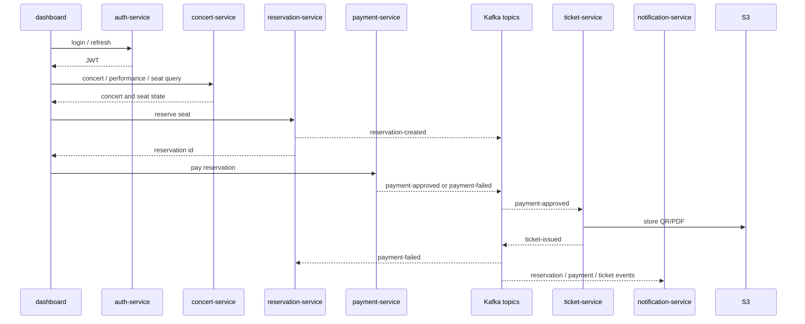

# 02. 서비스 아키텍처

## 서비스 구성

최종 구현은 service HTML의 구성을 기준으로 한다. infra-gitops 문서에는 `user-service`, `performance-service`, `venue-service`, `booking-service`, `seat-service`처럼 더 세분화된 구성이 있지만, 1차 구현에서는 발표 집중도와 구현 속도를 고려해 다음처럼 묶는다.

| 서비스 | 책임 | 저장소 | 주요 API |
| --- | --- | --- | --- |
| `auth-service` | 로그인, JWT 발급, role claim | PostgreSQL | `POST /auth/login`, `POST /auth/refresh`, role claim |
| `concert-service` | 공연, 공연장, 회차, 좌석 배치 조회와 운영 등록/검수 | PostgreSQL | `GET /concerts`, `GET /performances/{id}/seats`, `/provider/concerts`, `/admin/concert-requests` |
| `reservation-service` | 좌석 lock, 예약 생성, 예약 조회/취소, 만료 처리, 판매 상태 통제 | PostgreSQL, Redis 후보 | `POST /reservations`, `POST /reservations/{id}/cancel`, `/provider/sales`, `/admin/sales` |
| `payment-service` | 결제 mock, 승인/실패/지연 시뮬레이션, 결제 이벤트 발행, 정산 기준 조회 | PostgreSQL | `POST /payments`, `GET /payments/{id}`, `/provider/settlements` |
| `ticket-service` | 티켓 발행, QR/PDF 생성, S3 저장, 티켓 조회 | PostgreSQL, S3 | `POST /tickets/issue`, `GET /tickets/{id}`, `GET /tickets/me` |
| `notification-service` | 예약/결제/티켓 이벤트 기반 알림 저장과 발송 mock, 운영 이력 조회 | MongoDB | `GET /notifications`, `GET /notifications/{id}`, `/admin/operation-logs` |
| `dashboard` | 사용자 예매 화면과 운영 데모 화면 | 정적 asset | 정적 HTML/JS |

## 공연 공급자 유스케이스

공연 공급자는 공연을 실제로 공급하는 주최사와 공연장 측을 합친 액터다. 이 유스케이스는 고객 예매 흐름 이전에 운영자가 공연 상품, 회차, 좌석, 판매 조건을 준비하고 판매 이후 현황과 정산 기준 데이터를 확인하는 관점으로 둔다.

- 공연 상품을 등록한다.
- 공연명, 설명, 포스터, 관람 등급, 러닝타임을 입력한다.
- 공연 장소 정보를 입력하거나 선택한다.
- 공연 회차를 등록한다.
- 회차별 공연 일시를 설정한다.
- 좌석 등급과 가격 정보를 입력한다.
- 공연장 좌석맵 또는 구역 정보를 제공한다.
- 판매할 좌석과 판매하지 않을 좌석을 지정한다.
- 초대석, 관계자석, 보류석 요청을 등록한다.
- 선예매 대상 또는 팬클럽 인증 조건을 요청한다.
- 1인당 구매 가능 매수 제한을 요청한다.
- 취소/환불 정책 정보를 제공한다.
- 판매 오픈 요청을 제출한다.
- 판매 현황을 조회한다.
- 회차별 잔여석과 판매량을 확인한다.
- 공연 종료 후 판매 결과와 정산 기준 데이터를 확인한다.

## 플랫폼 운영자 유스케이스

플랫폼 운영자는 예매 서비스 전체 품질과 판매 통제를 책임지는 액터다. 이 유스케이스는 공연 공급자가 제출한 상품과 판매 조건을 검수하고, 오픈 당일의 판매 상태와 트래픽 대응을 통제하는 관점으로 둔다.

- 공연 상품 등록 요청을 검수한다.
- 공연 상품을 승인하거나 반려한다.
- 공연 판매 오픈 시간을 설정하거나 승인한다.
- 판매 시작, 판매 중단, 판매 재개를 처리한다.
- 판매 정책을 검수한다.
- 1인당 구매 제한을 확인한다.
- 선예매, 일반예매, 팬클럽 인증 정책을 설정하거나 승인한다.
- 좌석 등급, 가격, 회차 정보의 오류를 검수한다.
- 보류석, 관계자석, 장애인석 등 특수 좌석 정책을 확인한다.
- 취소표 재오픈 정책을 설정하거나 승인한다.
- 대기열 적용 여부와 진입량을 설정한다.
- 매크로 또는 비정상 트래픽 대응 정책을 적용한다.
- 장애 발생 시 특정 공연의 판매를 일시 중단한다.
- 예매 오픈 당일 주요 지표를 모니터링한다.
- 운영 이력을 조회한다.

## 핵심 예매 흐름

```text
1. Login
   -> auth-service가 JWT 발급

2. Concert
   -> concert-service가 공연, 회차, 좌석 상태 조회

3. Reserve
   -> reservation-service가 좌석 lock과 예약 생성

4. Payment
   -> payment-service가 결제 mock 승인/실패/지연 처리

5. Kafka
   -> payment-approved 또는 payment-failed 이벤트 발행

6. Ticket
   -> ticket-service가 결제 승인 이벤트를 받아 티켓 발행, QR/PDF 생성, S3 저장

7. Notify
   -> notification-service가 예약/결제/티켓 이벤트를 받아 알림 저장
```

예약 API는 좌석 선점과 예약 생성까지만 동기 처리한다. 결제 이후 티켓 발행과 알림 저장은 Kafka 이벤트로 분리한다.

### 서비스 간 의존 관계

사용자 요청 경로의 동기 REST 호출과 Kafka 이벤트 기반 후속 처리를 예매 순서대로 나눈다.



## API 초안

OpenAPI 작성 규약과 서비스별 분리 구조는 아직 확정 전이다. 팀 논의를 위해 [OpenAPI 규약 샘플](./02-service-architecture/openapi/README.md)에 공통 규약, 공통 컴포넌트, `reservation-service` 예시를 둔다.

API는 액터 관점이 섞이지 않도록 사용자, 공연 공급자, 플랫폼 운영자 기준으로 그룹핑한다. 사용자 예매 API는 공개 예매 흐름의 resource path를 사용하고, 공연 공급자 화면은 `/provider/...`, 플랫폼 운영자 화면은 `/admin/...` prefix를 사용한다. 역할 구분은 `auth-service`가 발급한 JWT role claim으로 처리한다.

### auth-service

#### 사용자 API

| Method | Path | 목적 |
| --- | --- | --- |
| `POST` | `/auth/login` | 사용자 로그인과 access token 발급 |
| `POST` | `/auth/refresh` | refresh token 기반 access token 재발급 |

### concert-service

#### 사용자 API

| Method | Path | 목적 |
| --- | --- | --- |
| `GET` | `/concerts` | 공연 목록 조회 |
| `GET` | `/concerts/{id}` | 공연 상세 조회 |
| `GET` | `/concerts/{id}/performances` | 공연별 회차 목록 조회 |
| `GET` | `/performances/{id}/seats` | 회차별 좌석 상태 조회 |

#### 공연 공급자 API

| Method | Path | 목적 |
| --- | --- | --- |
| `POST` | `/provider/concerts` | 공연 상품 초안 등록 |
| `PATCH` | `/provider/concerts/{concertId}` | 공연명, 설명, 포스터, 관람 등급, 러닝타임 수정 |
| `POST` | `/provider/venues` | 공연 장소 정보 등록 |
| `GET` | `/provider/venues` | 등록 가능한 공연 장소 목록 조회 |
| `POST` | `/provider/concerts/{concertId}/showtimes` | 공연 회차 등록 |
| `PATCH` | `/provider/showtimes/{showtimeId}` | 회차별 공연 일시 수정 |
| `POST` | `/provider/showtimes/{showtimeId}/seat-map` | 좌석맵 또는 구역 정보 등록 |
| `PATCH` | `/provider/showtimes/{showtimeId}/seat-inventory` | 판매 좌석과 비판매 좌석 지정 |
| `POST` | `/provider/showtimes/{showtimeId}/seat-grades` | 좌석 등급과 가격 정보 등록 |
| `POST` | `/provider/showtimes/{showtimeId}/hold-seat-requests` | 초대석, 관계자석, 보류석 요청 등록 |
| `PUT` | `/provider/concerts/{concertId}/sale-policy` | 선예매, 팬클럽 인증, 1인당 구매 제한, 취소/환불 정책 요청 |
| `POST` | `/provider/concerts/{concertId}/open-request` | 판매 오픈 요청 제출 |
| `GET` | `/provider/concerts/{concertId}/review-status` | 상품 검수와 판매 오픈 승인 상태 조회 |

#### 플랫폼 운영자 API

| Method | Path | 목적 |
| --- | --- | --- |
| `GET` | `/admin/concert-requests` | 공연 상품 등록 요청 목록 조회 |
| `GET` | `/admin/concert-requests/{requestId}` | 공연 상품 등록 요청 상세 검수 |
| `POST` | `/admin/concert-requests/{requestId}/approve` | 공연 상품 등록 요청 승인 |
| `POST` | `/admin/concert-requests/{requestId}/reject` | 공연 상품 등록 요청 반려 |
| `PUT` | `/admin/concerts/{concertId}/open-schedule` | 공연 판매 오픈 시간 설정 또는 승인 |
| `GET` | `/admin/concerts/{concertId}/sale-policy` | 판매 정책, 구매 제한, 인증 조건, 특수 좌석 정책 검수 |
| `POST` | `/admin/concerts/{concertId}/sale-policy/approve` | 판매 정책 승인 |
| `POST` | `/admin/concerts/{concertId}/sale-policy/reject` | 판매 정책 반려 |
| `POST` | `/admin/concerts/{concertId}/canceled-seat-reopen-policy` | 취소표 재오픈 정책 설정 또는 승인 |

### reservation-service

#### 사용자 API

| Method | Path | 목적 |
| --- | --- | --- |
| `POST` | `/reservations` | 좌석 lock과 예약 생성 |
| `GET` | `/reservations/{id}` | 예약 상태 조회 |
| `GET` | `/reservations/me` | 내 예약 목록 조회 |
| `POST` | `/reservations/{id}/cancel` | 예약 취소와 좌석 해제 |
| `POST` | `/reservations/{id}/expire` | 예약 만료 처리와 좌석 해제 |

#### 공연 공급자 API

| Method | Path | 목적 |
| --- | --- | --- |
| `GET` | `/provider/concerts/{concertId}/sales` | 공연 판매 현황 조회 |
| `GET` | `/provider/showtimes/{showtimeId}/sales` | 회차별 잔여석과 판매량 조회 |

#### 플랫폼 운영자 API

| Method | Path | 목적 |
| --- | --- | --- |
| `POST` | `/admin/concerts/{concertId}/sales/start` | 공연 판매 시작 처리 |
| `POST` | `/admin/concerts/{concertId}/sales/pause` | 공연 판매 중단 처리 |
| `POST` | `/admin/concerts/{concertId}/sales/resume` | 공연 판매 재개 처리 |
| `GET` | `/admin/concerts/{concertId}/sales` | 예매 오픈 당일 주요 판매 지표 조회 |
| `PUT` | `/admin/concerts/{concertId}/queue-policy` | 대기열 적용 여부와 진입량 설정 |
| `PUT` | `/admin/concerts/{concertId}/traffic-policy` | 매크로 또는 비정상 트래픽 대응 정책 적용 |

### payment-service

#### 사용자 API

| Method | Path | 목적 |
| --- | --- | --- |
| `POST` | `/payments` | 결제 mock 승인/실패/지연 처리 |
| `GET` | `/payments/{paymentId}` | 결제 상태 조회 |

#### 공연 공급자 API

| Method | Path | 목적 |
| --- | --- | --- |
| `GET` | `/provider/concerts/{concertId}/settlement-basis` | 공연 종료 후 판매 결과와 정산 기준 데이터 조회 |

#### 플랫폼 운영자 API

| Method | Path | 목적 |
| --- | --- | --- |
| `GET` | `/admin/concerts/{concertId}/settlement-basis` | 플랫폼 기준 판매 결과와 정산 기준 데이터 검토 |

### ticket-service

#### 사용자 API

| Method | Path | 목적 |
| --- | --- | --- |
| `POST` | `/tickets/issue` | 내부 또는 이벤트 기반 티켓 발행 |
| `GET` | `/tickets/{ticketId}` | 티켓 상세 조회 |
| `GET` | `/tickets/me` | 내 티켓 목록 조회 |

### notification-service

#### 사용자 API

| Method | Path | 목적 |
| --- | --- | --- |
| `GET` | `/notifications` | 내 알림 목록 조회 |
| `GET` | `/notifications/{id}` | 알림 상세 조회 |

#### 플랫폼 운영자 API

| Method | Path | 목적 |
| --- | --- | --- |
| `GET` | `/admin/operation-logs` | 판매 상태 변경, 승인/반려, 정책 변경 운영 이력 조회 |
| `GET` | `/admin/operation-logs/{logId}` | 운영 이력 상세 조회 |

## Kafka 이벤트 계약

모든 이벤트는 `eventId`, `eventType`, `occurredAt`, `producer`, `correlationId`, `payload`를 가진다.

| Topic | Producer | Consumer | 목적 |
| --- | --- | --- | --- |
| `reservation-created` | `reservation-service` | `notification-service`, analytics 후보 | 예약 생성 알림과 운영 통계 |
| `reservation-expired` | `reservation-service` | `notification-service` | 결제 제한 시간 만료 알림 |
| `payment-approved` | `payment-service` | `ticket-service`, `notification-service` | 티켓 발행 트리거 |
| `payment-failed` | `payment-service` | `reservation-service`, `notification-service` | 예약 실패 처리와 결제 실패 알림 |
| `ticket-issued` | `ticket-service` | `notification-service` | 티켓 발행 완료 알림 |
| `concert-approved` | `concert-service` | `notification-service`, analytics 후보 | 공연 상품 승인 이력과 공급자 알림 |
| `sale-status-changed` | `reservation-service` | `notification-service`, analytics 후보 | 판매 시작/중단/재개 운영 이력 |
| `sale-policy-updated` | `concert-service` | `reservation-service`, analytics 후보 | 판매 정책, 구매 제한, 인증 조건 변경 전파 |

Consumer는 `eventId` 기반 idempotency를 갖는다. `notification-service`는 `processed_events`에 처리 완료 이벤트를 기록한다.

## 데이터 모델 초안

| 서비스 | 테이블/컬렉션 | 핵심 필드 |
| --- | --- | --- |
| `concert-service` | `concerts`, `venues`, `seats`, `showtimes`, `seat_grades`, `sale_policies`, `hold_seat_requests`, `concert_review_requests` | `concertId`, `venueId`, `seatId`, `showtimeId`, `grade`, `price`, `purchaseLimit`, `reviewStatus`, `openAt` |
| `reservation-service` | `reservations`, `seat_locks`, `sale_controls`, `queue_policies`, `traffic_policies` | `reservationId`, `userId`, `concertId`, `showtimeId`, `seatId`, `status`, `expiresAt`, `saleStatus`, `queueEnabled`, `entryRate` |
| `payment-service` | `payments`, `settlement_basis_snapshots` | `paymentId`, `reservationId`, `amount`, `status`, `approvedAt`, `concertId`, `grossSales`, `refundAmount` |
| `ticket-service` | `tickets` | `ticketId`, `reservationId`, `seatId`, `s3Key`, `qrCode`, `status` |
| `notification-service` | `notifications`, `operation_logs`, `processed_events` | `notificationId`, `userId`, `type`, `message`, `operationType`, `actorId`, `eventId`, `createdAt` |

## 좌석 중복 방지 전략

1차 구현은 DB transaction과 unique constraint를 기본으로 한다.

- `reservation-service`만 좌석 점유 상태를 변경한다.
- `seat_locks` 또는 `reservations`에 `concert_id + showtime_id + seat_id` 기준 active unique constraint를 둔다.
- 동일 좌석 동시 요청 중 하나만 성공하고 나머지는 `409 Conflict`를 반환한다.
- 결제 제한 시간이 지나면 예약을 `expired`로 전환하고 좌석을 다시 열 수 있다.
- 중복 요청 방지를 위해 `Idempotency-Key` 또는 `user_id + concert_id + showtime_id + seat_id` 정책을 검토한다.

심화 후보는 Redis distributed lock, 예약 만료 scheduler, Kafka compacted topic 기반 좌석 상태 projection이다.

## 서비스 구현 원칙

- 서비스 간 즉시 조회는 REST로 처리하고, 후속 처리는 Kafka event로 분리한다.
- 결제 승인 이후 티켓 발행과 알림 저장은 API 응답 경로에서 분리한다.
- 결제 지연/실패가 예약 상태를 모호하게 만들지 않도록 `pending`, `failed`, `paid` 상태를 명확히 둔다.
- 티켓 QR/PDF artifact는 pod local에 저장하지 않고 S3에 저장하며 DB에는 key만 남긴다.
- 모든 요청과 이벤트에는 `correlationId`를 포함한다.
