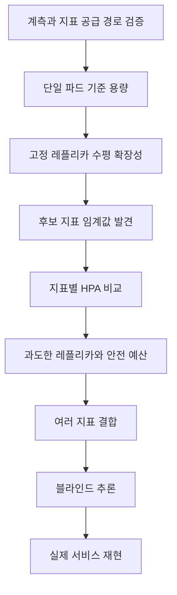

# HPA는 어떤 지표를 기준으로 확장해야 하는가?

## CPU·요청량·동시 처리량·큐 적체 비교를 통한 Kubernetes HPA 지표 선택과 도입 효과 검증

**Selecting Effective Scaling Signals for Kubernetes HPA: An Experimental Study of Resource, Traffic, Concurrency, and Backlog Metrics**

| 항목 | 내용 |
| --- | --- |
| 원고 유형 | 학술 논문 형식의 연구계획 원고 |
| 원고 상태 | 실험 전 설계 단계 |
| 작성일 | 2026-07-20 |
| 저자 | 추후 기입 |
| 소속 | 추후 기입 |
| 교신저자 | 추후 기입 |

> 이 문서는 국문 연구논문의 일반적인 IMRaD 구조에 맞춘 원고 초안이다. 이전 HPA 실험은 서론의 예비 관찰 자료로 분석하며, 새 연구의 결과로 재사용하지 않는다. 제4장 연구 결과는 후속 실험이 완료된 뒤 원시 데이터와 통계 분석을 근거로 작성한다.

---

## 국문초록

Kubernetes Horizontal Pod Autoscaler(HPA)는 관측된 메트릭을 기준으로 워크로드의 레플리카 수를 자동 조정한다. 실무에서는 CPU request 대비 사용률이 기본 지표로 널리 사용되지만, CPU 사용률이 서비스의 실제 처리 포화나 사용자 품질 저하를 항상 대표하지는 않는다. 특히 I/O 대기, 데이터베이스 connection pool, 외부 의존성, 비동기 queue가 처리 한계를 결정하는 서비스에서는 CPU가 낮은 상태에서도 지연시간과 실패율이 증가할 수 있다.

본 연구의 문제의식은 이전 서비스별 HPA spike 실험에서 출발한다. 해당 실험에서는 CPU target 70% 조건에서 6개 서비스 중 5개가 scale-out했으나, 서비스 품질 결과는 서로 달랐다. `reservation-service`는 HPA 동작과 함께 안정적인 품질을 유지했지만, `auth-service`와 `notification-service`는 tail latency 기준을 초과했다. `payment-service`는 처리 한계를 넘어섰으며, `concert-service`는 레플리카가 1개에서 4개로 증가했음에도 SQLAlchemy connection pool 대기와 timeout이 지속됐다. 이 결과는 HPA가 레플리카를 늘렸다는 사실만으로 HPA의 효과를 판단할 수 없으며, 스케일링 지표와 사용자 품질 지표, 공유 자원 안전 지표를 구분해야 함을 보여주는 예비 관찰이다.

본 연구는 CPU, 파드당 요청률, 가중 요청 작업량, 동시 처리 중인 요청 수, worker utilization, queue depth, oldest message age, consumer lag, 활성 연결 수를 후보 지표로 설정한다. 각 지표에 대해 SLO 위반 선행성, 레플리카 증가 후 감소 여부, 사용자 품질 회복 효과, 확장 안정성, 성공 요청당 자원 효율, 데이터베이스와 외부 의존성 안전 예산을 평가한다. 연구는 단일 파드 기준 용량 측정, 고정 레플리카 수평 확장성 검증, 후보 지표 임계값 발견, 지표별 HPA 비교, 과도한 레플리카 실험, 여러 지표 결합 실험, HPA 상태를 숨긴 블라인드 추론, 실제 서비스 재현의 순서로 수행한다.

본 연구의 목적은 CPU를 대체할 하나의 보편적 지표를 제안하는 것이 아니다. 서비스의 처리 특성에 따라 어떤 지표가 HPA 제어 입력으로 적합한지 검증하고, 처음 HPA를 도입하는 개발자와 운영자가 목표값, 최소·최대 레플리카, 안전 상한을 근거 기반으로 결정할 수 있는 재현 가능한 실험 절차를 제시하는 데 목적이 있다.

**주제어:** Kubernetes, Horizontal Pod Autoscaler, HPA, 사용자 정의 메트릭, 부하 테스트, 서비스 수준 목표, 관측성, 수평 확장

---

## 1. 서론

### 1.1 이전 HPA 실험에서 확인된 문제

본 연구는 새로운 이론적 질문에서 시작한 것이 아니라 실제 HPA 실험의 해석 한계에서 시작했다. 이전 프로젝트에서는 Kubernetes 기반 서비스에 CPU 기반 HPA를 적용하고, 서비스별 spike 부하에서 레플리카 증가 시점과 애플리케이션 품질을 관측했다[6]. 원래 운영 목표는 CPU target 70%, `minReplicas=2`, `maxReplicas=10`이었으나, 로컬 검증은 Docker Desktop 자원 제약을 고려해 CPU target 70%, `minReplicas=1`, `maxReplicas=4`, 서비스 CPU request `1000m` 조건에서 수행됐다.

이전 실험의 서비스별 결과는 표 1과 같다.

**표 1. 이전 서비스별 CPU 기반 HPA spike 실험 요약**

| 서비스 | 부하 preset | HPA 결과 | 판단 시간 | Ready 시간 | k6 판정 | 주요 해석 |
| --- | --- | --- | ---: | ---: | --- | --- |
| `auth-service` | `auth-30rps` | `1 -> 2` | `118.354s` | `129.721s` | FAIL | 오류는 없었으나 spike p99 기준 초과 |
| `reservation-service` | `reservation-140rps` | `1 -> 2` | `217.723s` | `229.870s` | PASS | HPA 반응과 품질 안정 동시 확인 |
| `ticket-service` | `ticket-75rps` | scale-out 없음 | - | - | PASS | CPU target에 도달하지 않아 HPA 검증 부하로 부족 |
| `notification-service` | `notification-400rps` | `1 -> 2` | `148.583s` | `160.480s` | FAIL | 오류는 없었으나 spike p99 기준 초과 |
| `payment-service` | `payment-250rps` | `1 -> 3` | `88.011s` | `99.794s` | FAIL | baseline부터 latency 기준 초과, overload에서 실패 급증 |
| `concert-service` | `concert-140rps` | `1 -> 4` | `57.818s` | `71.969s` | FAIL | HPA 반응 성공, DB-bound read와 pool timeout 지속 |

6개 서비스 중 `auth`, `reservation`, `notification`, `payment`, `concert` 5개 서비스에서 CPU 기반 scale-out이 관측됐다. HPA 판단 이후 새 파드가 Ready 상태에 도달하기까지 걸린 시간은 약 11~14초였다. 그러나 scale-out이 발생한 5개 서비스 중 부하 테스트를 통과한 서비스는 `reservation-service`뿐이었다. 이는 HPA 제어기가 CPU target에 반응했다는 사실과 서비스가 사용자 관점의 SLO를 만족했다는 사실이 서로 다른 평가 대상임을 보여준다.

서비스별 결과 차이는 CPU 기반 HPA의 성공 여부를 하나의 값으로 표현하기 어렵다는 점도 드러냈다.

- `auth-service`와 `notification-service`는 요청 오류 없이 처리했지만 p99 기준을 넘었다. 이 경우 HPA는 기능적으로 반응했으나 tail latency를 충분히 보호하지 못했다.
- `ticket-service`는 품질이 안정적이었지만 CPU target에 도달하지 않아 scale-out이 발생하지 않았다. 서비스가 안정적이라는 사실과 HPA 실험이 유효했다는 사실을 분리해야 한다.
- `payment-service`는 HPA가 `1 -> 3`으로 반응했지만 baseline부터 latency SLO를 넘었고 overload와 cooldown에서 실패가 크게 증가했다. HPA 반응을 확인하기에는 충분한 부하였지만 적정 운영 구간을 찾는 실험은 아니었다.
- `concert-service`는 HPA가 최대 레플리카까지 빠르게 증가했지만 DB connection pool 대기와 endpoint 처리 지연이 남았다. 수평 확장 가능한 애플리케이션 용량과 공유 데이터베이스 용량을 분리하지 않으면 HPA가 오히려 DB 연결 압력을 높일 수 있다.

이 결과는 기존 실험이 무의미했다는 뜻이 아니다. 오히려 HPA 연구의 핵심 질문을 더 구체적으로 만들었다. CPU target에 도달해 레플리카가 증가하는지만 확인하는 실험으로는 HPA의 운영 효과를 설명할 수 없다. 어떤 지표가 서비스 포화를 먼저 알렸는지, 해당 지표가 레플리카 증가 후 감소했는지, 그 감소가 p95·p99·실패율 회복으로 이어졌는지를 함께 확인해야 한다.

### 1.2 concert-service 예비 관찰의 심층 분석

`concert-service`의 세 번째 `concert-140rps` 실행은 이 문제를 가장 선명하게 보여준다[7]. 실행 조건은 `minReplicas=1`, `maxReplicas=4`, CPU target 70%, CPU request `1000m`, Uvicorn worker 2개, SQLAlchemy `poolSize=15`, `maxOverflow=0`, pool timeout 15초였다.

HPA와 Kubernetes Job 수준의 실행 결과는 정상적으로 보였다.

- HPA scale-out: `1 -> 2 -> 3 -> 4`
- HPA 판단 시간: `57.818s`
- 추가 파드 Ready 시간: `71.969s`
- 판단 이후 Ready 반영 시간: `14.151s`
- Kubernetes Job 상태: `Succeeded`
- Pod exit code: `0`

그러나 사용자 요청 품질은 실패했다.

**표 2. concert-service 세 번째 실행의 핵심 결과**

| 지표 | 값 |
| --- | ---: |
| 총 요청 수 | `119,838` |
| 평균 요청률 | `84.32 req/s` |
| 요청 실패율 | `34.64%` |
| 평균 응답시간 | `4,176.96ms` |
| p95 응답시간 | `10,507.47ms` |
| p99 응답시간 | `14,885.30ms` |
| 최대 응답시간 | `32,516.96ms` |
| check 통과율 | `45.70%` |
| SQLAlchemy `QueuePool limit` 로그 | `2,360`건 |
| SQLAlchemy `TimeoutError` 로그 | `1,180`건 |
| PostgreSQL `too many clients already` | `0`건 |

첫 번째 limit candidate는 최대 spike가 아니라 baseline 80 RPS 단계에서 이미 나타났다. 이 단계의 p95는 약 10.1초, p99는 약 10.3초, 실패율은 약 42%였다. HPA가 최대 레플리카까지 증가했음에도 사용자가 체감하는 품질은 회복되지 않았다.

이 실행에서는 PostgreSQL 서버의 `too many clients already` 오류가 재발하지 않았다. 이전보다 작은 pool 예산이 DB 서버의 `max_connections` 초과를 막는 데는 효과가 있었다. 그러나 worker별로 독립된 SQLAlchemy pool의 checkout 대기는 대량으로 발생했다. 이론적인 API connection budget은 다음과 같았다.

```text
4 replicas × 2 workers × 15 connections = 120 connections
```

이 값은 PostgreSQL `max_connections=200`보다 작았지만, 요청이 worker별로 균등하게 분배된다는 보장은 없다. 특정 process에서 15개의 pool이 먼저 고갈되면 전체 DB 연결 상한에 도달하기 전에도 checkout timeout이 발생할 수 있다. 따라서 이 실행은 다음 세 층으로 분리해 해석해야 한다.

1. **HPA 반응:** 성공. desired replicas와 Ready replicas가 증가했다.
2. **DB 서버 연결 상한:** 직접 재발하지 않음. `too many clients already`는 관측되지 않았다.
3. **애플리케이션 pool과 endpoint 처리:** 실패. pool checkout timeout과 장시간 요청이 지속됐다.

이 사례는 CPU 기반 HPA가 틀렸다는 단순한 결론을 지지하지 않는다. 정확한 해석은 CPU 기반 HPA가 scale-out을 유발했지만 해당 서비스의 지배적인 병목을 해소하지 못했다는 것이다. 즉, HPA가 보는 지표와 서비스가 실제로 기다리는 자원이 일치하지 않았다.

### 1.3 이전 실험의 해석 한계

이전 결과는 본 연구의 예비 관찰 자료로 유용하지만 확인적 연구 결과로 직접 재사용할 수는 없다. 다음 제한이 있기 때문이다.

첫째, 서비스별 부하 시나리오와 실행 시간이 달랐다. `concert-140rps`는 실제 사용자 여정 140 RPS가 아니라 `recommended`, `detail`, `calendar`, `date_performances`, `seat_map` API를 순차적으로 같은 RPS 계단에 올린 endpoint별 capacity probe였다. 서비스별 판단 시간을 단순 순위로 비교할 수 없다.

둘째, 모든 과거 실행의 DB pool 조건이 동일하지 않았다. `concert-service` 초기 실행은 `poolSize=35`, `maxOverflow=10`이었고, 세 번째 실행은 `15/0`이었다. `payment-service`는 별도의 `20/20` 구성이 확인됐다. 공유 자원 조건이 다른 실행을 동일한 HPA 지표 효과로 비교하면 혼란변수가 생긴다.

셋째, 이전 실험의 목적은 CPU 기반 HPA 반응과 서비스별 spike 결과를 확인하는 것이었다. CPU, RPS, in-flight, queue, consumer lag 같은 후보 지표를 같은 조건에서 비교하도록 설계되지 않았다.

넷째, 로컬 검증은 `min=1`, `max=4`였으므로 원래 운영 목표인 `min=2`, `max=10`을 검증하지 않았다. 로컬 결과를 운영 환경으로 직접 확대 해석할 수 없다.

다섯째, 일부 서비스는 HPA 검증 부하가 충분하지 않았고, 일부 서비스는 안정 구간을 넘어 과도한 부하를 받았다. 후보 지표 비교 전에 단일 파드 운영 용량과 고정 레플리카 확장성을 다시 측정해야 한다.

### 1.4 연구 문제

Kubernetes HPA는 resource metric뿐 아니라 Pods, Object, External metric을 이용할 수 있다[1][2]. 그러나 기술적으로 사용할 수 있는 지표가 곧 운영상 효과적인 지표라는 뜻은 아니다. 다음과 같은 문제가 남아 있다.

- CPU가 낮지만 in-flight 요청과 timeout이 증가하는 I/O-bound 서비스는 무엇을 기준으로 확장해야 하는가?
- 요청당 비용이 다른 API를 단순 RPS로 합쳐도 되는가?
- queue depth, oldest message age, consumer lag 중 어떤 지표가 비동기 처리 SLO를 더 잘 보호하는가?
- p95, p99, error rate처럼 중요한 지표를 HPA의 직접 입력으로 사용해도 되는가?
- DB pool wait와 active connections는 확장 신호인가, 확장 상한을 정하는 안전 지표인가?
- 여러 지표를 동시에 사용했을 때 가장 큰 desired replicas를 선택하는 HPA 동작이 과도한 확장을 만들 수 있는가?
- 레플리카를 계속 늘릴 때 처리량의 한계효용과 성공 요청당 자원 효율은 어떻게 변하는가?

### 1.5 연구 목적

본 연구의 목적은 다음과 같다.

> 새로운 서비스에 HPA를 처음 도입할 때, 서비스 특성에 적합한 스케일링 지표를 선택하고 목표값과 레플리카 범위를 결정할 수 있는 재현 가능한 실험 방법을 제시한다.

본 연구는 CPU를 제거하거나 하나의 대체 지표를 보편적 정답으로 제안하지 않는다. CPU-bound, I/O-bound, DB-bound, 비동기 작업 처리 등 서비스 특성별로 후보 지표를 비교하고, 지표 선택의 판정 기준을 제안한다.

### 1.6 연구 질문

본 연구의 주 연구 질문은 다음과 같다.

> **RQ1. 서비스 특성별로 어떤 관측 지표가 효과적인 HPA 스케일링 신호가 될 수 있는가?**

세부 연구 질문은 다음과 같다.

- **RQ2.** 후보 지표는 SLO 위반보다 얼마나 먼저 임계값에 도달하는가?
- **RQ3.** 후보 지표는 레플리카 증가 후 실제로 감소하는가?
- **RQ4.** 후보 지표 기반 HPA는 CPU 기반 HPA보다 SLO 위반 시간과 실패율을 줄이는가?
- **RQ5.** 지표별 HPA는 ramp, step, spike, sustained 부하에서 어떻게 다르게 반응하는가?
- **RQ6.** 과도한 레플리카 증가는 DB, 외부 의존성, 노드, 비용 효율에 어떤 영향을 미치는가?
- **RQ7.** latency와 error rate 같은 결과 지표는 HPA의 직접 입력으로도 적합한가?
- **RQ8.** 여러 지표를 함께 사용할 때 최대 권고 레플리카 선택 방식은 어떤 과잉 확장 또는 축소 지연을 만드는가?
- **RQ9.** HPA와 레플리카 상태를 숨겨도 나머지 지표로 스케일아웃과 SLO 회복을 추론할 수 있는가?

### 1.7 연구의 기대 기여

본 연구의 기대 기여는 다음과 같다.

1. HPA 지표를 자원, 수요, 애플리케이션 포화, backlog로 구분한다.
2. 후보 지표를 단순 상관관계가 아니라 SLO 선행성, 레플리카 반응성, 품질 회복으로 평가한다.
3. HPA 동작 성공과 애플리케이션 품질 성공을 분리하는 평가 체계를 제시한다.
4. DB, 외부 의존성, 노드 여유를 HPA 직접 입력과 구분되는 안전 지표로 정의한다.
5. 성공 요청당 pod-seconds와 scale efficiency를 이용해 과도한 확장의 비용을 평가한다.
6. 처음 HPA를 도입하는 개발자가 따라 할 수 있는 단계별 검증 절차를 제공한다.
7. HPA 내부를 확인할 수 없는 환경에서 사용할 최소 관측 지표 집합과 추론 한계를 제시한다.

### 1.8 논문의 구성

제2장에서는 HPA 제어 방식과 지표 유형, 관측 지표의 역할을 설명한다. 제3장에서는 연구 가설, 실험 환경, 변수, 실험 절차와 통계 방법을 제시한다. 제4장은 후속 실험 결과를 기록하는 형식으로 구성한다. 제5장에서는 결과의 해석 기준과 실무적 의미를 논의한다. 제6장에서는 타당성 위협과 연구 한계를 다루고, 제7장에서 결론과 후속 연구를 제시한다.

## 2. 이론적 배경과 관련 기술

### 2.1 Kubernetes HPA의 제어 방식

HPA는 관측한 현재 지표와 목표 지표의 비율을 이용해 desired replicas를 계산한다[1]. 기본 관계는 다음과 같다.

```text
desiredReplicas
= ceil(currentReplicas × currentMetricValue / desiredMetricValue)
```

CPU utilization을 사용하는 경우 현재 CPU 사용량은 컨테이너에 설정된 CPU request 대비 비율로 계산된다. 따라서 CPU request를 기록하지 않은 CPU 사용률은 HPA 연구에서 충분한 설명 변수가 아니다.

HPA는 연속적으로 반응하는 제어기가 아니라 주기적으로 메트릭을 조회한다. 공식 문서의 기본 sync period는 15초지만 실제 controller-manager 설정에 따라 달라질 수 있다[1]. 또한 준비되지 않은 파드, 누락된 메트릭, tolerance, stabilization window가 실제 scale-up과 scale-down에 영향을 준다. 본 연구는 지표가 임계값을 넘은 시점, HPA 판단 시점, Pod 생성 시점, readiness 시점, 실제 요청 처리 시점, SLO 회복 시점을 분리해 측정한다.

### 2.2 HPA에서 사용할 수 있는 지표 유형

`autoscaling/v2`는 Resource, Pods, Object, External metric을 지원한다[2]. 사용자 정의 지표는 adapter를 통해 `custom.metrics.k8s.io` 또는 `external.metrics.k8s.io`로 제공할 수 있다[1][3].

| 지표 유형 | 의미 | 본 연구의 후보 |
| --- | --- | --- |
| Resource | 파드 또는 컨테이너의 자원 사용 | CPU, memory |
| Pods | 각 파드에서 수집한 사용자 정의 지표의 평균 | RPS per pod, in-flight, worker utilization |
| Object | Kubernetes 객체와 연관된 지표 | Ingress 요청량 등 |
| External | Kubernetes 객체에 직접 종속되지 않은 외부 지표 | queue depth, consumer lag, message age |

여러 지표를 HPA에 지정하면 각 지표가 제안한 desired replicas 중 가장 큰 값이 선택된다[1]. 따라서 여러 지표를 나열하는 것은 `A AND B` 조건이나 안전 veto를 만들지 않는다. DB headroom이 부족할 때 확장을 막으려면 `maxReplicas` 예산, 파생 지표 또는 HPA 외부 정책이 필요하다.

### 2.3 서비스 관측 지표의 역할 구분

온라인 서비스의 기본 관측 대상은 traffic, latency, error, saturation이다[4][5]. 그러나 관측에 중요한 지표가 모두 HPA 입력에 적합한 것은 아니다. 본 연구는 지표를 네 역할로 구분한다.

| 역할 | 목적 | 대표 지표 |
| --- | --- | --- |
| 스케일링 지표 | HPA desired replicas 계산 | CPU, RPS per pod, in-flight, queue depth, consumer lag |
| 결과 지표 | 사용자 품질 회복 판정 | p95, p99, error rate, timeout, 비즈니스 성공률 |
| 안전 지표 | 확장 상한과 부작용 판정 | DB connections, pool budget, downstream quota, node headroom |
| 원인 분석 지표 | 성공 또는 실패 이유 설명 | CPU throttling, pool wait, query latency, lock wait, cache miss |

### 2.4 효과적인 HPA 지표의 조건

본 연구는 효과적인 HPA 지표가 다음 조건을 만족해야 한다고 정의한다.

1. **선행성:** SLO 위반보다 먼저 위험을 알려야 한다.
2. **레플리카 반응성:** 레플리카 증가 후 파드당 값이 감소해야 한다.
3. **품질 관련성:** 지표 감소가 p95, p99, 실패율 또는 비즈니스 성공률 회복과 연결돼야 한다.
4. **제어 가능성:** 레플리카 증가로 완화할 수 있는 문제를 나타내야 한다.
5. **측정 신뢰성:** 수집 지연과 누락이 제어 가능해야 한다.
6. **해석 가능성:** target을 파드당 안전 용량으로 설명할 수 있어야 한다.
7. **안전성:** DB, 외부 의존성, 노드 예산을 침해하지 않아야 한다.
8. **운영성:** 계측과 adapter 운영 비용이 효과보다 과도하지 않아야 한다.

### 2.5 후보 지표

#### 2.5.1 CPU utilization

CPU-bound 서비스에서는 CPU가 처리 포화와 직접 연결될 수 있다. 그러나 I/O, DB, 외부 API 대기가 길면 CPU가 낮아도 in-flight와 latency가 증가할 수 있다. CPU는 보편적 기준선으로 사용하되 모든 서비스의 정답으로 가정하지 않는다.

#### 2.5.2 파드당 RPS

요청당 처리 비용이 비슷한 stateless API에서는 파드당 RPS가 수요를 직접 설명한다. 요청 비용이 다른 API가 섞이면 원시 RPS만으로는 부하를 설명하기 어렵다.

#### 2.5.3 가중 요청 작업량

요청 유형별 기준 처리 비용을 이용해 다음 값을 계산한다.

```text
weighted_request_rate
= sum(route_rps × route_cost_weight)
```

가중치는 사전 benchmark의 CPU time, service time 또는 안전 처리량을 근거로 정한다.

#### 2.5.4 in-flight requests와 worker utilization

in-flight는 현재 끝나지 않은 요청 수다. I/O-bound 서비스에서 처리 슬롯과 connection 점유를 CPU보다 직접적으로 나타낼 수 있다. worker utilization과 local queue wait를 함께 측정해 요청이 어디에서 기다리는지 확인한다.

#### 2.5.5 queue depth, message age, consumer lag

비동기 처리에서는 CPU보다 처리되지 않은 작업의 수와 지연이 중요한 경우가 많다. queue depth는 적체량, oldest message age는 가장 오래 기다린 작업의 지연 위험, consumer lag는 생산과 소비 위치 차이를 나타낸다. poison message, retry, DLQ, partition 수를 함께 기록한다.

#### 2.5.6 활성 연결과 세션

WebSocket, SSE, streaming 서비스에서는 active connections, event rate, bytes per session이 처리 용량을 설명할 수 있다. 연결 수만으로는 연결별 처리 비용 차이를 설명하지 못하므로 event rate와 메모리, file descriptor를 함께 본다.

### 2.6 직접 HPA 입력으로 주의할 지표

p95와 p99는 사용자 품질 평가에 필수지만 후행 지표일 수 있다. error rate는 DB 장애, 외부 API 실패, 배포 오류, 사용자 입력 오류를 모두 포함할 수 있다. DB pool wait와 active connections는 DB-bound 병목을 설명하지만 파드를 늘릴수록 전체 pool 수가 증가할 수 있다. 따라서 이 지표들은 기본적으로 결과 또는 안전 지표로 사용하고, 직접 HPA 입력은 별도 실험군에서 검증한다.

### 2.7 연구 공백

공식 문서는 HPA가 사용자 정의 지표를 사용하는 방법과 제어 알고리즘을 설명하지만, 특정 서비스에 어떤 지표를 선택해야 하는지에 대한 보편적인 실험 절차를 제공하지는 않는다. 실무에서는 CPU, RPS, queue 지표가 사례별로 사용되지만 다음 질문을 함께 검증하는 기준은 부족하다.

- 지표가 SLO 위반을 얼마나 앞서 알렸는가?
- 레플리카 증가 후 지표가 실제로 감소했는가?
- SLO가 회복됐는가?
- 공유 자원 예산을 위반하지 않았는가?
- 성공 요청당 자원 효율이 개선됐는가?

본 연구는 이 다섯 질문을 하나의 지표 선택 절차로 통합한다.

## 3. 연구 방법

### 3.1 연구 설계

본 연구는 통제 실험과 실제 서비스 재현을 결합한 반복측정 실험으로 설계한다. 먼저 통제 가능한 서비스에서 병목 유형과 부하 모양을 조작한다. 이후 후보 지표별 HPA를 동일한 조건에서 비교하고, 최종 후보를 실제 라이브 커머스 서비스에 적용한다.

연구 단계는 다음과 같다.



### 3.2 연구 대상

통제 실험에서는 다음 네 워크로드 프로필을 사용한다.

| 프로필 | 재현 조건 | 주요 후보 지표 |
| --- | --- | --- |
| CPU-bound HTTP | 일정한 CPU 연산을 포함한 요청 | CPU, weighted RPS |
| I/O-bound HTTP | 제어 가능한 대기 또는 downstream 호출 | in-flight, worker utilization |
| DB-bound HTTP | 고정 데이터셋과 query/pool 제약 | RPS, in-flight, DB 안전 지표 |
| Async worker | 제어 가능한 메시지 유입과 처리 시간 | queue depth, message age, consumer lag |

실제 서비스 검증은 다음 대상을 우선한다.

- `concert-service`: DB 의존 조회 API
- `reservation-service`: DB 쓰기와 동시성 경쟁
- `notification-service`: 비동기 이벤트 적체
- CPU 처리 비용이 큰 인증 또는 연산 API

서비스별 절대 RPS를 서로 비교하지 않고 각 서비스 내부의 Before/After를 비교한다.

### 3.3 연구 가설

**표 3. 연구 가설**

| 가설 | 내용 |
| --- | --- |
| H1 | CPU-bound 서비스에서는 CPU utilization이 SLO 위반을 선행하고 scale-out 후 감소할 것이다. |
| H2 | I/O-bound 서비스에서는 in-flight 또는 worker utilization이 CPU보다 SLO 위반을 먼저 알릴 것이다. |
| H3 | 요청 비용이 일정한 API에서는 파드당 RPS가 안정적인 지표가 될 것이다. |
| H4 | 요청 비용이 다양한 API에서는 weighted request rate가 원시 RPS보다 적합할 것이다. |
| H5 | 비동기 worker에서는 queue depth, message age 또는 consumer lag가 CPU보다 적합할 것이다. |
| H6 | DB-bound 서비스에서는 HPA가 레플리카를 늘려도 DB pool wait가 유지되면 SLO가 회복되지 않을 것이다. |
| H7 | spike 지속 시간이 HPA 판단과 파드 준비 시간보다 짧으면 해당 spike의 품질 회복에 기여하지 못할 것이다. |
| H8 | 일정 레플리카 이후에는 처리량 개선보다 DB 연결과 pod-seconds가 더 크게 증가할 것이다. |
| H9 | p95, p99, error rate는 결과 판정에는 중요하지만 단독 HPA 입력으로는 부적합한 조건이 존재할 것이다. |
| H10 | HPA 상태를 숨겨도 관측 지표의 변화점으로 scale-out과 회복 여부를 일정 정확도로 추론할 수 있을 것이다. |

### 3.4 실험 환경

실험 환경은 다음 구성요소를 포함한다.

- Kubernetes와 `autoscaling/v2` HPA
- Metrics Server 또는 동등한 resource metrics 공급자
- Prometheus와 custom/external metrics adapter
- Grafana
- k6 또는 동등한 부하 생성기
- PostgreSQL
- 메시지 queue 또는 broker
- 실행 단위 `run_id`와 원시 데이터 저장소

각 실행은 다음 환경 정보를 저장한다.

- Kubernetes와 adapter 버전
- HPA min/max/metrics/behavior
- CPU·memory request와 limit
- 애플리케이션 worker 수
- DB pool과 connection budget
- 데이터셋 revision과 row count
- load profile과 request mix
- Prometheus scrape interval과 adapter refresh interval
- readiness와 startup probe
- 실행 시 노드 상태와 간섭 워크로드

### 3.5 독립변수

| 변수 | 실험 수준 |
| --- | --- |
| HPA 상태 | off, on |
| HPA 지표 | CPU, RPS per pod, weighted work, in-flight, worker utilization, queue depth, message age, consumer lag |
| 병목 | CPU, I/O, DB, downstream, queue |
| 부하 모양 | ramp, step, spike, sustained, wave |
| 고정 레플리카 | 1, 2, 4, 8 또는 환경상 가능한 수준 |
| maxReplicas | 안전 범위, 경계 범위, 과도한 범위 |
| request mix | 가벼운 요청 중심, 무거운 요청 중심, 실제 비율 |

### 3.6 종속변수

- p50, p95, p99 latency
- request failure rate와 timeout rate
- 비즈니스 성공률
- 안정 처리량
- 후보 지표 임계값 도달 시간
- HPA desired replicas 증가 시간
- 새 Pod Ready 시간
- 실제 요청 분산 시간
- SLO 회복 시간
- SLO violation area
- 최대 레플리카와 overshoot
- scale-up/down 횟수
- 성공 요청당 pod-seconds와 CPU-seconds
- DB connections, pool wait, query latency
- 메트릭 누락률과 공급 지연
- 블라인드 scale-out 탐지 precision, recall, F1

### 3.7 통제변수

- 애플리케이션 코드와 image digest
- 데이터셋과 DB 통계 상태
- Pod request/limit
- worker 수
- DB pool size, max overflow, timeout
- DB `max_connections`와 예약 예산
- cache 초기 상태
- 부하 생성기 위치와 자원
- readiness와 startup probe
- warmup, baseline, cooldown 길이
- scrape와 adapter 주기
- 노드 수와 간섭 워크로드

### 3.8 실험 절차

#### 3.8.1 계측 검증

Prometheus 수집값과 HPA가 조회하는 값을 비교한다. 메트릭 누락과 adapter 장애가 0으로 오인되지 않도록 하고, 모든 데이터가 같은 `run_id`와 시간축으로 연결되는지 확인한다.

#### 3.8.2 단일 파드 기준 용량

HPA를 끄고 replica 1개로 RPS를 단계적으로 증가시킨다. warmup은 판단에서 제외한다. SLO를 만족한 최대 처리량과 최초 위반 지점에서 CPU, RPS, in-flight, worker, queue, DB 상태를 저장한다.

#### 3.8.3 고정 레플리카 수평 확장성

HPA를 끄고 replica를 `1 -> 2 -> 4 -> 8`로 증가시켜 동일한 부하를 반복한다.

```text
scale_efficiency(N)
= stable_throughput(N) / (stable_throughput(1) × N)
```

수동 scale-out으로 처리량이 증가하지 않는 서비스는 HPA 지표 비교 전에 공유 병목을 해결하거나 실험상 제한 요인으로 기록한다.

#### 3.8.4 후보 지표 임계값

후보 지표가 SLO 위반보다 얼마나 먼저 상승하는지 계산한다.

```text
metric_lead_time
= T_violation - T_signal
```

target 후보는 SLO를 만족한 최대 파드당 값에 예비 실험에서 정한 운영 여유를 적용해 산출한다. 예비 실험 결과를 본 실험의 확인적 결과에 포함하지 않는다.

#### 3.8.5 지표별 HPA 비교

한 실행에는 하나의 주요 스케일링 지표만 사용한다. CPU, RPS per pod, weighted work, in-flight, queue 계열 지표를 동일한 load profile에서 비교한다.

#### 3.8.6 과도한 레플리카

같은 부하에서 `maxReplicas`를 단계적으로 늘린다. 처리량, SLO, DB connections, node headroom, pod-seconds의 한계효용을 측정한다.

```text
successful_request_efficiency
= successful_requests / pod_seconds
```

#### 3.8.7 여러 지표 결합

단일 지표 실험에서 살아남은 후보만 결합한다. 각 지표가 계산한 desired replicas, 최대값 선택으로 인한 overshoot, 지표 누락 시 scale-down 보류를 분석한다.

#### 3.8.8 블라인드 추론

통제 실험의 HPA, Deployment replica, Pod 목록과 event를 숨기고 나머지 지표만으로 scale-out 발생, 준비 시점, SLO 회복, 병목 유형을 추정한다. ground truth와 precision, recall, F1, 시점 절대 오차를 비교한다.

#### 3.8.9 실제 서비스 재현

통제 환경에서 선택된 지표를 실제 라이브 커머스 서비스에 적용한다. 동일 서비스에서 CPU HPA와 후보 지표 HPA를 비교하고, 실제 request mix와 공유 자원에서 효과가 유지되는지 확인한다.

### 3.9 부하 시나리오

| 단계 | 목적 | 판정 기준 |
| --- | --- | --- |
| warmup | 런타임, connection, cache 준비 | 용량 판단 제외 |
| baseline | 정상 상태의 분산 측정 | 비교 기준 |
| ramp | 점진적 부하 증가 | 임계값과 선행 시간 |
| step | 갑작스러운 부하 증가 | 판단과 준비 지연 |
| spike | 짧고 큰 부하 | HPA의 시간상 유효성 |
| sustained | 충분히 긴 고부하 | 최종 품질 회복 |
| overload | 안전 상한 이후 | 실패 모양과 병목 |
| cooldown | 부하 제거 후 회복 | scale-down 판정과 분리 |

cooldown은 recovery 관찰에 사용하고 짧은 cooldown만으로 scale-down 성공을 확정하지 않는다.

### 3.10 시간 지표

| 지표 | 정의 |
| --- | --- |
| `T_signal` | 부하 시작부터 후보 지표 임계값 도달까지 |
| `T_decision` | 부하 시작부터 HPA desired replicas 증가까지 |
| `T_ready` | 부하 시작부터 추가 Ready replica 확보까지 |
| `T_traffic` | 새 파드가 실제 요청을 처리할 때까지 |
| `T_violation` | SLO 위반 시작까지 |
| `T_recovery` | SLO가 회복돼 유지될 때까지 |

```text
scale_ready_delay = T_ready - T_decision
effective_recovery_delay = T_recovery - T_ready
```

`T_ready` 이후에도 SLO가 회복되지 않으면 추가 병목이 남은 것으로 분석한다.

### 3.11 품질과 효율 지표

SLO 위반은 이진값뿐 아니라 위반 크기와 시간을 함께 평가한다.

```text
latency_violation_area
= integral(max(0, observed_p95 - p95_slo)) over time
```

```text
replica_overshoot
= max_observed_replicas - minimum_replicas_that_met_slo
```

```text
pod_second_efficiency
= successful_requests / pod_seconds
```

### 3.12 데이터 수집

각 실행은 다음 구조로 증거를 보존한다.

```text
runs/<run-id>/
  execution.yaml
  environment.json
  dataset.json
  hpa.yaml
  load-profile.json
  metrics/
    application.csv
    kubernetes.csv
    database.csv
    queue.csv
  events/
    hpa-events.json
    pod-events.json
  loadtest/
    summary.json
    raw.json
  analysis/
    derived-metrics.csv
    charts/
  report.md
```

### 3.13 반복과 무작위화

예비 실험에서 조건별 분산과 효과 크기를 확인한 뒤 본 실험 반복 횟수를 산정한다. 실행 순서는 무작위화하며 날짜, 시간, 노드 상태를 block으로 기록한다. 같은 날 같은 지표만 연속 실행하지 않는다.

### 3.14 통계 분석

기술 통계는 중앙값, IQR, p95, p99, bootstrap 95% 신뢰구간을 기본으로 한다. 평균만으로 tail latency를 설명하지 않는다.

주요 결과는 다음 모형을 기준으로 분석한다.

```text
outcome
~ hpa_metric
  + bottleneck_type
  + load_shape
  + hpa_metric:bottleneck_type
  + hpa_metric:load_shape
  + random_effect(run_day_or_block)
```

표본과 분포에 따라 혼합효과모형, 반복측정 분석 또는 비모수 대안을 선택한다. 후보 지표의 SLO 위반 예측력은 precision, recall, F1, PR-AUC와 median lead time으로 평가한다. 후보 비교가 많아질 경우 Holm 보정 등 다중 비교 보정을 적용한다.

상관관계만으로 인과를 주장하지 않는다. HPA on/off, 고정 레플리카, 병목 주입을 직접 조작한 비교를 인과 해석의 근거로 사용한다.

### 3.15 후보 지표 선택 기준

| 기준 | 측정값 |
| --- | --- |
| 선행성 | metric lead time |
| 레플리카 반응성 | scale-out 전후 파드당 지표 변화율 |
| 품질 효과 | SLO violation area 감소율 |
| 안정성 | scale 횟수와 replica overshoot |
| 효율 | successful requests per pod-second |
| 안전성 | DB와 외부 의존성 예산 초과 여부 |
| 신뢰성 | metric missing ratio와 supply lag |
| 설명 가능성 | target의 단일 파드 용량 근거 |
| 운영성 | 계측·adapter 복잡도와 장애 영향 |

하나의 합산 점수로 판단을 감추지 않고, SLO 효과, 안전성, 비용, 운영 복잡도의 Pareto 후보를 제시한다.

### 3.16 보안과 개인정보

user ID, request ID, trace ID, reservation ID, ticket ID, 동적 URL ID, 오류 원문은 metric label에 사용하지 않는다. 실험 로그와 보고서에 비밀번호, 토큰, 쿠키, 개인정보, raw environment 값을 기록하지 않는다. metric label은 route kind, result, error code, service, environment처럼 낮은 cardinality 값으로 제한한다.

## 4. 연구 결과

> 이 장은 새 실험이 완료된 뒤 작성한다. 아래 표는 결과 기록 형식이며 값은 사전에 채우지 않는다. 이전 HPA 결과는 서론의 예비 관찰 자료이고 본 연구 결과에 합산하지 않는다.

### 4.1 계측 신뢰성

**표 4. 후보 지표 수집 신뢰성**

| 지표 | scrape interval | adapter lag | missing ratio | HPA 조회 일치율 | 판정 |
| --- | ---: | ---: | ---: | ---: | --- |
| CPU | 미실험 | 미실험 | 미실험 | 미실험 | 미실험 |
| RPS per pod | 미실험 | 미실험 | 미실험 | 미실험 | 미실험 |
| in-flight | 미실험 | 미실험 | 미실험 | 미실험 | 미실험 |
| queue depth | 미실험 | 미실험 | 미실험 | 미실험 | 미실험 |
| consumer lag | 미실험 | 미실험 | 미실험 | 미실험 | 미실험 |

### 4.2 단일 파드 용량과 고정 레플리카 확장성

**표 5. 워크로드별 단일 파드 SLO 용량**

| 워크로드 | 안정 RPS | 최초 SLO 위반 RPS | CPU | in-flight | DB/queue 상태 |
| --- | ---: | ---: | ---: | ---: | --- |
| CPU-bound | 미실험 | 미실험 | 미실험 | 미실험 | 미실험 |
| I/O-bound | 미실험 | 미실험 | 미실험 | 미실험 | 미실험 |
| DB-bound | 미실험 | 미실험 | 미실험 | 미실험 | 미실험 |
| Async worker | 미실험 | 미실험 | 미실험 | 미실험 | 미실험 |

**표 6. 고정 레플리카별 수평 확장 효율**

| 워크로드 | replicas | throughput | p95 | error | scale efficiency | 제한 요인 |
| --- | ---: | ---: | ---: | ---: | ---: | --- |
| 미실험 | 1 | - | - | - | `1.0` 기준 | - |
| 미실험 | 2 | - | - | - | - | - |
| 미실험 | 4 | - | - | - | - | - |
| 미실험 | 8 | - | - | - | - | - |

### 4.3 후보 지표의 선행성과 레플리카 반응성

**표 7. 후보 지표별 lead time과 scale-out 후 변화**

| 워크로드 | 지표 | median lead time | scale-out 후 변화율 | SLO 관련성 | 후보 유지 여부 |
| --- | --- | ---: | ---: | ---: | --- |
| 미실험 | CPU | - | - | - | 미판정 |
| 미실험 | RPS per pod | - | - | - | 미판정 |
| 미실험 | weighted work | - | - | - | 미판정 |
| 미실험 | in-flight | - | - | - | 미판정 |
| 미실험 | queue depth | - | - | - | 미판정 |
| 미실험 | message age | - | - | - | 미판정 |
| 미실험 | consumer lag | - | - | - | 미판정 |

### 4.4 지표별 HPA 효과

**표 8. 지표별 HPA 품질 및 효율 비교**

| 워크로드 | HPA 지표 | `T_decision` | `T_ready` | violation area | error | pod-second efficiency | 판정 |
| --- | --- | ---: | ---: | ---: | ---: | ---: | --- |
| 미실험 | HPA off | - | - | - | - | - | 미판정 |
| 미실험 | CPU | - | - | - | - | - | 미판정 |
| 미실험 | RPS per pod | - | - | - | - | - | 미판정 |
| 미실험 | in-flight | - | - | - | - | - | 미판정 |
| 미실험 | backlog 계열 | - | - | - | - | - | 미판정 |

### 4.5 부하 모양별 결과

**표 9. Ramp, step, spike, sustained 비교**

| 지표 | load shape | scale-out 여부 | SLO 회복 | overshoot | 해석 |
| --- | --- | --- | --- | ---: | --- |
| 미실험 | ramp | - | - | - | 미판정 |
| 미실험 | step | - | - | - | 미판정 |
| 미실험 | spike | - | - | - | 미판정 |
| 미실험 | sustained | - | - | - | 미판정 |
| 미실험 | wave | - | - | - | 미판정 |

### 4.6 과도한 레플리카와 공유 자원

**표 10. maxReplicas 증가에 따른 한계효용과 안전 예산**

| maxReplicas | throughput gain | p95 개선 | DB connections | node headroom | requests/pod-second | 안전 판정 |
| ---: | ---: | ---: | ---: | ---: | ---: | --- |
| 미실험 | - | - | - | - | - | 미판정 |

### 4.7 여러 지표 결합

**표 11. 다중 지표별 desired replicas와 최종 선택**

| 시각 | CPU 권고 | 수요 지표 권고 | backlog 권고 | 최종 desired | 누락 지표 | 결과 |
| --- | ---: | ---: | ---: | ---: | --- | --- |
| 미실험 | - | - | - | - | - | 미판정 |

### 4.8 블라인드 추론

**표 12. HPA 상태 비공개 분석 정확도**

| 지표 집합 | precision | recall | F1 | 시점 MAE | 회복 분류 정확도 |
| --- | ---: | ---: | ---: | ---: | ---: |
| 미실험 | - | - | - | - | - |

### 4.9 실제 서비스 재현

**표 13. 실제 서비스별 지표 선택 결과**

| 서비스 | CPU 기준 결과 | 후보 지표 결과 | 안전 상한 | 최종 지표 | 예외와 한계 |
| --- | --- | --- | --- | --- | --- |
| `concert-service` | 미실험 | 미실험 | 미실험 | 미판정 | 미실험 |
| `reservation-service` | 미실험 | 미실험 | 미실험 | 미판정 | 미실험 |
| `notification-service` | 미실험 | 미실험 | 미실험 | 미판정 | 미실험 |

## 5. 논의

> 이 장의 최종 주장은 제4장 결과가 확보된 뒤 작성한다. 현재는 결과 해석 규칙과 논의해야 할 질문만 정의한다.

### 5.1 HPA 반응과 HPA 효과의 구분

HPA의 desired와 Ready replicas가 증가했다면 제어기는 반응한 것이다. 그러나 HPA 효과를 주장하려면 최소한 다음을 추가로 만족해야 한다.

- SLO violation area가 기준선보다 감소한다.
- `T_ready` 이후 `T_recovery`가 관측된다.
- 실패율과 timeout이 악화되지 않는다.
- 공유 자원 안전 예산을 넘지 않는다.
- 성공 요청당 자원 효율이 수용 가능한 수준이다.

### 5.2 서비스 유형별 지표 선택

CPU-bound 서비스에서 CPU가 가장 적합하게 나타나더라도 이를 모든 서비스로 일반화하지 않는다. I/O-bound 서비스는 in-flight와 worker utilization, 비동기 서비스는 queue와 lag, 지속 연결 서비스는 active connections와 event rate가 더 적합할 수 있다. DB-bound 서비스에서는 수요 지표와 DB 안전 상한을 분리해야 한다.

### 5.3 결과 지표를 HPA 입력으로 사용할 때의 위험

latency와 error는 사용자 영향에 가깝지만 후행 지표일 수 있다. 외부 의존성 장애 중 error 기반 scale-out이 실패 요청과 의존성 부하를 늘리는지 확인해야 한다. 결과 지표 기반 HPA가 유효한 조건이 발견되더라도 메트릭 창, low traffic, 오류 분류, false positive를 함께 보고한다.

### 5.4 짧은 spike와 최소 레플리카

spike 지속 시간이 `T_decision + scale_ready_delay`보다 짧다면 해당 spike를 HPA가 직접 완화하기 어렵다. 이 경우 target을 공격적으로 낮추는 것만이 답은 아니다. minReplicas, 시작 시간, readiness, 선행 외부 지표, 요청 제한을 함께 검토한다.

### 5.5 과도한 확장과 DB 예산

DB-bound 서비스는 다음 예산을 우선 계산한다.

```text
api_connection_budget
= maxReplicas × workersPerPod × (poolSize + maxOverflow)
```

애플리케이션 외 연결과 운영 여유를 제외한 뒤 `maxReplicas`를 정한다. pool wait가 높다는 이유만으로 pool 또는 replica를 동시에 늘리지 않는다.

### 5.6 처음 도입하는 사람을 위한 의미

본 연구가 제공할 이정표는 다음과 같다.

1. HPA를 끄고 단일 파드 SLO 용량을 측정한다.
2. 고정 레플리카를 늘려 서비스가 실제로 수평 확장되는지 확인한다.
3. 병목과 직접 관련된 후보 지표를 두 개 이상 비교한다.
4. target을 단일 파드의 안전한 파드당 값으로 정한다.
5. ramp, step, spike, sustained 부하를 구분한다.
6. HPA 판단, 파드 준비, SLO 회복 시간을 따로 측정한다.
7. DB와 외부 의존성 예산으로 `maxReplicas`를 제한한다.
8. 레플리카가 늘어난 사실이 아니라 사용자 품질 회복을 성공으로 판정한다.

### 5.7 블랙박스 환경에서의 활용

HPA 내부 상태를 볼 수 없는 환경에서는 정확한 레플리카 수를 단정하지 않는다. 통제 실험에서 검증된 시간 순서와 변화점을 이용해 scale-out 가능성, 준비 시점, SLO 회복 여부, 주요 병목을 추정한다. 인스턴스 식별 정보가 전혀 없으면 결과는 원인 확정이 아니라 추론으로 표현한다.

## 6. 연구의 타당성과 한계

### 6.1 내부 타당성

cache warmup, JIT, DB 통계, 부하 생성기 자원, 노드 간섭, adapter cache, readiness 설정이 결과에 영향을 줄 수 있다. 실행 순서 무작위화, 동일 warmup, 환경 snapshot, 간섭 워크로드 기록으로 완화한다.

### 6.2 구성 타당성

CPU utilization과 절대 CPU 사용량, 전체 RPS와 파드당 RPS, desired replica와 Ready replica, 평균 latency와 tail latency를 혼동하지 않는다. Kubernetes Job 성공도 성능 실험 성공으로 간주하지 않는다.

### 6.3 외적 타당성

단일 노드나 로컬 Kubernetes 결과를 다중 노드 운영 환경으로 직접 일반화하지 않는다. 한 프레임워크의 worker 모델과 한 API의 RPS를 다른 서비스에 그대로 적용하지 않는다. 절대 target보다 지표 선택 절차와 상대 효과를 주요 기여로 둔다.

### 6.4 통계적 결론 타당성

예비 실험으로 반복 횟수를 정하고 제외 기준을 사전에 등록한다. 실패 실행을 사후 제거하지 않는다. 다중 비교와 비정상 분포를 고려하며, 통계적 유의성과 운영상 의미 있는 효과 크기를 구분한다.

### 6.5 연구 범위의 한계

본 연구는 모든 autoscaler, Cluster Autoscaler, VPA와 HPA의 동시 최적화, 예측형 autoscaling, 강화학습 제어기, 전체 클라우드 비용 최적화를 다루지 않는다. 이 항목은 후속 연구로 분리한다.

## 7. 결론

이전 HPA 실험은 CPU 기반 HPA가 여러 서비스에서 실제 scale-out을 일으킨다는 사실을 확인했다. 동시에 레플리카 증가가 사용자 품질 회복을 보장하지 않는다는 사실도 드러냈다. `reservation-service`는 안정적인 결과를 보였지만, 다른 서비스는 tail latency, 처리 한계, DB pool checkout timeout 등 서로 다른 제한을 나타냈다. 특히 `concert-service`는 `1 -> 4` scale-out 이후에도 실패율과 p95가 높은 상태로 남아 HPA 반응과 서비스 성공을 분리해야 한다는 문제를 제기했다.

본 연구는 이 문제를 “CPU 대신 무엇을 사용할 것인가”라는 단순 대체 질문으로 다루지 않는다. 서비스 특성에 따라 어떤 지표가 SLO 위반을 선행하고, 레플리카 증가 후 감소하며, 실제 사용자 품질을 회복시키는지를 실험한다. 또한 DB, 외부 의존성, 노드 자원은 확장 신호와 구분되는 안전 예산으로 평가한다.

본 연구가 최종적으로 제시하려는 것은 하나의 보편적 target이 아니다. 다음 세 가지를 제시하는 것이 목표다.

1. 반복 가능한 HPA 지표 검증 방법
2. 서비스 유형별 지표 선택과 안전 상한 이정표
3. HPA가 성공하거나 실패한 이유를 설명할 수 있는 증거 체계

현재 원고는 연구 설계 단계이므로 새 실험의 효과를 주장하지 않는다. 제4장 결과와 제5장 최종 논의는 사전 등록된 실험과 원시 데이터 분석이 완료된 뒤 작성한다.

## 참고문헌

[1] Kubernetes Authors, “Horizontal Pod Autoscaling,” *Kubernetes Documentation*. [Online]. Available: <https://kubernetes.io/docs/concepts/workloads/autoscaling/horizontal-pod-autoscale/>. Accessed: Jul. 20, 2026.

[2] Kubernetes Authors, “HorizontalPodAutoscaler autoscaling/v2 API,” *Kubernetes API Reference*. [Online]. Available: <https://kubernetes.io/docs/reference/kubernetes-api/autoscaling/horizontal-pod-autoscaler-v2/>. Accessed: Jul. 20, 2026.

[3] Kubernetes Authors, “Building a Custom Metrics Exporter for Kubernetes,” *Kubernetes Blog*, Jul. 14, 2026. [Online]. Available: <https://kubernetes.io/blog/2026/07/14/custom-metrics-exporter-kubernetes/>. Accessed: Jul. 20, 2026.

[4] Prometheus Authors, “Instrumentation,” *Prometheus Documentation*. [Online]. Available: <https://prometheus.io/docs/practices/instrumentation/>. Accessed: Jul. 20, 2026.

[5] R. Ewaschuk, “Monitoring Distributed Systems,” in *Site Reliability Engineering: How Google Runs Production Systems*, B. Beyer, C. Jones, J. Petoff, and N. R. Murphy, Eds. O’Reilly Media, 2016. [Online]. Available: <https://sre.google/sre-book/monitoring-distributed-systems/>. Accessed: Jul. 20, 2026.

[6] Medikong Project, “Service HPA Spike 최종 실험 결과 보고서,” Internal Technical Report, Jun. 22, 2026. Evidence path: `workspace/docs/evidence/loadtest/hpa-spike-test/reports/service-hpa-spike-final-report-2026-06-22.md`.

[7] Medikong Project, “Service HPA Spike concert 140RPS - third run,” Internal Technical Report, Jun. 22, 2026. Evidence path: `workspace/docs/evidence/loadtest/hpa-spike-test/reports/service-hpa-spike-concert-140rps-third-20260622/README.md`.

## 부록 A. 실행별 필수 기록 항목

- run_id
- code commit 또는 image digest
- Kubernetes와 adapter 버전
- HPA min/max/metric/target/behavior
- CPU·memory request와 limit
- worker 수
- DB pool size, max overflow, timeout
- DB max connections와 애플리케이션 예산
- dataset revision과 row count
- load profile과 request mix
- warmup, baseline, spike, overload, cooldown 시간
- Prometheus scrape interval과 adapter refresh interval
- SLO
- HPA 판단과 Ready 시간
- k6 summary와 오류 분류
- 원시 증거 경로

## 부록 B. 결과 판정 체크리스트

- [ ] 단일 파드 운영 용량이 측정됐다.
- [ ] 고정 레플리카 확장성이 검증됐다.
- [ ] CPU 외 후보 지표가 같은 조건에서 비교됐다.
- [ ] 후보 지표가 SLO 위반을 선행했는지 계산됐다.
- [ ] 레플리카 증가 후 후보 지표가 감소했는지 확인됐다.
- [ ] Ready 이후 SLO 회복 여부가 판정됐다.
- [ ] DB와 외부 의존성 안전 예산이 확인됐다.
- [ ] 성공 요청당 자원 효율이 계산됐다.
- [ ] 메트릭 누락과 adapter 장애가 기록됐다.
- [ ] 실패 실행도 결과에 포함됐다.
- [ ] 블랙박스 추론은 ground truth와 비교됐다.
- [ ] 결과의 환경과 일반화 한계가 명시됐다.

---

## Abstract

Kubernetes Horizontal Pod Autoscaler (HPA) adjusts the number of workload replicas according to observed metrics. CPU utilization relative to resource requests is widely used as a default scaling signal; however, it does not always represent the actual saturation point of a service. I/O waits, database connection pools, downstream dependencies, and asynchronous queues can degrade latency and reliability while CPU utilization remains low.

This study is motivated by a previous service-level HPA spike experiment in which five out of six services scaled out under a 70% CPU target. Among the five services that scaled out, only one satisfied the complete load-test criteria. In the most pronounced case, the concert service scaled from one to four replicas, yet database pool checkout timeouts, a 34.64% request failure rate, and a p95 latency of approximately 10.5 seconds remained. This preliminary observation indicates that successful HPA actuation and successful service recovery must be evaluated separately.

The proposed study compares CPU utilization, requests per pod, weighted request work rate, in-flight requests, worker utilization, queue depth, oldest message age, consumer lag, and active connections. Candidate metrics are evaluated by their lead time before SLO violations, reduction after replica growth, effect on service recovery, scaling stability, successful requests per pod-second, metric reliability, and compliance with database and downstream safety budgets. The experimental procedure consists of single-pod capacity measurement, fixed-replica scalability testing, metric threshold discovery, metric-specific HPA comparison, over-scaling tests, multi-metric evaluation, blind inference with hidden HPA state, and validation on real services.

The purpose of this study is not to identify a universal replacement for CPU-based autoscaling. Instead, it aims to provide a reproducible method that allows first-time HPA adopters to select workload-specific scaling signals and justify metric targets, minimum and maximum replica counts, and safety limits using experimental evidence.

**Keywords:** Kubernetes, Horizontal Pod Autoscaler, custom metrics, load testing, service level objective, observability, horizontal scaling
