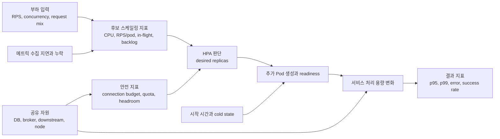
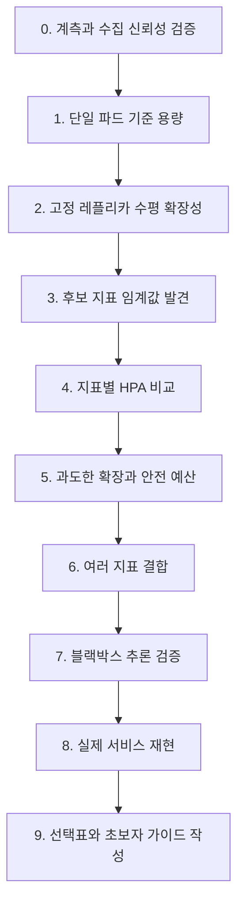

# HPA 지표 선택과 도입 효과 검증 연구 기획 설계

## 문서 정보

| 항목 | 내용 |
| --- | --- |
| 문서 상태 | 연구 기획 초안 |
| 작성일 | 2026-07-20 |
| 연구 분야 | Kubernetes, HPA, 서비스 성능, 관측성, 부하 실험 |
| 연구 대상 | HPA를 처음 도입하거나 기존 HPA를 근거 기반으로 재검증하려는 서비스 |
| 핵심 산출물 | 연구 보고서, 재현 가능한 실험 절차, HPA 지표 선택표, 초보자용 도입 이정표 |

## 연구 기획 요약

이 연구는 CPU 대신 사용할 하나의 만능 메트릭을 찾는 연구가 아니다. 서비스가 실제로 소비하는 처리 용량을 가장 잘 나타내는 지표를 찾고, 그 지표가 HPA 제어 입력으로 적합한지를 실험으로 판정하는 연구다.

핵심 판정 기준은 다음 세 가지다.

1. 후보 지표가 p95, p99, 실패율 같은 SLO 위반보다 먼저 위험을 알리는가?
2. 레플리카를 늘렸을 때 후보 지표가 실제로 감소하는가?
3. 후보 지표의 감소가 사용자 품질 회복으로 이어지고 DB, 외부 의존성, 노드 예산을 침해하지 않는가?

연구는 단일 파드 기준 용량, 고정 레플리카 확장성, 후보 지표 임계값, 지표별 HPA, 과도한 레플리카, 여러 지표 결합, 블랙박스 추론, 실제 서비스 재현 순으로 진행한다. 최종 결과는 특정 target 숫자가 아니라 어떤 서비스든 자기 상황에 맞는 지표와 HPA 범위를 찾을 수 있는 실험 절차다.

## 1. 문서 목적

이 문서는 새로운 서비스에 Horizontal Pod Autoscaler(HPA)를 처음 도입할 때 무엇을 측정하고, 어떤 지표를 스케일링 신호로 선택하며, 레플리카 증가가 실제 서비스 품질을 개선했는지를 검증하기 위한 연구 계획을 정의한다.

연구의 목적은 특정 서비스에 적용할 단일 HPA YAML이나 `CPU 70%` 같은 관행적 기본값을 제시하는 것이 아니다. 서비스의 처리 특성에 맞는 HPA 지표를 찾는 방법, 적정 목표값과 레플리카 상한을 정하는 방법, 과도한 확장이 새로운 병목을 만드는 조건을 재현 가능한 실험으로 설명하는 것이 목적이다.

이 연구는 다음 독자를 대상으로 한다.

- 서비스를 만들고 HPA를 처음 도입하려는 개발자와 운영자
- CPU 기반 HPA를 사용하고 있지만 그 설정 근거를 설명하기 어려운 팀
- HPA가 레플리카를 늘렸는데도 지연시간과 실패율이 개선되지 않은 경험이 있는 팀
- RPS, 동시 요청, 큐 적체, consumer lag 같은 사용자 정의 지표를 검토하는 팀
- 결과를 논문, 기술 보고서, 포트폴리오 또는 내부 운영 기준으로 남기려는 연구자

## 2. 논의의 발전과 최종 연구 방향

연구 아이디어는 다음 세 단계를 거쳐 구체화됐다.

### 2.1 최초 아이디어: 보이지 않는 HPA를 외부 지표로 추론한다

첫 아이디어는 HPA 설정과 레플리카 수를 직접 확인할 수 없는 환경에서 요청량, 자원, 지연시간, 오류, 포화 지표를 이용해 스케일아웃 발생과 원인을 추론하는 것이었다.

이 질문은 여전히 연구 가치가 있다. 다만 실제 HPA 상태를 전혀 확인할 수 없다면 관측된 변화가 HPA 때문인지, 수동 확장이나 캐시 효과, 외부 의존성 변화 때문인지 확정하기 어렵다. 따라서 블랙박스 추론은 연구 전체의 중심이 아니라, 정답을 알고 있는 통제 실험 이후 HPA 데이터를 숨기고 추정 정확도를 검증하는 단계로 배치한다.

### 2.2 두 번째 구체화: 최초 도입자를 위한 실험 이정표를 만든다

연구가 제공해야 할 가치는 특정 환경의 HPA 분석에 한정되지 않는다. 서비스를 새로 만들고 HPA를 처음 도입하는 사람도 다음 질문을 던지고 검증할 수 있어야 한다.

- 우리 서비스는 레플리카를 늘리면 실제 처리량이 증가하는가?
- HPA가 반응하기 전에 이미 SLO를 위반하고 있지 않은가?
- 짧은 부하 급증에 HPA가 실질적으로 기여하는가?
- 레플리카를 계속 늘리면 DB 연결, 노드 자원, 외부 API 한도에 어떤 문제가 생기는가?
- `minReplicas`, `maxReplicas`, target을 어떤 근거로 정해야 하는가?
- HPA가 동작한 것과 서비스가 정상화된 것을 어떻게 구분하는가?

따라서 연구는 결과뿐 아니라 처음 도입하는 사람이 그대로 반복할 수 있는 검증 순서를 제공해야 한다.

### 2.3 최종 핵심 질문: 어떤 지표가 HPA 도입에 효과적인가

최종 핵심은 단순 CPU 기반 메트릭의 한계를 지적하는 데 있지 않다.

> 서비스 특성에 따라 어떤 지표를 HPA의 스케일링 신호로 사용해야 효과적인가?

이를 연구 가능한 문장으로 확장하면 다음과 같다.

> CPU, 요청량, 동시 처리량, 큐 적체, 처리 지연, 세션 수 등 후보 지표 중 어떤 지표가 SLO 위반을 미리 알리고, 레플리카 증가 후 실제로 감소하며, 서비스 품질을 회복시키는지 검증하여 HPA 지표 선택 기준을 제시한다.

## 3. 단 하나의 연구 목표

> 새로운 서비스에 HPA를 처음 도입할 때, 서비스 특성에 적합한 스케일링 지표를 선택하고 목표값과 레플리카 범위를 결정할 수 있는 재현 가능한 실험 방법을 제시한다.

이 목표 아래에서 CPU-bound, I/O-bound, DB-bound, 비동기 작업 처리 같은 서비스 특성을 비교한다. 여러 실험은 각각 별개의 목표가 아니라 하나의 지표 선택 방법을 검증하기 위한 단계다.

## 4. 연구 제목

### 4.1 제안 제목

**HPA는 어떤 지표를 기준으로 확장해야 하는가?**

### 4.2 부제

**CPU·요청량·동시 처리량·큐 적체 비교를 통한 Kubernetes HPA 지표 선택과 도입 효과 검증**

### 4.3 영문 제목 후보

**Selecting Effective Scaling Signals for Kubernetes HPA: An Experimental Study of Resource, Traffic, Concurrency, and Backlog Metrics**

## 5. 연구가 전달할 핵심 메시지

이 연구가 최종적으로 전달해야 하는 메시지는 다음과 같다.

> HPA는 파드를 늘려주는 기능이지 서비스의 확장성을 만들어주는 기능은 아니다. 먼저 서비스가 수평 확장 가능한지 확인하고, SLO 위반을 선행하며 레플리카 증가로 완화되는 지표를 찾아 HPA에 연결해야 한다.

좋은 HPA 지표는 단순히 부하와 함께 증가하는 지표가 아니다.

> 좋은 HPA 지표는 SLO 위반보다 먼저 위험을 알리고, 레플리카를 늘렸을 때 실제로 감소하며, 그 감소가 사용자 품질 회복으로 이어지는 지표다.

## 6. 연구 질문

### 6.1 주 연구 질문

**RQ1. 서비스 특성별로 어떤 관측 지표가 CPU 사용률보다 효과적인 HPA 스케일링 신호가 될 수 있는가?**

### 6.2 세부 연구 질문

- **RQ2.** 후보 지표는 SLO 위반보다 얼마나 먼저 임계값에 도달하는가?
- **RQ3.** 후보 지표는 레플리카 증가 후 실제로 감소하는가?
- **RQ4.** 후보 지표 기반 HPA는 CPU 기반 HPA보다 SLO 위반 시간과 실패율을 줄이는가?
- **RQ5.** 지표별 HPA는 점진 부하, 갑작스러운 spike, 지속 부하에서 어떻게 다르게 반응하는가?
- **RQ6.** 레플리카를 과도하게 늘렸을 때 DB, 외부 의존성, 노드, 비용 효율에 어떤 부작용이 발생하는가?
- **RQ7.** latency와 error rate처럼 중요한 서비스 지표가 반드시 HPA의 직접 입력으로도 적합한가?
- **RQ8.** 여러 지표를 함께 사용할 때 Kubernetes HPA의 최대 권고치 선택 방식은 어떤 과잉 확장 또는 축소 지연을 만드는가?
- **RQ9.** HPA와 레플리카 상태를 숨겨도 나머지 관측 지표만으로 스케일아웃 시점과 SLO 회복 여부를 추론할 수 있는가?

## 7. 연구 가설

가설은 실험 전에 문서로 고정하고, 결과에 맞춰 사후 변경하지 않는다.

### H1. CPU-bound 서비스

CPU-bound 서비스에서는 CPU request 대비 사용률이 SLO 위반을 선행하고, 레플리카 증가 후 파드당 CPU와 지연시간이 함께 감소할 것이다.

### H2. I/O-bound 온라인 서비스

I/O-bound 서비스에서는 CPU 사용률보다 파드당 in-flight requests 또는 worker utilization이 SLO 위반을 더 일찍 알리고, 해당 지표 기반 HPA가 SLO 위반 면적을 더 작게 만들 것이다.

### H3. 요청 비용이 비교적 일정한 stateless API

요청당 처리 비용이 비교적 일정한 API에서는 파드당 RPS가 CPU보다 수요 변화를 직접 반영하며, 더 예측 가능한 레플리카 수를 제안할 것이다.

### H4. 요청 비용이 다양한 API

가벼운 조회와 무거운 조회가 섞인 서비스에서는 원시 RPS가 실제 처리 부담을 충분히 설명하지 못하며, 요청 유형별 가중치를 적용한 request work rate 또는 in-flight 지표가 더 적합할 것이다.

### H5. 비동기 작업 처리

메시지 소비자와 비동기 worker에서는 CPU보다 queue depth, oldest message age 또는 consumer lag가 처리 지연을 더 직접적으로 설명할 것이다.

### H6. DB-bound 서비스

DB-bound 서비스에서는 RPS 또는 CPU 기반 HPA가 레플리카와 전체 DB 연결 수만 증가시키고, DB pool wait와 query latency가 유지되면 p95와 실패율을 회복시키지 못할 것이다.

### H7. 짧은 spike

부하 지속 시간이 HPA 판단 시간과 파드 준비 시간의 합보다 짧으면, HPA는 레플리카를 늘리더라도 해당 spike의 SLO 회복에 실질적으로 기여하지 못할 것이다.

### H8. 과도한 확장

레플리카가 특정 지점을 넘어가면 처리량과 SLO 개선은 정체되지만 DB 연결, pod-seconds, 노드 자원 사용량은 계속 증가하여 성공 요청당 자원 효율이 낮아질 것이다.

### H9. 결과 지표와 제어 지표의 차이

p95, p99, error rate는 HPA의 효과를 평가하는 데 필수지만, 후행 지표이거나 외부 의존성 실패를 포함하므로 단독 스케일링 신호로는 부적합한 경우가 있을 것이다.

### H10. 블랙박스 추론

통제 실험에서 확인된 시간적 특징을 이용하면 HPA 상태를 숨긴 분석에서도 스케일아웃 사건과 서비스 회복 여부를 일정 정확도로 추정할 수 있을 것이다. 단, 인스턴스 식별 정보가 전혀 없다면 정확한 레플리카 수까지 추정하는 것은 제한적일 것이다.

## 8. HPA 동작에 대한 연구 전제

### 8.1 기본 계산

HPA의 기본적인 레플리카 계산은 다음 관계로 설명된다.

```text
desiredReplicas
= ceil(currentReplicas × currentMetricValue / desiredMetricValue)
```

이 식이 연구 설계에 주는 의미는 다음과 같다.

- target은 관행이 아니라 용량 실험에서 얻은 안전한 파드당 값이어야 한다.
- 지표는 레플리카 증가 후 파드당 값이 감소하는 성질을 가져야 한다.
- CPU utilization은 절대 CPU 사용량이 아니라 CPU request 대비 사용률이므로 request 값을 함께 기록해야 한다.
- 현재 값과 목표값의 비율이 같아도 min/max, scaling policy, readiness, 메트릭 누락에 따라 실제 반응은 달라질 수 있다.

### 8.2 제어 주기와 지연

HPA는 연속적인 즉시 제어가 아니라 주기적으로 메트릭을 확인하는 제어기다. 공식 문서의 기본 sync period는 15초지만, 실제 클러스터의 controller-manager 설정이 다를 수 있으므로 실험 환경의 값을 기록한다.

관측해야 할 시간은 최소한 다음과 같다.

```text
부하 시작
  -> 후보 지표 임계값 도달
  -> HPA desired replicas 증가
  -> Deployment replica 변경
  -> 새 Pod 생성
  -> readiness 통과
  -> 트래픽 분산
  -> SLO 회복 또는 미회복
```

### 8.3 누락 지표와 준비되지 않은 파드

HPA는 누락된 메트릭과 아직 준비되지 않은 파드를 보수적으로 취급할 수 있다. 따라서 다음을 함께 저장한다.

- 메트릭 수집 성공률과 누락 구간
- Pod 생성 시각
- readiness 전환 시각
- 첫 요청 처리 시각
- HPA conditions와 events
- `FailedGetResourceMetric`, `FailedComputeMetricsReplicas` 같은 오류

### 8.4 여러 지표의 결합 의미

`autoscaling/v2`에서 여러 지표를 지정하면 HPA는 각 지표가 제안한 desired replicas 중 가장 큰 값을 선택한다. 이는 기본적으로 OR에 가까운 동작이다.

따라서 다음 조건은 두 개의 HPA 지표를 단순히 나열하는 것만으로 구현되지 않는다.

```text
RPS가 높고 AND DB에 여유가 있을 때만 확장한다.
```

DB headroom을 두 번째 HPA 지표로 넣는다고 해서 확장을 막는 veto가 되지 않는다. DB 예산은 다음 중 하나로 반영해야 한다.

- DB 연결 예산을 기준으로 `maxReplicas`를 제한한다.
- 확장 가능 여부를 반영한 파생 지표를 만든다.
- 애플리케이션 동시성 제한과 backpressure를 함께 둔다.
- HPA 밖의 별도 정책 제어기를 사용한다.

## 9. 지표의 네 가지 역할

관측할 가치가 있는 지표와 HPA에 직접 넣기 좋은 지표는 다르다. 모든 지표를 하나의 후보 목록으로 섞지 않고 역할을 구분한다.

| 역할 | 목적 | 대표 지표 |
| --- | --- | --- |
| 스케일링 신호 | desired replicas 계산 | CPU utilization, RPS per pod, in-flight, queue depth, consumer lag |
| 결과 지표 | 사용자 품질 회복 판정 | p95, p99, error rate, timeout, 비즈니스 성공률 |
| 안전 지표 | 과도한 확장 방지 | DB connections, pool budget, downstream quota, node headroom |
| 원인 분석 지표 | 성공 또는 실패 이유 설명 | CPU throttling, pool wait, query latency, lock wait, cache miss |

이 역할 구분은 연구의 중요한 기여다. p99가 중요하다고 해서 p99를 곧바로 HPA 입력으로 사용해야 하는 것은 아니다. DB connection이 중요하다고 해서 connection 수 증가를 scale-out 신호로 사용하는 것도 위험할 수 있다.

## 10. 좋은 HPA 지표의 선택 기준

후보 지표는 다음 기준으로 평가한다.

### 10.1 선행성

지표가 SLO 위반보다 먼저 위험을 알려야 한다.

```text
lead_time
= SLO 위반 시점 - 후보 지표 임계값 도달 시점
```

`lead_time > 0`이면 대응 여유가 있고, `lead_time <= 0`이면 지표가 너무 늦거나 동시에 반응한 것이다.

### 10.2 레플리카 반응성

레플리카를 늘렸을 때 파드당 지표가 감소해야 한다. 감소하지 않는다면 HPA가 제어할 수 없는 병목일 가능성이 있다.

### 10.3 SLO 관련성

지표의 변화가 p95, p99, error rate, 비즈니스 성공률 변화와 어떤 관계가 있는지 확인한다. 단순 상관관계만으로 인과성을 주장하지 않고, 고정 레플리카와 HPA 활성화 실험을 비교한다.

### 10.4 단조성과 해석 가능성

부하가 증가할수록 값이 대체로 증가하고, 레플리카가 증가할수록 파드당 값이 대체로 감소해야 목표값을 설명하기 쉽다.

### 10.5 측정 신뢰성

- 수집 지연이 짧은가?
- 누락률이 낮은가?
- 재시작 후에도 의미가 유지되는가?
- 집계식과 label이 안정적인가?
- 메트릭 어댑터 장애 시 HPA가 어떤 상태가 되는가?

### 10.6 요청 비용 민감성

같은 1 RPS라도 요청 처리 비용이 크게 다를 수 있다. 후보 지표가 요청 구성 차이를 설명할 수 있는지 확인한다.

### 10.7 제어 가능성

레플리카 증가가 해당 지표를 실제로 완화할 수 있어야 한다. 외부 API quota, 단일 DB lock, partition 수 같은 공유 상한은 파드 증가로 해결되지 않을 수 있다.

### 10.8 운영 비용

지표 계산과 노출, adapter 운영, 시계열 cardinality가 감당 가능한 수준이어야 한다. 좋은 연구 결과라도 운영 복잡도가 효과보다 크다면 일반적인 도입 지표로 권장하기 어렵다.

## 11. 후보 지표 목록과 연구상의 위치

### 11.1 CPU request 대비 사용률

| 항목 | 내용 |
| --- | --- |
| 적합 후보 | CPU-bound, 요청당 연산량이 비교적 일정한 서비스 |
| 장점 | Kubernetes 기본 resource metric, 구현과 설명이 단순함 |
| 한계 | I/O 대기, DB 대기, 외부 API 대기 중에는 낮게 나타날 수 있음 |
| 필수 맥락 | CPU request, CPU limit, throttling, worker 수 |

CPU target은 반드시 CPU request와 함께 해석한다. 같은 `500m` 사용도 request가 `500m`이면 100%, `1000m`이면 50%다.

### 11.2 메모리

| 항목 | 내용 |
| --- | --- |
| 적합 후보 | 작업량과 활성 메모리가 비례하고, 파드 분산 후 working set이 감소하는 서비스 |
| 장점 | 메모리 압박형 서비스의 직접 신호가 될 수 있음 |
| 한계 | 캐시, GC, allocator 특성 때문에 scale-out 후에도 감소하지 않을 수 있음 |
| 필수 맥락 | working set, RSS, cache, limit, OOMKilled, GC 상태 |

메모리는 사용량이 높은 이유가 요청 처리량 때문인지, 캐시 또는 누수 때문인지 먼저 구분해야 한다.

### 11.3 파드당 RPS

| 항목 | 내용 |
| --- | --- |
| 적합 후보 | 요청당 처리 비용이 비슷한 stateless API |
| 장점 | 수요를 직접 반영하고 파드당 안전 용량을 설명하기 쉬움 |
| 한계 | 무거운 요청과 가벼운 요청이 섞이면 실제 부하를 왜곡함 |
| 필수 맥락 | route kind, method, 응답 결과, 요청 구성 비율 |

원시 전체 RPS를 사용할지 파드당 `AverageValue`를 사용할지 구분한다. 전체 RPS는 레플리카 증가 후 줄어들지 않지만 파드당 RPS는 정상적인 분산이 이뤄지면 감소한다.

### 11.4 가중 요청 작업량

요청 비용이 다른 API를 단순 RPS 하나로 합치지 않고 기준 처리 비용을 사용해 가중치를 적용한다.

```text
weighted_request_rate
= sum(route_rps × route_cost_weight)
```

가중치는 사전 benchmark에서 얻은 CPU time, service time 또는 안전 처리량을 바탕으로 정한다. 결과를 보고 임의로 조정하지 않는다.

### 11.5 in-flight requests

| 항목 | 내용 |
| --- | --- |
| 적합 후보 | I/O-bound API, 동시 요청 수가 worker나 connection 점유와 연결된 서비스 |
| 장점 | CPU가 낮아도 처리 슬롯이 점유된 상태를 포착함 |
| 한계 | timeout과 느린 외부 의존성 때문에 값이 증가할 수 있음 |
| 필수 맥락 | request duration, timeout, worker 수, downstream latency |

in-flight가 증가했지만 레플리카 증가 후 감소하지 않는다면 외부 의존성 또는 공유 DB가 원인일 수 있다.

### 11.6 worker 또는 thread pool utilization

| 항목 | 내용 |
| --- | --- |
| 적합 후보 | 처리 worker/thread 수가 명확한 애플리케이션 |
| 장점 | 애플리케이션 내부 처리 용량과 가까운 신호 |
| 한계 | 런타임별 계측 구현이 필요하고 정의가 달라질 수 있음 |
| 필수 맥락 | busy workers, total workers, local queue, queue wait |

### 11.7 queue depth

| 항목 | 내용 |
| --- | --- |
| 적합 후보 | 비동기 worker, 배치 처리, 이벤트 소비자 |
| 장점 | 처리되지 못한 작업 수를 직접 보여줌 |
| 한계 | 전체 큐 길이와 파드당 목표값의 관계를 명확히 해야 함 |
| 필수 맥락 | arrival rate, processing rate, retry, dead letter, partition 수 |

### 11.8 oldest message age

| 항목 | 내용 |
| --- | --- |
| 적합 후보 | 처리 완료 시간 SLO가 중요한 비동기 작업 |
| 장점 | 사용자 또는 비즈니스 지연 위험과 직접 연결됨 |
| 한계 | 오래된 독립 오류 메시지 하나가 과도한 확장을 유발할 수 있음 |
| 필수 맥락 | retry 정책, poison message, DLQ 분리, backlog 크기 |

### 11.9 consumer lag

| 항목 | 내용 |
| --- | --- |
| 적합 후보 | Kafka 등 순서가 있는 로그 기반 메시징 |
| 장점 | 생산 속도와 소비 속도의 차이를 설명하기 쉬움 |
| 한계 | partition 수가 실제 최대 병렬성을 제한함 |
| 필수 맥락 | partition 수, consumer 수, rebalance 시간, 처리율 |

### 11.10 처리율 차이

```text
processing_deficit
= incoming_rate - completed_rate
```

순간 queue depth보다 유입과 완료 속도의 차이가 더 빠른 선행 지표가 될 수 있는지 비교한다.

### 11.11 활성 연결과 세션 수

| 항목 | 내용 |
| --- | --- |
| 적합 후보 | WebSocket, SSE, streaming, 세션 점유형 서비스 |
| 장점 | 지속 연결이 소비하는 용량을 직접 반영함 |
| 한계 | 연결마다 이벤트 빈도와 처리 비용이 다를 수 있음 |
| 필수 맥락 | connections per pod, event rate, bytes, session duration |

### 11.12 비즈니스 backlog

예약 대기 건수, 티켓 발행 대기 건수, 알림 생성 대기 건수처럼 사용자가 이해할 수 있는 도메인 backlog를 후보로 포함할 수 있다.

비즈니스 backlog는 설명력이 좋지만, raw 사용자 ID, 예약 ID, 티켓 ID를 metric label에 넣지 않는다.

## 12. 직접 HPA 입력으로 주의할 지표

### 12.1 p95와 p99

p95와 p99는 사용자 품질 판정에는 필수지만 이미 큐와 대기가 누적된 뒤 악화되는 후행 지표일 수 있다. histogram 집계 구간과 트래픽 양에 따라 값이 흔들릴 수 있고, HPA가 확장한 직후에도 이전 구간의 느린 요청이 남아 있을 수 있다.

따라서 기본 연구에서는 결과 지표로 사용하고, latency 기반 HPA는 별도 비교군으로 다룬다.

### 12.2 error rate

오류율은 DB 장애, 외부 API 실패, 잘못된 배포, 사용자 입력 오류 등 여러 원인을 포함한다. 레플리카 증가로 해결되지 않는 오류를 scale-out 신호로 사용하면 실패 요청을 더 빠르게 생성하거나 의존성에 더 큰 압력을 줄 수 있다.

### 12.3 DB pool utilization과 pool wait

DB pool wait는 DB-bound 병목을 설명하는 핵심 지표지만, 이를 단순 scale-out 신호로 쓰면 파드마다 새 pool이 생겨 DB 연결 압력을 높일 수 있다. 기본적으로 안전 지표와 원인 분석 지표로 사용한다.

### 12.4 DB active connections

DB 연결 수는 확장 상한을 정하는 지표이지 일반적인 확장 신호가 아니다.

```text
max_connection_budget
>= maxReplicas × workersPerPod × (poolSize + maxOverflow)
```

실제 DB는 애플리케이션 외 연결, 관리자 연결, migration, 모니터링 연결을 사용하므로 전체 `max_connections`를 애플리케이션 예산으로 모두 쓰지 않는다.

### 12.5 downstream latency와 quota

외부 서비스가 느리거나 rate limit에 걸린 상태에서는 로컬 파드를 늘리는 것이 회복에 도움이 되지 않을 수 있다. 결과 분석과 확장 안전성 판단에는 필요하지만 직접 HPA 입력으로 사용하기 전에 제어 가능성을 검증한다.

## 13. 연구 개념 모형



위 모형에서 후보 지표와 결과 지표 사이의 상관관계만 보는 것으로는 부족하다. HPA 활성화 여부, 레플리카 수, 병목 조건을 직접 조작해 인과관계를 확인한다.

## 14. 전체 실험 전략

연구는 탐색 실험, 통제 실험, 비교 실험, 블라인드 검증, 실제 서비스 검증의 순서로 진행한다.



## 15. 연구 환경

### 15.1 통제 실험 환경

통제 실험은 다음 구성요소를 사용한다.

- Kubernetes
- `autoscaling/v2` HPA
- Metrics Server 또는 동등한 resource metrics 제공자
- Prometheus
- custom/external metrics adapter
- Grafana
- 부하 생성기(k6 등)
- PostgreSQL
- 메시지 브로커 또는 재현 가능한 queue
- 시간 동기화된 실행 메타데이터와 결과 저장소

### 15.2 대상 워크로드

첫 연구는 프레임워크, 언어, 서비스 수가 결과를 가리지 않도록 통제 가능한 대상 서비스를 우선한다.

| 프로필 | 재현 방법 | 검증할 주요 지표 |
| --- | --- | --- |
| CPU-bound HTTP | 일정한 CPU 연산을 포함한 요청 | CPU, weighted RPS |
| I/O-bound HTTP | 제어 가능한 대기 또는 downstream 호출 | in-flight, worker utilization |
| DB-bound HTTP | 고정 데이터셋과 query/pool 제약 | RPS, in-flight, pool wait, DB guardrail |
| Async worker | 제어 가능한 메시지 유입과 처리 시간 | queue depth, message age, consumer lag |

통제 실험 이후 실제 라이브 커머스 서비스에서 외적 타당성을 확인한다.

- `concert-service`: 조회와 DB 의존성이 있는 온라인 서비스
- `reservation-service`: DB 쓰기와 동시성 경쟁이 있는 서비스
- `notification-service`: 이벤트 적체와 소비 지연이 있는 비동기 서비스
- CPU 비용이 큰 인증 또는 별도 연산 API: CPU-bound 비교 대상

실제 서비스 비교에서는 서비스마다 API와 데이터셋이 다르므로 절대 RPS 순위를 만들지 않는다. 각 서비스 내부의 Before/After와 지표 선택 결과를 비교한다.

## 16. 실험 변수

### 16.1 독립변수

| 변수 | 수준 |
| --- | --- |
| HPA 상태 | off, on |
| HPA 지표 | CPU, RPS per pod, weighted work rate, in-flight, queue depth, message age, consumer lag |
| 병목 유형 | CPU, I/O, DB, downstream, queue |
| 부하 모양 | ramp, step, spike, sustained, wave |
| 고정 레플리카 | 1, 2, 4, 8 또는 환경상 가능한 수준 |
| maxReplicas | 안전 범위, 경계 범위, 과도한 범위 |
| request mix | 가벼운 요청 중심, 무거운 요청 중심, 실제 비율 |

모든 변수를 한 번에 완전 요인 설계로 조합하면 실행 수가 과도하게 증가한다. 먼저 단계별로 후보를 제거한 뒤, 최종 후보에 대해서만 확인 실험을 진행한다.

### 16.2 종속변수

- p50, p95, p99 latency
- request failure rate
- timeout rate
- 비즈니스 성공률
- 안정 처리량
- HPA 판단 시간
- 추가 Pod ready 시간
- SLO 회복 시간
- SLO violation area
- 최대 레플리카 수와 overshoot
- scale-up과 scale-down 횟수
- 성공 요청당 pod-seconds
- 성공 요청당 CPU-seconds
- DB connections와 pool wait
- 메트릭 누락률
- 블라인드 스케일아웃 탐지 정확도

### 16.3 통제변수

- 애플리케이션 이미지와 코드 버전
- Kubernetes 버전
- HPA controller 설정과 behavior
- 노드 수와 노드 자원
- Pod CPU/memory request와 limit
- 애플리케이션 worker 수
- DB 데이터셋과 통계 상태
- DB pool size, max overflow, timeout
- DB `max_connections`와 애플리케이션 연결 예산
- cache 초기 상태
- load generator 위치와 자원
- 부하 시나리오와 request mix
- metric scrape interval, adapter refresh interval
- readiness와 startup probe
- 실행 전 warmup과 실행 후 cooldown
- 실험 중 다른 워크로드의 존재 여부

## 17. 실험 단계 상세

### 17.1 0단계: 계측과 메트릭 공급 경로 검증

목적은 지표 비교 전에 측정 시스템 자체가 결과를 왜곡하지 않는지 확인하는 것이다.

검증 항목:

- 애플리케이션 지표가 Prometheus에 예상 주기로 수집된다.
- Prometheus 기록 규칙과 adapter가 같은 의미의 값을 제공한다.
- HPA가 참조하는 metric name과 selector가 실제 시계열에 존재한다.
- metric adapter 중단 또는 시계열 누락 시 HPA condition을 기록한다.
- label cardinality가 통제된다.
- 부하 생성기, Prometheus, Kubernetes event의 시간이 동기화된다.
- 1~5초 또는 선택한 분석 해상도로 사건의 선후관계를 구분할 수 있다.

완료 기준:

- 알려진 고정 입력에 대해 수집값과 HPA 조회값의 오차를 설명할 수 있다.
- 메트릭 누락과 adapter 장애가 정상적인 0으로 기록되지 않는다.
- 한 실행의 모든 데이터가 같은 `run_id`로 연결된다.

### 17.2 1단계: 단일 파드 기준 용량

조건:

- HPA 비활성화
- replica `1`
- CPU limit 제거 또는 충분히 높게 설정
- 고정 데이터셋
- 단계적 RPS 증가
- warmup 구간은 용량 판단에서 제외

목표:

- 단일 파드의 최소 실행 비용과 요청 처리 가능한 운영 구간을 구분한다.
- p95, p99, error rate가 SLO를 처음 위반하는 지점을 찾는다.
- 해당 지점 이전의 CPU, RPS, in-flight, worker, queue, DB 상태를 저장한다.

단일 파드가 실행만 가능한 수준과 안정적으로 요청을 처리할 수 있는 수준을 혼동하지 않는다.

### 17.3 2단계: 고정 레플리카 수평 확장성

조건:

- HPA 비활성화
- replica `1 -> 2 -> 4 -> 8`
- 같은 데이터셋과 부하 시나리오 반복

주요 계산:

```text
scale_efficiency(N)
= throughput(N) / (throughput(1) × N)
```

해석 예시:

- `1.0`에 가까움: 거의 선형 확장
- 값이 감소함: 공유 자원 또는 조정 비용 존재
- 처리량이 거의 늘지 않음: HPA 이전에 병목 해결 필요

수동 scale-out이 되지 않는 서비스는 HPA로도 확장성이 생기지 않는다. 이 단계는 HPA 비교 전에 반드시 수행한다.

### 17.4 3단계: 후보 지표 임계값 발견

각 후보 지표에 대해 다음을 구한다.

- SLO 위반 이전의 안전 상한
- SLO 위반을 알리는 선행 시간
- RPS 단계별 분산과 이상치
- request mix 변화에 대한 민감도
- 레플리카 수 변화에 대한 파드당 값의 감소 정도

target 후보는 다음처럼 정한다.

```text
target_candidate
= SLO를 만족한 최대 파드당 값 × 운영 여유 계수
```

운영 여유 계수는 예비 실험에서 정하고 본 실험 전에 고정한다. CPU 70% 같은 숫자를 다른 서비스에서 그대로 가져오지 않는다.

### 17.5 4단계: 지표별 HPA 비교

각 실행에는 한 종류의 주요 지표만 사용해 원인을 분리한다.

비교군 예시:

- HPA off, fixed replica
- CPU utilization HPA
- RPS per pod HPA
- weighted request work HPA
- in-flight HPA
- queue depth HPA
- message age 또는 consumer lag HPA

동일한 load profile을 사용해 다음을 비교한다.

- 지표가 처음 임계값을 넘은 시각
- desired replicas 증가 시각
- ready replicas 증가 시각
- SLO 위반 시작과 종료 시각
- 실패율과 timeout
- 최종 처리량
- 사용한 pod-seconds
- 과도한 replica overshoot

### 17.6 5단계: 과도한 레플리카와 안전 예산

같은 부하에서 `maxReplicas`를 점진적으로 늘린다.

관찰할 부작용:

- DB connection pool 총량 증가
- DB `max_connections` 접근 또는 고갈
- 새 파드의 connection storm
- cold cache와 cache miss 증가
- 노드 CPU와 메모리 경합
- scheduling 지연
- readiness 지연
- service mesh sidecar 비용 증가
- 처리량 정체와 비용 증가
- 반복적인 scale-up과 scale-down

이 단계에서는 최대 성능보다 추가 레플리카의 한계효용을 본다.

```text
marginal_throughput_gain(N)
= throughput(N) - throughput(N-1)
```

```text
successful_request_efficiency
= successful_requests / pod_seconds
```

레플리카 증가로 p95가 조금 개선됐더라도 성공 요청당 pod-seconds가 크게 악화되면 운영 효율이 낮아진 것이다.

### 17.7 6단계: 여러 지표 결합

단일 지표 비교에서 살아남은 후보만 결합한다.

검증 항목:

- 각 지표가 제안한 desired replicas
- 최대 권고치 선택으로 인한 overshoot
- 한 지표 누락 시 scale-down 보류
- CPU는 낮지만 RPS가 높은 경우
- RPS는 낮지만 in-flight가 높은 경우
- 수요 지표는 높지만 DB headroom이 없는 경우

DB budget과 downstream quota는 다중 HPA 지표가 아니라 안전 상한 또는 별도 제어 조건으로 다룬다.

### 17.8 7단계: 블랙박스 추론 검증

통제 실험에서 실제 HPA와 레플리카 상태를 ground truth로 저장한다. 분석 단계에서는 다음 데이터를 숨긴다.

- HPA current/desired replicas
- Deployment replicas
- Pod 목록
- HPA events

나머지 지표만 사용해 다음을 추정한다.

- 스케일아웃 사건 발생 여부
- 추정 발생 시각
- 처리 용량 준비 시각
- SLO 회복 여부
- CPU, DB, queue, downstream 중 주요 병목 후보

평가값:

- precision, recall, F1
- 실제 시각과 추정 시각의 절대 오차
- SLO 회복 분류 정확도
- 지표군 제거에 따른 성능 감소

이 단계는 HPA 내부를 볼 수 없는 환경에서 얻을 수 있는 관측 인사이트를 검증한다. ground truth가 전혀 없는 대상 환경에서는 인과를 확정하지 않고 추론 결과로 표시한다.

### 17.9 8단계: 실제 서비스 검증

통제 환경에서 선정된 지표를 실제 라이브 커머스 서비스에 적용한다.

서비스별 절대 처리량은 직접 비교하지 않는다. 다음을 확인한다.

- 동일 서비스에서 CPU 기반 HPA와 선정 지표 기반 HPA의 차이
- 실제 request mix에서 지표 선행성이 유지되는가
- 실제 DB와 외부 의존성에서도 레플리카 증가 후 지표가 감소하는가
- 서비스별로 다른 지표가 선택되는가
- 통제 환경에서 발견하지 못한 새로운 병목이 있는가

## 18. 부하 시나리오

### 18.1 공통 단계 의미

| 단계 | 목적 | 결과 해석 |
| --- | --- | --- |
| warmup | 런타임, connection, cache 준비 | 용량 판정 제외 |
| baseline | 정상 상태 분산 측정 | 비교 기준 |
| ramp | 점진적 부하 증가 | 임계값과 선행 시간 탐색 |
| step | 갑작스러운 한 단계 증가 | HPA 판단과 준비 지연 측정 |
| spike | 짧고 큰 부하 | HPA가 제때 기여하는지 확인 |
| sustained | 충분히 긴 고부하 | 정상화와 안정 처리량 확인 |
| overload | 상한 이후 실패 모양 확인 | 안전 한계와 병목 확인 |
| cooldown | 부하 제거 후 회복 관찰 | scale-down 성공 판정과 분리 |

cooldown은 회복을 관찰하는 단계다. 짧은 cooldown만으로 scale-down 안정성을 확정하지 않는다.

### 18.2 부하 모양

#### Ramp

낮은 RPS에서 시작해 일정 간격으로 증가한다. 단일 파드 용량, 후보 지표 임계값, SLO 선행 시간을 찾는 데 사용한다.

#### Step

정상 부하에서 목표 부하로 즉시 증가한다. HPA 판단과 파드 준비 지연을 분리하기 좋다.

#### Spike

짧은 시간 동안 큰 부하를 발생시킨다. spike 지속 시간과 `T_decision + T_ready`를 비교한다.

#### Sustained

새 파드가 준비되고 메트릭이 안정될 수 있도록 충분히 긴 부하를 유지한다. HPA의 최종 효과를 확인한다.

#### Wave

부하 증가와 감소를 반복한다. oscillation, stabilization, 불필요한 scale-up/down을 확인한다.

## 19. 시간 지표 정의

| 지표 | 정의 |
| --- | --- |
| `T_signal` | 부하 시작부터 후보 지표 임계값 도달까지 |
| `T_decision` | 부하 시작부터 HPA desired replicas 증가까지 |
| `T_created` | 부하 시작부터 새 Pod 생성까지 |
| `T_ready` | 부하 시작부터 추가 ready replicas 확보까지 |
| `T_traffic` | 부하 시작부터 새 Pod가 실제 요청을 처리할 때까지 |
| `T_violation` | 부하 시작부터 SLO 위반까지 |
| `T_recovery` | 부하 시작부터 SLO가 회복돼 유지될 때까지 |

연구에서 특히 중요한 값은 다음이다.

```text
metric_lead_time
= T_violation - T_signal
```

```text
scale_ready_delay
= T_ready - T_decision
```

```text
effective_recovery_delay
= T_recovery - T_ready
```

`T_ready` 이후에도 SLO가 회복되지 않으면 단순 확장 지연이 아니라 다른 병목이 남아 있을 가능성이 있다.

## 20. 품질과 효율 지표 정의

### 20.1 SLO violation area

SLO 위반 여부만 0과 1로 보지 않고 위반 크기와 시간을 함께 계산한다.

```text
latency_violation_area
= integral(max(0, observed_p95 - p95_slo)) over time
```

오류율도 같은 방식으로 계산할 수 있다.

### 20.2 수평 확장 효율

```text
scale_efficiency(N)
= stable_throughput(N) / (stable_throughput(1) × N)
```

### 20.3 성공 요청 효율

```text
pod_second_efficiency
= successful_requests / pod_seconds
```

```text
cpu_second_efficiency
= successful_requests / container_cpu_seconds
```

### 20.4 확장 overshoot

```text
replica_overshoot
= max_observed_replicas - minimum_replicas_that_met_slo
```

### 20.5 진동성

단위 시간 내 scale-up/down 횟수와 replica 변동 폭을 함께 본다. 단순 변경 횟수만으로 판단하지 않고 실제 SLO와 비용 영향도 확인한다.

## 21. 통계 분석 계획

### 21.1 예비 실험과 본 실험 분리

먼저 조건별 예비 실험을 수행해 분산, 이상치, 수집 지연을 확인한다. 예비 실험 데이터는 target과 본 실험 반복 횟수를 정하는 데 사용하고, 확인적 결론의 주 분석에는 섞지 않는다.

본 실험 시작 전에 다음을 고정한다.

- 가설
- 제외 기준
- SLO
- 후보 지표와 target
- 반복 횟수
- 주요 결과값
- 통계 방법

### 21.2 반복과 실행 순서

- 예비 실험은 조건별 최소 반복으로 분산을 파악한다.
- 본 실험 반복 횟수는 예비 실험 효과 크기와 분산으로 산정한다.
- 실행 순서는 무작위화한다.
- 실행 날짜, 시간, 노드 상태를 block으로 기록한다.
- 같은 날 같은 순서로 특정 지표만 반복하지 않는다.

### 21.3 기술 통계

기본 보고값:

- 중앙값
- IQR
- p95와 p99
- bootstrap 95% 신뢰구간
- 최소/최대와 이상치 사유

평균 하나만으로 tail latency와 변동성을 설명하지 않는다.

### 21.4 효과 분석

주요 결과에 대해 다음 요인과 상호작용을 분석한다.

```text
outcome
~ hpa_metric
  + bottleneck_type
  + load_shape
  + hpa_metric:bottleneck_type
  + hpa_metric:load_shape
  + random_effect(run_day_or_block)
```

환경과 표본 수에 따라 혼합효과모형, 반복측정 분석 또는 비모수 대안을 선택한다.

### 21.5 시간 분석

- cross-correlation은 지표와 SLO의 시간차를 탐색하는 보조 수단으로 사용한다.
- change-point detection으로 처리량 또는 자원 분포의 변화를 찾는다.
- 상관관계만으로 HPA 원인이라고 단정하지 않는다.
- 인과 주장은 HPA on/off, 고정 replica, 병목 주입 같은 개입 비교를 근거로 한다.

### 21.6 후보 지표 예측력

각 지표가 일정 시간 안의 SLO 위반을 예측하는지 평가한다.

- precision, recall, F1
- ROC-AUC 또는 불균형이 큰 경우 PR-AUC
- false positive rate
- false negative rate
- median lead time

복잡한 모델보다 임계값 기반 규칙과 해석 가능한 회귀를 우선한다. 연구 목표는 범용 예측 모델이 아니라 지표 선택 기준을 제시하는 것이다.

### 21.7 지표군 제거 분석

다음 지표군을 하나씩 제거해 결론이 얼마나 바뀌는지 확인한다.

- 자원 지표
- 수요 지표
- 애플리케이션 포화 지표
- DB 지표
- 사용자 품질 지표

이를 통해 최소 관측 지표 집합을 제안한다.

### 21.8 다중 비교

후보 지표가 많아지면 우연한 유의성을 줄이기 위해 Holm 또는 적절한 다중 비교 보정을 사용한다. 통계적 유의성과 운영상 의미 있는 효과 크기를 구분한다.

## 22. 후보 지표 판정표

각 후보 지표는 다음 기준으로 평가한다.

| 기준 | 질문 | 판정값 예시 |
| --- | --- | --- |
| 선행성 | SLO 위반보다 먼저 반응했는가? | lead time |
| 제어 가능성 | replica 증가 후 감소했는가? | 전후 변화율 |
| 품질 효과 | SLO 위반을 줄였는가? | violation area 감소율 |
| 안정성 | 진동과 overshoot가 과하지 않은가? | scale 횟수, overshoot |
| 효율 | 성공 요청당 자원이 개선됐는가? | requests/pod-second |
| 안전성 | DB와 외부 의존성 예산을 지켰는가? | budget 초과 여부 |
| 신뢰성 | 누락과 수집 지연이 낮은가? | missing ratio, lag |
| 설명 가능성 | target 근거를 용량으로 설명할 수 있는가? | 근거 존재 여부 |
| 운영성 | adapter와 계측 복잡도가 수용 가능한가? | 운영 비용 평가 |

최종 선택은 하나의 점수로 모든 판단을 감추지 않는다. 다음 조건을 만족하는 Pareto 후보를 제시한다.

- SLO 개선이 크다.
- 안전 예산을 위반하지 않는다.
- 비용 효율이 지나치게 나빠지지 않는다.
- 운영 복잡도가 수용 가능하다.

## 23. 서비스 유형별 초기 후보

| 서비스 유형 | 우선 검증 지표 | 결과 지표 | 안전 지표 |
| --- | --- | --- | --- |
| CPU 연산 API | CPU utilization, weighted RPS | p95/p99, error | throttling, node CPU |
| 일반 stateless API | RPS per pod, in-flight | p95/p99, success rate | worker, downstream quota |
| I/O-bound API | in-flight, worker utilization | timeout, p95/p99 | downstream latency |
| DB-bound API | RPS/in-flight를 실험하되 DB 병목 분리 | p95/p99, DB timeout | pool wait, active connections, DB headroom |
| 비동기 worker | queue depth, message age, consumer lag | completion delay, retry | partition 수, DLQ, downstream quota |
| WebSocket/SSE | active connections, event rate | disconnect, event latency | memory, file descriptor, network |

이 표는 정답이 아니라 최초 실험 후보를 정하는 이정표다.

## 24. 예상 가능한 결과 모양

아래 문장은 사전 결론이 아니라 실험 후 작성할 수 있는 해석 예시다.

### 24.1 CPU 기반 HPA가 유효한 경우

> CPU-bound 조건에서 CPU utilization은 p95 SLO 위반보다 먼저 목표값을 넘었고, 추가 파드가 준비된 뒤 파드당 CPU와 p95가 함께 감소했다. CPU 기반 HPA는 고정 레플리카 대비 SLO violation area를 줄였으며 DB와 외부 의존성 예산을 초과하지 않았다.

### 24.2 in-flight가 더 유효한 경우

> I/O-bound 조건에서는 CPU 사용률이 낮게 유지됐지만 in-flight requests와 worker utilization이 먼저 증가했다. in-flight 기반 HPA는 CPU 기반 HPA보다 빠르게 확장했으며 timeout과 p99를 더 크게 줄였다.

### 24.3 queue 기반 HPA가 유효한 경우

> 비동기 처리 조건에서 CPU는 낮았지만 consumer lag와 oldest message age가 지속적으로 증가했다. backlog 기반 HPA는 완료 지연을 줄였고, partition 수까지 확장한 이후에는 추가 replica의 효과가 사라졌다.

### 24.4 과도한 확장으로 DB 문제가 생긴 경우

> 레플리카를 4개에서 8개로 늘려도 처리량과 p95는 개선되지 않았지만 DB 연결 수와 pool checkout 대기는 증가했다. 이 조건에서 HPA 상한은 4개가 적합하며 이후 확장은 DB 병목을 먼저 해결해야 한다.

### 24.5 짧은 spike에 HPA가 늦은 경우

> HPA는 부하 발생 후 확장을 결정했지만 새 파드가 준비됐을 때 spike가 이미 끝났다. 이 부하 모양에서는 target 조정보다 minReplicas, 시작 시간 단축 또는 선행 수요 지표가 더 중요했다.

### 24.6 HPA는 동작했지만 서비스가 회복되지 않은 경우

> desired와 ready replicas는 증가했지만 DB pool wait, timeout, p95가 회복되지 않았다. HPA 동작은 확인됐으나 서비스 품질 회복에는 실패했으며, 공유 DB가 수평 확장의 제한 요인으로 판단됐다.

## 25. 과거 실험을 예비 근거로 사용하는 방법

과거 HPA spike 실험에서는 HPA가 `1 -> 2 -> 3 -> 4`로 증가했고 `hpa_decision_seconds=57.818`, `scale_out_ready_seconds=71.969`가 기록됐다. 그러나 애플리케이션 `QueuePool` timeout이 반복됐고, 해당 실행의 실패율과 tail latency가 높은 상태로 남았다.

이 기록은 다음 연구 명제를 세우는 예비 근거로 사용한다.

- HPA 동작 성공과 애플리케이션 성공은 별개다.
- ready replica 증가 이후에도 SLO가 회복되지 않을 수 있다.
- CPU와 레플리카만 보면 DB pool 병목을 놓칠 수 있다.
- Kubernetes Job이 `Succeeded`여도 부하 테스트 품질 판정은 `FAIL`일 수 있다.
- HPA, DB 서버 연결 예산, 애플리케이션 pool checkout timeout을 분리해서 봐야 한다.

과거 수치를 본 연구의 확인적 결과로 재사용하지 않는다. 새로운 실험 계획과 데이터 수집 기준에 따라 다시 실행하고, 과거 결과는 가설과 계측 항목을 정한 배경으로만 표시한다.

## 26. HPA 최초 도입자를 위한 실험 이정표

### 26.1 도입 전

1. 사용자 관점의 SLO를 정한다.
2. HPA를 끄고 단일 파드 운영 용량을 측정한다.
3. 레플리카를 수동으로 늘려 서비스가 실제 수평 확장되는지 확인한다.
4. 병목이 CPU, worker, DB, queue, downstream 중 어디에 있는지 구분한다.
5. 후보 지표를 최소 두 종류 이상 선정한다.
6. 후보 지표의 수집 지연과 누락을 확인한다.
7. DB와 외부 의존성 예산으로 maxReplicas 상한을 계산한다.

### 26.2 첫 HPA 적용

1. 단일 지표와 보수적인 min/max로 시작한다.
2. target은 단일 파드 SLO 실험에서 얻은 안전 용량으로 정한다.
3. ramp와 sustained 부하로 기본 반응을 확인한다.
4. `T_decision`, `T_ready`, `T_recovery`를 분리해 기록한다.
5. HPA가 움직였는지가 아니라 SLO가 회복됐는지 판정한다.

### 26.3 확장 검증

1. step과 spike를 추가한다.
2. maxReplicas를 단계적으로 늘린다.
3. 처리량 증가와 비용 증가의 한계효용을 비교한다.
4. DB connections, pool wait, downstream quota를 확인한다.
5. 짧은 spike에서 HPA가 늦다면 target만 낮추지 말고 minReplicas와 시작 시간을 검토한다.

### 26.4 운영 전

1. metric adapter 장애와 메트릭 누락을 시험한다.
2. scale-down stabilization과 진동을 시험한다.
3. readiness와 startup probe가 실제 준비 상태를 나타내는지 확인한다.
4. 배포 직후 cold state에서 HPA가 오판하지 않는지 확인한다.
5. 최종 HPA 설정과 근거를 문서화한다.

## 27. 초보자가 피해야 할 결론

- `CPU 70%가 일반적이므로 우리 서비스에도 적합하다.`
- `레플리카가 늘었으므로 HPA가 성공했다.`
- `평균 latency가 낮으므로 문제없다.`
- `maxReplicas를 크게 잡으면 트래픽에 안전하다.`
- `DB pool wait가 높으므로 파드를 더 늘리면 된다.`
- `오류율이 높으므로 오류율 기반으로 확장하면 된다.`
- `한 번의 부하 테스트 결과로 최적값을 찾았다.`
- `서로 다른 API와 서비스의 RPS를 같은 용량으로 비교할 수 있다.`
- `Job이 Succeeded이므로 성능 테스트도 성공했다.`
- `Grafana 화면만 있으면 재현 가능한 증거가 된다.`

## 28. 실행 단위와 증거 보존

각 실행은 하나의 `run_id`를 갖고 실행 인자, 원시 결과, 분석 결과를 같은 실행 폴더에 둔다.

```text
runs/<run-id>/
  execution.yaml
  environment.json
  dataset.json
  hpa.yaml
  load-profile.json
  metrics/
    application.csv
    kubernetes.csv
    database.csv
    queue.csv
  events/
    hpa-events.json
    pod-events.json
  loadtest/
    summary.json
    raw.json
  analysis/
    derived-metrics.csv
    charts/
  report.md
```

### 28.1 `execution.yaml` 필수 항목

- run_id
- Git commit 또는 image digest
- Kubernetes version
- HPA API version
- HPA min/max/metrics/behavior
- CPU/memory request와 limit
- worker 수
- DB pool size/max overflow/timeout
- DB max connections와 예약 예산
- dataset revision과 row counts
- load profile과 request mix
- warmup/baseline/spike/cooldown 시간
- Prometheus scrape interval
- adapter refresh interval
- 실험 시작/종료 시각

### 28.2 `report.md` 필수 항목

- 연구 질문과 가설
- 데이터셋 기준치
- HPA 설정
- DB pool과 연결 예산
- CPU request와 limit
- 기준 RPS 또는 유입률
- 기준 SLO
- HPA scale-out 숫자와 시간
- 부하 테스트 결과와 실패율
- 주요 오류 메시지의 분류와 개수
- SLO 회복 여부
- 증거 파일 경로
- 결론과 다음 실험

## 29. 관측 지표 구현 원칙

### 29.1 애플리케이션 메트릭

최소 공통 지표:

- request total
- request duration histogram
- request failure total
- in-flight requests
- worker busy/total
- queue wait 또는 local queue depth
- downstream request duration/error
- DB pool checked-out/wait/timeout

온라인 서비스는 요청 수, 오류, 지연시간과 함께 in-progress 요청을 관측한다. 비동기 작업은 유입, 처리 중, 완료, backlog, 마지막 처리 또는 age를 관측한다.

### 29.2 시스템 메트릭

- CPU usage/request/limit
- CPU throttling
- memory working set/limit
- Pod ready/phase/restart
- Deployment desired/available replicas
- HPA current/desired replicas와 condition
- Node CPU/memory/pressure
- scheduling failure

### 29.3 metric label 안전성

다음 값은 label로 사용하지 않는다.

- user ID
- request ID
- trace ID
- reservation ID
- ticket ID
- 원시 URL path의 동적 ID
- 오류 원문 전체

낮은 cardinality의 route kind, result, error code, service, environment만 사용한다. 개인정보와 인증정보를 메트릭, 로그, 실행 보고서에 남기지 않는다.

## 30. 연구 타당성을 위협하는 요인

### 30.1 내부 타당성

- cache warmup 차이
- JIT 또는 런타임 초기화
- DB 통계와 vacuum 상태
- 부하 생성기 자원 부족
- 같은 노드의 다른 워크로드 간섭
- metric scrape와 HPA 조회 주기 차이
- adapter 캐시
- readiness가 실제 준비보다 빠른 문제
- 실행 순서에 따른 열 상태 차이

대응:

- 실행 순서 무작위화
- 동일 warmup
- 환경 snapshot 저장
- 간섭 워크로드 기록
- 실패한 수집 구간을 임의 0으로 대체하지 않음

### 30.2 구성 타당성

- CPU utilization과 절대 CPU 사용량 혼동
- 전체 RPS와 파드당 RPS 혼동
- 평균 latency로 tail latency를 대체
- queue depth와 message age를 같은 의미로 해석
- HPA desired replica와 ready replica 혼동
- Kubernetes Job 성공과 성능 성공 혼동

### 30.3 외적 타당성

- 단일 노드 Docker Desktop 결과를 다중 노드 운영 환경으로 일반화
- 한 프레임워크의 worker 모델을 다른 런타임에 일반화
- 한 API의 RPS를 다른 API 용량에 적용
- 통제된 DB를 실제 운영 DB와 동일하게 해석

대응:

- 환경별 절대 수치보다 선택 방법과 상대 효과를 주요 기여로 둔다.
- 실제 서비스 검증 단계를 별도로 둔다.
- 결과표에 환경과 버전을 명시한다.

### 30.4 통계적 결론 타당성

- 실행 수 부족
- 후보 지표가 많아 생기는 우연한 유의성
- 비정상 분포에 평균과 정규성 가정만 사용
- 실패 실행을 사후 제외

대응:

- 예비 실험 기반 반복 횟수 산정
- 제외 기준 사전 등록
- bootstrap 신뢰구간과 비모수 대안
- 다중 비교 보정
- 실패 실행도 별도 결과로 보존

## 31. 범위에서 제외할 것

첫 연구에서 다음은 핵심 범위로 확장하지 않는다.

- 모든 Kubernetes autoscaler 비교
- 클러스터 오토스케일러 최적화
- VPA와 HPA 동시 최적화
- 예측형 autoscaling 모델 개발
- 강화학습 기반 제어기 개발
- 클라우드 비용 전체 최적화
- 여러 언어와 프레임워크의 성능 순위
- 모든 서비스에 통하는 단일 최적 target 주장
- 장기간 실제 운영 트래픽에 대한 무제한 일반화

필요하면 후속 연구로 분리한다.

## 32. 연구 단계와 산출물

| 단계 | 산출물 |
| --- | --- |
| 계측 검증 | metric catalog, adapter 검증 기록, 누락/지연 보고서 |
| 단일 파드 기준 | baseline report, SLO 용량표 |
| 고정 레플리카 | scale efficiency report |
| 후보 임계값 | metric lead-time 표, target 근거 |
| HPA 비교 | 지표별 SLO/비용/안정성 비교표 |
| 과도한 확장 | DB/노드/비용 안전 상한 보고서 |
| 다중 지표 | max recommendation과 실패 모드 보고서 |
| 블랙박스 검증 | 탐지 F1, 시점 오차, 최소 지표 집합 |
| 실제 서비스 검증 | 서비스별 적용 결과와 예외 |
| 최종 연구 | 논문형 보고서, HPA 지표 선택표, 초보자 가이드 |

## 33. 최종 보고서 구성

1. 초록
2. 연구 배경과 문제 정의
3. 관련 기술과 HPA 동작
4. 연구 질문과 가설
5. 후보 지표 분류
6. 실험 환경과 재현 조건
7. 단일 파드와 고정 레플리카 결과
8. 지표별 HPA 비교 결과
9. 부하 모양별 반응 차이
10. 과도한 확장과 공유 자원 병목
11. 여러 지표 결합 결과
12. 블랙박스 추론 결과
13. 통계 분석
14. HPA 지표 선택 기준
15. 초보자용 도입 절차
16. 한계와 후속 연구
17. 결론
18. 실행 데이터와 재현 방법

## 34. 완료 기준

연구는 다음 조건을 모두 만족해야 완료로 본다.

- 단일 연구 질문과 가설이 사전에 고정돼 있다.
- CPU 외 후보 지표가 실제 HPA 입력으로 비교됐다.
- 단일 파드와 고정 레플리카 기준선이 있다.
- HPA 동작과 SLO 회복이 별도로 판정됐다.
- 점진 부하, spike, 지속 부하가 구분돼 있다.
- 과도한 레플리카의 부작용이 실험됐다.
- DB와 외부 의존성 안전 예산이 포함됐다.
- 실행 순서, 반복, 통계 방법이 기록됐다.
- 원시 데이터와 보고서가 run_id로 연결된다.
- 실패 실행과 메트릭 누락도 증거로 보존된다.
- 최소 관측 지표 집합이 제시된다.
- 서비스 유형별 초기 후보 선택표가 있다.
- 처음 HPA를 도입하는 사람이 따라 할 수 있는 절차가 있다.
- 결과를 과장하지 않고 환경과 한계를 명시한다.

## 35. 기대 기여

### 35.1 연구적 기여

- HPA 지표를 자원, 수요, 포화, backlog로 구분해 비교한다.
- 지표의 단순 상관성이 아니라 선행성, 레플리카 반응성, SLO 회복을 함께 평가한다.
- HPA 동작 성공과 애플리케이션 성공을 분리한다.
- 과도한 레플리카가 공유 자원과 비용에 미치는 영향을 정량화한다.
- HPA 내부를 볼 수 없는 환경을 위한 블라인드 추론 가능성을 평가한다.

### 35.2 실무적 기여

- CPU 70% 같은 관행을 복사하지 않고 자기 서비스의 target을 찾는 방법을 제공한다.
- API, worker, DB-bound, 지속 연결 서비스별 첫 후보 지표를 제시한다.
- `minReplicas`, `maxReplicas`, target, behavior의 근거를 보고서로 남길 수 있다.
- HPA가 효과가 없는 상황을 더 빠르게 구분할 수 있다.
- 초보자가 YAML 적용 전에 수행해야 할 실험 순서를 제공한다.

## 36. 결론

이 연구의 목적은 CPU를 버리고 다른 하나의 만능 지표를 찾는 것이 아니다. 서비스가 어떤 자원을 기다리고 어떤 단위로 병렬 처리되는지에 따라 적합한 HPA 지표는 달라진다.

따라서 최종 결론은 다음 형태여야 한다.

> 서비스의 HPA 지표는 SLO 위반보다 먼저 위험을 알리고, 레플리카 증가로 실제 완화되며, 공유 자원 안전 예산 안에서 사용자 품질을 회복시키는지를 실험해 선택해야 한다.

이 기준을 통과한 지표만 HPA의 제어 입력으로 사용한다. p95, p99, 오류율, DB 연결 수처럼 중요한 지표라도 역할에 따라 결과 판정 또는 안전 상한으로 분리한다.

연구의 최종 결과는 특정 숫자 하나가 아니라 다음 세 가지다.

1. 반복 가능한 HPA 지표 검증 방법
2. 서비스 유형별 지표 선택과 안전 상한 이정표
3. 왜 해당 HPA가 성공하거나 실패했는지 설명할 수 있는 증거 체계

## 37. 참고 자료

공식 문서와 계측 기준은 연구 실행 시점의 버전을 다시 확인한다.

- Kubernetes, [Horizontal Pod Autoscaling](https://kubernetes.io/docs/concepts/workloads/autoscaling/horizontal-pod-autoscale/)
- Kubernetes, [HorizontalPodAutoscaler autoscaling/v2 API](https://kubernetes.io/docs/reference/kubernetes-api/autoscaling/horizontal-pod-autoscaler-v2/)
- Kubernetes, [Autoscaling Workloads](https://kubernetes.io/docs/concepts/workloads/autoscaling/)
- Kubernetes, [Building a Custom Metrics Exporter for Kubernetes](https://kubernetes.io/blog/2026/07/14/custom-metrics-exporter-kubernetes/)
- Prometheus, [Instrumentation](https://prometheus.io/docs/practices/instrumentation/)
- Prometheus, [Alerting](https://prometheus.io/docs/practices/alerting/)
- Google SRE, [Monitoring Distributed Systems](https://sre.google/sre-book/monitoring-distributed-systems/)
- Google SRE, [Service Level Objectives](https://sre.google/sre-book/service-level-objectives/)
