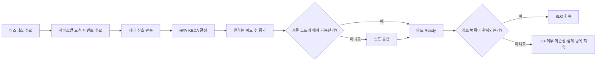

# 서비스 특성 기반 Kubernetes 오토스케일링 전략 선택과 검증

## HPA, KEDA와 노드 오토스케일링의 계층별 실험 연구

**Selecting and Validating Kubernetes Autoscaling Strategies Based on Service Characteristics: A Layered Experimental Study of HPA, KEDA, and Node Autoscaling**

| 항목 | 내용 |
| --- | --- |
| 원고 유형 | 최상위 연구 논문 초안 |
| 원고 상태 | 실험 전 연구 설계 및 예비 관찰 정리 단계 |
| 작성일 | 2026-07-21 |
| 저자 | 추후 기입 |
| 소속 | 추후 기입 |
| 교신저자 | 추후 기입 |
| 연구 기획 근거 | [Kubernetes 오토스케일링 전략 연구 기획서](kubernetes-autoscaling-strategy-research-design.md) |
| 세부 연구 근거 | [HPA 지표 선택 연구 설계](hpa-metric-selection-research-design.md) |
| 논문 구성 근거 | [HPA 지표 선택 논문 원고](hpa-metric-selection-paper.md) |

> 이 문서는 최상위 연구 기획서의 연구 범위와 HPA 세부 논문의 목차 및 서술 방식을 결합한 논문형 연구 초안이다. 이전 HPA 실험은 연구 동기를 형성한 예비 관찰로만 사용한다. 후속 실험을 수행하지 않은 항목은 `미실험`으로 표시하며, 예상이나 가설을 관측 결과처럼 서술하지 않는다.

---

## 목차

1. 서론
2. 이론적 배경과 연구 공백
3. 연구 방법
4. 예비 관찰 및 연구 결과 기록안
5. 논의
6. 연구의 타당성과 한계
7. 결론
8. 참고문헌
9. 부록

---

## 국문초록

Kubernetes 환경의 오토스케일링은 일반적으로 CPU 기반 Horizontal Pod Autoscaler(HPA)를 도입하는 문제로 축소되어 설명된다. 그러나 서비스 품질 저하의 원인이 CPU 포화가 아니라 동시 처리 한계, 데이터베이스 connection pool, 외부 API, 비동기 Queue 또는 노드 가용량에 있다면 레플리카 증가만으로 사용자 품질이 회복되지 않는다. 또한 HPA나 KEDA가 원하는 레플리카 수를 늘려도 새 파드를 배치할 노드가 없거나 노드 공급 시간이 부하 지속시간보다 길다면 워크로드 계층의 확장 결정은 실제 처리 용량으로 전환되지 않는다.

본 연구는 이전 서비스별 CPU 기반 HPA spike 실험에서 출발한다. 해당 실험에서는 6개 서비스 중 5개 서비스가 scale-out했지만 전체 부하 테스트 기준을 통과한 서비스는 `reservation-service` 하나였다. `concert-service`는 레플리카가 1개에서 4개로 증가했음에도 요청 실패율 34.64%, p95 약 10.5초, p99 약 14.9초와 SQLAlchemy QueuePool 대기가 지속됐다. 이 예비 관찰은 오토스케일러의 동작 성공과 서비스 수준 목표(Service Level Objective, SLO)의 회복을 별도 결과로 평가해야 함을 보여준다.

본 연구의 목적은 하나의 보편적인 오토스케일링 설정을 제안하는 것이 아니다. 서비스별 수요 특성과 최초 포화 지점을 진단하고, 파드 수, 파드 크기, 이벤트 처리량과 노드 용량 중 어떤 확장 축을 선택해야 하는지 판단한 뒤, CPU, 파드당 RPS, 가중 작업량, in-flight requests, worker utilization, queue depth, oldest message age와 consumer lag 중 어떤 제어 신호가 적절한지 검증하는 재현 가능한 방법을 제시하는 데 목적이 있다.

연구는 단일 파드 안전 용량 측정, 고정 레플리카 수평 확장성 검증, 워크로드 오토스케일링 전략 비교, 제한된 노드 환경에서의 워크로드-노드 연계 실험, 다서비스 통합 실험과 트래픽 형태별 부가 실험의 순서로 수행한다. 고정 용량, CPU 기반 HPA, 사용자 정의 지표 기반 HPA/KEDA, Queue 기반 KEDA, 사전 확장, rightsizing 또는 VPA 검토, Node Autoscaler 결합과 확장 제한 및 Backpressure를 비교 후보로 둔다. 1차 결과는 SLO 위반 면적과 SLO 회복 시간이며, 성공 요청당 pod-seconds, node-seconds, 확장 안정성, DB·broker·외부 API 안전 예산을 함께 평가한다.

본 연구의 기대 결과는 특정 제품의 권장 설정값이 아니라 문제 진단, 확장 축 선택, 제어 신호 검증, 안전 상한 설정과 적용 한계 확인으로 이어지는 실험 절차다. 이 절차는 오토스케일링을 처음 도입하는 개발자와 운영자가 설정을 복사하는 대신 자기 서비스의 병목과 트래픽 조건에 맞는 전략을 선택하는 근거로 사용될 수 있다.

**주제어:** Kubernetes, 오토스케일링, Horizontal Pod Autoscaler, KEDA, Node Autoscaling, 서비스 수준 목표, 부하 테스트, 관측성

---

## 1. 서론

### 1.1 연구 배경

서비스에 오토스케일링을 도입하려는 이유는 레플리카 수를 자동으로 변경하는 기능 자체에 있지 않다. 고정 용량만으로는 시간에 따라 달라지는 수요를 처리하기 어렵거나, 최댓값에 맞춘 상시 용량이 과도한 비용과 유휴 자원을 만들거나, 예상하지 못한 부하에서 사용자 품질이 저하되는 문제가 먼저 존재한다. 오토스케일링은 이러한 운영 문제를 해결하기 위한 수단이다.

그러나 오토스케일링을 처음 도입할 때는 CPU 사용률 하나를 기준으로 HPA를 구성한 뒤 레플리카가 증가하는지를 확인하는 방식이 자주 사용된다. 이 접근은 CPU가 실제 처리 한계를 대표하고, 파드를 더 늘리면 처리량이 증가하며, 새 파드를 배치할 노드 용량이 충분하다는 세 조건이 동시에 성립할 때 효과적이다. 어느 하나라도 성립하지 않으면 HPA는 정상적으로 동작하면서도 사용자 품질을 회복하지 못할 수 있다.

Kubernetes의 오토스케일링은 하나의 제어기가 담당하는 단일 문제가 아니다. 워크로드 레플리카 수는 HPA 또는 KEDA가 조절할 수 있고, 파드당 자원 크기는 Resource Request의 조정이나 Vertical Pod Autoscaler(VPA) 검토와 관련되며, Pending Pod를 수용할 물리적 용량은 Node Autoscaler가 공급한다. DB, broker와 외부 API 같은 공유 자원은 레플리카 증가로 자동 확장되지 않을 수 있다. 따라서 효과적인 전략을 찾기 위해서는 수요, 제어 신호, 확장 축, 용량 준비 시간과 공유 자원 안전 예산을 하나의 인과 구조로 다뤄야 한다.

### 1.2 이전 HPA 실험에서 확인된 문제

이전 프로젝트에서는 CPU target 70%를 적용한 서비스별 HPA spike 실험을 수행했다[7]. 로컬 검증은 Docker Desktop 자원 제약을 고려해 `minReplicas=1`, `maxReplicas=4`, 서비스 CPU request `1000m` 조건으로 진행했다.

**표 1. 이전 서비스별 CPU 기반 HPA spike 실험 요약**

| 서비스 | 부하 preset | HPA 결과 | 판단 시간 | Ready 시간 | k6 판정 | 주요 관찰 |
| --- | --- | --- | ---: | ---: | --- | --- |
| `auth-service` | `auth-30rps` | `1 -> 2` | `118.354s` | `129.721s` | FAIL | 오류는 없었으나 spike p99 기준 초과 |
| `reservation-service` | `reservation-140rps` | `1 -> 2` | `217.723s` | `229.870s` | PASS | HPA 반응과 품질 안정 동시 확인 |
| `ticket-service` | `ticket-75rps` | scale-out 없음 | - | - | PASS | CPU target에 도달하지 않아 HPA 검증 부하로 부족 |
| `notification-service` | `notification-400rps` | `1 -> 2` | `148.583s` | `160.480s` | FAIL | 오류는 없었으나 spike p99 기준 초과 |
| `payment-service` | `payment-250rps` | `1 -> 3` | `88.011s` | `99.794s` | FAIL | baseline부터 지연 기준 초과, overload에서 실패 증가 |
| `concert-service` | `concert-140rps` | `1 -> 4` | `57.818s` | `71.969s` | FAIL | DB-bound read와 pool timeout 지속 |

6개 서비스 중 5개 서비스에서 scale-out이 관측됐다. HPA 판단 이후 새 파드가 Ready 상태에 도달하기까지 약 11~14초가 걸렸다. 그러나 scale-out이 발생한 5개 서비스 중 전체 품질 기준을 통과한 서비스는 `reservation-service`뿐이었다. 이 결과는 다음 두 문장을 구분해야 함을 보여준다.

1. 오토스케일러가 제어 신호에 반응해 원하는 레플리카 수를 늘렸다.
2. 증가한 레플리카가 실제 처리 용량을 만들고 사용자 품질을 회복했다.

첫 번째 문장은 제어기의 동작 결과이며, 두 번째 문장은 시스템과 사용자 관점의 효과다. 본 연구는 두 결과 사이에 존재하는 파드 준비, 노드 공급, 트래픽 분산과 공유 자원 병목을 측정 대상으로 포함한다.

### 1.3 concert-service 반례

`concert-service`의 세 번째 `concert-140rps` 실행은 레플리카 증가가 서비스 품질 회복을 보장하지 않는 사례를 제공했다[8]. 해당 실행의 HPA는 `1 -> 2 -> 3 -> 4`로 증가했고, 판단 시점부터 추가 파드 Ready 반영까지 14.151초가 걸렸다. Kubernetes Job은 `Succeeded`, Pod exit code는 `0`이었다.

그러나 사용자 요청 품질은 다음과 같았다.

**표 2. concert-service 세 번째 실행의 핵심 관찰값**

| 지표 | 값 |
| --- | ---: |
| 총 요청 수 | `119,838` |
| 평균 요청률 | `84.32 req/s` |
| 요청 실패율 | `34.64%` |
| 평균 응답시간 | `4,176.96ms` |
| p95 응답시간 | `10,507.47ms` |
| p99 응답시간 | `14,885.30ms` |
| 최대 응답시간 | `32,516.96ms` |
| SQLAlchemy `QueuePool limit` 로그 | `2,360`건 |
| SQLAlchemy `TimeoutError` 로그 | `1,180`건 |
| PostgreSQL `too many clients already` | `0`건 |

이 실행에서는 DB 서버의 최대 연결 수 초과가 재발하지 않았지만, worker별 SQLAlchemy pool checkout 대기는 지속됐다. 당시 설정에서 이론적인 애플리케이션 연결 노출 상한은 다음과 같았다.

```text
4 replicas × 2 workers × 15 connections = 120 connections
```

이 값은 PostgreSQL `max_connections=200`보다 작았지만, 요청이 worker별로 균등하게 분배된다는 보장은 없다. 특정 process의 pool이 먼저 고갈되면 DB 서버 전체 연결 상한에 도달하지 않아도 checkout timeout이 발생할 수 있다. 이 사례에서 CPU 기반 HPA는 scale-out을 유발했지만 지배적인 병목을 제거하지 못했다. 따라서 정확한 결론은 CPU 기반 HPA의 보편적 실패가 아니라 제어 신호와 실제 대기 자원의 불일치다.

### 1.4 기존 해석의 한계

이전 HPA 결과는 연구 질문을 구체화하는 예비 관찰로 유용하지만, 본 연구의 확인적 결과로 합산할 수 없다.

- 서비스별 부하 시나리오와 실행 시간이 동일하지 않았다.
- 서비스와 실행별 DB pool 및 worker 조건이 달랐다.
- CPU, RPS, in-flight와 Queue 지표를 같은 조건에서 비교하지 않았다.
- 로컬 단일 노드 조건과 `min=1`, `max=4`는 실제 운영 목표를 대표하지 않는다.
- 일부 서비스는 HPA가 반응하기에 부하가 부족했고, 일부 서비스는 안정 운영 구간을 이미 넘어섰다.
- 노드 공급 지연과 워크로드 제어 지연을 분리하는 실험이 아니었다.

따라서 후속 연구에서는 단일 파드 용량과 고정 레플리카 확장성을 먼저 측정하고, 서비스 유형별 후보 전략을 동일한 조건에서 비교해야 한다.

### 1.5 연구 문제

기술적으로 사용할 수 있는 오토스케일링 기능과 운영상 효과적인 전략은 동일하지 않다. 본 연구는 다음 문제를 다룬다.

- CPU가 낮지만 in-flight 요청과 timeout이 증가하는 서비스의 제어 신호 선택
- 요청당 처리 비용이 서로 다른 API의 작업량 표현
- Queue depth, oldest message age와 consumer lag의 선택 기준
- 파드 수 증가로 완화되지 않는 DB와 외부 API 병목의 판정
- 원하는 레플리카 수 증가와 실제 Ready 용량 사이의 시간 차이
- Resource Request 오차가 파드 배치와 노드 공급에 미치는 영향
- 짧은 순간 증가와 예측 가능한 피크에서 반응형 확장의 적용 한계
- 과도한 레플리카가 공유 자원과 비용에 미치는 영향
- 여러 서비스의 피크가 분산되거나 겹칠 때 공유 노드 용량의 효율성

### 1.6 연구 목적

본 연구의 단 하나의 목적은 다음과 같다.

> 서비스별 수요 특성과 최초 포화 지점에 맞는 Kubernetes 오토스케일링 전략을 선택하고, 동일한 조건에서 SLO 회복성과 자원 효율성을 검증할 수 있는 재현 가능한 방법을 제시한다.

본 연구는 CPU를 제거하거나 KEDA를 보편적인 대안으로 제안하지 않는다. 어떤 서비스에서 어떤 확장 축과 제어 신호가 유효한지, 어느 조건부터 효과가 사라지거나 부작용이 발생하는지를 실험으로 구분한다.

### 1.7 연구 질문

주 연구 질문은 다음과 같다.

> **RQ1. 서비스별 수요 특성과 최초 포화 지점을 근거로 Kubernetes 오토스케일링 전략을 어떻게 선택하고 검증할 수 있는가?**

세부 연구 질문은 다음과 같다.

- **RQ2.** 어떤 관측 지표가 서비스의 SLO 위반을 선행하고 선택한 확장 축의 증가 후 감소하는가?
- **RQ3.** 서비스 특성 기반 HPA/KEDA는 고정 용량과 CPU 기반 HPA보다 SLO 위반 면적과 회복 시간을 줄이는가?
- **RQ4.** 워크로드 확장 결정, 파드 준비와 노드 공급의 각 지연은 최종 SLO 회복에 얼마나 기여하는가?
- **RQ5.** DB, broker와 외부 API 같은 공유 자원 병목에서 레플리카 증가는 품질과 자원 효율에 어떤 영향을 미치는가?
- **RQ6.** 트래픽 증가 속도, 지속시간, 반복성, 요청 구성과 상품 집중도에 따라 동일한 전략의 효과는 어떻게 달라지는가?
- **RQ7.** 서비스별 피크가 분산되거나 동시에 발생할 때 워크로드-노드 연계 전략의 용량 효율은 어떻게 달라지는가?
- **RQ8.** 오토스케일러와 레플리카 상태를 볼 수 없는 환경에서 서비스 지표만으로 확장 시점과 SLO 회복 여부를 어느 수준까지 추론할 수 있는가?

### 1.8 연구의 기대 기여

본 연구의 기대 기여는 다음과 같다.

1. 오토스케일링 문제를 제어 신호 하나가 아니라 최초 포화 지점, 확장 축, 용량 준비 시간과 안전 예산의 결합으로 정의한다.
2. HPA/KEDA의 desired replica 증가와 Ready 용량 증가, SLO 회복을 별도 단계로 평가한다.
3. CPU, 수요, 동시 처리와 backlog 지표를 서비스 유형별로 비교하는 실험 절차를 제시한다.
4. KEDA와 Node Autoscaler의 책임 경계를 구분하고 두 계층의 시간 차이를 정량화한다.
5. DB와 외부 의존성 지표를 무조건적인 확장 신호가 아니라 안전 상한과 Backpressure 판정 근거로 사용한다.
6. SLO 위반 면적과 성공 요청당 pod-seconds 및 node-seconds를 결합해 품질과 효율을 함께 평가한다.
7. 다상품·분산형 기본 시나리오와 트래픽 형태별 부가 실험을 통해 전략의 적용 범위를 제시한다.
8. 오토스케일링을 처음 도입하는 사람이 따라 할 수 있는 단계별 선택 절차와 증거 계약을 제공한다.

### 1.9 논문의 구성

제2장에서는 Kubernetes 오토스케일링 계층, 제어 신호의 역할과 기존 접근의 연구 공백을 설명한다. 제3장에서는 연구 가설, 시나리오, 비교군, 변수, 실험 절차와 통계 분석 계획을 제시한다. 제4장에서는 이전 HPA 실험을 예비 관찰로 정리하고 후속 결과의 기록 형식을 정의한다. 제5장에서는 결과를 해석할 기준과 실무적 의미를 논의한다. 제6장에서는 타당성 위협과 연구 한계를 다루고 제7장에서 결론과 후속 연구 방향을 제시한다.

## 2. 이론적 배경과 연구 공백

### 2.1 오토스케일링의 세 계층

Kubernetes 환경의 용량 조절은 다음 세 계층으로 구분할 수 있다.

| 계층 | 핵심 질문 | 대표 수단 | 직접 조절 대상 |
| --- | --- | --- | --- |
| 워크로드 수 | 파드를 몇 개 실행할 것인가? | HPA, KEDA | Deployment·StatefulSet 등의 replica |
| 워크로드 크기 | 파드 하나에 자원을 얼마나 배정할 것인가? | Resource Request 조정, VPA 검토 | CPU·memory request |
| 노드 용량 | 파드를 수용할 노드를 얼마나 공급할 것인가? | Node Autoscaler | 노드 또는 노드 그룹 용량 |

HPA와 KEDA는 워크로드의 원하는 레플리카 수를 변경하지만 직접 노드를 생성하지 않는다. Node Autoscaler는 배치할 수 없는 파드와 노드 정책을 근거로 인프라 용량을 조절하지만 애플리케이션의 SLO와 서비스별 병목을 직접 판단하지 않는다. VPA 또는 rightsizing은 파드 크기와 스케줄링 가능성에 영향을 주지만 요청량 변화에 대응하는 수평 확장과 동일한 역할이 아니다[1][3][4].

### 2.2 HPA의 제어 방식

HPA는 현재 레플리카 수와 현재 지표 대비 목표 지표의 비율을 이용해 원하는 레플리카 수를 계산한다[2]. 기본 관계는 다음과 같다.

```text
desiredReplicas
= ceil(currentReplicas × currentMetricValue / desiredMetricValue)
```

CPU utilization을 사용할 경우 현재 사용량은 CPU request 대비 비율로 계산된다. 따라서 request의 정확성은 HPA 계산과 노드 스케줄링에 동시에 영향을 준다. 여러 지표를 구성하면 각 지표가 권고하는 레플리카 수 중 가장 큰 값이 선택될 수 있으므로, 상관관계가 높은 지표를 무분별하게 결합하면 과도한 확장이나 축소 지연이 발생할 수 있다.

### 2.3 KEDA의 역할

KEDA는 Queue, broker, Prometheus와 외부 이벤트 소스를 Kubernetes 워크로드 확장에 연결한다[5]. Queue depth, oldest message age와 consumer lag처럼 backlog를 나타내는 지표는 비동기 worker의 수요를 CPU보다 직접적으로 표현할 수 있다. 온라인 API도 Prometheus scaler 등을 통해 RPS 또는 in-flight 지표를 사용할 수 있다.

그러나 KEDA를 사용한다는 사실만으로 전략이 적합해지는 것은 아니다. 외부 지표가 처리 수요를 정확히 나타내는지, 레플리카 증가로 해당 지표가 감소하는지, metric polling과 cooldown이 부하 지속시간에 맞는지 검증해야 한다. 또한 KEDA가 만든 추가 파드를 수용할 노드 용량은 별도의 문제다.

### 2.4 Node Autoscaling과 용량 준비

Node Autoscaler는 기존 노드에 배치할 수 없는 파드를 수용할 노드 용량을 추가할 수 있다[4]. 최종 용량 준비 시간은 워크로드 제어기가 원하는 레플리카 수를 늘리는 시점만으로 결정되지 않는다.

```text
end_to_end_capacity_latency
= workload_decision_latency
+ scheduling_or_pending_latency
+ node_provision_latency
+ image_and_container_startup
+ readiness_and_endpoint_registration
```

기존 노드에 충분한 여유가 있으면 노드 공급 없이 새 파드가 Ready 상태에 도달할 수 있다. 반대로 노드 여유가 부족하면 Pending Pod 감지부터 노드 Ready까지 추가 지연이 발생한다. 순간 증가의 지속시간이 이 전체 시간보다 짧다면 target을 공격적으로 조정하는 것만으로 SLO를 보호하기 어렵다.

### 2.5 제어 지표와 결과 지표의 구분

관측 지표는 연구에서 다음 네 역할로 구분한다.

| 역할 | 질문 | 예시 |
| --- | --- | --- |
| 수요 지표 | 처리해야 할 일이 얼마나 들어오는가? | RPS, event rate, queue arrival rate |
| 포화 지표 | 현재 처리기가 얼마나 바쁜가? | CPU, in-flight, worker utilization, queue age |
| 결과 지표 | 사용자가 어떤 품질을 경험하는가? | p95·p99, 오류율, 성공률 |
| 안전 지표 | 확장이 다른 계층을 위험하게 만드는가? | DB pool wait, connection budget, external quota, node headroom |

p95, p99와 오류율은 사용자 영향에 가까운 결과 지표이지만 일반적으로 문제가 발생한 뒤 악화되는 후행 지표가 될 수 있다. DB pool wait와 외부 quota는 서비스 병목을 보여주지만 레플리카 증가가 오히려 값을 악화시킬 수 있다. 따라서 중요한 지표라는 이유만으로 직접 확장 입력으로 사용하지 않고, 선행성, 제어 가능성과 확장 후 변화 방향을 검증해야 한다.

### 2.6 후보 제어 신호

본 연구의 후보 신호와 적용 가정은 다음과 같다.

| 후보 신호 | 우선 적용 대상 | 검증해야 할 조건 |
| --- | --- | --- |
| CPU request 대비 사용률 | CPU-bound 서비스 | CPU 증가가 SLO 저하를 선행하고 레플리카 증가로 감소 |
| 파드당 RPS | 요청 비용이 비교적 일정한 stateless API | 파드당 작업량과 처리 비용의 안정성 |
| 가중 요청 작업량 | endpoint별 비용 차이가 큰 API | 가중치의 재현성과 버전 관리 |
| in-flight requests | I/O-bound 온라인 서비스 | 동시 처리 한계와 SLO의 관계 |
| worker utilization | worker 또는 thread pool 기반 서비스 | 실제 대기와 worker 포화의 관계 |
| queue depth | 비동기 worker | 유입률과 처리율을 함께 해석 가능 |
| oldest message age | 대기시간 SLO가 중요한 worker | 오래된 작업의 지연을 대표 |
| consumer lag | partition 기반 streaming worker | partition 불균형과 처리율 고려 |
| 활성 연결·세션 수 | WebSocket와 장기 연결 서비스 | 연결당 비용과 이벤트율의 안정성 |

### 2.7 수요에서 SLO 회복까지의 인과 구조



이 구조에서 레플리카 증가와 노드 증가는 중간 결과다. 최종 성공은 SLO 회복과 안전 예산 준수로 판정한다.

### 2.8 연구 공백

공식 문서는 각 오토스케일링 기능의 동작과 설정 방법을 설명한다[1][2][3][4][5]. 그러나 오토스케일링을 처음 도입하는 사람이 자기 서비스의 최초 포화 지점을 찾아 확장 축과 제어 신호를 선택하고, 워크로드 결정부터 노드 공급과 SLO 회복까지 같은 시간축에서 검증하는 실험 절차는 별도로 구성해야 한다.

기존 HPA 세부 연구는 CPU와 사용자 정의 지표의 비교를 다루지만, 다음 질문은 최상위 연구에서 추가로 다뤄야 한다.

- 파드를 늘릴 것인지 파드 크기를 조정할 것인지의 선택
- KEDA의 이벤트 수요가 실제 노드 용량으로 전환되는 시간
- 노드 여유가 없는 조건에서의 SLO 회복 가능성
- 여러 서비스가 노드 용량을 공유할 때의 효율과 간섭
- 공유 자원 병목에서 확장하지 않아야 할 조건
- 트래픽 형태가 전략 효과를 바꾸는 적용 경계

## 3. 연구 방법

### 3.1 연구 설계

본 연구는 통제된 부하 실험과 실제 서비스 재현을 결합한 단계적 비교 연구다. 첫 단계에서 서비스별 단일 파드 안전 용량과 고정 레플리카 수평 확장성을 측정한다. 두 번째 단계에서 노드 용량을 충분히 고정한 상태로 워크로드 전략만 비교한다. 세 번째 단계에서 노드 용량을 제한해 워크로드-노드 연계 효과를 비교한다. 마지막 단계에서 서비스별 피크를 결합한 다서비스 시나리오와 트래픽 형태별 부가 실험을 수행한다.

연구의 인과 해석을 위해 처음부터 HPA/KEDA 설정, Resource Request와 Node Autoscaler를 동시에 변경하지 않는다. 각 단계에서 독립변수를 제한하고 이전 단계의 결과를 다음 단계의 입력으로 사용한다.

### 3.2 연구 가정

| ID | 연구 가정 |
| --- | --- |
| A1 | 같은 트래픽 profile과 요청 구성을 반복할 수 있다. |
| A2 | 부하 생성기, Prometheus, Kubernetes event와 애플리케이션 시간축을 정렬할 수 있다. |
| A3 | 오토스케일링 비교 전에 고정 레플리카 수평 확장성을 확인할 수 있다. |
| A4 | 모든 대상 컨테이너에 CPU와 memory request를 명시한다. |
| A5 | DB, broker, cache와 외부 mock의 용량 및 설정을 비교 중 고정한다. |
| A6 | 전략 외의 애플리케이션 이미지, 데이터셋과 요청 비율을 동일하게 유지한다. |
| A7 | 노드 공급 실험에서는 노드 타입, 최소·최대 수, quota와 zone 조건을 기록한다. |
| A8 | 제어 신호, desired·ready replicas, Pending Pod, Node 상태와 SLO를 수집할 수 있다. |
| A9 | 새 파드가 endpoint에 등록된 뒤 정상적으로 트래픽을 분담하는지 확인할 수 있다. |

### 3.3 연구 가설

주 가설은 다음과 같다.

> **H1. 서비스별 수요 특성과 최초 포화 지점에 맞춰 선택한 오토스케일링 전략은 CPU 기반 HPA 일괄 적용보다 SLO 위반 면적을 줄이면서 성공 요청당 자원 효율을 유지하거나 개선한다.**

귀무가설은 다음과 같다.

> **H0. 서비스 특성과 병목을 고려한 전략 선택은 CPU 기반 HPA와 비교했을 때 SLO 회복성과 자원 효율성에 유의미한 차이를 만들지 않는다.**

확인적 하위 가설은 다음과 같다.

| ID | 가설 | 반증 조건의 예 |
| --- | --- | --- |
| H1-a | 레플리카 증가로 감소하는 수요·포화 신호는 CPU보다 SLO 위반을 더 일찍 예고할 수 있다. | 선행 시간이 없거나 SLO 개선이 없음 |
| H1-b | 수평 확장 가능한 서비스에서는 서비스 특성 기반 HPA/KEDA가 SLO 위반 면적을 줄인다. | 고정 용량 또는 CPU HPA와 차이가 없거나 더 나쁨 |
| H1-c | 공유 자원 병목에서는 공격적인 레플리카 증가가 품질을 회복하지 못하고 경합 또는 비용을 늘릴 수 있다. | 처리량이 선형 개선되고 안전 지표가 유지됨 |
| H1-d | 노드 공급 시간이 SLO 허용 시간보다 길면 반응형 워크로드 확장만으로 짧은 순간 증가를 보호하기 어렵다. | 노드 준비 전에도 SLO가 유지되거나 공급 지연의 영향이 없음 |
| H1-e | Resource Request가 실제 필요량보다 작으면 노드 공급이 늦고, 크면 불필요한 용량과 비용이 증가한다. | Request 오차가 배치·비용·SLO에 차이를 만들지 않음 |
| H1-f | 서비스별 피크가 분산되면 공유 클러스터는 서비스별 최대 고정 용량의 합보다 적은 node-seconds로 SLO를 유지한다. | 효율이 개선되지 않거나 SLO가 악화됨 |
| H1-g | 동일한 전략도 트래픽 증가 속도, 지속시간, 반복성과 요청 구성에 따라 효과가 달라진다. | 전략과 트래픽 형태의 상호작용이 관측되지 않음 |
| H1-h | 짧은 순간 증가에서는 최소 여유 용량 또는 예약된 사전 확장이 반응형 확장보다 SLO 위반을 줄인다. | 반응형 전략이 동일하거나 더 빠르게 회복함 |

### 3.4 기본 비즈니스 시나리오

기본 환경은 특정 상품 하나의 오픈 시점에 모든 거래가 집중되는 서비스가 아니다. 다양한 상품이 하루 종일 거래되고 매출과 주문이 여러 시간대에 분산되지만, 사용자 행동과 요청 구성에 따라 서비스별 처리 수요가 계속 달라지는 환경으로 정의한다.

예를 들어 조회 서비스는 출퇴근 시간과 저녁 탐색 시간에 높은 수요를 보일 수 있고, 예약과 결제 서비스는 탐색 이후에 지연된 피크를 가질 수 있다. 알림과 정산 worker는 거래 발생 이후 Queue가 누적되며 온라인 API와 다른 시간적 수요를 보일 수 있다. 총 요청량이 같아도 endpoint별 요청 비용과 비동기 작업 비율이 달라지면 서비스별 포화 지점은 달라진다.

기본 시나리오의 연구 변수는 다음과 같다.

- 상품 수와 상품별 수요 집중도
- 조회, 예약, 결제, 알림과 취소 요청의 구성비
- 서비스별 peak 시점과 겹침 정도
- 온라인 요청과 비동기 이벤트 사이의 지연
- 공유 DB, broker와 외부 API의 정상 용량 및 지연 조건

특정 상품 집중은 제거하지 않고 예외 스트레스 조건으로 분리한다. 연구의 기본 결론은 다상품·분산형 환경에서 도출하고, 특정 상품 오픈, 순간 증가와 반복 피크는 적용 한계를 확인하는 부가 연구로 둔다.

### 3.5 연구 대상

첫 연구 주기에서는 원인 분리가 가능한 최소 대상부터 시작한다.

| 대상 | 선정 이유 | 첫 비교 질문 |
| --- | --- | --- |
| 수평 확장 가능 온라인 서비스 | 레플리카 증가가 처리량으로 전환되는 양의 사례 | CPU와 수요·동시 처리 지표 중 무엇이 SLO를 더 잘 보호하는가? |
| 공유 DB 병목 온라인 서비스 | 레플리카 증가가 품질을 회복하지 못한 반례 | 확장 상한과 Backpressure가 공격적 확장보다 안전한가? |
| 비동기 worker | Queue 계열 KEDA 전략 검증 | depth, age와 lag 중 무엇이 처리 지연을 더 잘 보호하는가? |
| 노드 용량 제한 환경 | 워크로드와 인프라 연계 검증 | Pending, 노드 공급과 SLO 회복 사이의 시간 관계는 무엇인가? |

이전 예비 관찰을 재사용한다면 `reservation-service`와 `concert-service`를 첫 온라인 서비스 후보로 사용할 수 있다. 다만 새로운 환경에서는 단일 파드 용량과 고정 레플리카 확장성을 다시 측정한 뒤 최종 확정한다.

### 3.6 실험 비교군

| 코드 | 전략 | 적용 목적 |
| --- | --- | --- |
| C0 | 고정 안전 용량 | 품질과 비용 기준선 |
| C1 | CPU 기반 HPA | 기존 관행 비교 기준 |
| C2 | RPS·가중 RPS 기반 HPA/KEDA | 요청 비용이 비교적 안정적인 온라인 서비스 |
| C3 | in-flight·worker utilization 기반 HPA/KEDA | I/O 또는 동시 처리 포화 서비스 |
| C4 | Queue·lag·oldest age 기반 KEDA | 비동기 worker |
| C5 | 사전 확장+반응형 확장 | 예측 가능한 피크와 느린 노드 공급 |
| C6 | rightsizing 또는 VPA 검토 후 HPA | Request 오차와 파드 크기 문제 |
| C7 | 워크로드 전략+Node Autoscaler | 파드와 노드 용량 연계 |
| C8 | 확장 제한+Backpressure | DB와 외부 의존성 보호 |

모든 비교군을 모든 서비스에 적용하지 않는다. 고정 레플리카 실험으로 해당 병목이 선택한 확장 축에 의해 완화되는지 확인한 뒤 비교군을 제한한다.

### 3.7 독립변수

- 오토스케일링 전략과 제어 신호
- target과 metric window
- 최소·최대 레플리카 수
- HPA behavior와 stabilization 설정
- KEDA polling interval과 cooldown
- Pod CPU·memory request 및 limit
- 노드 최소·최대 수와 공급 정책
- 트래픽 형태와 요청 구성
- 상품 집중도와 서비스별 peak 동시성
- 공유 자원 정상·지연 조건

### 3.8 종속변수

- latency 및 오류율 SLO 위반 면적
- SLO 회복 시간
- p95, p99, 오류율과 성공률
- Queue oldest age와 처리 지연
- desired replica, Ready replica와 Node 변화 시간
- Pending Pod 시간과 node provision 시간
- 성공 요청당 pod-seconds, CPU-seconds와 node-seconds
- 확장 및 축소 횟수, overshoot와 안정 상태 복귀 시간
- DB 연결, pool wait, lock wait와 query latency
- broker lag와 외부 API quota, timeout 및 retry

### 3.9 통제변수

- 애플리케이션 image digest와 설정
- 데이터셋 revision 및 크기
- endpoint별 요청 비율과 payload
- 부하 생성기 위치와 네트워크
- DB, broker, cache와 외부 mock 설정
- worker 수와 connection pool 설정
- Prometheus scrape 및 adapter refresh 설정
- Kubernetes, KEDA와 Node Autoscaler 버전
- 노드 타입, zone, quota와 클러스터 add-on
- warmup, steady, increase, recovery와 cooldown 구간

### 3.10 실험 절차

#### 3.10.1 단계 0: 사전 등록과 계측 검증

주 가설, 1차 결과, 제외 기준과 분석 단위를 고정한다. 부하 생성기, Prometheus, Kubernetes event와 애플리케이션 로그의 시간 오차를 측정한다. metric adapter 지연과 누락률을 확인한다.

#### 3.10.2 단계 1: 단일 파드 안전 용량

오토스케일링을 비활성화하고 요청량을 점진적으로 증가시킨다. SLO를 만족하는 최대 지속 처리량, 최초 SLO 위반 지점과 최초 포화 지표를 기록한다. target 후보는 이 단계의 안전한 파드당 값에서 도출한다.

#### 3.10.3 단계 2: 고정 레플리카 수평 확장성

동일한 총부하와 요청 구성에서 레플리카를 `1`, `2`, `4`로 고정해 처리량, 지연과 공유 자원 상태를 비교한다. 필요하면 `8`을 탐색 조건으로 추가한다. 레플리카 증가율보다 처리량 개선율이 현저히 낮거나 안전 지표가 악화되면 수평 확장 한계를 기록한다.

#### 3.10.4 단계 3: 노드 용량을 고정한 워크로드 전략 비교

모든 후보 파드를 즉시 배치할 수 있는 노드 여유를 확보한다. C0~C4와 필요 시 C8을 비교한다. 이 단계에서는 Node Autoscaler 영향을 제거하고 제어 신호, desired replica 증가, Pod Ready와 SLO 회복을 측정한다.

#### 3.10.5 단계 4: 제한된 노드 용량에서 연계 비교

상위 워크로드 전략만 C7과 결합한다. 기존 노드 여유가 있는 조건과 새 노드가 필요한 조건을 분리한다. Pending Pod 감지, 노드 공급 시작, Node Ready, Pod Ready와 SLO 회복을 하나의 시간축으로 연결한다.

#### 3.10.6 단계 5: 다서비스 통합 실험

서비스별 임계값과 안전 상한을 확보한 뒤 다상품·분산형 시나리오를 실행한다. 서비스별 peak가 분산된 조건과 겹치는 조건을 비교한다. 공유 DB와 broker의 정상 조건 및 지연 조건을 별도로 둔다.

#### 3.10.7 단계 6: 트래픽 형태별 부가 실험

주 연구에서 선택된 상위 전략에만 ramp, step, spike, sustained, wave와 predictable peak를 적용한다. 특정 상품 집중은 예외 스트레스 조건으로 실행한다.

#### 3.10.8 단계 7: 블라인드 추론

HPA, KEDA, replica와 Node 상태를 숨긴 데이터 묶음을 만든다. 서비스 지표만으로 확장 시작, 용량 준비, SLO 회복과 잘못된 확장 축을 추정한 뒤 ground truth와 비교한다.

### 3.11 트래픽 형태

| 코드 | 형태 | 연구 목적 |
| --- | --- | --- |
| P1 | 점진 증가 | 임계값과 안정 처리 구간 발견 |
| P2 | 계단 증가 | 제어 지연과 회복 구간 비교 |
| P3 | 짧은 순간 증가 | 반응형 확장의 시간 한계 확인 |
| P4 | 지속 고부하 | 안정 상태와 자원 효율 비교 |
| P5 | 반복 파형 | scale up/down 안정성과 진동 확인 |
| P6 | 예측 가능한 피크 | 사전 확장과 반응형 확장 비교 |
| P7 | 서비스별 분산 피크 | 공유 노드 용량 재사용 평가 |
| P8 | 동시 피크 | 서비스 간 간섭과 노드 최대치 평가 |
| P9 | 특정 상품 집중 | 예외 상황의 견고성과 적용 한계 확인 |

24시간 수요를 단순히 몇 분으로 압축하지 않는다. 시나리오 설명용 일일 그래프와 제어기 반응 검증용 부하 실행을 분리하며, 후자는 polling, stabilization, cooldown, Pod startup과 Node provisioning의 실제 시간 비율을 보존한다.

### 3.12 핵심 시간 지표

| 기호 | 시점 |
| --- | --- |
| t0 | 부하 변화 시작 |
| t1 | 후보 제어 신호가 사전 임계값 도달 |
| t2 | desired replica 증가 |
| t3 | 새 Pod 생성 |
| t4 | Pod가 Pending 또는 Scheduling 상태 진입 |
| t5 | 노드 공급 시작 |
| t6 | Node Ready |
| t7 | 새 Pod Ready 및 endpoint 등록 |
| t8 | SLO 회복 |
| t9 | scale-down 또는 node consolidation 시작 |
| t10 | 안정 상태 복귀 |

```text
signal_lead_time = SLO 최초 위반 시점 - t1
workload_decision_latency = t2 - t0
pod_ready_latency = t7 - t2
node_provision_latency = t6 - t5
end_to_end_capacity_latency = t7 - t0
slo_recovery_latency = t8 - t0
pending_pod_seconds = 각 Pending Pod 지속시간의 합
```

노드 추가가 없었던 실행의 `node_provision_latency`는 `0`이 아니라 `not_applicable`로 기록한다. 기존 노드 여유로 배치된 경우와 즉시 노드가 공급된 경우를 구분하기 위해서다.

### 3.13 품질 및 효율 지표

1차 결과는 latency SLO 위반 면적과 오류율 SLO 위반 면적이다.

```text
SLO_violation_area
= 각 관측 구간에서 max(0, observed_value - SLO_threshold) × interval
```

단위가 다른 latency와 오류율을 하나의 임의 점수로 합치지 않는다. 서비스별 공동 1차 결과 또는 사전 지정한 1차·보조 결과로 분석한다.

자원 효율 지표는 다음과 같다.

```text
successful_requests_per_pod_second
= successful_requests / total_pod_seconds

successful_requests_per_node_second
= successful_requests / total_node_seconds

capacity_headroom_ratio
= (allocatable_capacity - requested_capacity) / allocatable_capacity

scale_efficiency
= throughput_improvement_ratio / resource_increase_ratio
```

실제 비용을 수집할 수 있으면 노드 시간과 가격을 사용한다. 로컬 환경에서는 비용을 직접 주장하지 않고 node-seconds, vCPU-seconds와 memory-GiB-seconds를 대리 지표로 사용한다.

### 3.14 공유 자원 안전 지표

- DB connection usage와 wait
- connection pool checkout wait와 timeout
- DB query latency와 lock wait
- broker partition별 lag와 oldest message age
- cache hit·miss와 stampede 징후
- 외부 API quota, timeout과 retry
- 네트워크 연결과 ephemeral port

DB 연결 노출 상한은 다음 관계를 기본 점검식으로 사용한다.

```text
application_connection_budget
= maxReplicas × workersPerPod × (poolSize + maxOverflow)
```

이 값은 실제 동시 연결 수가 아니라 설정이 허용하는 최대 노출 범위다. DB 운영 연결과 여유 용량을 제외한 안전 예산과 비교해 `maxReplicas`를 정한다.

### 3.15 데이터 수집과 실행 계약

각 실행은 다음 정보를 `run_id`로 연결한다.

- 연구, 시나리오와 전략 ID
- 시작 및 종료 시각
- code commit과 image digest
- Kubernetes, KEDA, metrics adapter와 Node Autoscaler 버전
- HPA, ScaledObject, VPA와 Node 정책 전체 설정
- Pod request, limit, worker와 pool 설정
- 노드 타입, 최소·최대 수, zone과 quota
- DB, broker, cache와 외부 mock 설정
- 데이터셋 revision, 상품 수와 상품 집중도
- endpoint별 요청 비율과 부하 profile
- warmup, steady, increase, recovery와 cooldown 구간
- SLO와 공유 자원 안전 예산
- 부하 생성기 summary 및 시계열
- Prometheus query 결과와 Kubernetes event
- 제외 또는 경고 사유

### 3.16 반복, 무작위화와 통계 분석

독립된 부하 실행 한 번을 기본 분석 단위로 한다. 매초 수집한 시계열 값을 독립 표본으로 세어 표본 수를 부풀리지 않는다.

- 예비 실험은 조건별 최소 3회 수행해 분산과 효과 크기를 확인한다.
- 본 실험 반복 횟수는 예비 실험의 효과 크기와 분산을 이용해 산정한다.
- 전략 실행 순서를 무작위화한다.
- 날짜, 클러스터 상태와 노드 image 상태를 block으로 기록한다.
- 중앙값 차이, 백분율 변화, bootstrap 95% 신뢰구간과 효과 크기를 함께 제시한다.
- `strategy`, `traffic_pattern`과 `strategy × traffic_pattern`의 효과를 비교한다.
- 다중 비교는 보정된 신뢰구간 또는 false discovery rate를 사용한다.
- metric adapter, Node 공급과 부하 생성기 실패를 구분한다.
- 오토스케일링 실패를 결측으로 제거하지 않는다.
- 사후 발견 패턴은 확인적 결론이 아니라 후속 가설로 표시한다.

### 3.17 보안과 개인정보

연구 산출물에는 비밀번호, OTP, JWT, session cookie, 실제 사용자 개인정보, 결제정보, Secret 원문, credential이 포함된 URL, 원문 Redis key/value와 민감한 환경변수를 저장하지 않는다. 실패 보고서는 민감한 로그 원문 대신 오류 유형, 집계 건수와 안전하게 축약한 메시지를 사용한다.

### 3.18 전략 채택 기준

오토스케일링 전략은 다음 다섯 질문을 모두 통과해야 채택 후보가 된다.

1. 제어 신호가 수요 또는 포화를 안정적으로 측정하는가?
2. 제어 신호가 SLO 위반보다 충분히 먼저 반응하는가?
3. 선택한 확장 축을 늘리면 제어 신호와 SLO가 개선되는가?
4. 파드와 노드 준비 시간이 부하 지속시간 안에 들어오는가?
5. 공유 자원과 비용 예산을 넘지 않는가?

## 4. 예비 관찰 및 연구 결과 기록안

> 제4.1절만 이전 실험에서 확인된 예비 관찰이다. 제4.2절 이후의 표는 후속 실험 결과를 기록하기 위한 형식이며 값은 사전에 채우지 않는다.

### 4.1 예비 관찰의 요약

이전 실험에서 확인된 사실은 다음과 같다.

- CPU 기반 HPA는 6개 서비스 중 5개 서비스에서 실제 scale-out을 만들었다.
- HPA 판단 이후 추가 파드 Ready까지 약 11~14초가 필요했다.
- scale-out 서비스 중 전체 품질 기준을 통과한 서비스는 `reservation-service` 하나였다.
- `concert-service`는 최대 레플리카까지 증가했지만 실패율, tail latency와 pool checkout timeout이 지속됐다.
- Kubernetes Job 성공과 Pod 정상 종료는 사용자 요청 품질 성공을 의미하지 않았다.

현재 예비 관찰만으로 확인하지 못한 사항은 다음과 같다.

- CPU 외 지표가 동일 조건에서 더 나은 SLO 회복을 만드는지
- KEDA와 HPA 구현 차이가 결과에 미치는 영향
- 노드 여유가 없는 환경의 공급 지연과 비용
- Resource Request 오차가 스케줄링에 미치는 영향
- 다상품·분산형 통합 시나리오의 자원 재사용 효과
- 트래픽 형태와 전략 사이의 상호작용

### 4.2 계측 신뢰성

**표 3. 제어 신호 수집 신뢰성**

| 지표 | scrape interval | adapter·polling lag | missing ratio | 제어기 조회 일치율 | 판정 |
| --- | ---: | ---: | ---: | ---: | --- |
| CPU | 미실험 | 미실험 | 미실험 | 미실험 | 미판정 |
| RPS per pod | 미실험 | 미실험 | 미실험 | 미실험 | 미판정 |
| in-flight | 미실험 | 미실험 | 미실험 | 미실험 | 미판정 |
| queue depth | 미실험 | 미실험 | 미실험 | 미실험 | 미판정 |
| oldest message age | 미실험 | 미실험 | 미실험 | 미실험 | 미판정 |
| consumer lag | 미실험 | 미실험 | 미실험 | 미실험 | 미판정 |

### 4.3 단일 파드 용량과 고정 레플리카 확장성

**표 4. 서비스별 단일 파드 SLO 용량**

| 서비스·유형 | 안정 처리량 | 최초 SLO 위반 처리량 | 최초 포화 지표 | 공유 자원 상태 | 판정 |
| --- | ---: | ---: | --- | --- | --- |
| 수평 확장 가능 온라인 서비스 | 미실험 | 미실험 | 미실험 | 미실험 | 미판정 |
| 공유 DB 병목 서비스 | 미실험 | 미실험 | 미실험 | 미실험 | 미판정 |
| 비동기 worker | 미실험 | 미실험 | 미실험 | 미실험 | 미판정 |

**표 5. 고정 레플리카별 확장 효율**

| 서비스 | replicas | throughput | p95 | error | scale efficiency | 제한 요인 |
| --- | ---: | ---: | ---: | ---: | ---: | --- |
| 미실험 | 1 | - | - | - | `1.0` 기준 | 미판정 |
| 미실험 | 2 | - | - | - | - | 미판정 |
| 미실험 | 4 | - | - | - | - | 미판정 |

### 4.4 워크로드 전략 비교

**표 6. 전략별 품질 및 자원 효율**

| 서비스 | 전략 | decision latency | Pod Ready latency | SLO violation area | recovery latency | requests/pod-second | 판정 |
| --- | --- | ---: | ---: | ---: | ---: | ---: | --- |
| 미실험 | C0 고정 용량 | - | - | - | - | - | 미판정 |
| 미실험 | C1 CPU HPA | - | - | - | - | - | 미판정 |
| 미실험 | C2 RPS·가중 RPS | - | - | - | - | - | 미판정 |
| 미실험 | C3 in-flight·worker | - | - | - | - | - | 미판정 |
| 미실험 | C4 Queue·lag·age | - | - | - | - | - | 미판정 |
| 미실험 | C8 제한+Backpressure | - | - | - | - | - | 미판정 |

### 4.5 워크로드-노드 연계 결과

**표 7. 용량 준비 단계별 시간**

| 전략 | 기존 node headroom | Pending Pod | node provision | Pod Ready | end-to-end capacity | SLO recovery | 판정 |
| --- | ---: | ---: | ---: | ---: | ---: | ---: | --- |
| 미실험 | 충분 | - | `N/A` | - | - | - | 미판정 |
| 미실험 | 부족 | - | - | - | - | - | 미판정 |

**표 8. Resource Request 오차의 영향**

| request 조건 | scheduling 결과 | node-seconds | 유휴 용량 | SLO violation area | 해석 |
| --- | --- | ---: | ---: | ---: | --- |
| 과소 설정 | 미실험 | - | - | - | 미판정 |
| 기준 설정 | 미실험 | - | - | - | 미판정 |
| 과대 설정 | 미실험 | - | - | - | 미판정 |

### 4.6 공유 자원과 과도한 확장

**표 9. 최대 레플리카 증가에 따른 한계효용과 안전 예산**

| maxReplicas | throughput gain | p95 개선 | DB pool wait | connection budget | requests/pod-second | 안전 판정 |
| ---: | ---: | ---: | ---: | ---: | ---: | --- |
| 미실험 | - | - | - | - | - | 미판정 |

### 4.7 트래픽 형태별 전략 효과

**표 10. 전략과 트래픽 형태의 상호작용**

| 전략 | traffic pattern | scale-out 여부 | SLO 회복 | overshoot | node-seconds | 적용 판정 |
| --- | --- | --- | --- | ---: | ---: | --- |
| 미실험 | ramp | - | - | - | - | 미판정 |
| 미실험 | step | - | - | - | - | 미판정 |
| 미실험 | spike | - | - | - | - | 미판정 |
| 미실험 | sustained | - | - | - | - | 미판정 |
| 미실험 | distributed peak | - | - | - | - | 미판정 |
| 미실험 | concurrent peak | - | - | - | - | 미판정 |

### 4.8 다서비스 통합 결과

**표 11. 서비스별 피크 분산과 동시 발생 비교**

| 시나리오 | SLO 통과 서비스 수 | 총 node-seconds | 평균 headroom | 공유 자원 위반 | 전략 판정 |
| --- | ---: | ---: | ---: | --- | --- |
| 서비스별 분산 피크 | 미실험 | - | - | 미실험 | 미판정 |
| 서비스 동시 피크 | 미실험 | - | - | 미실험 | 미판정 |
| 서비스별 최대 고정 용량 합 | 미실험 | - | - | 미실험 | 미판정 |

### 4.9 블랙박스 추론 결과

**표 12. 제어기 상태 비공개 분석 정확도**

| 지표 집합 | scale-out precision | recall | 시점 MAE | SLO 회복 분류 정확도 | 병목 분류 정확도 |
| --- | ---: | ---: | ---: | ---: | ---: |
| 미실험 | - | - | - | - | - |

### 4.10 결과 시각화 계획

실제 결과 차트는 원시 데이터에서 재생성할 수 있어야 한다.

| 차트 | 분석 질문 | 주요 필드 |
| --- | --- | --- |
| 정렬된 시계열 | 수요, 제어 신호, replica, node와 SLO가 언제 변했는가? | 상대시간, RPS, desired, ready, node, p99 |
| SLO 구간 차트 | 위반과 회복 구간은 어디인가? | p95·p99·오류율, SLO threshold |
| interval plot | 전략 차이와 반복 분산은 얼마인가? | 전략, violation area, 95% CI |
| 효율 scatter | 자원 증가가 성공 처리량 개선으로 이어졌는가? | pod-seconds, node-seconds, 성공 요청 |
| interaction plot | 트래픽 형태가 전략 효과를 바꾸는가? | 전략, 패턴, 효과 크기 |
| 단계별 waterfall | 전체 용량 지연에서 가장 큰 구간은 어디인가? | decision, pending, node, pod, recovery |

단위가 다른 RPS, replica와 node 수를 하나의 y축에 그대로 겹치지 않는다. 정렬된 소형 차트를 사용하거나 정규화 사실과 기준을 명시한다.

## 5. 논의

> 이 장의 최종 주장은 제4장의 후속 실험 결과가 확보된 뒤 확정한다. 현재 내용은 예비 관찰로 지지되는 해석과 후속 결과의 판정 규칙이다.

### 5.1 오토스케일러 동작과 서비스 효과의 구분

desired replica와 Ready replica가 증가했다면 워크로드 제어기는 반응한 것이다. 그러나 전략의 효과를 주장하려면 다음 조건을 추가로 만족해야 한다.

- SLO 위반 면적이 기준선보다 감소한다.
- Ready 용량 증가 이후 SLO 회복이 관측된다.
- 실패율과 timeout이 악화되지 않는다.
- 공유 자원 안전 예산을 넘지 않는다.
- 성공 요청당 자원 효율이 수용 가능한 범위다.
- 실험 조건의 부하 지속시간 안에 용량이 준비된다.

이 기준에 따르면 이전 `concert-service` 실험은 HPA 동작에는 성공했지만 서비스 효과에는 실패한 예비 사례다.

### 5.2 서비스 유형별 전략 선택

CPU-bound 서비스에서 CPU HPA가 가장 좋은 결과를 보이더라도 이를 모든 서비스로 일반화하지 않는다. I/O-bound 온라인 서비스는 in-flight 또는 worker utilization, 비동기 worker는 Queue 계열 지표, 장기 연결 서비스는 active connections와 event rate가 더 적합할 수 있다. 요청당 비용 차이가 크면 원시 RPS보다 가중 작업량을 검토해야 한다.

DB-bound 서비스에서는 수요 지표와 DB 안전 지표를 분리한다. 수요가 증가했다는 사실은 파드를 늘려야 한다는 결론과 동일하지 않다. 고정 레플리카 실험에서 처리량이 증가하지 않거나 pool wait가 악화되면 확장 제한, query 개선, cache, Backpressure와 DB 용량 조정이 우선일 수 있다.

### 5.3 KEDA 전략의 의미

KEDA 전략 연구의 핵심은 KEDA 사용 여부가 아니라 외부 수요와 backlog를 어떤 값으로 표현할 것인가에 있다. Queue depth가 같아도 유입률과 처리율이 다르면 해소 시간은 달라질 수 있다. oldest message age는 대기시간 SLO에 가깝지만 일부 오래된 메시지에 민감할 수 있고, consumer lag는 partition 불균형을 숨길 수 있다. 각 지표는 레플리카 증가 후 감소 방향, SLO 선행성과 측정 신뢰성을 함께 검증해야 한다.

온라인 API에 KEDA Prometheus scaler를 사용할 때도 CPU HPA와 동일한 평가 원칙을 적용한다. KEDA는 외부 신호 연결 수단이며, RPS 또는 in-flight 지표 자체의 적합성을 보장하지 않는다.

### 5.4 파드와 노드 용량의 시간 차이

워크로드 전략이 우수해도 노드 공급이 늦으면 실제 용량 회복은 지연된다. `workload_decision_latency`, `pending_pod_seconds`, `node_provision_latency`, `pod_ready_latency`와 `slo_recovery_latency`를 분리하면 다음 원인을 구분할 수 있다.

- 제어 신호가 늦어 desired replica 증가가 늦은 경우
- desired replica는 증가했지만 기존 노드에 여유가 없는 경우
- 노드는 공급됐지만 image pull 또는 readiness가 느린 경우
- 파드는 Ready지만 트래픽 분산이나 공유 자원 병목 때문에 SLO가 회복되지 않는 경우

짧은 순간 증가가 전체 용량 준비 시간보다 짧으면 최소 여유 용량, 예약된 사전 확장, 요청 제한과 큐잉을 검토해야 한다.

### 5.5 과도한 확장의 판정

레플리카를 더 많이 늘리는 전략이 항상 안전한 것은 아니다. 처리량 개선률보다 자원 증가율이 크면 `scale_efficiency`가 감소한다. DB 연결 예산, broker partition 수와 외부 quota가 고정된 상태에서는 추가 파드가 경합과 retry를 늘릴 수 있다.

과도한 확장은 다음 조건으로 판정한다.

- 레플리카 증가 후 처리량의 한계효용이 사전 기준보다 낮다.
- p95 또는 p99가 개선되지 않거나 악화된다.
- 성공 요청당 pod-seconds 또는 node-seconds가 악화된다.
- DB pool wait, lock wait, broker lag 또는 외부 quota 위반이 증가한다.
- scale up/down 횟수와 안정 상태 복귀 시간이 증가한다.

### 5.6 다상품·분산형 서비스의 의미

본 연구의 기본 시나리오는 하나의 상품 오픈에 모든 수요가 집중되는 상황이 아니다. 여러 상품과 사용자 행동이 하루 종일 존재하며 서비스별 수요 시점이 달라지는 상황이다. 이러한 환경에서는 서비스별 최대 용량을 단순 합산한 고정 노드 규모보다 공유 클러스터가 용량을 재사용할 가능성이 있다.

다만 피크 분산이 곧 비용 절감을 보장하지 않는다. scale-down 지연, node consolidation, 최소 레플리카, topology 제약과 image 분산이 유휴 용량을 남길 수 있다. 따라서 총 node-seconds와 SLO를 함께 비교해야 한다.

### 5.7 처음 도입하는 사람을 위한 절차

본 연구가 제안하는 최초 도입 절차는 다음과 같다.

1. 오토스케일링을 끄고 단일 파드 SLO 용량을 측정한다.
2. 고정 레플리카를 늘려 서비스가 실제로 수평 확장되는지 확인한다.
3. 최초 포화 지점과 공유 자원 안전 예산을 기록한다.
4. 병목과 직접 관련된 제어 신호를 두 개 이상 비교한다.
5. target은 단일 파드의 안전한 파드당 값에서 도출한다.
6. HPA/KEDA 결정, Pod Ready, Node 공급과 SLO 회복 시간을 따로 측정한다.
7. DB와 외부 의존성 예산으로 `maxReplicas`를 제한한다.
8. ramp, step, spike와 sustained 부하를 구분한다.
9. 레플리카나 노드 증가가 아니라 SLO 회복과 자원 효율로 성공을 판정한다.
10. 상위 전략만 다서비스와 예외 트래픽 조건으로 확장한다.

### 5.8 블랙박스 환경에서의 활용

HPA, KEDA와 replica 상태를 직접 볼 수 없는 환경에서는 정확한 레플리카 수를 단정하지 않는다. 통제 실험에서 검증한 시간 순서와 변화점을 이용해 scale-out 가능성, 용량 준비와 SLO 회복 여부를 추정한다. instance 또는 pod 식별 정보가 없으면 원인 확정이 아니라 확률적 추론으로 보고한다.

블랙박스 분석은 ground truth가 있는 데이터에서 precision, recall, 시점 오차와 병목 분류 정확도를 검증한 뒤 적용한다. 부하 변화, 배포, cache와 외부 의존성 변화가 동시에 발생한 운영 데이터에서는 오토스케일러 효과를 단정하지 않는다.

### 5.9 결과 해석의 분기

| 후속 관측 결과 | 가능한 해석 | 다음 결정 |
| --- | --- | --- |
| CPU HPA가 가장 낮은 SLO 위반 면적과 높은 효율을 보임 | 대상 서비스에서 CPU가 유효한 포화 대리 지표 | CPU HPA 유지, 적용 범위 명시 |
| 수요·동시 처리 지표가 CPU보다 빠르고 품질을 개선 | CPU가 병목을 늦게 반영 | 사용자 정의 지표 전략 채택 검토 |
| Queue 전략이 age를 줄이지만 node 지연으로 SLO 실패 | 워크로드 결정은 적절하나 용량 공급이 늦음 | node headroom 또는 사전 확장 검토 |
| 레플리카 증가에도 처리량과 SLO 개선 없음 | 수평 확장으로 해결되지 않는 병목 | 확장 중단, 병목 개선과 Backpressure |
| 공격적 확장이 품질은 개선하지만 효율이 급감 | 성능과 비용 사이의 한계효용 존재 | 목표 SLO와 비용 예산으로 상한 결정 |
| 트래픽 형태별 우수 전략이 다름 | 단일 전략의 적용 경계 존재 | 기본 전략과 예외 전략 분리 |

## 6. 연구의 타당성과 한계

### 6.1 내부 타당성

cache warmup, JIT, DB buffer와 통계, image pull, readiness 설정, adapter cache와 부하 생성기 자원이 결과에 영향을 줄 수 있다. 실행 순서 무작위화, 동일 warmup, 환경 snapshot과 block 기록으로 영향을 줄인다. 배포, 장애 주입과 오토스케일링 설정을 한 실행에서 동시에 변경하지 않는다.

### 6.2 구성 타당성

노드와 레플리카 수가 트래픽과 함께 증가하는 사실만으로 성공을 정의하지 않는다. CPU utilization과 절대 CPU, 전체 RPS와 파드당 RPS, desired replica와 Ready replica, 평균 latency와 tail latency를 구분한다. Kubernetes Job 성공도 성능 실험 성공으로 간주하지 않는다.

### 6.3 외적 타당성

로컬 또는 특정 클라우드 환경의 노드 공급 시간을 다른 환경으로 일반화하지 않는다. 한 언어, worker 모델과 DB driver의 결과를 모든 서비스에 적용하지 않는다. 다상품·분산형 시나리오가 모든 업종을 대표한다고 주장하지 않는다. 절대 target 값보다 전략 선택 절차와 상대 효과를 주요 기여로 둔다.

### 6.4 통계적 결론 타당성

소표본 예비 실험은 탐색적 결과로 표시한다. 본 실험의 반복 횟수는 예비 분산과 효과 크기로 정한다. 실패 실행을 사후 제거하지 않으며 제외 기준과 건수를 보고한다. 통계적 유의성과 운영상 의미 있는 효과 크기를 구분한다.

### 6.5 시간 압축의 한계

24시간 수요를 몇 분으로 압축하면 polling, synchronization, stabilization, cooldown, Pod startup과 Node provisioning의 상대 시간이 달라진다. 일일 수요 그래프는 시나리오 설명에만 사용하고 제어기 반응 실험은 현실적인 증가 속도와 지속시간으로 분리한다.

### 6.6 도구와 버전 의존성

Kubernetes, KEDA, VPA와 Node Autoscaler의 동작과 기본값은 버전에 따라 달라질 수 있다. 실행 manifest와 버전을 보존하고, 실험 실행 시점에 공식 문서를 다시 확인한다.

### 6.7 인과 해석의 한계

독립변수와 환경을 통제한 실험에서는 전략 변경의 효과를 비교할 수 있다. 운영 관측 데이터에서는 트래픽 구성, 배포, cache와 외부 의존성이 동시에 변할 수 있으므로 인과관계를 단정하지 않는다. 블랙박스 결과는 통제 실험에서 확인한 범위 안에서만 사용한다.

### 6.8 첫 연구 주기의 범위

첫 연구 주기에는 고정 용량, HPA, KEDA, Resource Request, 제한된 VPA 검토와 Node Autoscaler 연계를 포함한다. 강화학습 기반 제어기, 장기 수요 예측 모델 경쟁, multi-cloud 기능 비교, spot interruption, multi-cluster 최적화와 실제 사용자 결제 트래픽은 제외한다. 제외 항목은 첫 주기의 인과관계와 실행 가능성을 보존하기 위한 범위 제한이다.

## 7. 결론

이전 HPA 실험은 CPU 기반 HPA가 여러 서비스에서 실제 scale-out을 만든다는 사실을 확인했다. 동시에 레플리카 증가가 사용자 품질 회복을 보장하지 않는다는 사실도 드러냈다. `reservation-service`는 HPA 반응과 품질 안정이 함께 나타났지만, `concert-service`는 최대 레플리카 증가 이후에도 높은 실패율, tail latency와 pool checkout timeout을 보였다.

이 예비 관찰에서 도출할 수 있는 현재 결론은 CPU 기반 HPA가 항상 실패한다는 주장이 아니다. 오토스케일러가 관측하는 제어 신호, 서비스가 실제로 기다리는 자원과 새 용량이 준비되는 계층이 일치해야 한다는 점이다.

본 연구는 이 문제를 CPU 대신 어떤 지표를 사용할 것인지에 한정하지 않는다. 서비스별 최초 포화 지점을 확인하고, 파드 수, 파드 크기, 이벤트 처리량과 노드 용량 중 적절한 확장 축을 선택하며, HPA/KEDA 결정부터 Pod Ready, Node 공급과 SLO 회복까지의 시간을 검증한다. DB, broker와 외부 API는 무조건적인 확장 대상이 아니라 안전 상한과 Backpressure의 근거로 다룬다.

최종 연구 결과는 다음 세 가지를 제공해야 한다.

1. 문제와 최초 포화 지점을 구분하는 방법
2. 서비스 특성에 맞는 확장 축과 제어 신호를 선택하는 방법
3. 선택한 전략의 유효 조건, 실패 조건과 안전 상한을 검증하는 방법

현재 원고는 연구 설계와 예비 관찰 단계다. H1의 지지 여부, KEDA의 효과, 노드 연계의 효율과 트래픽 형태별 적용 경계는 아직 결론 내리지 않는다. 제4장의 미실험 항목을 사전 등록된 절차와 원시 데이터로 채운 뒤 제5장의 최종 논의를 확정한다.

## 참고문헌

[1] Kubernetes Authors, “Autoscaling Workloads,” *Kubernetes Documentation*. [Online]. Available: <https://kubernetes.io/docs/concepts/workloads/autoscaling/>. Accessed: Jul. 20, 2026.

[2] Kubernetes Authors, “Horizontal Pod Autoscaling,” *Kubernetes Documentation*. [Online]. Available: <https://kubernetes.io/docs/concepts/workloads/autoscaling/horizontal-pod-autoscale/>. Accessed: Jul. 20, 2026.

[3] Kubernetes Authors, “Vertical Pod Autoscaling,” *Kubernetes Documentation*. [Online]. Available: <https://kubernetes.io/docs/concepts/workloads/autoscaling/vertical-pod-autoscale/>. Accessed: Jul. 20, 2026.

[4] Kubernetes Authors, “Node Autoscaling,” *Kubernetes Documentation*. [Online]. Available: <https://kubernetes.io/docs/concepts/cluster-administration/node-autoscaling/>. Accessed: Jul. 20, 2026.

[5] KEDA Authors, “Scaling Deployments, StatefulSets & Custom Resources,” *KEDA Documentation v2.20*. [Online]. Available: <https://keda.sh/docs/2.20/concepts/scaling-deployments/>. Accessed: Jul. 20, 2026.

[6] Prometheus Authors, “Instrumentation,” *Prometheus Documentation*. [Online]. Available: <https://prometheus.io/docs/practices/instrumentation/>. Accessed: Jul. 20, 2026.

[7] Medikong Project, “Service HPA Spike 최종 실험 결과 보고서,” Internal Technical Report, Jun. 22, 2026. Evidence: [service-hpa-spike-final-report-2026-06-22.md](../../evidence/loadtest/hpa-spike-test/reports/service-hpa-spike-final-report-2026-06-22.md).

[8] Medikong Project, “Service HPA Spike concert 140RPS - third run,” Internal Technical Report, Jun. 22, 2026. Evidence: [service-hpa-spike-concert-140rps-third-20260622](../../evidence/loadtest/hpa-spike-test/reports/service-hpa-spike-concert-140rps-third-20260622/README.md).

## Abstract

Kubernetes autoscaling is frequently introduced as a configuration problem centered on CPU-based Horizontal Pod Autoscaling. Replica growth, however, does not guarantee service-level objective recovery when the dominant constraint is request concurrency, a database connection pool, an external dependency, an asynchronous backlog, or insufficient node capacity. Workload-level scaling decisions may also fail to become usable capacity when new Pods cannot be scheduled or when node provisioning takes longer than the demand surge.

This study is motivated by a prior service-level HPA spike experiment. Five of six services scaled out under a CPU target, but only the reservation service satisfied the complete load-test criteria. The concert service scaled from one to four replicas while retaining a 34.64% request failure rate, a p95 latency of approximately 10.5 seconds, a p99 latency of approximately 14.9 seconds, and substantial SQLAlchemy QueuePool waits. This preliminary observation distinguishes successful autoscaler actuation from successful service recovery.

The proposed study develops and validates a reproducible procedure for selecting Kubernetes autoscaling strategies according to service demand characteristics and the first saturation point. It compares fixed capacity, CPU-based HPA, custom-metric HPA or KEDA, backlog-driven KEDA, scheduled capacity, resource rightsizing, node autoscaling, and scaling limits with backpressure. The experiment separates single-Pod capacity, fixed-replica scalability, workload scaling, Pod readiness, node provisioning, shared-resource safety, and final SLO recovery. The primary outcomes are SLO violation area and recovery latency, accompanied by successful requests per Pod-second, successful requests per node-second, scaling stability, and database, broker, and downstream safety budgets.

The expected contribution is not a universal autoscaling target or a single preferred tool. It is an evidence-based decision method that identifies which axis should scale, which signal should control it, how long usable capacity takes to arrive, and under which traffic and dependency conditions the strategy ceases to be effective.

**Keywords:** Kubernetes, autoscaling, Horizontal Pod Autoscaler, KEDA, node autoscaling, service level objective, load testing, observability

## 부록 A. 실행별 필수 기록 항목

- [ ] `run_id`가 모든 원시 증거와 분석 결과에 포함됐다.
- [ ] code commit과 image digest를 기록했다.
- [ ] Kubernetes, KEDA, adapter와 Node Autoscaler 버전을 기록했다.
- [ ] HPA, ScaledObject, VPA와 Node 정책을 보존했다.
- [ ] CPU·memory request와 limit를 기록했다.
- [ ] worker, DB pool과 broker 설정을 기록했다.
- [ ] 데이터셋 revision, 상품 수와 집중도를 기록했다.
- [ ] 부하 profile, endpoint 비율과 payload 조건을 기록했다.
- [ ] warmup, steady, increase, recovery와 cooldown 구간을 기록했다.
- [ ] SLO와 공유 자원 안전 예산을 기록했다.
- [ ] 부하 생성기, Prometheus와 Kubernetes 원시 증거를 보존했다.
- [ ] 제외 또는 실패 사유를 기록했다.

## 부록 B. 결과 판정 체크리스트

- [ ] 단일 파드 안전 용량을 측정했다.
- [ ] 고정 레플리카 수평 확장성을 검증했다.
- [ ] CPU 외 후보 신호를 같은 조건에서 비교했다.
- [ ] 제어 신호의 SLO 선행 시간을 계산했다.
- [ ] 레플리카 증가 후 제어 신호의 감소 여부를 확인했다.
- [ ] desired, Ready, Node와 SLO 회복 시점을 구분했다.
- [ ] DB와 외부 의존성 안전 예산을 확인했다.
- [ ] 성공 요청당 pod-seconds와 node-seconds를 계산했다.
- [ ] 트래픽 형태와 전략의 상호작용을 분석했다.
- [ ] 실패 실행과 귀무 결과를 포함했다.
- [ ] 통계적 불확실성과 효과 크기를 보고했다.
- [ ] 결과의 환경 및 일반화 한계를 명시했다.

## 부록 C. 최초 도입자를 위한 전략 선택표

| 관측 결과 | 우선 검토 전략 | 피해야 할 결론 |
| --- | --- | --- |
| CPU와 지연이 함께 증가하고 고정 레플리카 확장성이 좋음 | CPU HPA | CPU가 모든 서비스에 보편적이라는 판단 |
| CPU는 낮지만 in-flight와 worker 대기가 증가 | in-flight·worker 기반 HPA/KEDA | CPU가 낮으므로 용량이 충분하다는 판단 |
| 요청당 비용이 일정하고 파드당 RPS가 확장 후 감소 | RPS 기반 HPA/KEDA | 전체 RPS를 파드당 지표처럼 사용 |
| 요청 종류별 처리 비용 차이가 큼 | 가중 RPS 또는 in-flight | 원시 RPS로 모든 요청을 동일 취급 |
| Queue와 oldest age가 증가 | Queue·lag·age 기반 KEDA | CPU가 오를 때까지 대기 |
| memory working set이 장기적으로 과대·과소 설정 | rightsizing 또는 VPA 검토 | 즉시 레플리카만 증가 |
| Pending Pod와 부족한 allocatable이 증가 | Request와 Node Autoscaler 검증 | KEDA가 직접 노드를 늘린다는 해석 |
| DB pool wait·lock·외부 quota가 먼저 포화 | 확장 상한, Backpressure와 병목 개선 | `maxReplicas`만 계속 증가 |
| 예측 가능한 피크가 노드 준비 시간보다 짧음 | 사전 확장+반응형 확장 | 반응형 설정만 공격적으로 조정 |

## 부록 D. 원고 완성 조건

- [ ] 제4장의 모든 `미실험` 표를 원시 데이터에서 생성한 결과로 교체했다.
- [ ] 예비 관찰과 확인적 연구 결과를 별도 표와 문장으로 유지했다.
- [ ] 연구 질문별 결과 표, 효과 크기와 신뢰구간을 연결했다.
- [ ] H1이 지지되지 않은 결과와 반례를 포함했다.
- [ ] 차트 생성 코드와 원시 데이터 경로를 제공했다.
- [ ] 실행 시점의 공식 문서 버전과 기본값을 다시 확인했다.
- [ ] 제5장의 조건부 표현을 실제 결과에 맞는 최종 논의로 수정했다.
- [ ] 국문초록과 영문초록을 최종 결과에 맞게 갱신했다.
- [ ] 저자, 소속과 연구 환경 정보를 확정했다.
