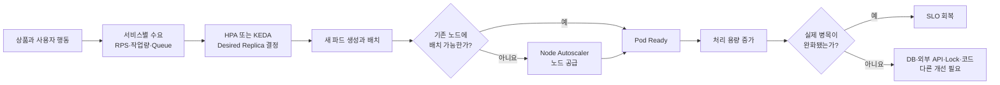
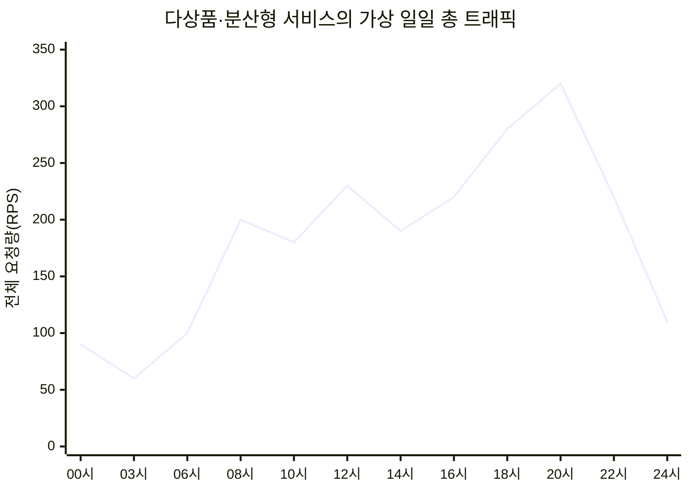
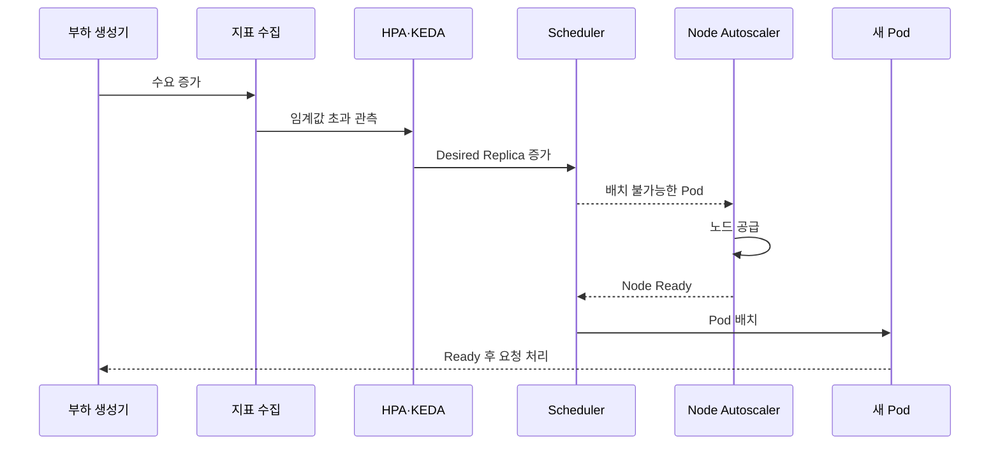
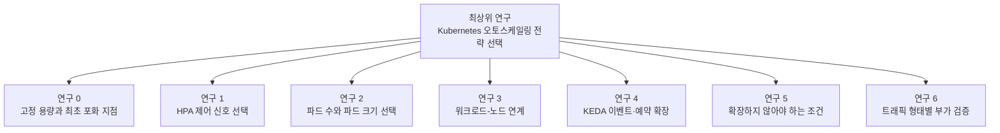
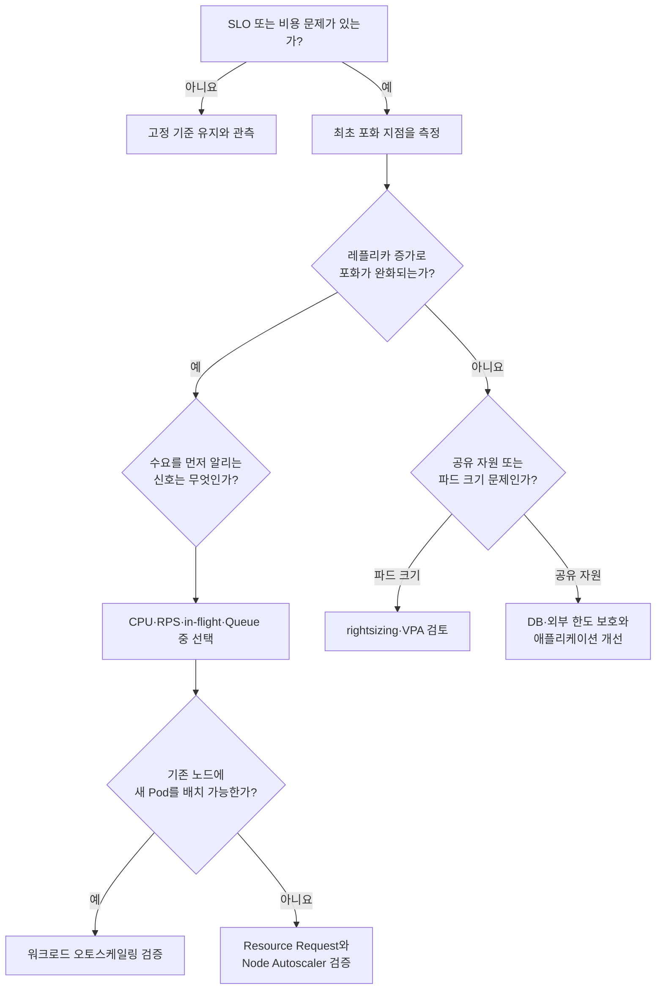

# Kubernetes 오토스케일링 전략 선택과 검증 연구 기획서

## 문서 정보

| 항목 | 내용 |
| --- | --- |
| 문서 상태 | 최상위 연구 기획 초안 |
| 작성일 | 2026-07-20 |
| 연구 분야 | Kubernetes, Workload Autoscaling, Node Autoscaling, KEDA, 서비스 성능, 관측성 |
| 연구 대상 | 오토스케일링을 처음 도입하거나 기존 전략을 근거 기반으로 재검증하려는 다서비스 환경 |
| 기본 비즈니스 환경 | 여러 상품이 하루 종일 거래되는 다상품·분산형 서비스 |
| 주 비교 기준 | 고정 용량, CPU 기반 HPA, 서비스 특성 기반 HPA/KEDA, 워크로드-노드 연계 전략 |
| 핵심 결과 | SLO 회복성, 자원 효율성, 비용, 확장 안정성, 적용 가능 조건과 한계 |
| 하위 연구 | `hpa-metric-selection-research-design.md`, `hpa-metric-selection-paper.md` |

## 기술 요약

이 연구는 가장 좋은 오토스케일러 하나를 고르는 연구가 아니다. 서비스에 수요가 발생했을 때 무엇이 먼저 포화되는지 확인하고, 그 포화를 줄일 수 있는 확장 축과 제어 신호를 선택한 뒤, 파드와 노드의 용량 증가가 실제 SLO 회복으로 이어지는지 검증하는 연구다.

이전 HPA 실험에서는 CPU 기반 HPA가 다섯 서비스에서 실제 레플리카 증가를 만들었고, HPA 결정 후 새 파드가 Ready가 되기까지 약 11~14초가 걸렸다. 그러나 스케일아웃이 발생한 다섯 서비스 중 `reservation-service`만 품질 기준을 통과했다. `concert-service`는 `1 -> 4` 확장에 성공했지만 실패율 34.64%, p99 약 14.9초, SQLAlchemy QueuePool 대기를 기록했다[6][7]. 이 결과는 다음 출발점을 제공한다.

> 레플리카 증가 성공과 서비스 품질 회복은 서로 다른 결과다.

따라서 연구의 단 하나의 목표는 다음과 같다.

> 서비스별 수요 특성과 최초 포화 지점에 맞는 Kubernetes 오토스케일링 전략을 선택하고, 같은 조건에서 SLO 회복성과 자원 효율성을 검증할 수 있는 재현 가능한 방법을 제시한다.

기본 시나리오는 특정 상품 오픈에 트래픽이 집중되는 환경이 아니다. 여러 상품과 여러 사용자 행동이 하루 종일 존재하고, 시간대와 요청 구성에 따라 서비스별 수요가 서로 다르게 변하는 환경이다. 특정 상품 집중, 순간적인 급증, 반복 피크, Queue 폭증은 선택된 전략의 적용 한계를 확인하는 부가 연구로 둔다.

## 1. 문서 목적

이 문서는 지금까지의 HPA 연구를 더 큰 Kubernetes 오토스케일링 연구 체계 안에 배치하고, 후속 실험을 실행하기 위한 최상위 연구 질문, 가설, 가정, 시나리오, 변수, 측정 지표, 통계 방법과 완료 기준을 정의한다.

이 문서는 기존 문서를 대체하지 않는다.

- [01 프로젝트 제안](../../members/observability/live-commerce/01-proposal.md), [02 검증 계획](../../members/observability/live-commerce/02-validation-plan.md), [03 발표 구성안](../../members/observability/live-commerce/03-presentation-plan.md)은 티켓 오픈 상황을 중심으로 한 프로젝트 검증 문서로 유지한다.
- `hpa-metric-selection-research-design.md`는 HPA 제어 신호 선택을 다루는 첫 번째 세부 연구로 유지한다.
- `hpa-metric-selection-paper.md`는 이전 HPA 실험을 서론으로 사용한 세부 논문 원고로 유지한다.
- 이 문서는 위 문서들을 연결하는 최상위 연구 기획서다.

## 2. 연구 주제의 발전

### 2.1 시작점: 관측 지표로 HPA를 판단한다

최초 아이디어는 HPA 설정과 레플리카 수를 직접 알기 어려운 환경에서 요청량, 자원 사용량, 지연시간, 오류와 포화 지표를 이용해 HPA의 동작과 영향을 추론하는 것이었다.

이 질문은 블랙박스 추론이라는 세부 연구 가치가 있다. 다만 HPA 상태를 전혀 확인할 수 없다면 수동 확장, 캐시, 배포, 외부 의존성 변화와 HPA 효과를 분리하기 어렵다. 따라서 정답을 아는 통제 실험 이후 HPA 정보를 숨기고 추정 정확도를 평가하는 단계로 배치한다.

### 2.2 최초 도입자를 위한 실험 이정표

연구는 특정 환경을 설명하는 데 그치지 않고 오토스케일링을 처음 도입하는 사람이 다음 질문에 답할 수 있어야 한다.

- 왜 오토스케일링을 도입하려는가?
- 고정 용량에서 어떤 한계가 먼저 나타나는가?
- 파드를 늘리면 실제 처리량과 SLO가 개선되는가?
- 어떤 지표가 SLO 위반보다 먼저 위험을 알리는가?
- 파드가 늘어날 때 노드는 필요한 시간 안에 공급되는가?
- 파드를 더 늘리는 것이 DB나 외부 의존성 문제를 악화시키지 않는가?
- 언제 자동 확장보다 사전 확장, 수직 조정, 요청 제한 또는 애플리케이션 개선이 필요한가?

### 2.3 CPU를 넘어선 HPA 지표 연구

세 번째 단계에서는 CPU를 유일한 기준으로 삼지 않고 RPS, 가중 요청량, in-flight requests, worker utilization, queue depth, oldest message age, consumer lag 등을 비교하는 HPA 지표 선택 연구로 구체화했다.

이 연구는 현재 HPA 지표 선택 연구 설계와 논문 원고에 보존한다. 최상위 연구에서는 이를 다음 질문의 일부로 다룬다.

> 수평 확장을 선택했다면 어떤 신호를 사용해야 하는가?

### 2.4 HPA에서 Kubernetes 오토스케일링 전략으로 확장

HPA는 파드 수를 조절하지만 다음 문제를 단독으로 해결하지 않는다.

- 파드 한 개에 필요한 CPU와 메모리의 크기
- 새 파드를 배치할 노드 용량
- Queue와 이벤트 적체에 맞는 활성화 조건
- 예상 가능한 시간대의 사전 용량 확보
- DB, 브로커, 외부 API 같은 공유 자원 한계

따라서 연구 범위를 HPA 설정 최적화가 아니라 확장 대상, 제어 신호, 반응 시점과 안전 상한을 함께 선택하는 Kubernetes 오토스케일링 전략으로 넓힌다.

### 2.5 특정 이벤트가 아닌 다상품·분산형 기본 환경

특정 상품 하나의 오픈 시점에 모든 거래가 집중되는 상황은 오토스케일링을 설명하기 쉽지만, 대표 비즈니스 환경으로 사용하면 결론이 순간 급증과 사전 확장에 치우칠 수 있다.

기본 환경은 다음과 같이 정의한다.

> 다양한 상품이 24시간 거래되고 매출과 주문이 여러 시간대에 분산되어 있지만, 사용자 행동과 요청 구성에 따라 서비스별 처리 수요는 계속 달라지는 환경

특정 상품 집중은 제거하지 않는다. 기본 시나리오가 아니라 예외 상황에 대한 견고성을 확인하는 부가 연구로 둔다.

## 3. 연구 제목과 핵심 질문

### 3.1 제안 제목

**서비스 수요와 병목에 맞는 Kubernetes 오토스케일링 전략은 어떻게 선택해야 하는가?**

### 3.2 부제

**다상품·분산형 서비스에서 HPA, KEDA, 수직 자원 조정과 Node Autoscaler의 연계 효과 검증**

### 3.3 영문 제목 후보

**Selecting Kubernetes Autoscaling Strategies by Workload Demand and Bottleneck: An Experimental Study of Workload and Node Capacity Coordination**

### 3.4 주 연구 질문

> **RQ1. 서비스별 수요 특성과 최초 포화 지점이 다를 때, 어떤 제어 신호와 확장 축을 선택해야 실제 유입 수요에 필요한 파드와 노드 가용 용량을 SLO 허용시간 안에 제공하고 수요 감소 후 적정 수준으로 회수할 수 있는가?**

### 3.5 세부 연구 질문

- **RQ2.** 고정 용량에서 최초로 포화되는 대상은 파드 CPU·메모리, 파드 동시 처리량, Queue, 공유 데이터 저장소, 외부 의존성, 노드 중 무엇인가?
- **RQ3.** CPU, RPS, 가중 요청량, in-flight requests, Queue와 consumer lag 중 어떤 지표가 서비스 유형별 수평 확장 신호에 적합한가?
- **RQ4.** 수평 확장, 수직 자원 조정, 이벤트 기반 확장, 예약된 사전 확장과 무확장 중 어떤 전략이 포화를 실제로 완화하는가?
- **RQ5.** 워크로드 오토스케일러의 레플리카 결정과 Node Autoscaler의 용량 공급 사이에서 어느 구간이 SLO 회복을 지연시키는가?
- **RQ6.** Resource Request의 과소·과대 설정은 파드 배치, 노드 공급, 비용과 통합 효율에 어떤 영향을 주는가?
- **RQ7.** 서비스별 피크 시간이 다를 때 공유 클러스터가 용량을 재사용하여 고정 최대 용량보다 효율적으로 운영되는가?
- **RQ8.** 트래픽 증가 속도, 지속시간, 반복성, 요청 구성과 상품 집중도가 전략 효과를 어떻게 바꾸는가?
- **RQ9.** 어떤 조건에서 레플리카 증가를 중단하고 캐시, 동시성 제한, Queue, DB 개선 또는 외부 의존성 보호를 먼저 선택해야 하는가?
- **RQ10.** 오토스케일링 상태를 숨긴 환경에서도 서비스·파드·노드 지표만으로 확장 사건과 SLO 회복 여부를 추론할 수 있는가?
- **RQ11.** 실제 유입 수요와 준비된 처리 용량 사이의 부족·과잉 면적은 전략별로 어떻게 다르며, KEDA를 포함한 제어 비용을 고려해도 순효율이 유지되는가?

## 4. 연구가 전달할 핵심 메시지

이 연구의 핵심 메시지는 다음과 같다.

> 오토스케일링의 핵심은 파드나 노드 수를 트래픽과 일대일로 늘리는 것이 아니라, 현재 포화된 용량의 종류를 찾아 실제 수요에 필요한 처리 용량을 SLO 위반 전에 제공하고 수요 감소 후 적정 수준으로 회수하는 것이다.

효과적인 전략은 다음 다섯 조건을 만족해야 한다.

1. 제어 신호가 SLO 위반보다 먼저 수요 또는 포화를 알린다.
2. 선택한 확장 축을 늘렸을 때 해당 포화 지표가 감소한다.
3. 파드와 노드의 준비가 필요한 시간 안에 완료된다.
4. SLO 회복이 DB, 브로커, 외부 API와 비용 예산 안에서 이루어진다.
5. 수요 감소 후 불필요한 파드와 노드가 과잉 용량 예산 안에서 회수된다.

## 5. 분석 계층과 오토스케일링 책임 경계

### 5.1 비즈니스 수요와 인프라 수요는 같지 않다

매출이 여러 시간대에 고르게 발생해도 서비스 요청량이 균일하다는 뜻은 아니다. 주문 수가 비슷해도 탐색, 로그인, 장바구니, 결제 재시도, 알림 작업 비율이 달라질 수 있다.

| 계층 | 대표 관측 대상 | 연구에서의 역할 |
| --- | --- | --- |
| 비즈니스 수요 | 상품 분포, 주문 수, 거래액, 전환율 | 수요가 발생한 이유 설명 |
| 서비스 수요 | API별 RPS, 가중 작업량, 동시 요청, Queue 유입 | 워크로드 제어 신호 후보 |
| 워크로드 용량 | Ready Replica, Pod CPU·메모리, worker, 처리율 | 파드 수준 확장 효과 |
| 클러스터 용량 | Pending Pod, allocatable, requested, Node 수 | 노드 수준 확장 효과 |
| 품질과 안전 | p95·p99, 오류율, Queue age, DB 연결, 외부 한도 | 결과 판정과 안전 상한 |

### 5.2 수요에서 SLO 회복까지의 인과 구조

다음 그림은 연구에서 검증할 전체 관계를 보여준다. 각 화살표는 자동으로 성공한다고 가정하지 않고 별도의 시간과 실패 원인을 측정한다.



이 그림에서 노드 수는 트래픽을 그대로 따라갈 필요가 없다. 기존 노드에 새 파드를 배치할 공간이 있다면 파드만 증가하고 노드 수는 유지되는 것이 정상이다. 성공 기준은 트래픽과 노드 수의 일대일 대응이 아니라 필요한 파드를 배치할 용량이 제때 확보되고 SLO가 회복되는 것이다.

### 5.3 기술별 책임

| 수단 | 직접 조절하는 대상 | 주 입력 | 이 연구에서의 위치 |
| --- | --- | --- | --- |
| 고정 용량 | 없음 | 사전 산정 | 비교 기준과 최소 안전 용량 |
| HPA | 워크로드 레플리카 | CPU, memory, Pods, Object, External metric | 온라인 서비스 수평 확장 |
| KEDA | 이벤트 감지와 HPA용 External metric, 0↔1 활성화 | Queue, lag, Prometheus, cron 등 | 이벤트·외부 지표 기반 워크로드 확장 |
| 수직 자원 조정/VPA | 파드 Resource Request와 Limit | 현재·과거 자원 사용량 | 파드 크기 조정과 rightsizing |
| Node Autoscaler | 노드 공급과 통합 | 스케줄 불가능한 파드, Pod Request, 노드 제약 | 워크로드 증가를 수용할 클러스터 용량 |
| 예약된 사전 확장 | 지정 시점의 최소 용량 | 운영 일정과 예측 | 반응형 확장보다 준비 시간이 긴 상황 |
| Backpressure·동시성 제한 | 허용 작업량 | DB·외부 한도 | 공유 자원 보호와 무확장 판단 |

KEDA와 Node Autoscaler를 직접 비교하지 않는다. KEDA는 워크로드 수요를 레플리카 요구량으로 바꾸는 계층이고, Node Autoscaler는 배치할 수 없는 파드를 수용할 노드를 공급하는 계층이다[1][4][5].

KEDA의 공식 동작에서 0↔1 활성화는 KEDA가 담당하고 1↔N 확장은 KEDA가 노출한 지표를 이용해 HPA가 결정한다[5]. Node Autoscaler는 실제 RPS를 직접 읽는 것이 아니라 주로 Pod Resource Request와 스케줄링 제약을 이용한다[4]. 이 책임 경계를 실험 해석의 전제로 둔다.

### 5.4 실제 수요와 노드 가용 용량의 정합성

이 연구에서 `노드 가용성`은 노드가 장애 없이 Ready 상태인지 나타내는 availability와 구분한다. 연구 대상은 특정 시점에 필요한 파드를 실제로 배치하고 실행할 수 있는 **노드 가용 용량(Node Available Capacity)** 이다.

노드 수가 트래픽과 같은 비율로 변할 필요는 없다. 기존 노드에 충분한 여유가 있다면 트래픽 증가를 새 파드만으로 수용하는 것이 정상이며, 서비스별 피크가 분산되면 같은 노드 용량을 시간대별로 재사용할 수 있다. 따라서 노드 수의 상관관계가 아니라 수요에 필요한 처리 용량이 요구 시점 안에 준비됐는지 평가한다.

수요를 필요한 파드 수로 변환하는 기본 관계는 다음과 같다.

```text
required_pods_i(t)
= ceil(weighted_workload_i(t) / verified_safe_capacity_per_pod_i)
```

`verified_safe_capacity_per_pod`는 추정값이 아니라 단일 파드 부하 실험에서 SLO를 만족한 안전 처리량으로 정한다. 요청 종류별 비용 차이가 크면 원시 RPS 대신 가중 작업량을 사용한다.

서비스 `i`와 자원 종류 `r`에 대한 노드 요구량은 다음과 같이 계산한다.

```text
required_node_request_r(t)
= Σ(required_pods_i(t) × pod_request_i,r)
+ safety_margin_r
```

이 값은 실제 CPU 사용량 예측이 아니라 스케줄러가 파드를 배치하기 위해 필요한 request 기준 용량이다. CPU, memory, accelerator와 topology 제약을 하나의 임의 점수로 합치지 않고 자원별로 계산한다. allocatable 총량이 충분해도 파편화, affinity, taint, zone과 최대 파드 수 때문에 배치하지 못할 수 있으므로 Pending Pod와 실제 스케줄링 결과를 함께 사용한다.

사용자 수요와 실제 Ready 처리 용량의 차이는 다음과 같이 정의한다.

```text
ready_workload_capacity_i(t)
= ready_pods_i(t) × verified_safe_capacity_per_pod_i

under_provision_area_i
= Σ max(0, required_workload_i(t) - ready_workload_capacity_i(t)) × interval

over_provision_area_i
= Σ max(0, ready_workload_capacity_i(t) - required_workload_i(t)) × interval
```

`required_workload`는 요청 종류별 비용을 반영한 작업량을 `verified_safe_capacity_per_pod`와 같은 처리량 단위로 환산한 값이다.

`under_provision_area`는 용량 부족의 크기와 지속시간을, `over_provision_area`는 과잉 용량의 크기와 지속시간을 나타낸다. 단순 node count와 평균 utilization보다 SLO 위반 전후의 용량 정합성을 직접 표현한다.

용량 제공의 성공은 다음 조건으로 판정한다.

1. 용량 부족 면적이 고정 용량과 CPU 기반 HPA 기준보다 작다.
2. 전체 용량 준비 시간이 SLO 허용시간 안에 들어온다.
3. Ready 용량 증가 후 SLO 회복이 관측된다.
4. Pending Pod, Queue 적체와 공유 자원 안전 지표가 허용 범위 안에 있다.
5. 수요 감소 후 파드와 노드가 과잉 용량 예산 안에서 회수된다.
6. KEDA operator, metrics server, webhook과 외부 메트릭 조회를 포함한 제어 비용을 차감해도 순자원 효율이 유지된다.

## 6. 이전 실험에서 얻은 예비 증거

### 6.1 확인된 사실

이전 실험은 새 연구의 결과가 아니라 가설을 만드는 예비 관찰이다[6].

| 서비스 | HPA 결과 | 결정 시점 | Ready 시점 | 품질 판정 | 예비 해석 |
| --- | ---: | ---: | ---: | --- | --- |
| auth | 1 → 2 | 118.354초 | 129.721초 | FAIL | spike p99 초과 |
| reservation | 1 → 2 | 217.723초 | 229.870초 | PASS | 수평 확장과 품질 유지 가능성 |
| ticket | 확장 없음 | - | - | PASS | CPU target을 유발할 부하 부족 |
| notification | 1 → 2 | 148.583초 | 160.480초 | FAIL | spike p99 초과 |
| payment | 1 → 3 | 88.011초 | 99.794초 | FAIL | 성능 한계와 오류 증가 |
| concert | 1 → 4 | 57.818초 | 71.969초 | FAIL | DB-bound read와 pool 대기 |

스케일아웃이 발생한 서비스는 HPA 결정 후 약 11~14초 안에 Ready Replica가 증가했다. 그러나 기계적인 HPA 반응만으로 품질 회복을 설명할 수 없었다.

### 6.2 concert-service 반례

`concert-service` 3차 실행에서는 HPA가 `1 -> 2 -> 3 -> 4`로 동작했지만 다음 결과가 나타났다[7].

| 항목 | 결과 |
| --- | ---: |
| 요청 실패율 | 34.64% |
| 평균 지연시간 | 4,176.96ms |
| p95 | 10,507.47ms |
| p99 | 14,885.30ms |
| SQLAlchemy QueuePool limit 로그 | 2,360건 |
| SQLAlchemy TimeoutError | 1,180건 |
| PostgreSQL `too many clients already` | 0건 |

이는 PostgreSQL 서버의 최대 연결 수 초과가 직접 재발한 사례는 아니지만, 애플리케이션 worker별 연결 풀 대기와 endpoint 지연이 유지된 사례다. 레플리카 증가가 애플리케이션 동시성을 늘려도 공유 DB 경로가 충분히 빨라지지 않으면 사용자 품질은 회복되지 않을 수 있다는 가설을 만든다.

### 6.3 아직 확인하지 못한 것

이전 실험으로 다음 내용을 결론 내리지 않는다.

- CPU가 다른 모든 지표보다 나쁘다는 결론
- KEDA가 CPU 기반 HPA보다 우수하다는 결론
- 노드 공급 시간이 이전 실패의 원인이었다는 결론
- 운영 환경의 `minReplicas`, `maxReplicas`와 비용 최적값
- 특정 트래픽 형태에서 전략별 우열
- 서비스 간 공유 노드 용량의 재사용 효과

## 7. 연구 가정과 전제 조건

가정은 결과가 아니다. 실험을 해석할 수 있도록 고정하거나 검증해야 하는 조건이다. 조건이 깨지면 실행을 실패로 숨기지 않고 해당 가정 위반으로 기록한다.

### A1. 재현 가능한 수요

동일한 seed, 데이터셋, 요청 구성과 단계별 부하를 다시 실행할 수 있어야 한다. 요청 수뿐 아니라 endpoint 비율, payload 크기와 상품 분포를 기록한다.

### A2. 시간축 정합성

부하 생성기, 애플리케이션, Prometheus, Kubernetes 이벤트와 클라우드 공급 이벤트의 시간이 동기화돼야 한다. 시간 오차가 주요 지연 지표보다 크면 해당 실행은 시간 비교에서 제외한다.

### A3. 수평 확장 가능성의 사전 검증

대상 워크로드는 고정 레플리카를 1, 2, 4로 늘렸을 때 처리량 또는 SLO가 개선되는지 먼저 확인한다. 개선이 없다면 HPA/KEDA target 비교보다 병목 분석을 우선한다.

### A4. Resource Request의 명시

CPU와 memory request, limit, worker 수, sidecar overhead를 기록한다. CPU utilization과 Node Autoscaler의 판단을 Request 없이 해석하지 않는다.

### A5. 하위 시스템 예산의 고정

DB max connections, 파드별 worker와 pool, 브로커 partition, 외부 API quota, 캐시 정책을 실행 간 고정한다. 변경할 경우 별도 실험 처리로 분리한다.

### A6. 애플리케이션 동일성

이미지 digest, 설정, feature flag, 데이터 revision과 배포 정책을 고정한다. 오토스케일링 전략 비교 중 애플리케이션 최적화를 함께 적용하지 않는다.

### A7. 노드 공급 가능성

Node Autoscaler 실험에서는 공급 한도, 가용 인스턴스 종류, zone, quota와 최대 노드 수를 확인한다. 클라우드 공급 부족은 전략 실패와 구분한다.

### A8. 충분한 관측 가능성

Desired Replica, Ready Replica, Pending Pod, Pod Request, Node allocatable, SLO, DB·Queue 안전 지표를 수집할 수 있어야 한다. 제어 지표를 수집할 수 없으면 해당 전략의 원인 해석 수준을 낮춘다.

### A9. 정상적인 트래픽 분산

새 파드가 Ready가 된 뒤 실제 요청을 받는지 확인한다. readiness, endpoint 등록, connection reuse 또는 sticky session 때문에 일부 파드에만 요청이 몰리면 오토스케일러가 아닌 분산 문제로 분리한다.

## 8. 연구 가설

### 8.1 주 가설

> **H1. 서비스의 부하 특성, 실제 포화 지점, 확장 가능한 자원, 파드·노드 준비 시간을 함께 고려해 선택한 오토스케일링 전략은 CPU 기반 HPA를 일괄 적용한 전략보다 SLO 위반과 불필요한 자원 사용을 줄일 것이다.**

### 8.2 귀무가설

> **H0. 서비스 특성과 병목을 고려한 전략 선택은 CPU 기반 HPA와 비교했을 때 SLO 회복성과 자원 효율성에 유의미한 차이를 만들지 않는다.**

### 8.3 확인적 하위 가설

| ID | 가설 | 반증 조건의 예 |
| --- | --- | --- |
| H1-a | 서비스 수요를 직접 나타내고 레플리카 증가로 감소하는 신호는 CPU보다 SLO 위반을 더 일찍 예고할 수 있다. | 선행 시간이 없거나 SLO·비용 개선이 없음 |
| H1-b | 수평 확장 가능한 서비스에서는 서비스 특성 기반 HPA/KEDA가 고정 용량 또는 CPU 일괄 전략보다 SLO 위반 면적을 줄인다. | 고정 용량이나 CPU 전략과 차이가 없거나 더 나쁨 |
| H1-c | DB·외부 API 같은 공유 자원 병목에서는 공격적인 레플리카 증가가 품질을 회복하지 못하고 경합 또는 비용을 늘릴 수 있다. | 레플리카 증가에 따라 처리량이 선형 개선되고 안전 지표가 유지됨 |
| H1-d | 새 파드가 기존 노드에 배치되지 못할 때 Node Autoscaler 공급 시간이 SLO 허용 시간보다 길면 반응형 워크로드 확장만으로 순간 증가를 보호할 수 없다. | 노드 준비 전에도 SLO가 유지되거나 공급 시간이 영향 없음 |
| H1-e | Resource Request가 실제 필요량보다 작으면 노드 공급이 늦고, 크면 불필요한 노드 용량과 비용이 증가한다. | Request 오차가 배치·비용·SLO에 차이를 만들지 않음 |
| H1-f | 서비스별 피크 시점이 다르면 공유 클러스터가 노드 용량을 재사용하여 서비스별 최대 고정 용량의 합보다 적은 비용으로 SLO를 유지한다. | 노드 시간과 여유 용량이 줄지 않거나 SLO가 악화됨 |
| H1-g | 같은 전략이라도 트래픽 증가 속도, 지속시간, 반복성, 요청 구성과 상품 집중도에 따라 효과가 달라진다. | 전략과 트래픽 형태의 상호작용이 관측되지 않음 |
| H1-h | 짧은 순간 증가에서는 반응형 확장보다 최소 여유 용량 또는 예약된 사전 확장이 SLO 위반을 더 줄인다. | 반응형 전략이 동일하거나 더 빠르게 회복 |
| H1-i | 수요와 병목에 맞는 워크로드-노드 연계 전략은 CPU 기반 HPA보다 용량 부족 면적을 줄이면서 과잉 용량과 제어 비용을 사전 예산 안에 유지한다. | 부족 면적이 감소하지 않거나 과잉 용량·제어 비용 증가가 품질 개선보다 큼 |

하위 가설은 모두 한 번에 확인하지 않는다. 단계별 연구에서 독립변수를 제한하고, 각 연구가 시작되기 전에 해당 가설과 1차 결과 지표를 고정한다.

## 9. 기본 비즈니스 시나리오

### 9.1 24시간 다상품·분산형 서비스

기본 시나리오는 여러 상품에서 하루 종일 조회와 거래가 발생한다. 시간대별 차이는 있지만 특정 상품 하나나 특정 시점만 전체 결과를 지배하지 않는다.

다음 그림은 실제 측정값이 아니라 실험 시나리오를 설명하기 위한 가상 입력이다. RPS 값은 실험 환경의 단일 파드 안전 용량을 측정한 뒤 비율을 유지하면서 다시 산정한다.



그래프는 하루 종일 기본 수요가 존재하면서 오전, 점심, 저녁의 사용자 행동 차이에 따라 총 요청량이 달라지는 상황을 표현한다. 실제 실험은 24시간 그래프를 임의로 짧게 압축하지 않는다. 오토스케일러의 감지, 파드 시작과 노드 공급 시간이 왜곡될 수 있으므로 중요한 구간을 현실적인 지속시간의 별도 실행으로 나눈다.

### 9.2 서비스별 수요가 달라지는 이유

전체 거래가 분산되어도 서비스별 수요는 다음 요인으로 서로 다르게 변한다.

| 서비스 유형 | 수요를 만드는 행동 | 대표 수요 지표 | 예상되는 최초 포화 |
| --- | --- | --- | --- |
| 상품·공연 조회 | 탐색, 검색, 상세 조회 | RPS, 가중 RPS, cache miss | CPU, DB read, cache |
| 인증 | 로그인, 토큰 갱신 | RPS, CPU, in-flight | CPU, 저장소, 암호 연산 |
| 예약·주문 | 구매 전환, 재고 확보 | in-flight, lock wait, 성공 주문률 | DB lock, transaction |
| 결제 | 승인, 실패, 재시도 | in-flight, 외부 latency, quota | 외부 API, connection |
| 발권·처리 | 완료 작업 생성 | 작업률, Queue, 처리 시간 | CPU, 저장소, worker |
| 알림 | 주문 이후 비동기 작업 | Queue depth, oldest age, lag | consumer, broker |

전체 RPS가 일정해도 가벼운 조회에서 무거운 주문·결제로 요청 구성 비율이 변하면 실제 자원 수요가 달라질 수 있다. 이 때문에 원시 총 RPS만으로 모든 서비스를 함께 확장하지 않는다.

### 9.3 상품 수요 분포

기본 시나리오에서는 상품 집중도를 별도 변수로 기록한다. 특정 상품 하나가 전체 요청을 지배하지 않도록 기본 분포의 상한을 정하되, 정확한 상한은 가상으로 고정하지 않고 데이터셋과 비즈니스 가정에서 산정한다.

비교할 분포는 다음과 같다.

- 다수 상품에 비교적 고르게 분산된 수요
- 일부 인기 상품이 존재하는 long-tail 수요
- 소수 상품에 일시적으로 집중된 수요

상품 집중도는 전체 RPS와 별개다. 같은 RPS에서도 집중도가 높으면 캐시 key, DB row, partition, lock 경합이 달라질 수 있다.

## 10. 부가 연구: 트래픽 형태에 따른 적용 한계

부가 연구는 주 연구에서 선택된 전략의 일반화 가능성과 한계를 확인한다. 모든 서비스, 모든 전략, 모든 트래픽 형태를 완전 조합하지 않는다. 대표 서비스 유형과 상위 전략만 선택한다.

### 10.1 비교할 트래픽 형태

| ID | 트래픽 형태 | 통제할 조건 | 확인 질문 |
| --- | --- | --- | --- |
| P1 | 점진 증가 대 순간 증가 | 최대 RPS 동일 | 증가 속도가 확장 성공을 바꾸는가? |
| P2 | 짧은 급증 대 지속 고부하 | 최대 RPS 동일 | 반응형 확장이 기여할 충분한 시간이 있는가? |
| P3 | 단일 피크 대 반복 microburst | 전체 요청 수 동일 | 반복 확장·축소와 진동이 발생하는가? |
| P4 | 요청 구성 변화 | 평균 RPS 동일 | 무거운 API 비율을 원시 RPS가 설명하는가? |
| P5 | 서비스별 피크 분산 대 동시 발생 | 서비스별 전체 요청 수 동일 | 공유 노드 용량 재사용 효과가 있는가? |
| P6 | 상품 수요 분산 대 집중 | 전체 RPS 동일 | 캐시·DB·Lock 병목이 달라지는가? |
| P7 | Queue 유입의 점진 증가 대 burst | 전체 메시지 수 동일 | Queue depth, oldest age, lag 중 무엇이 적합한가? |
| P8 | 유휴 상태에서 재활성화 | 첫 요청 수와 간격 동일 | scale-to-zero의 비용 절감이 첫 요청 지연을 정당화하는가? |
| P9 | 예측 가능한 캠페인·상품 오픈 | peak와 지속시간 동일 | 예약된 사전 확장이 반응형 전략보다 유리한가? |

### 10.2 부가 연구 가설

> **트래픽 형태는 오토스케일링 전략과 SLO·효율 결과 사이의 조절 변수다. 동일 전략도 증가 속도, 지속시간, 반복성, 요청 구성과 집중도에 따라 효과가 달라질 것이다.**

통계 분석에서는 전략의 주효과뿐 아니라 `전략 × 트래픽 형태` 상호작용을 확인한다.

### 10.3 가상 순간 증가와 용량 지연

다음 그림은 실제 결과가 아니라 부가 연구가 확인하려는 시간 차이를 설명한다.



순간 증가에서는 이 전체 시간이 부하 지속시간보다 길 수 있다. 이 경우 KEDA 또는 HPA가 올바르게 동작해도 해당 급증의 SLO를 회복시키지 못할 수 있다.

## 11. 연구 프로그램과 기존 문서의 위치

최상위 연구를 다음 세부 연구로 나눈다. 순서는 원인 분리를 위해 중요하다.



| 세부 연구 | 핵심 질문 | 선행 조건 | 주요 산출물 |
| --- | --- | --- | --- |
| 연구 0 | 고정 용량에서 무엇이 먼저 포화되는가? | 계측 검증 | 단일 파드 용량, 고정 레플리카 확장성 |
| 연구 1 | 수평 확장에 어떤 지표를 사용할 것인가? | 연구 0 | HPA 지표 선택 세부 연구 결과 |
| 연구 2 | 파드 수와 파드 크기 중 무엇을 바꿀 것인가? | 자원 사용 분포 | HPA 대 rightsizing/VPA 선택 기준 |
| 연구 3 | 새 파드를 수용할 노드를 어떻게 공급할 것인가? | 연구 1, Request 검증 | Pending·Node Ready·비용 비교 |
| 연구 4 | 이벤트와 예측 가능한 일정에 어떻게 대응할 것인가? | Queue·일정 재현 | KEDA, scale-to-zero, cron·사전 확장 기준 |
| 연구 5 | 어떤 병목에서는 확장을 중단해야 하는가? | 공유 자원 계측 | DB·외부 의존성 안전 상한과 대안 |
| 연구 6 | 선택한 전략은 어떤 트래픽 형태까지 유효한가? | 상위 전략 선정 | 적용 조건, 실패 경계, 견고성 결과 |

## 12. 실행 단계

### 단계 0. 연구 사전 등록

- 주 가설, 1차 결과 지표, 제외 기준과 비교 전략을 실행 전에 고정한다.
- 새 실험 결과와 이전 예비 관찰을 구분한다.
- 예상과 다른 실패도 제거하지 않고 결과에 포함한다.

### 단계 1. 계측과 시간 검증

- 부하 생성기의 요청 수와 게이트웨이·서비스 수신량을 대조한다.
- HPA/KEDA 지표 값과 Prometheus 원시 값을 대조한다.
- Desired, Current, Ready Replica와 Pod lifecycle event를 수집한다.
- Pending 원인과 Node 공급 이벤트를 수집한다.
- 모든 데이터에 공통 `run_id`와 상대 시간을 부여한다.

### 단계 2. 고정 단일 파드 용량

- 오토스케일링을 끄고 레플리카 1로 측정한다.
- warmup 이후 RPS 또는 작업량을 단계적으로 높인다.
- 최초 SLO 위반과 최초 포화 지표를 기록한다.
- 요청 구성과 상품 분포를 바꿔 요청 비용 차이를 확인한다.

### 단계 3. 고정 레플리카 수평 확장성

- 같은 부하를 레플리카 1, 2, 4에서 비교한다.
- 처리량, SLO, 성공 요청당 자원과 공유 자원 사용량을 측정한다.
- 레플리카 증가에도 개선되지 않는 서비스는 워크로드 오토스케일러 비교 대상과 병목 개선 대상으로 분리한다.

### 단계 4. 노드 용량을 고정한 워크로드 전략 비교

노드 용량을 충분히 사전 확보한 상태에서 다음을 비교한다.

1. 고정 레플리카
2. CPU 기반 HPA
3. 서비스 특성 기반 HPA 또는 KEDA
4. 예측 가능한 구간의 사전 확장

이 단계에서는 Node Autoscaler를 개입시키지 않는다. 워크로드 제어 신호와 노드 공급 지연을 동시에 바꾸지 않기 위해서다.

### 단계 5. 제한된 노드 용량에서 연계 비교

상위 워크로드 전략을 선택한 뒤 기존 노드의 여유를 제한하고 Node Autoscaler를 결합한다.

- Request가 정확한 조건
- Request가 실제 필요량보다 작은 조건
- Request가 실제 필요량보다 큰 조건
- 충분한 warm node가 있는 조건
- 최소 노드만 있는 조건

이 단계에서 파드 확장, Pending, Node 공급과 SLO 회복을 하나의 시간축으로 분석한다.

### 단계 6. 다서비스 통합 실험

서비스별 분리 실험에서 임계값과 안전 상한을 얻은 뒤 다상품·분산형 기본 시나리오를 통합 실행한다.

- 서비스별 peak가 서로 다른 조건
- 여러 서비스 peak가 겹치는 조건
- 공유 DB 또는 외부 의존성이 정상인 조건
- 하위 시스템 지연이 있는 조건

통합 실험은 서비스별 원인을 이미 좁힌 뒤 수행한다. 통합 실행부터 시작하면 서비스 간 간섭과 노드 공급 지연을 분리하기 어렵다.

### 단계 7. 부가 트래픽 형태 실험

주 연구에서 선택된 상위 전략만 P1~P9 중 관련 있는 형태에 적용한다. 모든 조합을 실행하지 않고 가설을 반증할 가능성이 높은 조건을 우선한다.

### 단계 8. 블라인드 분석

HPA/KEDA/Replica/Node 상태를 숨긴 데이터 묶음을 별도로 만들고 서비스 지표만으로 다음을 추정한다.

- 확장 시작 시점
- 용량 준비 시점
- SLO 회복 여부
- 잘못된 확장 축을 선택한 실행

추정 결과는 ground truth와 비교한다.

## 13. 실험 비교군

모든 비교군을 모든 서비스에 적용하지 않는다. 서비스가 해당 전략으로 해결할 수 있는 병목을 가졌는지 연구 0에서 확인한 뒤 선택한다.

| 코드 | 전략 | 사용 목적 |
| --- | --- | --- |
| C0 | 고정 안전 용량 | 기준선과 비용 상한 |
| C1 | CPU 기반 HPA | 기존 관행 비교 기준 |
| C2 | RPS·가중 RPS 기반 HPA/KEDA | 요청 비용이 비교적 안정적인 온라인 서비스 |
| C3 | in-flight·worker utilization 기반 HPA/KEDA | I/O·동시 처리 포화 서비스 |
| C4 | Queue·lag·oldest age 기반 KEDA | 비동기 worker |
| C5 | 사전 확장+반응형 확장 | 예측 가능한 피크와 느린 노드 공급 |
| C6 | rightsizing/VPA 후 HPA | Request 오차와 파드 크기 문제 |
| C7 | 워크로드 전략+Node Autoscaler | 파드와 노드 용량 연계 |
| C8 | 확장 제한+Backpressure | DB·외부 의존성 보호 |

## 14. 변수 정의

### 14.1 독립변수

- 오토스케일링 전략
- 제어 신호와 target
- min/max replicas
- HPA behavior, stabilization, KEDA polling/cooldown
- Pod CPU·memory request와 limit
- 노드 최소·최대 수와 공급 정책
- 트래픽 형태
- 요청 구성과 상품 집중도
- 서비스 유형과 공유 자원 상태

### 14.2 종속변수

- SLO 위반 지속시간과 위반 면적
- p95, p99, 오류율과 성공률
- Queue oldest age와 처리 지연
- 부하 시작부터 Desired Replica 증가까지의 시간
- Desired Replica 증가부터 Ready Replica 증가까지의 시간
- Pending Pod 시간과 Node 공급 시간
- 부하 시작부터 SLO 회복까지의 시간
- 실제 수요 대비 Ready 처리 용량의 부족·과잉 면적
- 수요 감소부터 불필요한 파드·노드 회수까지의 시간
- 성공 요청당 pod-seconds, CPU-seconds, node-seconds
- 노드 비용과 유휴 용량
- KEDA 제어 계층 CPU·memory와 외부 메트릭 조회량
- 레플리카·노드 증감 횟수와 재시작·축출
- DB 연결, pool wait, lock wait, 외부 quota 사용량

### 14.3 통제변수

- 애플리케이션 이미지와 설정
- 데이터셋 revision과 크기
- endpoint별 요청 비율과 payload
- 부하 생성기 위치와 네트워크
- DB, broker, cache와 외부 mock 설정
- worker 수와 connection pool
- Prometheus scrape와 adapter refresh 설정
- Kubernetes, KEDA와 Node Autoscaler 버전
- 노드 타입, zone, quota와 클러스터 add-on
- 실행 전 warmup과 실행 후 cooldown

### 14.4 조절변수

부가 연구에서 트래픽 형태, 상품 집중도, 서비스 peak 동시성과 하위 시스템 지연을 조절변수로 취급한다. 주 분석에서는 전략 효과를, 부가 분석에서는 전략 효과가 이 조건에 따라 달라지는지를 본다.

## 15. 핵심 시간 지표

각 실행은 다음 시점을 기록한다.

| 기호 | 시점 |
| --- | --- |
| t0 | 부하 변화 시작 |
| t1 | 후보 지표가 사전 고정한 임계값 도달 |
| t2 | Desired Replica 증가 |
| t3 | 새 Pod 생성 |
| t4 | Pod가 Pending 또는 Scheduling 상태 진입 |
| t5 | Node 공급 시작 |
| t6 | Node Ready |
| t7 | 새 Pod Ready와 endpoint 등록 |
| t8 | SLO 회복 |
| t9 | scale-down 또는 node consolidation 시작 |
| t10 | 안정 상태 복귀 |

다음 값을 계산한다.

```text
signal_lead_time = SLO 최초 위반 시점 - t1
workload_decision_latency = t2 - t0
pod_ready_latency = t7 - t2
node_provision_latency = t6 - t5
end_to_end_capacity_latency = t7 - t0
slo_recovery_latency = t8 - t0
pending_pod_seconds = 각 Pending Pod 지속시간의 합
```

노드 추가가 없었던 실행에서는 `node_provision_latency`를 0으로 기록하지 않고 `not_applicable`로 기록한다. 기존 노드 여유로 파드가 배치된 것과 즉시 노드가 공급된 것을 구분하기 위해서다.

## 16. 품질과 효율 지표

### 16.1 1차 결과 지표

최상위 연구의 공동 1차 결과는 `SLO violation area`와 `under_provision_area`로 둔다. 전자는 사용자 품질 위반의 크기와 지속시간을, 후자는 실제 수요에 비해 Ready 처리 용량이 부족했던 크기와 지속시간을 나타낸다.

```text
SLO_violation_area
= 각 관측 구간에서 max(0, observed_value - SLO_threshold) × interval
```

Latency와 오류율은 단위가 다르므로 별도의 위반 면적을 계산한다. `under_provision_area`도 이 값과 하나의 임의 점수로 합치지 않는다. 각 결과를 공동 1차 결과 또는 사전 지정된 서비스별 1차 결과로 분석하고, `over_provision_area`는 품질 개선을 위해 과도한 용량을 사용했는지 판정하는 안전 지표로 둔다.

### 16.2 보조 결과 지표

```text
successful_requests_per_pod_second
= successful_requests / total_pod_seconds

successful_requests_per_node_second
= successful_requests / total_node_seconds

capacity_headroom_ratio
= (allocatable_capacity - requested_capacity) / allocatable_capacity

scale_efficiency
= throughput_improvement_ratio / resource_increase_ratio
```

비용은 가능한 경우 실제 노드 시간과 가격으로 계산한다. 로컬 환경에서는 비용을 직접 주장하지 않고 node-seconds, vCPU-seconds, memory-GiB-seconds를 대리 지표로 사용한다.

### 16.3 공유 자원 안전 지표

- DB connection usage와 wait
- connection pool checkout wait와 timeout
- DB query latency와 lock wait
- broker partition별 lag
- cache hit·miss와 stampede 징후
- 외부 API quota, timeout, retry
- 네트워크 연결과 ephemeral port

DB 연결 예산은 다음 관계를 기본 점검식으로 사용한다.

```text
application_connection_budget
= maxReplicas × workersPerPod × (poolSize + maxOverflow)
```

이 값은 실제 동시 연결 수와 같다고 가정하지 않는다. 설정이 허용하는 최대 노출 범위를 계산해 DB 예산과 비교하는 안전 상한이다.

### 16.4 수요-가용 용량 정합성 지표

수요와 용량이 함께 증가하는지 단순 상관계수만으로 판정하지 않는다. 제어 지연이 있는 시계열에서는 같은 방향의 변화가 있어도 필요한 시점보다 늦게 용량이 도착할 수 있기 때문이다.

- `under_provision_area`: 필요한 처리량보다 Ready 처리 용량이 부족했던 면적
- `over_provision_area`: 필요한 처리량보다 Ready 처리 용량이 과도했던 면적
- `capacity_readiness_latency`: 수요 변화부터 필요한 Ready 처리 용량 확보까지의 시간
- `demand_coverage_ratio`: 관측 구간 중 Ready 처리 용량이 필요 처리량 이상이었던 시간 비율
- `scale_in_recovery_latency`: 수요 감소부터 파드·노드가 사전 정의한 적정 범위로 돌아오기까지의 시간
- `pending_pod_seconds`: 노드 용량 부족 또는 스케줄링 제약으로 배치되지 못한 파드 시간의 합

KEDA를 사용한 조건에서는 다음 순효율도 별도로 계산한다.

```text
net_resource_benefit
= removed_workload_pod_seconds
- keda_control_plane_pod_seconds
- external_metric_query_cost
- additional_node_idle_cost
```

서로 다른 단위를 억지로 하나의 금액으로 환산하지 않는다. 실제 비용을 확보할 수 없으면 pod-seconds, CPU-seconds, memory-GiB-seconds, API query count와 node-seconds를 별도 결과로 보고한다.

## 17. 전략 판정 기준

오토스케일링 전략은 다음 여섯 질문을 모두 통과해야 채택 후보가 된다.

1. 제어 신호가 수요 또는 포화를 안정적으로 측정하는가?
2. 제어 신호가 SLO 위반보다 충분히 먼저 반응하는가?
3. 선택한 확장 축을 늘리면 제어 신호와 SLO가 개선되는가?
4. 파드와 노드 준비 시간이 부하 지속시간 안에 들어오는가?
5. 공유 자원과 비용 예산을 넘지 않는가?
6. 수요 감소 후 용량이 적정 시간 안에 회수되고 KEDA를 포함한 제어 비용을 차감해도 순효율이 유지되는가?

### 17.1 초기 선택표

| 관측 결과 | 우선 검토 전략 | 피해야 할 성급한 결론 |
| --- | --- | --- |
| CPU와 지연이 함께 증가하고 고정 레플리카 확장성이 좋음 | CPU HPA | CPU가 모든 서비스에 보편적이라고 판단 |
| CPU는 낮지만 in-flight와 worker 대기가 증가 | in-flight·worker 기반 HPA/KEDA | CPU가 낮으므로 용량이 충분하다고 판단 |
| 요청당 비용이 일정하고 파드당 RPS가 확장 후 감소 | RPS 기반 HPA/KEDA | 전체 RPS를 파드당 지표처럼 사용 |
| 요청 종류별 처리 비용 차이가 큼 | 가중 RPS 또는 in-flight | 원시 RPS 하나로 동일 취급 |
| Queue와 oldest age가 증가 | KEDA Queue·lag·age | CPU가 오를 때까지 대기 |
| memory working set이 장기적으로 과대·과소 설정 | rightsizing/VPA 검토 | 즉시 레플리카만 증가 |
| Pending Pod와 부족한 allocatable이 증가 | Node Autoscaler와 Request 검증 | KEDA가 직접 노드를 늘린다고 해석 |
| DB pool wait·lock·외부 quota가 먼저 포화 | 확장 상한, Backpressure, 애플리케이션 개선 | maxReplicas만 계속 증가 |
| 예측 가능한 피크가 노드 준비 시간보다 짧음 | 사전 확장+반응형 확장 | 반응형 설정만 공격적으로 조정 |

### 17.2 의사결정 구조

다음 그림은 특정 도구를 먼저 고르지 않고 문제, 포화 지점, 확장 가능성, 배치 용량 순으로 전략을 좁히는 판정 순서를 보여준다.



## 18. 통계 분석 계획

### 18.1 분석 단위

독립된 부하 실행 한 번을 기본 분석 단위로 한다. 시계열의 매초 값을 독립 표본으로 세어 표본 수를 부풀리지 않는다.

### 18.2 반복 횟수

- 예비 실험은 각 조건을 최소 3회 실행해 분산, 수집 실패와 효과 크기를 확인한다.
- 본 실험 반복 횟수는 예비 실험의 효과 크기와 분산을 이용해 정한다.
- 충분한 검정력을 계산하지 못한 소표본 결과는 탐색적 결과로 표시한다.

### 18.3 무작위화와 block

- 전략 실행 순서를 무작위화한다.
- 날짜, 시간, 클러스터 상태와 노드 이미지 상태를 block으로 기록한다.
- 같은 전략을 연속 실행해 warm cache나 이미지 pull 효과가 특정 전략에만 유리하게 작용하지 않도록 한다.
- 첫 실행의 cold start 효과를 연구하려는 경우와 제거하려는 경우를 구분한다.

### 18.4 주 분석

- 각 전략의 SLO violation area와 SLO recovery latency를 CPU HPA 및 고정 용량과 비교한다.
- 각 전략의 under-provision area와 over-provision area를 함께 비교해 부족을 줄이기 위해 과잉 용량을 과도하게 늘렸는지 확인한다.
- capacity readiness latency와 SLO recovery latency의 차이를 분석해 용량이 준비된 뒤에도 남는 애플리케이션·공유 자원 지연을 구분한다.
- 중앙값 차이, 백분율 변화, bootstrap 95% 신뢰구간과 효과 크기를 함께 제시한다.
- 평균만으로 p95·p99와 tail failure를 대체하지 않는다.
- 전략과 트래픽 형태를 함께 비교할 때 `strategy`, `traffic_pattern`, `strategy × traffic_pattern`을 고정효과로 둔다.
- 실행 날짜나 클러스터 상태의 반복 영향이 크면 이를 임의효과 또는 block 효과로 다룬다.

### 18.5 다중 비교와 사후 분석

- 서비스별 1차 비교와 결과 지표를 사전에 제한한다.
- 여러 전략을 탐색할 때 보정된 신뢰구간 또는 false discovery rate를 사용한다.
- 사후에 발견한 패턴은 확인적 결론이 아니라 후속 가설로 표시한다.

### 18.6 결측과 실패 실행

- metric adapter 오류, Node 공급 실패, 부하 생성기 오류를 구분한다.
- 오토스케일링 실패를 단순 결측으로 제거하지 않는다.
- 실험 인프라 오류로 제외할 경우 사전 정의한 제외 기준과 건수를 보고한다.

## 19. 데이터 수집과 실행 계약

### 19.1 실행별 필수 메타데이터

- `run_id`
- 연구·시나리오·전략 ID
- 실행 시작과 종료 시각
- 코드 commit과 image digest
- Kubernetes, KEDA, metrics adapter, Node Autoscaler 버전
- HPA/KEDA/VPA/Node 정책 전체 설정
- Pod request, limit, worker, pool
- 노드 타입, 최소·최대 수, zone, quota
- DB, broker, cache, 외부 mock 설정
- 데이터셋 revision, 상품 수와 상품 집중도
- endpoint별 요청 비율과 부하 profile
- warmup, steady, increase, recovery, cooldown 구간
- SLO와 안전 예산
- 제외 또는 경고 사유

### 19.2 원시 증거

- 부하 생성기 summary와 시계열
- Prometheus query 결과 또는 snapshot
- HPA, ScaledObject, VPA와 Node Autoscaler 상태
- Kubernetes event와 Pod lifecycle
- 애플리케이션·DB·broker 오류 집계
- 실행 환경 manifest
- 분석 코드와 생성된 차트

### 19.3 보안 경계

다음 데이터는 연구 산출물과 관측 데이터에 저장하지 않는다.

- 비밀번호, OTP, JWT와 session cookie
- 실제 사용자 개인정보와 결제정보
- Secret 원문과 credential이 포함된 URL
- 원문 Redis key/value와 민감한 환경변수
- 사용자 식별이 가능한 raw payload

실패 보고서는 민감한 로그 원문 대신 오류 유형, 집계 건수, 안전하게 축약한 메시지를 사용한다.

## 20. 시각화 계획

가상 시나리오와 실제 결과의 시각화 역할을 구분한다.

### 20.1 Mermaid를 사용하는 대상

- 연구 계층과 기술 책임 경계
- 가상 트래픽 형태
- 파드와 노드가 준비되는 단계
- 연구 프로그램과 의사결정 구조

Mermaid의 가상 수치는 실제 관측값으로 오해하지 않도록 제목과 본문에 가상 입력이라고 표시한다.

| 문서 위치 | 시각 자료 | 분석 질문 | 표현 방식 |
| --- | --- | --- | --- |
| 5.2 | 수요에서 SLO 회복까지 | 어느 계층에서 용량 준비가 지연되거나 병목이 남는가? | 조건 분기 flowchart |
| 9.1 | 가상 일일 총 트래픽 | 다상품·분산형 기본 수요는 어떤 모양인가? | 단일 series line |
| 10.3 | 순간 증가와 용량 지연 | 감지부터 Pod Ready까지 어떤 단계가 있는가? | sequence diagram |
| 11 | 연구 프로그램 | 하위 연구가 최상위 질문에 어떻게 연결되는가? | 계층 flowchart |
| 17.2 | 전략 의사결정 | 문제에서 확장 축까지 어떤 순서로 판단하는가? | 조건 분기 flowchart |

### 20.2 실제 결과 차트

실제 결과는 원시 데이터에서 재생성 가능한 차트로 만든다.

| 차트 | 질문 | 주요 필드 |
| --- | --- | --- |
| 다중 시계열 line | 수요, Replica, Node와 SLO가 언제 변했는가? | 상대시간, RPS, desired, ready, node, p99 |
| 구간 표시 line | SLO 위반과 회복 구간은 어디인가? | p95·p99·오류율, SLO threshold |
| box plot 또는 interval plot | 반복 실행의 분산과 전략 차이는 얼마인가? | 전략, SLO violation area, CI |
| scatter | 자원 증가가 처리량 개선으로 이어졌는가? | pod-seconds, node-seconds, 성공 요청 |
| heatmap | 전략과 트래픽 형태의 상호작용은 무엇인가? | 전략, 패턴, 효과 크기 |
| waterfall 또는 단계별 bar | 전체 용량 지연의 어느 단계가 큰가? | 감지, 결정, node, pod, recovery 시간 |

단위가 다른 RPS, Replica와 Node 수를 같은 y축에 그대로 겹치지 않는다. 한 그림에 비교해야 한다면 정규화 사실을 명시하거나 정렬된 소형 차트로 나눈다.

## 21. 연구 타당성과 한계

### 21.1 내부 타당성

- KEDA와 Node Autoscaler를 처음부터 동시에 바꾸면 원인을 분리할 수 없다.
- cache warmup, image pull, DB buffer와 autoscaler stabilization이 실행 순서에 영향을 줄 수 있다.
- 배포, 장애 주입과 부하 실험을 동시에 변경하지 않는다.

### 21.2 구성 타당성

- 노드 수가 트래픽과 같이 변하는 것을 성공으로 정의하지 않는다.
- HPA/KEDA 동작 성공과 사용자 품질 성공을 분리한다.
- 평균 CPU와 평균 latency만으로 tail latency, Queue age와 오류를 대체하지 않는다.
- 매출 분포와 서비스 요청 분포를 같은 변수로 취급하지 않는다.

### 21.3 외적 타당성

- 로컬 클러스터에서 Node 공급 결과를 클라우드 운영 결과로 일반화하지 않는다.
- 특정 언어, DB driver와 pool 구현 결과를 모든 서비스에 일반화하지 않는다.
- 다상품·분산형 기본 시나리오가 모든 업종을 대표한다고 주장하지 않는다.
- 부가 트래픽 형태로 적용 범위를 넓히되 관측하지 않은 형태에는 결론을 확장하지 않는다.

### 21.4 시간 압축의 위험

24시간 수요를 몇 분으로 단순 압축하면 HPA sync, KEDA polling, cooldown, Pod startup과 Node provisioning의 상대 시간이 달라진다. 하루 그래프는 시나리오 지도이며, 제어기 반응을 검증하는 실행은 현실적인 증가 속도와 지속시간으로 분리한다.

### 21.5 도구와 버전 의존성

Kubernetes, KEDA, VPA와 Node Autoscaler의 동작과 기본값은 버전에 따라 달라질 수 있다. 실행 manifest와 버전을 보존하고 연구 실행 시점에 공식 문서를 다시 확인한다.

### 21.6 인과 해석의 한계

독립변수와 환경을 통제한 실험에서는 전략 변경의 효과를 비교할 수 있다. 실제 운영 관측 데이터만으로는 트래픽 구성, 배포, cache와 외부 의존성이 동시에 변할 수 있으므로 인과관계를 단정하지 않는다.

## 22. 연구 범위

### 22.1 포함

- 고정 용량과 오토스케일링 비교
- HPA 자원·사용자 정의·외부 지표
- KEDA 이벤트 기반 확장과 예약된 확장
- Resource Request와 rightsizing/VPA 검토
- Node Autoscaler를 통한 노드 공급과 통합
- DB·외부 의존성 안전 예산
- 다상품·분산형 기본 시나리오
- 트래픽 형태별 부가 연구
- 블랙박스 추론과 최초 도입자 이정표

### 22.2 첫 연구 주기에서 제외

- 강화학습 기반 제어기 개발
- 장기 트래픽 예측 모델 자체의 정확도 경쟁
- 여러 cloud provider의 전체 기능 비교
- spot interruption과 multi-cluster autoscaling 최적화
- 서비스 mesh와 네트워크 autoscaling 전 범위
- 실제 사용자 개인정보나 실제 결제 트래픽 사용

제외 항목은 연구가 실패해서가 아니라 첫 주기의 인과관계와 실행 가능성을 보존하기 위해 분리한다.

## 23. 연구 산출물

### 23.1 필수 산출물

1. 최상위 연구 기획서와 사전 등록 가설
2. 서비스 유형별 최초 포화 지점 보고서
3. 기존 HPA 지표 선택 세부 연구 결과
4. 워크로드-노드 연계 시간 분석 보고서
5. 수요-가용 용량 부족·과잉 면적과 순자원 효율 분석 보고서
6. 다상품·분산형 기본 시나리오 명세
7. 트래픽 형태별 부가 연구 결과
8. 서비스 유형별 전략 선택표와 의사결정 구조
9. 실행 manifest, 원시 데이터, 분석 코드와 재현 절차
10. 실패 실행과 반례를 포함한 최종 논문 또는 기술 보고서
11. 오토스케일링 최초 도입자를 위한 단계별 체크리스트

### 23.2 논문 묶음

- 최상위 논문: Kubernetes 오토스케일링 전략 선택 방법
- 세부 논문 1: HPA 제어 신호 선택과 효과 검증
- 세부 논문 2: 파드 수와 파드 크기의 선택
- 세부 논문 3: 워크로드와 노드 오토스케일링 연계
- 세부 논문 4: 트래픽 형태에 따른 전략 적용 경계
- 세부 논문 5: 확장하지 않아야 하는 병목과 안전 상한

## 24. 단계별 완료 조건

### Gate 0. 연구 준비 완료

- [ ] 주 가설과 귀무가설이 사전 고정됐다.
- [ ] 1차 결과 지표와 제외 기준이 정해졌다.
- [ ] 실행별 `run_id`와 증거 계약이 준비됐다.
- [ ] 시간 정합성과 계측 정확성이 검증됐다.

### Gate 1. 서비스 용량 이해 완료

- [ ] 단일 파드 안전 용량이 측정됐다.
- [ ] 고정 레플리카 수평 확장성이 검증됐다.
- [ ] 최초 포화 지점과 공유 자원 예산이 기록됐다.
- [ ] 확장할 수 없는 병목이 별도로 분류됐다.

### Gate 2. 워크로드 전략 선택 완료

- [ ] 고정 용량, CPU HPA와 서비스 특성 기반 전략이 같은 조건에서 비교됐다.
- [ ] 제어 신호 선행성과 레플리카 반응성이 계산됐다.
- [ ] HPA/KEDA 동작과 SLO 회복이 별도로 판정됐다.
- [ ] 과도한 레플리카의 한계효용과 부작용이 측정됐다.

### Gate 3. 노드 연계 검증 완료

- [ ] Pending, Node 공급, Pod Ready 시간이 하나의 시간축으로 연결됐다.
- [ ] Resource Request 오차의 영향이 비교됐다.
- [ ] 기존 노드 여유와 신규 노드 공급이 구분됐다.
- [ ] 실제 수요와 Ready 처리 용량의 부족·과잉 면적이 계산됐다.
- [ ] 수요 감소 후 파드와 노드의 회수 시간이 측정됐다.
- [ ] SLO와 node-seconds 또는 실제 비용이 함께 평가됐다.

### Gate 4. 통합 및 부가 연구 완료

- [ ] 서비스별 피크 분산과 동시 발생이 비교됐다.
- [ ] 다상품·분산형 기본 시나리오가 재현됐다.
- [ ] 최소 두 가지 트래픽 형태에서 전략 적용 경계가 검증됐다.
- [ ] 특정 상품 집중은 예외 스트레스 조건으로 구분됐다.

### Gate 5. 연구 종료

- [ ] 통계 분석과 불확실성이 보고됐다.
- [ ] 실패 실행과 귀무 결과가 포함됐다.
- [ ] 결과의 환경과 일반화 한계가 명시됐다.
- [ ] 처음 도입하는 사람이 따라 할 수 있는 선택 절차가 완성됐다.
- [ ] 원시 데이터와 보고서가 `run_id`로 연결됐다.

## 25. 최초 실행 제안

첫 실행부터 전체 연구를 구현하지 않는다. 이전 실험과 직접 연결되는 가장 작은 확인 실험은 다음과 같다.

### 25.1 대상

- 수평 확장 가능성이 관측된 서비스 유형 1개
- 공유 DB 병목이 관측된 서비스 유형 1개

기존 예비 관찰을 재사용한다면 `reservation-service`와 `concert-service`가 후보지만, 새 환경에서는 단일 파드와 고정 레플리카 기준선을 다시 측정한 뒤 확정한다.

### 25.2 순서

1. 오토스케일링을 끈 단일 파드 용량 측정
2. 고정 1·2·4 레플리카 확장성 비교
3. 노드를 충분히 확보한 상태에서 고정, CPU HPA, 서비스 특성 기반 전략 비교
4. 상위 전략에 한해 제한된 노드 환경과 Node Autoscaler 결합
5. 점진 증가와 순간 증가 두 형태에서 적용 경계 비교

### 25.3 첫 실행의 결정 질문

> 같은 레플리카 증가가 수평 확장 가능한 서비스와 공유 DB 병목 서비스에서 왜 다른 품질 결과를 만드는가?

이 질문에 답한 뒤에야 서비스 수와 트래픽 형태를 넓힌다.

## 26. 추가로 결정해야 할 사항

실험 구현 전 다음 내용을 별도 결정 기록으로 고정해야 한다.

- 첫 연구 환경을 로컬 클러스터와 클라우드 중 어디에서 시작할지
- Node Autoscaler 구현을 Cluster Autoscaler와 Karpenter 중 무엇으로 선택할지
- 온라인 서비스의 첫 KEDA 지표를 Prometheus RPS와 in-flight 중 무엇으로 할지
- Queue 기반 대표 worker와 broker를 무엇으로 할지
- 다상품 데이터셋의 상품 수와 집중도 분포
- 서비스별 SLO와 DB·외부 의존성 예산
- 예비 실험 이후 본 실험 표본 수
- 실제 비용을 수집할 수 없는 환경의 비용 대리 지표

이 항목은 연구 주제를 바꾸는 질문이 아니라 실험 구현을 구체화하는 결정이다.

## 27. 참고문헌과 근거

공식 문서의 기본값과 기능 상태는 연구 실행 시점에 다시 확인한다.

[1] Kubernetes Authors, “Autoscaling Workloads,” *Kubernetes Documentation*. [Online]. Available: <https://kubernetes.io/docs/concepts/workloads/autoscaling/>. Accessed: Jul. 20, 2026.

[2] Kubernetes Authors, “Horizontal Pod Autoscaling,” *Kubernetes Documentation*. [Online]. Available: <https://kubernetes.io/docs/concepts/workloads/autoscaling/horizontal-pod-autoscale/>. Accessed: Jul. 20, 2026.

[3] Kubernetes Authors, “Vertical Pod Autoscaling,” *Kubernetes Documentation*. [Online]. Available: <https://kubernetes.io/docs/concepts/workloads/autoscaling/vertical-pod-autoscale/>. Accessed: Jul. 20, 2026.

[4] Kubernetes Authors, “Node Autoscaling,” *Kubernetes Documentation*. [Online]. Available: <https://kubernetes.io/docs/concepts/cluster-administration/node-autoscaling/>. Accessed: Jul. 20, 2026.

[5] KEDA Authors, “Scaling Deployments, StatefulSets & Custom Resources,” *KEDA Documentation v2.20*. [Online]. Available: <https://keda.sh/docs/2.20/concepts/scaling-deployments/>. Accessed: Jul. 20, 2026.

[6] Medikong Project, “Service HPA Spike 최종 실험 결과 보고서,” Internal Technical Report, Jun. 22, 2026. Evidence path: `workspace/docs/evidence/loadtest/hpa-spike-test/reports/service-hpa-spike-final-report-2026-06-22.md`.

[7] Medikong Project, “Service HPA Spike concert 140RPS - third run,” Internal Technical Report, Jun. 22, 2026. Evidence path: `workspace/docs/evidence/loadtest/hpa-spike-test/reports/service-hpa-spike-concert-140rps-third-20260622/README.md`.

## 28. 결론

이 연구는 특정 상품 오픈, CPU HPA 또는 KEDA 하나에 한정되지 않는다. 여러 상품과 사용자 행동이 하루 종일 존재하는 서비스에서 서비스별 수요와 병목을 확인하고, 파드 수, 파드 크기, 이벤트 처리량과 노드 용량 중 무엇을 조절해야 하는지 선택하는 방법을 검증한다.

기존 HPA 연구는 이 최상위 연구의 첫 번째 세부 연구로 보존한다. KEDA는 서비스 수요와 이벤트를 워크로드 레플리카 요구량으로 바꾸는 핵심 수단이지만 직접 노드를 늘리는 도구로 해석하지 않는다. Node Autoscaler는 늘어난 파드를 수용할 용량을 제공하며, 두 계층 사이의 시간 차이와 Resource Request가 연구의 중요한 대상이다.

최종 결과는 하나의 보편 설정값이 아니라 다음 세 가지여야 한다.

1. 문제와 최초 포화 지점을 구분하는 방법
2. 서비스 특성에 맞는 확장 축과 제어 신호를 선택하는 방법
3. 선택한 전략이 어떤 트래픽 조건까지 유효하고 언제 실패하는지 검증하는 방법

이 세 가지를 재현 가능한 실험과 통계로 제시할 때, 처음 오토스케일링을 도입하는 사람도 설정을 복사하는 대신 자기 서비스에 맞는 전략을 찾을 수 있다.
