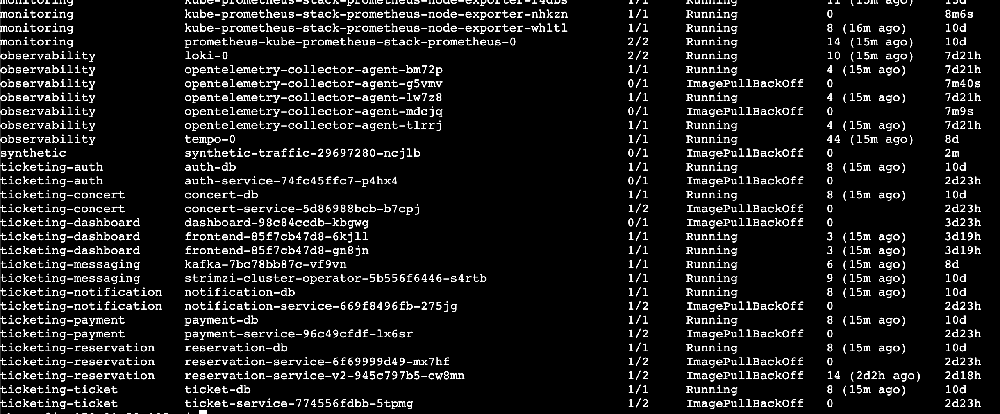

# ECR registry 403 ImagePullBackOff

## Context

private-dev 클러스터에서 서비스 Pod가 Rolling Update 또는 재생성될 때 ECR private registry 이미지 pull이 반복 실패하고 있다.

이번 기록은 목표 체크리스트의 운영 분석 항목 중 다음 요구를 채우기 위한 장애 패턴 식별 자료다.

```text
반복 장애 패턴 2가지 이상을 운영 보고서로 정리한다.
장애 패턴 식별 결과와 개선 방안을 운영 보고서로 작성한다.
```

관련 체크리스트 위치:

```text
workspace/docs/members/service/goal/2026-06-15-goal-review/goal-functional-equivalence-checklist-2026-06-15.md
```

## Symptoms

관찰된 Kubernetes Event:

```text
Normal   BackOff         47h (x799 over 2d2h)  kubelet  Back-off pulling image "941141115079.dkr.ecr.ap-northeast-2.amazonaws.com/notification-service:v0.1.2"
Warning  Failed          47h (x802 over 2d2h)  kubelet  Error: ImagePullBackOff
Normal   SandboxChanged  10m (x2 over 11m)     kubelet  Pod sandbox changed, it will be killed and re-created.
Normal   Pulled          10m                   kubelet  Container image "registry.istio.io/release/proxyv2:1.30.0" already present on machine
Normal   Created         10m                   kubelet  Created container: istio-init
Normal   Started         10m                   kubelet  Started container istio-init
Normal   Pulled          10m                   kubelet  Container image "registry.istio.io/release/proxyv2:1.30.0" already present on machine
Normal   Created         10m                   kubelet  Created container: istio-proxy
Normal   Started         10m                   kubelet  Started container istio-proxy
Warning  Unhealthy       10m (x5 over 10m)     kubelet  Startup probe failed: Get "http://192.168.145.185:15021/healthz/ready": dial tcp 192.168.145.185:15021: connect: connection refused
Warning  Failed          8m57s (x4 over 10m)   kubelet  Error: ErrImagePull
Normal   Pulling         7m24s (x5 over 10m)   kubelet  Pulling image "941141115079.dkr.ecr.ap-northeast-2.amazonaws.com/notification-service:v0.1.2"
Warning  Failed          7m24s (x5 over 10m)   kubelet  Failed to pull image "941141115079.dkr.ecr.ap-northeast-2.amazonaws.com/notification-service:v0.1.2": failed to pull and unpack image "941141115079.dkr.ecr.ap-northeast-2.amazonaws.com/notification-service:v0.1.2": failed to resolve image: unexpected status from HEAD request to https://941141115079.dkr.ecr.ap-northeast-2.amazonaws.com/v2/notification-service/manifests/v0.1.2: 403 Forbidden
Normal   BackOff         67s (x39 over 10m)    kubelet  Back-off pulling image "941141115079.dkr.ecr.ap-northeast-2.amazonaws.com/notification-service:v0.1.2"
Warning  Failed          23s (x42 over 10m)    kubelet  Error: ImagePullBackOff
```

Pod 목록 캡처:



반복적으로 보이는 현상:

- `notification-service:v0.1.2` pull 시 ECR manifest HEAD 요청이 `403 Forbidden`으로 실패한다.
- 여러 서비스 Pod가 `ImagePullBackOff` 상태로 남아 있다.
- Istio sidecar 이미지는 노드에 이미 있어 `istio-init`, `istio-proxy`는 시작되지만, 애플리케이션 컨테이너 pull 실패로 Pod는 정상 준비되지 않는다.
- 일부 Pod는 2일 이상 `ImagePullBackOff` 또는 `1/2` 상태로 남아 Rolling Update가 완료되지 않는다.

## Impact

- 신규 버전 배포 또는 Pod 재생성 시 서비스 복구가 자동으로 끝나지 않는다.
- `maxUnavailable`이 작아도 신규 Pod가 준비되지 않으면 rollout이 지연되거나 멈출 수 있다.
- sidecar만 떠 있는 `1/2` Pod가 남아 운영자가 서비스 준비 상태를 오판할 수 있다.
- 목표 체크리스트의 Rolling Update 무중단 검증, 운영 장애 패턴 보고, 배포 실패 알림 검증에 직접 영향을 준다.

## Investigation

| 시간 | 확인 내용 | 결과 |
| --- | --- | --- |
| 2026-06-19 | `kubectl describe pod` Events 확인 | ECR HEAD 요청이 `403 Forbidden`으로 실패했다. |
| 2026-06-19 | 전체 Pod 상태 캡처 확인 | `ticketing-*`, `observability`, `synthetic` namespace에서 `ImagePullBackOff`가 반복 확인됐다. |
| 2026-06-19 | 기존 trouble 기록 확인 | `2026-06-08-troubleshooting-report.md`에 ECR Secret 부재와 12시간 토큰 만료 한계가 이미 기록되어 있다. |
| 2026-06-19 | 체크리스트 메모 확인 | ECR registry 403 에러가 반복 장애 패턴 후보로 적혀 있다. |
| 2026-06-19 02:51 UTC | `ecr-registry` Secret 재발급 | `ticketing-*`, `synthetic`, `observability`, `monitoring`, `kong` namespace에 새 ECR 토큰을 적용했다. |
| 2026-06-19 02:54 UTC | 원격 노드 cron 복구 | `/home/ubuntu/.local/bin/medikong-refresh-ecr-secret.sh`를 만들고 6시간 주기 cron을 등록했다. |
| 2026-06-19 02:55 UTC | 최신 이벤트 확인 | `403`/`Forbidden` 이벤트는 사라졌다. 남은 pull 실패는 ECR 인증 문제가 아닌 별도 이슈로 분리했다. |

## Current Diagnosis

현재 직접 증거가 있는 원인은 **ECR private registry 인증 실패**다.

근거:

```text
unexpected status from HEAD request ... /manifests/v0.1.2: 403 Forbidden
```

이 메시지는 kubelet/container runtime이 ECR 조회 권한을 얻지 못한 상태로 해석한다.

반복 장애 패턴은 ECR 인증 Secret 갱신 실패로 한정한다.

| 패턴 | 현재 판정 | 근거 | 개선 방향 |
| --- | --- | --- | --- |
| ECR 인증 Secret 만료 또는 누락 | 직접 증거 있음 | ECR HEAD `403 Forbidden`, 과거 ECR Secret 수동 생성 및 토큰 만료 기록 | kubelet ECR credential provider로 Secret 갱신 의존을 제거하고, `imagePullSecrets` 참조를 단계적으로 줄인다. |

주의할 점:

- 이번 문서는 ECR 인증 Secret 만료 또는 누락으로 발생한 `403 Forbidden`만 다룬다.
- 다른 종류의 `ImagePullBackOff`는 별도 문서에서 다룬다.
- `istio-proxy` readiness 실패는 애플리케이션 컨테이너 pull 실패 이후 Pod 준비가 완료되지 않아 따라오는 증상으로 우선 해석한다.

## Temporary Recovery Verification

ECR 인증 상태:

```bash
kubectl get secret ecr-registry -A
kubectl get serviceaccount -n ticketing-notification -o yaml
kubectl get deployment -n ticketing-notification notification-service -o yaml
```

ECR Secret 재발급 후 즉시 pull 확인:

```bash
ECR_PASSWORD=$(aws ecr get-login-password --region ap-northeast-2)

kubectl delete secret ecr-registry -n ticketing-notification --ignore-not-found
kubectl create secret docker-registry ecr-registry \
  --docker-server=941141115079.dkr.ecr.ap-northeast-2.amazonaws.com \
  --docker-username=AWS \
  --docker-password="${ECR_PASSWORD}" \
  -n ticketing-notification

kubectl rollout restart deployment/notification-service -n ticketing-notification
kubectl rollout status deployment/notification-service -n ticketing-notification
```

## Improvement Plan

| 우선순위 | 개선안 | 담당 repo | 완료 기준 |
| --- | --- | --- | --- |
| p1 | 모든 `ticketing-*`, `observability`, `synthetic` namespace의 `ecr-registry` Secret 존재와 갱신 시각을 점검한다. | gitops | namespace별 pull secret 상태 표가 남는다. |
| p1 | kubelet ECR credential provider 도입으로 Secret 갱신 의존을 제거한다. | infra | kubelet이 ECR image pull 시점에 node IAM Role로 credential을 가져온다. |
| p1 | GitOps values에서 `imagePullSecrets: ecr-registry` 의존을 단계적으로 제거한다. | gitops | 신규 namespace 추가 시 pull secret 누락이 발생하지 않는다. |
| p2 | ImagePullBackOff 발생 시 Discord `#ops-alert` 또는 배포 상태 채널로 알림을 보낸다. | gitops | `ImagePullBackOff` 이벤트 또는 Pod 상태 기반 알림 캡처가 남는다. |

## Actions

| 상태 | 작업 | 담당 | 링크 |
| --- | --- | --- | --- |
| done | ECR 403 Event와 Pod 상태 캡처를 trouble 문서로 기록 | Codex | 이 문서 |
| done | namespace별 `ecr-registry` Secret을 새 토큰으로 재발급 | Codex | `medikong.io/ecr-refreshed-at=2026-06-19T02:54:26Z` |
| done | 원격 노드의 ECR Secret 갱신 cron을 6시간 주기로 복구 | Codex | `/home/ubuntu/.local/bin/medikong-refresh-ecr-secret.sh` |
| done | 최신 이벤트에서 ECR `403 Forbidden`이 사라졌는지 확인 | Codex | `kubectl get events -A --sort-by=.metadata.creationTimestamp` |
| done | 근본 해결 방향을 kubelet ECR credential provider runbook으로 분리 | Codex | `workspace/docs/runbooks/deployment/ecr-kubelet-credential-provider.md` |
| todo | 모든 node에 kubelet ECR credential provider 적용 | unassigned | `workspace/docs/runbooks/deployment/ecr-kubelet-credential-provider.md` |
| todo | 운영 보고서에 ECR 인증 실패 패턴과 개선안을 반영 | unassigned | `workspace/docs/members/service/goal/2026-06-15-goal-review/goal-functional-equivalence-checklist-2026-06-15.md` |

## Resolution

아직 미해결이다.

닫기 전 필요한 확인:

- ECR Secret 재발급 후 같은 Deployment가 `rollout status`까지 성공하는지 확인한다.
- kubelet ECR credential provider 적용 후 `imagePullSecrets` 없이 ECR image pull이 성공하는지 확인한다.
- 같은 조건에서 Rolling Update 중 ECR `403 Forbidden`이 재발하지 않는지 확인한다.
